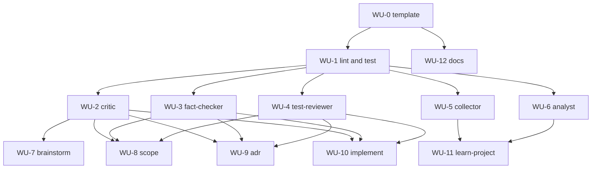

# ADR 0003 Execution Blueprint

- **Parent ADR:** `docs/adr/0003-purpose-built-subagents.md`

## System Snapshot

Real paths, confirmed in Stage 1 (repo root is `~/.claude`).

- Existing agents: `agents/auditor.md`, `agents/git.md`, `agents/reviewer.md`. Auto-discovered; no registry in `.claude-plugin/plugin.json`.
- Commands that spawn agents: `commands/brainstorm.md`, `commands/scope.md`, `commands/adr.md`, `commands/implement.md`, `commands/learn-project.md`, plus `commands/quick-review.md`, `commands/deep-review.md`, `commands/repo-audit.md`, `commands/commit-and-push.md`, `commands/create-pull-request.md`.
- Spawn sites to re-point: `commands/brainstorm.md:108`; `commands/scope.md:251,277,289`; `commands/adr.md:199,215,219`; `commands/implement.md:127,128,129,306`; `commands/learn-project.md:65,75`.
- Check-script convention: `shell/check-shared-settings.sh`, `shell/check-manifest.sh`, each with a paired `*.test.sh`.
- CI: `.github/workflows/shell-ci.yml` auto-discovers `*.test.sh` and runs explicit steps for the check scripts. Guardrail-check precedent: `hooks/no-dash-guard.test.sh`.
- Docs: `docs/authoring/01-commands-skills-hooks.md` (no agents section), index at `docs/index.md`.
- Model policy: `docs/internals/02-model-routing-and-memory.md:9-13`.

## Work Units

### WU-0: Agent authoring template
- Requires: nothing
- Goal: a canonical template new agents copy, carrying the frontmatter skeleton and the shared guardrail block.
- Files:
  - `agents/_TEMPLATE.md` | new | frontmatter keys (`name`, `description`, `tools`, `model`, `effort`) with allowed-value comments, plus the non-negotiable guardrail block (read-only stance where applicable, no dashes, no AI attribution, grounding discipline) matching the wording in `agents/reviewer.md:13-23`.
- Verification: `test -f agents/_TEMPLATE.md && grep -q 'name:' agents/_TEMPLATE.md`
- Tests: covered by WU-1's suite (the template is the fixture the lint validates against).
- Done When:
  - [x] `agents/_TEMPLATE.md` exists with all five frontmatter keys and the guardrail block.
  - [x] The leading `_` keeps it out of auto-discovery (confirm it is not treated as a live agent).

### WU-1: Agent lint and test suite
- Requires: WU-0
- Goal: a check script that validates every `agents/*.md` (excluding `_TEMPLATE.md`) and fails CI on drift; passes on the current three agents.
- Files:
  - `shell/check-agents.sh` | new | assert required frontmatter keys present; `model` in {haiku, sonnet, opus}; `effort` in {low, medium, high, xhigh, max}; a read-only tool allowlist (no Edit/Write/Bash) when the description declares read-only; presence of the required guardrail invariants (a no-dash clause). Use required-invariants matching, not exact-block match, so per-agent wording is allowed.
  - `shell/check-agents.test.sh` | new | behavioral suite following the `shell/check-manifest.test.sh` pattern.
  - `.github/workflows/shell-ci.yml` | edit | add an explicit `shell/check-agents.sh` step next to the existing check-script steps.
- Verification: `bash shell/check-agents.sh && bash shell/check-agents.test.sh`
- Tests (engineering-standards, regression-pinning + boundaries):
  - Scenario: the three existing agents all pass. Given `agents/auditor.md`, `agents/git.md`, `agents/reviewer.md`, when the check runs, then it exits 0.
  - Scenario: missing frontmatter key fails. Given a fixture agent with no `model:`, when the check runs, then it exits non-zero and names the file.
  - Scenario: read-only violation fails. Given a fixture whose description says read-only but whose `tools:` lists `Write`, when the check runs, then it exits non-zero.
  - Scenario: bad model tier fails. Given a fixture with `model: gpt`, then it exits non-zero.
- Done When:
  - [x] `shell/check-agents.sh` exits 0 against the current `agents/` and non-zero on each negative fixture.
  - [x] The test suite is discovered by `git ls-files '*.test.sh'` and passes on Linux and macOS.
  - [x] `.github/workflows/shell-ci.yml` runs the check step.

### WU-2: `critic` agent
- Requires: WU-1
- Goal: a read-only adversarial agent with a focus param `premise | plan | decision | pre-exec`.
- Files:
  - `agents/critic.md` | new | from `agents/_TEMPLATE.md`; `model: sonnet`, `effort: high`, `tools: Read, Grep, Glob, Skill`; body defines the four focus stances (premise challenges whether to build; plan/decision/pre-exec stress-test a settled artifact) and a PASS/FAIL output contract.
- Verification: `bash shell/check-agents.sh && grep -q 'premise' agents/critic.md`
- Tests: WU-1 lint validates the file.
- Done When:
  - [x] `agents/critic.md` passes `check-agents.sh`.
  - [x] The body names all four focus values and keeps the premise stance distinct from the convergent stances.

### WU-3: `fact-checker` agent
- Requires: WU-1
- Goal: a read-only grounding-research verifier with a PASS/FAIL/WARN contract.
- Files:
  - `agents/fact-checker.md` | new | from template; `model: sonnet`, `effort: high`, `tools: Read, Grep, Glob, Skill`; loads `playbook:grounding-research`; verifies referenced paths and signatures, returns the Verification Summary table shape used in `commands/adr.md:199`.
- Verification: `bash shell/check-agents.sh && grep -q 'PASS' agents/fact-checker.md`
- Tests: WU-1 lint.
- Done When:
  - [x] `agents/fact-checker.md` passes `check-agents.sh`.
  - [x] Output contract matches what scope/adr/implement fact-check phases expect.

### WU-4: `test-reviewer` agent
- Requires: WU-1
- Goal: a read-only engineering-standards test reviewer.
- Files:
  - `agents/test-reviewer.md` | new | from template; `model: sonnet`, `effort: high`, `tools: Read, Grep, Glob, Skill`; loads `playbook:engineering-standards`; evaluates regression-pinning, flakiness, boundary coverage, test independence, mock quality, assertion strength.
- Verification: `bash shell/check-agents.sh && grep -q 'engineering-standards' agents/test-reviewer.md`
- Tests: WU-1 lint.
- Done When:
  - [x] `agents/test-reviewer.md` passes `check-agents.sh`.

### WU-5: `collector` agent
- Requires: WU-1
- Goal: a cheap mechanical gatherer for `/playbook:learn-project` Phase 1.
- Files:
  - `agents/collector.md` | new | from template; `model: haiku`, `effort: medium`, `tools: Bash, Read, Grep, Glob, WebFetch`; gathers repo structure, git history, PRs, and tracker data, returns a compact cited summary (never raw dumps).
- Verification: `bash shell/check-agents.sh && grep -q 'haiku' agents/collector.md`
- Tests: WU-1 lint.
- Done When:
  - [x] `agents/collector.md` passes `check-agents.sh` and pins Haiku.

### WU-6: `analyst` agent
- Requires: WU-1
- Goal: distills Phase 1 findings into candidate memory facts for `/playbook:learn-project` Phase 2.
- Files:
  - `agents/analyst.md` | new | from template; `model: sonnet`, `tools: Read, Grep, Glob, Skill`; emits candidate facts in the shape `commands/learn-project.md:75` describes (title, body, type, scope, links, anchors).
- Verification: `bash shell/check-agents.sh && grep -q 'anchors' agents/analyst.md`
- Tests: WU-1 lint.
- Done When:
  - [x] `agents/analyst.md` passes `check-agents.sh`.

### WU-7: Re-point brainstorm
- Requires: WU-2
- Goal: brainstorm's premise-challenge spawns `critic` (focus premise), not `general-purpose`.
- Files:
  - `commands/brainstorm.md` | edit | line 108: `general-purpose` to `critic` (focus premise).
- Verification: `grep -q 'critic' commands/brainstorm.md && ! grep -q 'general-purpose' commands/brainstorm.md`
- Done When:
  - [x] `commands/brainstorm.md` names `critic` and no longer names `general-purpose`.

### WU-8: Re-point scope
- Requires: WU-2, WU-3, WU-4
- Goal: scope's three gate phases spawn `fact-checker`, `critic` (plan), `test-reviewer`.
- Files:
  - `commands/scope.md` | edit | line 251 Explore to `fact-checker`; line 277 `general-purpose` to `critic` (focus plan); line 289 Explore to `test-reviewer`.
- Verification: `grep -q 'fact-checker' commands/scope.md && grep -q 'test-reviewer' commands/scope.md && ! grep -q 'general-purpose' commands/scope.md`
- Done When:
  - [x] All three phases in `commands/scope.md` name the new agents; no `general-purpose` remains.

### WU-9: Re-point adr
- Requires: WU-2, WU-3, WU-4
- Goal: adr's three gate phases spawn `fact-checker`, `critic` (decision), `test-reviewer`.
- Files:
  - `commands/adr.md` | edit | line 199 Explore to `fact-checker`; line 215 `general-purpose` to `critic` (focus decision); line 219 Explore to `test-reviewer`.
- Verification: `grep -q 'fact-checker' commands/adr.md && grep -q 'test-reviewer' commands/adr.md && ! grep -q 'general-purpose' commands/adr.md`
- Done When:
  - [x] All three phases in `commands/adr.md` name the new agents; no `general-purpose` remains.

### WU-10: Re-point implement
- Requires: WU-2, WU-3, WU-4
- Goal: implement's gate and refinement swarm spawn the typed agents; the post-impl swarm reuses `reviewer`.
- Files:
  - `commands/implement.md` | edit | line 127 Explore to `fact-checker`; line 128 `general-purpose` to `critic` (focus pre-exec); line 129 Explore to `test-reviewer`; line 306 `general-purpose` swarm to `reviewer`.
- Verification: `grep -q 'reviewer' commands/implement.md && grep -q 'fact-checker' commands/implement.md && ! grep -q 'general-purpose' commands/implement.md`
- Done When:
  - [x] The four sites in `commands/implement.md` name the typed agents; no `general-purpose` remains.
  - [x] The untyped Sonnet TDD dispatch at `implement.md:237-239` is left unchanged (out of scope, noted).

### WU-11: Re-point learn-project
- Requires: WU-5, WU-6
- Goal: learn-project collectors spawn `collector`, analysts spawn `analyst`.
- Files:
  - `commands/learn-project.md` | edit | Phase 1 collectors named `subagent_type: collector`; Phase 2 analysts named `subagent_type: analyst`.
- Verification: `grep -q 'subagent_type: collector' commands/learn-project.md && grep -q 'subagent_type: analyst' commands/learn-project.md`
- Done When:
  - [x] Both phases in `commands/learn-project.md` name a typed agent; no untyped Agent dispatch remains.

### WU-12: Authoring-agents docs
- Requires: WU-0
- Goal: a documented pattern for authoring agents.
- Files:
  - `docs/authoring/02-authoring-agents.md` | new | frontmatter schema, both binding mechanisms (`context: fork` + `agent:` versus inline `subagent_type`), model and tool policy, the guardrail template, and the parametrize-versus-split rule.
  - `docs/index.md` | edit | link the new page.
- Verification: `test -f docs/authoring/02-authoring-agents.md && grep -q 'authoring-agents' docs/index.md`
- Done When:
  - [x] The page covers the schema, both bindings, the policy, and the split rule.
  - [x] `docs/index.md` links it.

## Ordering

| WU | Requires | Parallel group |
|---|---|---|
| WU-0 | none | none |
| WU-1 | WU-0 | none |
| WU-2 | WU-1 | P1 |
| WU-3 | WU-1 | P1 |
| WU-4 | WU-1 | P1 |
| WU-5 | WU-1 | P1 |
| WU-6 | WU-1 | P1 |
| WU-7 | WU-2 | P2 |
| WU-8 | WU-2, WU-3, WU-4 | P2 |
| WU-9 | WU-2, WU-3, WU-4 | P2 |
| WU-10 | WU-2, WU-3, WU-4 | P2 |
| WU-11 | WU-5, WU-6 | P2 |
| WU-12 | WU-0 | P2 |

## Parallel Groups

- Sequential first: WU-0, then WU-1.
- P1 (after WU-1): WU-2, WU-3, WU-4, WU-5, WU-6. Each writes a distinct new `agents/*.md`, no shared state, safe to run concurrently.
- P2 (after P1): WU-7, WU-8, WU-9, WU-10, WU-11, WU-12. Each edits a distinct command file or a distinct docs file (only WU-12 touches `docs/index.md`), disjoint, safe to run concurrently.

## Dependency Graph

## Confidence + open items

- Confidence: HIGH on the structure (real paths, disjoint file plans, literal verification commands, the shell-ci pattern to follow). MEDIUM on the exact re-point line numbers, they drift as the command files change, so each WU greps for content rather than trusting a line number.
- Open items (verify downstream):
  - Lint strictness: required-invariants matching versus exact-block match for the guardrail. Chosen required-invariants here; confirm in `/playbook:implement` that it catches real drift without false positives.
  - `critic` premise-versus-convergent stance separation: verify in `/playbook:implement` review that the focus param keeps them distinct.
  - `fact-checker` and `test-reviewer` are consistency bets over the already-read-only `Explore`. Capture the before baseline (fact-check catch rate) so the gain is provable.
  - Cost baseline: measure `/playbook:learn-project` and the `/playbook:implement` refinement swarm token cost before WU-5 and WU-10 land.
  - `_TEMPLATE.md` must not be picked up as a live agent; confirm the discovery rule ignores the leading underscore, else move the template under `docs/`.
  - Inline-versus-system-prompt duplication: the re-point WUs (WU-8, WU-9, WU-10) swap the agent name but leave the command's inline task instructions in place, which now overlap the agent's baked-in system prompt. Decide the source of truth in `/playbook:implement`: thin the inline prompt, or keep it authoritative and thin the agent body. The lint does not catch this cross-file overlap.
  - Lint coverage: add an `effort` out-of-range boundary case and a positive new-agent fixture to `shell/check-agents.test.sh`.
