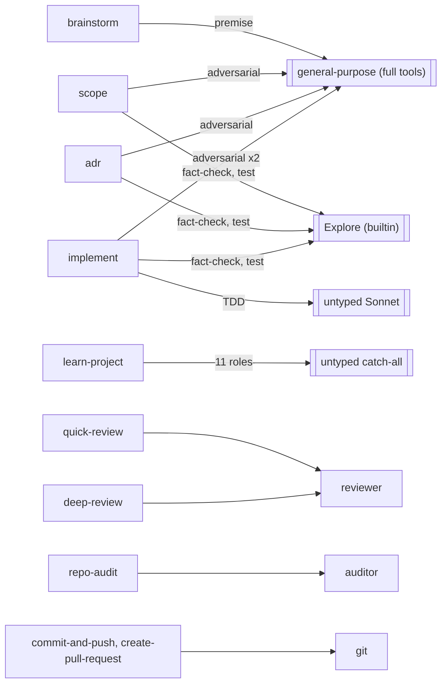
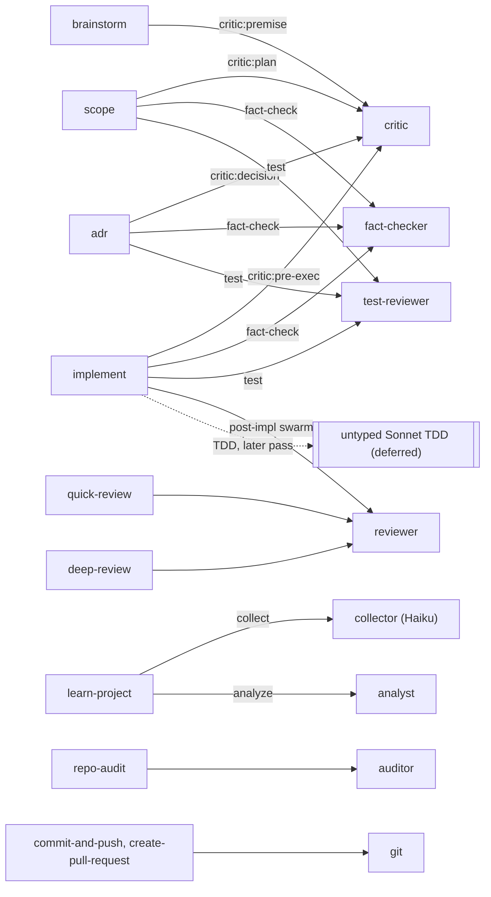

# ADR 0003: Purpose-built subagents over generic fallbacks

**Status:** Accepted
**Date:** 2026-08-07

## Context

The toolkit ships three custom subagents and binds them to commands two ways: a whole-command fork (`context: fork` + `agent:`) and an inline spawn (`Agent` tool with `subagent_type:`). Each custom agent pins its model tier and restricts its tools, and `agents/` is auto-discovered (no registry in `plugin.json`, established in ADR 0001).

The three existing agents earn their keep on structural properties an inline prompt can't express:

- `auditor` (`agents/auditor.md:1-7`): Opus, effort max, read-only tool set, forked by `commands/repo-audit.md:4-5`.
- `git` (`agents/git.md:1-7`): Haiku, tools Bash/Read/Skill, forked by `commands/commit-and-push.md:5-6` and `commands/create-pull-request.md:5-6`.
- `reviewer` (`agents/reviewer.md:1-7`): Sonnet, structurally read-only, takes a lens param, spawned by `commands/quick-review.md:148` and `commands/deep-review.md:185`.

Outside those three, commands lean on Claude Code's built-in generic agents:

- Five `general-purpose` spawns carry full Edit/Write/Bash access they never use, for adversarial or premise passes: `commands/brainstorm.md:108`, `commands/scope.md:277`, `commands/adr.md:215`, `commands/implement.md:128`, `commands/implement.md:306`.
- Six `Explore` spawns (already read-only) run fact-check and test-review phases: `commands/scope.md:251,289`, `commands/adr.md:199,219`, `commands/implement.md:127,129`.
- `/playbook:learn-project` dispatches 11 roles (5 collectors, 6 analysts) with no `subagent_type` at all, so they fall to the catch-all agent: `commands/learn-project.md:30,65,75`.
- The TDD cycle in `/playbook:implement` dispatches on `model: sonnet` with no `subagent_type`: `commands/implement.md:237-239`.

Two facts constrain the fix. The model policy is Sonnet default, Haiku for mechanical or search subagents (3x cheaper), Opus for architecture under 20% (`docs/internals/02-model-routing-and-memory.md:9-13`). The repo runs a shell CI that auto-discovers `*.test.sh` suites (`.github/workflows/shell-ci.yml`), with a guardrail-check precedent at `hooks/no-dash-guard.test.sh`. There's no authoring doc for agents: `docs/authoring/01-commands-skills-hooks.md` covers commands, skills, and hooks only.

This decision comes from an approved design doc, `.claude/designs/2026-08-07-agent-layer-refinement.md`.

## Decision Drivers

- **Least privilege.** The five `general-purpose` spawns hold write and shell tools they don't need. A read-only agent removes that reach (`commands/implement.md:306` is the clearest case: a review swarm that only reads a diff).
- **Cost.** The 11 `/playbook:learn-project` roles run at the default tier for mechanical gathering. Haiku fits the collectors and cuts cost 3x per the model policy.
- **Consistency.** Adversarial and verification passes vary run to run because the behavior lives in an inline prompt, not a pinned system prompt.
- **No generic fallback.** Untyped spawns (`/playbook:learn-project`, the TDD cycle) hide the role from the agent log and the picker.
- **Maintainability.** Growing from 3 agents to 8 multiplies the repeated guardrail block; without a check, the copies drift.

## Considered Alternatives

### A. Parametrized role-agents, few and reused (effort: M)

One agent per role, each taking a focus param, reused across commands (the way `reviewer` takes a lens). A `critic` covers all four adversarial sites; a `verifier` covers all six `Explore` sites.

- Trade-offs: fewest files and the most consistent behavior. But a single `verifier` blurs two disciplines (grounding-research fact-check versus engineering-standards test review), and a single `critic` blurs the divergent premise stance with the convergent plan stance.

### B. One agent per command role (effort: L)

A distinct agent per site: `brainstorm-critic`, `scope-critic`, `adr-critic`, and so on.

- Trade-offs: each prompt is tuned to its command. But four near-identical critics duplicate the same block, and the drift surface the CI check has to police grows with every file.

### C. Keep generic agents, sharpen inline prompts (effort: S)

No new agents. Standardize the adversarial and verify prompts into shared snippets referenced from each command, and re-point only `implement.md:306` to `reviewer`.

- Trade-offs: cheapest and lowest maintenance. But it leaves the `general-purpose` spawns holding unused write tools, keeps `/playbook:learn-project` untyped, and delivers none of the cost or least-privilege goals; it's a consistency-only fix.

## Decision

Adopt a hybrid roster: parametrize a role where its variants are near-identical, split a role into separate agents where the discipline genuinely diverges. Build it in full.

New agents:

- `critic` (read-only; Sonnet, effort high), focus param `premise | plan | decision | pre-exec`. Reused by brainstorm, scope, adr, implement. Parametrized: the role is one adversarial pass; the focus flips the stance.
- `fact-checker` (read-only; grounding-research discipline, PASS/FAIL/WARN contract) and `test-reviewer` (read-only; engineering-standards discipline). Split from a single verifier because the two disciplines and checklists diverge. Both reused by scope, adr, implement.
- `collector` (Haiku; tools Bash/Read/Grep/Glob/WebFetch) for `/playbook:learn-project` Phase 1, and `analyst` (Sonnet; read-only + Skill) for Phase 2.

Reuse, no new file: re-point `implement.md:306`'s post-implementation swarm to the existing `reviewer`, removing the last `general-purpose` site.

Maintainability: a canonical `agents/_TEMPLATE.md` carries the frontmatter skeleton and the guardrail block. A `check-agents.sh` validator with a `*.test.sh` suite (auto-discovered by shell CI, following the `no-dash-guard` precedent) asserts required frontmatter keys, a model in the allowed set, a read-only tool allowlist when the agent claims read-only, and presence of the guardrail invariants. An "Authoring agents" section in `docs/authoring/` documents the frontmatter schema, both binding mechanisms, the model and tool policy, the template, and the parametrize-versus-split rule.

Why the alternatives lost. Pure A blurs the fact-check and test-review disciplines into one agent and muddies the critic's premise and plan stances, so the split from B is kept where it pays. Pure B duplicates four near-identical critics and enlarges the drift surface, so parametrization from A is kept where the role is one. C is the floor, not the goal: it leaves unused write tools on the generic spawns and keeps `/playbook:learn-project` untyped, so it misses the least-privilege, cost, and no-fallback drivers the design set.

An adversarial review of this decision argued that `fact-checker`, `test-reviewer`, and `analyst` are consistency bets, not least-privilege wins, because they replace agents that are already read-only (`Explore`) or run inside a single command (`analyst`). That critique is accepted and recorded in Consequences and in the blueprint's open items, not silently dropped. The full build proceeds by choice: the value is a uniform, typed, documented agent layer, and the weak agents are flagged for a measured check rather than deferred.

## Consequences

Positive:

- Every command spawn site names a purpose-built agent. Untyped and `general-purpose` fallbacks go to zero (the TDD site excepted and deferred).
- The four adversarial spawns and the post-impl swarm lose their unused Edit/Write/Bash reach.
- `/playbook:learn-project` collectors run on Haiku, and the `implement.md:306` swarm runs on `reviewer` (Sonnet, no Bash), a measured cost drop.
- The agent layer has an authoring doc, a template, and a CI check, so it grows without drift.

Negative and follow-up:

- Eight agents instead of three: more files in the picker and more guardrail blocks to keep honest. The template and CI check exist to hold that line.
- `fact-checker` and `test-reviewer` replace the already-read-only `Explore`, so their gain is baked-in discipline, not least privilege. Verify the consistency gain before treating it as settled.
- `analyst` is reused only inside `/playbook:learn-project`, so it fails the two-command reuse bar; accepted for the no-fallback goal.
- The parametrized `critic` must keep the divergent premise stance clean from the convergent plan and decision stances.
- The untyped Sonnet TDD dispatch (`implement.md:237-239`) stays as-is; flag for a later pass.
- Success is measured, not asserted: spawn sites carrying unused write tools driven to zero; token cost per `/playbook:learn-project` run and per `/playbook:implement` refinement swarm versus baseline; count of untyped or generic spawn sites; the CI check flagging guardrail drift. Capture the baselines before the build.

## Architecture Diagrams

Current state: commands spawn a mix, with generic agents shaded conceptually (`general-purpose` with full tools, the built-in `Explore`, the untyped catch-all, and the untyped Sonnet TDD dispatch).

Proposed state: every command binds to a purpose-built agent; the TDD dispatch is the one deferred edge.

## References

- Design doc: `.claude/designs/2026-08-07-agent-layer-refinement.md`.
- ADR 0001: `docs/adr/0001-package-toolkit-as-plugin.md` (agents auto-discover from `agents/`).
- Existing agents: `agents/auditor.md`, `agents/git.md`, `agents/reviewer.md`.
- Model policy: `docs/internals/02-model-routing-and-memory.md:9-13`.
- CI and guardrail precedent: `.github/workflows/shell-ci.yml`, `hooks/no-dash-guard.test.sh`.
