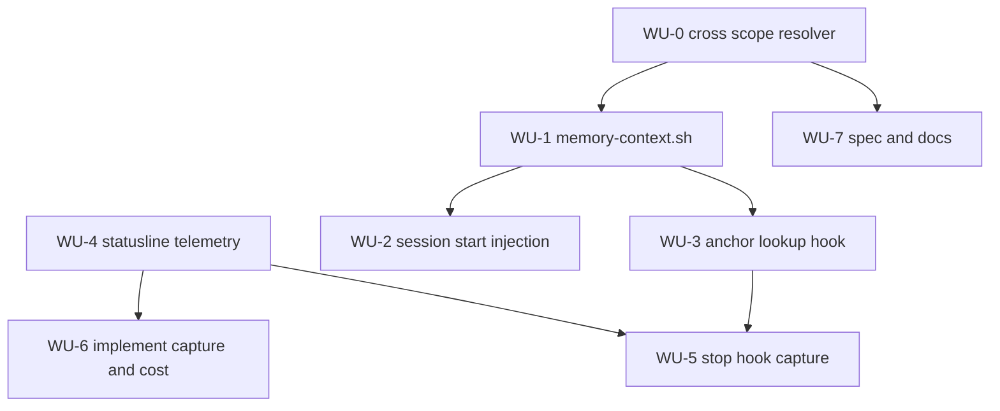

# ADR 0004 Execution Blueprint

- **Parent ADR:** `docs/adr/0004-graph-first-memory.md`

## System Snapshot

Real paths, confirmed in Stage 1 (repo root is `~/.claude`).

- Graph builder: `hooks/rebuild-memory-graph.sh` (PostToolUse). Its resolver is at line 160 and is same-scope only. Suite at `hooks/rebuild-memory-graph.test.sh`, 11 scenarios.
- Live store: 80 fact files, 9 indexes, `memory/graph.json` at 215 nodes and 943 edges. 4 edges dangle, all cross-scope links to real global facts.
- Session start: `hooks/session-init.sh:67` injects the project `MEMORY.md` (2.5 KB) as `SessionStart` `additionalContext`. No test file exists for it.
- Edited-file signal: `hooks/post-edit-track.sh` appends `{path, ts}` to `$(session_dir)/edits.jsonl`.
- Shared helpers: `hooks/lib/common.sh` provides `session_dir`, `hi_field`, `hi_session_id`, `abspath`, `atomic_append`, `emit_pre_context`, `emit_prompt_context`, `emit_system_message`.
- Telemetry source: `statusline.sh:295-306` parses `.session_id`, `.context_window.used_percentage`, `.cost.total_cost_usd`, `.cost.total_duration_ms`. Suite at `shell/statusline.test.sh`.
- Hook registry: `hooks/hooks.json` registers all 7 events for the plugin, using `"${CLAUDE_PLUGIN_ROOT}/hooks/<name>.sh"`.
- Constraint: `hooks/precompact-warn.sh:8-10` records that `PreCompact` has no `additionalContext` channel, so it cannot instruct the model.
- Measured slice: global + `pragmatic-engineer/playbook` facts with ids and descriptions is 8.8 KB against a 204 KB file.

## Work Units

### WU-0: Cross-scope edge resolution
- Requires: nothing
- Goal: a link target resolves in the source's own scope first, then falls back to global. Truly absent targets still dangle.
- Files:
  - `hooks/rebuild-memory-graph.sh` | edit | make edge building two-pass. Collect every node id first, then resolve each link target: try `<proj>/<target>`, else `global/<target>`, else emit the same-scope id so it surfaces as dangling. Keep node schema, id format, `anchors` handling, early exit, and output path unchanged.
  - `hooks/rebuild-memory-graph.test.sh` | edit | add the scenarios below.
- Verification: `bash hooks/rebuild-memory-graph.test.sh && /bin/bash hooks/rebuild-memory-graph.test.sh`
- Tests:
  - Scenario: project fact links to a global fact. Given a project fact with `relates_to: [global-thing]` and a global fact `global-thing`, when the graph rebuilds, then an edge exists from the project fact to `global/global-thing`.
  - Scenario: same scope wins. Given a fact named `dup` in BOTH the project store and global, and a project fact linking to `dup`, then the edge points at the project `dup`, not the global one.
  - Scenario: truly missing still dangles. Given a project fact linking to `nope` that exists nowhere, then an edge is still emitted and its target matches no node.
  - Scenario: global source is unaffected. Given a global fact linking to another global fact, then the edge resolves as before.
- Done When:
  - [ ] The 4 dangling edges in the real store resolve; the rebuilt graph reports 0 dangling.
  - [ ] Suite green on bash 5 and bash 3.2.

### WU-1: `memory-context.sh`, the repo-slice reader
- Requires: WU-0
- Goal: one script that turns `graph.json` into a compact, repo-scoped context block.
- Files:
  - `shell/memory-context.sh` | new | `memory-context.sh [--repo <owner/repo>] [--graph <path>]`. Defaults: repo from `git remote get-url origin`, graph from `~/.claude/memory/graph.json`. Emits markdown: the global facts and the repo's facts as `name: description` lines, their typed edges, and an anchor index mapping each anchored path to the facts that describe it. Prints nothing and exits 0 when the graph is absent, so callers never break.
  - `shell/memory-context.test.sh` | new | suite below.
- Verification: `bash shell/memory-context.sh --repo pragmatic-engineer/playbook | wc -c` (expect under 12000) and `bash shell/memory-context.test.sh`
- Tests:
  - Scenario: only relevant scopes appear. Given a graph with global, repo A, and repo B facts, when run for repo A, then repo B facts are absent and global plus repo A facts are present.
  - Scenario: anchor index. Given a fact anchored to `src/auth/login.py`, then the output maps that path to the fact name.
  - Scenario: edges included. Given a fact with `depends_on`, then the output names the prerequisite.
  - Scenario: missing graph is not an error. Given no `graph.json`, then it exits 0 and prints nothing.
  - Scenario: unknown repo yields globals only. Given a repo with no facts, then only global facts appear.
- Done When:
  - [ ] Output for this repo is under 12 KB.
  - [ ] Suite green on bash 5 and bash 3.2, shellcheck clean.

### WU-2: Inject the slice at session start
- Requires: WU-1
- Goal: `SessionStart` carries the graph slice instead of the raw index dump.
- Files:
  - `hooks/session-init.sh` | edit | replace the `MEMORY.md` read at line 67 with a call to `shell/memory-context.sh`. Fall back to the existing `MEMORY.md` behaviour when the script or graph is missing, so a partial install still works.
  - `hooks/session-init.test.sh` | new | this hook has no test today; cover the injection path and the fallback.
- Verification: `bash hooks/session-init.test.sh`
- Tests:
  - Scenario: slice is injected. Given a fake `HOME` with a graph, when the hook runs, then its `additionalContext` contains a fact from the slice.
  - Scenario: fallback. Given a fake `HOME` with `MEMORY.md` but no graph, then the hook still emits the index content and exits 0.
  - Scenario: no store at all. Given a fake `HOME` with no memory dir, then the hook exits 0 and emits no memory block.
- Done When:
  - [ ] Session start injects the slice, and degrades to the old behaviour without a graph.

### WU-3: `memory-anchors.sh`, just-in-time anchor lookup
- Requires: WU-1
- Goal: editing a file surfaces the facts about that file before the edit lands.
- Files:
  - `hooks/memory-anchors.sh` | new | `PreToolUse` on `Edit|Write`. **Build the anchor index once per session** into the session dir and consult that, rather than re-reading the 204 KB `graph.json` on every edit: this hook sits on a hot path, and a 50 file refactor would otherwise pay 50 full graph reads. Reads `tool_input.file_path`, looks it up in the index (exact path, then containing directory), and emits `additionalContext` naming the matching facts plus their `depends_on` and `contradicts` neighbours. Emits nothing when there is no match. Never blocks. Follow `hooks/preread-edit-check.sh` for shape and use `emit_pre_context` from `hooks/lib/common.sh`.
  - `hooks/memory-anchors.test.sh` | new | suite below.
  - `hooks/hooks.json` | edit | register it under `PreToolUse` with matcher `Edit|Write`.
- Verification: `bash hooks/memory-anchors.test.sh && jq -e '.hooks.PreToolUse[] | select(.hooks[].command | test("memory-anchors"))' hooks/hooks.json`
- Tests:
  - Scenario: anchored file hits. Given a fact anchored to `src/a.py` and an Edit on `src/a.py`, then the output names that fact.
  - Scenario: directory anchor hits. Given a fact anchored to `src/`, and an Edit on `src/deep/b.py`, then the output names that fact.
  - Scenario: neighbours pulled. Given the matched fact has `depends_on: other`, then `other` is named too.
  - Scenario: no match is silent. Given an Edit on an unanchored path, then the hook emits nothing and exits 0.
  - Scenario: never blocks. Given a malformed payload or a missing graph, then the hook exits 0 and emits nothing.
- Done When:
  - [ ] Editing an anchored file surfaces its facts; unanchored edits cost nothing.

### WU-4: Statusline telemetry
- Requires: nothing
- Goal: persist the two signals only the statusline receives.
- Files:
  - `statusline.sh` | edit | after parsing its stdin JSON, append `{ts, cost_usd, used_pct}` to `$(session_dir)/telemetry.jsonl`, and write a `capture-due` marker when `used_percentage` crosses the threshold (default 70, override with `CC_CAPTURE_AT`). The write must be atomic and must never fail the render: wrap in a guard so a broken write still prints the status line.
  - `shell/statusline.test.sh` | edit | add the scenarios below.
- Verification: `bash shell/statusline.test.sh`
- Tests:
  - Scenario: sample appended. Given a payload with cost and usage, then `telemetry.jsonl` gains one line with both values.
  - Scenario: threshold sets the marker. Given `used_percentage` of 75 and a threshold of 70, then `capture-due` exists.
  - Scenario: below threshold, no marker. Given 40, then `capture-due` does not exist.
  - Scenario: render survives a bad write. Given an unwritable session dir, then the status line still prints and exits 0.
- Done When:
  - [ ] Telemetry lands; the status line never breaks because of it.

### WU-5: `memory-capture.sh`, the Stop-hook trigger
- Requires: WU-4, WU-3 (both edit `hooks/hooks.json`, so they must not run concurrently)
- Goal: when context is genuinely under pressure, prompt capture while the model can still act.
- Files:
  - `hooks/memory-capture.sh` | new | `Stop` hook. If `capture-due` exists in the session dir, emit `{"decision":"block","reason":"..."}` instructing capture of durable facts from this session (listing the session's edited paths from `edits.jsonl` as candidates), then clear the marker so it fires once per crossing. Otherwise exit 0 silently.
  - `hooks/memory-capture.test.sh` | new | suite below.
  - `hooks/hooks.json` | edit | register under `Stop`.
- Verification: `bash hooks/memory-capture.test.sh`
- Tests:
  - Scenario: marker present fires once. Given `capture-due` exists, then the output has `decision: block` with a non-empty reason, and the marker is gone afterwards.
  - Scenario: second call is silent. Given the marker was just consumed, then the next run exits 0 with no output.
  - Scenario: no marker, no output. Given no marker, then the hook exits 0 and emits nothing.
  - Scenario: edited paths listed. Given `edits.jsonl` has two paths, then the reason names them.
- Done When:
  - [ ] Capture fires once per threshold crossing and never on a quiet turn.

### WU-6: `/playbook:implement` captures around a run, and records cost
- Requires: WU-4
- Goal: the one deterministic capture path, plus the cost figure the ADR asks for.
- Files:
  - `commands/implement.md` | edit | in Step 3, snapshot the current telemetry sample. In Step 7's memory-capture step, make capture explicit rather than conditional, and report the cost delta between the snapshot and the run's end.
- Verification: `grep -q 'telemetry' commands/implement.md`
- Tests: none. This is command prose, covered by the WU-4 suite underneath it.
- Done When:
  - [ ] `/playbook:implement` captures facts before and after a run and reports its cost delta.

### WU-7: Update the spec and the docs
- Requires: WU-0
- Goal: the written rule matches the resolver.
- Files:
  - `prompts/SYSTEM_PROMPT.md` | edit | the Memory section states same-store resolution. Change it to scope-then-global, and note that a project fact shadows a global fact of the same name.
  - `docs/concepts/02-memory-system.md` | edit | same correction, plus a short note that the graph is the retrieval path and what the session-start slice contains.
- Verification: `grep -q 'then global' prompts/SYSTEM_PROMPT.md`
- Done When:
  - [ ] No doc still claims edges resolve within one store only.

## Ordering

| WU | Requires | Parallel group |
|---|---|---|
| WU-0 | none | P1 |
| WU-4 | none | P1 |
| WU-1 | WU-0 | P2 |
| WU-6 | WU-4 | P2 |
| WU-7 | WU-0 | P2 |
| WU-2 | WU-1 | P3 |
| WU-3 | WU-1 | P3 |
| WU-5 | WU-4, WU-3 | none |

## Parallel Groups

- **P1:** WU-0 and WU-4. Disjoint: `hooks/rebuild-memory-graph.*` versus `statusline.sh` and `shell/statusline.test.sh`.
- **P2:** WU-1, WU-6, WU-7. Disjoint: `shell/memory-context.*` versus `commands/implement.md` versus `prompts/SYSTEM_PROMPT.md` and `docs/concepts/02-memory-system.md`.
- **P3:** WU-2 and WU-3. Disjoint: `hooks/session-init.*` versus `hooks/memory-anchors.*` and `hooks/hooks.json`.
- **Sequential last:** WU-5. It edits `hooks/hooks.json`, which WU-3 also edits, so it must follow P3 rather than run beside it.

## Dependency Graph

## Confidence + open items

- Confidence: HIGH on WU-0, WU-1, WU-2, WU-3 and WU-7. Real paths, a measured 8.8 KB slice, and `worktree.sh` already proves a shared shell module works. MEDIUM on WU-4 and WU-5: giving a display component a side effect is unusual, and the threshold value is a guess.
- Open items (verify downstream):
  - The 70 percent threshold is unvalidated. Too low nags, too high races auto-compact at 90. Tune against real sessions after WU-5 lands.
  - `Stop` returning `decision: block` interrupts the turn end. Confirm during `/playbook:implement` that it reads as a useful prompt and not as a stuck session, and that clearing the marker really does stop it re-firing.
  - Capture at the threshold is a prompt, not an enforcement. Only WU-6 is deterministic. If the prompted path proves unreliable in practice, the fallback is to lean harder on WU-6 and drop WU-5.
  - The statusline write must never break the render. Verify the guard by pointing the session dir somewhere unwritable.
  - WU-2 changes what every session loads. Watch for the slice being noisier than the old 2.5 KB index; if so, trim descriptions rather than reverting.
