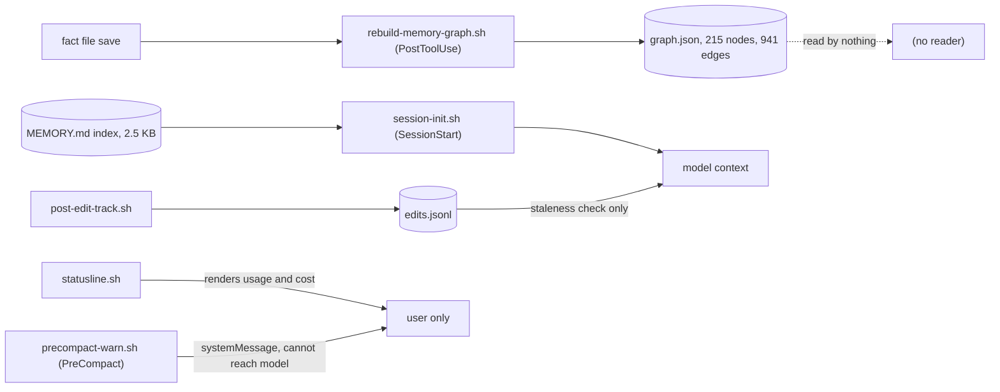
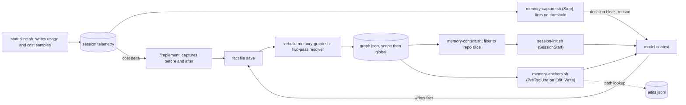
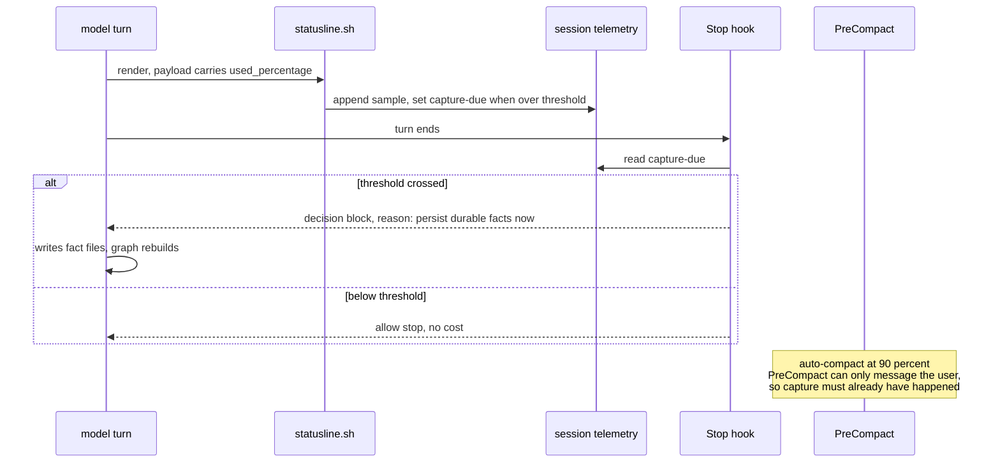

# ADR 0004: Graph-first memory retrieval and triggered capture

- **Status:** Proposed
- **Date created:** 2026-08-10
- **Date modified:** 2026-08-10

## Context

The memory store holds 80 fact files across a global scope and 8 project scopes. `hooks/rebuild-memory-graph.sh` regenerates a single `~/.claude/memory/graph.json` on every fact-file save (PostToolUse on Edit/Write/NotebookEdit). That file now holds 215 nodes and 941 edges.

Nothing reads it. Grepping the repo, the only other mentions of `graph.json` are `commands/learn-project.md`, which exports it, and `prompts/SYSTEM_PROMPT.md`, which describes it. The graph is write-only.

Retrieval today is index-first. `hooks/session-init.sh:67` injects the project `MEMORY.md` list as `SessionStart` `additionalContext`: 2.5 KB of one-line descriptions for this repo. Picking which fact files to read is then a judgement call from those descriptions.

Three consequences follow from the graph being unread:

- **Anchors are dead weight.** 135 of the 215 nodes are `code:` nodes produced from `anchors:` frontmatter. They map facts to files and symbols. No code path consults them, so nothing connects a fact to the file you are about to edit.
- **Edges are dead weight.** 941 edges encode `depends_on`, `supersedes`, `contradicts`, and `relates_to`. Loading a fact never pulls its prerequisites and never surfaces a fact that contradicts it.
- **Cross-scope links cannot resolve.** `hooks/rebuild-memory-graph.sh:160` resolves a link target inside the source's own scope only:

  ```python
  target_id = (f'global/{one_target}' if scope == 'global' else f'{proj}/{one_target}')
  ```

  Of the 4 edges that dangle today, 3 point from a project fact at a global fact that genuinely exists on disk (`memory/prefer-pinned-dependency-versions.md`, `memory/commits-must-be-signed.md`). Only `user_git_identity` is truly absent. `SYSTEM_PROMPT.md:53` documents same-store resolution as intended, but authors are already writing cross-scope links and expecting them to work.

Capture is discretionary. `SYSTEM_PROMPT.md:59` says to persist a durable fact the moment it is learned. That is a model judgement with no trigger, so capture happens when it happens.

Two measurements shape the design. The whole graph is 204 KB, but the slice relevant to one repo (global facts plus this project's facts, ids and descriptions) is **8.8 KB**, a 23x reduction and only 3.5x what `session-init.sh` already injects. And a scan of the hook surface shows the signals needed are already flowing: `hooks/post-edit-track.sh` records every edited absolute path to a per-session `edits.jsonl`, and `statusline.sh:297,305` parses `.context_window.used_percentage` and `.cost.total_cost_usd` from its stdin payload.

One hard constraint bounds the capture design, and it is documented in the repo already. `hooks/precompact-warn.sh:8-10`:

> PreCompact has no additionalContext channel (the hook output schema defines no PreCompact variant), so the hook can't inject guidance to Claude here; the systemMessage prompts the user.

So the event that fires when context is about to be lost cannot instruct the model. `SessionEnd` is worse: the session is over. The only per-turn event that can feed text back to the model is `Stop`, via `decision: block` with a `reason`.

## Decision Drivers

- **The index already answers "what facts exist".** 2.5 KB of descriptions does that well. The graph must earn its place on what the index structurally cannot do: attach facts to code, and pull the closure around a fact.
- **Relevance beats recall.** 61 of 80 facts belong to other repos. Loading the right 3 facts for the file in hand is worth more than listing all 63 that could apply.
- **Cost of retrieval must scale with need.** A turn that edits nothing should pay nothing. The 8.8 KB measurement means the base case is cheap enough to load once, so per-turn work has to justify itself.
- **Capture must have a trigger, not an intention.** Discretionary capture loses knowledge exactly when context is under pressure, which is when the session is most worth remembering.
- **Work with the hook channels that exist.** `PreCompact` cannot reach the model. Any design that assumes it can is unbuildable.
- **Do not break the existing store.** 80 fact files and 9 index files are live user data. Changes to the resolver alter the meaning of existing links.

## Considered Alternatives

### A. Sharpen the index, leave the graph unread (effort: S)

Keep `session-init.sh` injecting `MEMORY.md`. Improve fact descriptions so the one-liners are easier to choose from. Delete the anchors and edges machinery, or leave it dormant.

- Trade-offs: nearly free, no new moving parts, no risk to the store. But it delivers none of what was asked. Anchors stay dead, closure stays manual, cross-scope links stay broken, and capture stays discretionary. It is the honest floor, and worth naming because much of the graph's value is speculative until proven.

### B. Load the repo slice at session start, match anchors just in time, trigger capture on a context threshold (effort: M)

Three parts, each using plumbing that already exists:

- **Retrieval, base case.** A helper reads `graph.json`, filters to global plus the current repo, and emits a compact block: each fact's id, description, and typed edges, plus an anchor index of file to facts. `session-init.sh` injects it at `SessionStart` in place of the raw `MEMORY.md` dump. Measured at 8.8 KB for this repo.
- **Retrieval, just in time.** A `PreToolUse` hook on `Edit` and `Write` looks up the target path in the anchor index and injects the facts anchored to it, plus their `depends_on` and `contradicts` neighbours. Turns that edit nothing pay nothing. `hooks/preread-edit-check.sh` is the existing precedent for a `PreToolUse` hook that emits `additionalContext` and never blocks.
- **Capture.** `statusline.sh` already parses `.context_window.used_percentage`; it writes a capture-due flag to the session dir when usage crosses a threshold well below the 90% auto-compact point. A `Stop` hook reads the flag and returns `decision: block` with a reason instructing capture of durable facts from this session. `/implement` additionally captures deterministically before and after a run, where it can spawn an agent rather than rely on a prompt.
- **Resolver.** Two-pass edge resolution: collect all nodes, then resolve each link target in the source's own scope first and fall back to global. Recovers the 3 cross-scope edges.

- Trade-offs: uses existing signals, costs nothing on turns that do not edit, and the threshold fires while the model can still act. But it spreads logic across four touch points (statusline, a Stop hook, a PreToolUse hook, session-init), and capture at the threshold is a prompt the model must obey, not an enforced write. Coupling a capture signal to `statusline.sh` is unusual, justified only because it is the sole component that receives context usage.

### C. Retrieve on every prompt via UserPromptSubmit (effort: M)

Inject an anchor-matched and keyword-matched subgraph on every user prompt, using the existing `UserPromptSubmit` channel and `emit_prompt_context()` from `hooks/lib/common.sh`.

- Trade-offs: the freshest possible relevance, and it catches prompts that mention a file without editing it. But it adds a graph read and a match to every turn including trivial ones, and `hooks/auto-model-detect.sh` already occupies that event, so it compounds per-prompt latency. The 8.8 KB measurement undercuts the premise: if the whole repo slice fits in one session-start injection, paying per turn to re-derive a subset buys little.

### D. Build a searchable index over fact bodies (effort: XL)

Embed or full-text index the 80 fact bodies, and retrieve by semantic similarity to the prompt.

- Trade-offs: the only option that finds a fact whose description does not match the query wording. But it needs an embedding model or a search daemon, a rebuild pipeline, and a storage format, for a corpus of 80 files totalling under 200 KB. The graph already encodes the relationships that matter, and the index already covers lookup by description. This is infrastructure for a scale that does not exist.

## Decision

Adopt **B**.

The measurement drove it. Once the repo-relevant slice turned out to be 8.8 KB, the expensive options lost their justification: there is no retrieval problem that a once-per-session injection plus a cheap just-in-time anchor lookup does not solve at this corpus size. What the graph uniquely provides is the fact-to-code mapping and the edge closure, and B is the smallest design that delivers both.

Why the others lost:

- **A** is the floor and is rejected on scope, not on cost. It leaves anchors and edges dead, which is the whole of the request. It stays useful as the fallback if the graph proves not to earn its keep.
- **C** is rejected on the 8.8 KB measurement. Paying per turn to recompute a subset of something small enough to load once is work without a payoff, and it lands on an event that already carries a hook.
- **D** is rejected on proportionality. An embedding pipeline for 80 files is infrastructure the corpus cannot justify, and it solves a lookup problem the index already handles.

The cross-scope resolver change is adopted as part of B: a project fact resolves a link in its own scope first, then global. This contradicts `SYSTEM_PROMPT.md:53`, which states same-store resolution. The spec is treated as the defect, because 3 of 4 live dangling edges are authors writing exactly this link and expecting it to resolve. The system prompt is updated with the decision.

Cost instrumentation rides along rather than getting its own decision: `statusline.sh` is already the only component receiving `.cost.total_cost_usd`, and it is already being modified to write a context-usage flag, so it appends cost samples to the same per-session file. `/implement` and `/learn-project` read the delta between their start and end. This is coarser than per-agent token accounting, which no hook payload exposes.

## Consequences

Positive:

- Anchors and edges become load-bearing. Editing a file surfaces the facts about that file, plus what they depend on and what contradicts them.
- 3 currently dangling edges resolve, and cross-scope links become a supported authoring pattern instead of a silent failure.
- Turns that edit nothing pay nothing for retrieval.
- Capture fires on a signal rather than on judgement, at a point where the model can still act.
- Per-run cost becomes measurable for the two most expensive commands.

Negative and follow-up:

- **Capture at the threshold is a prompt, not an enforcement.** A `Stop` hook can instruct, and the model can still do a poor job of it. Only the `/implement` path is deterministic, because a command can spawn an agent. This is a real limit of the hook surface, not a shortcut.
- **`statusline.sh` gains a side effect.** A display component now writes session state. It is the only component that receives context usage and cost, so the alternative is not having the signal at all. The write must be small, atomic, and failure-tolerant, because a broken statusline is highly visible.
- **Four touch points** (`session-init.sh`, a new `PreToolUse` hook, a new `Stop` hook, `statusline.sh`) must stay consistent about the graph's shape. A schema change to `graph.json` now breaks readers, where before it broke nothing.
- **Threshold tuning is unknown.** Too low and capture nags; too high and it races auto-compact at 90%. The starting value is a guess and needs revision against real sessions.
- **The system prompt changes meaning.** Same-store resolution becomes scope-then-global. Existing facts are unaffected in content, but 3 edges that read as dangling will start resolving, which changes what gets loaded.
- Success is measured, not asserted: dangling edges from cross-scope links driven to zero; anchor hits per editing session above zero; facts captured per session at the threshold; session-start injection staying within roughly 10 KB; and a recorded cost figure for a `/learn-project` run.

## Architecture Diagrams

Current state. The graph is written and never read, and the two live signals go nowhere useful.



Proposed state. The graph becomes the retrieval path, and the existing signals get consumers.



Capture trigger sequence, showing why `Stop` carries it rather than `PreCompact`.


