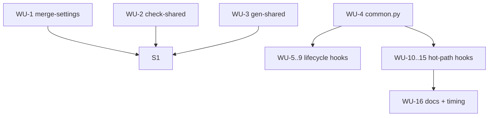

# ADR 0005 Execution Blueprint

- **Parent ADR:** `docs/adr/0005-python-hooks-and-config-scripts.md`

## System Snapshot

Real paths, confirmed in Stage 1 (repo root is `~/.claude`).

- 14 hooks in `hooks/`. Three guards stay bash: `hooks/rm-workspace-guard.sh`, `hooks/no-dash-guard.sh`, `hooks/bg-await-guard.sh` (wired in `settings.json`). Eleven migrate to python: `auto-model-detect`, `memory-anchors`, `memory-capture`, `post-edit-track`, `precompact-warn`, `preread-edit-check`, `preread-size-check`, `rebuild-memory-graph`, `search-counter`, `session-clean-exit`, `session-init`.
- Shared bash lib `hooks/lib/common.sh` (11 helpers: `hi_field`, `hi_session_id`, `session_dir`, `abspath`, `atomic_append`, `emit_pre_context`, `emit_pre_deny`, `emit_prompt_context`, `emit_system_message`, `_incr_counter`, `repo_slug`). Stays for the guards; a `common.py` is added for the python hooks.
- Config scripts (jq-heavy): `shell/merge-settings.sh` (12 jq), `shell/check-shared-settings.sh` (10), `shell/gen-shared-settings.sh` (5). Paired suites: `shell/merge-settings.test.sh`, `shell/check-shared-settings.test.sh`, `shell/gen-shared-settings.test.sh`.
- Hook registry: `hooks/hooks.json` invokes `"${CLAUDE_PLUGIN_ROOT}/hooks/<name>.sh"`. Guards are in `settings.json` and `settings.shared.json`.
- Callers of the config scripts: `install.sh`, `shell/setup-local.sh`, `.github/workflows/shell-ci.yml` (the shared-settings check), `shell/gen-shared-settings.sh` writes `settings.shared.json`.
- CI: `.github/workflows/shell-ci.yml` auto-discovers `*.test.sh` and runs `shellcheck`/`bash -n`/`zsh -n`. Python tests need a discovery path too (a `*_test.py` runner or keeping thin `*.test.sh` wrappers that invoke the python).
- python3 >= 3.9 is ensured by setup (v0.8.0), standard library only (no pip deps).

## Work Units

Grouped into three Segments, delivered in order.

### Segment S1: config scripts to python (non-hot-path, lowest risk)

#### WU-1: `merge-settings` to python
- Requires: nothing
- Files: `shell/merge-settings.py` | new (port of `shell/merge-settings.sh`, stdlib json, same CLI and exit codes) ; `shell/merge-settings.sh` | delete ; `shell/merge-settings.test.sh` | edit (invoke the `.py`, keep the scenarios) ; callers (`shell/setup-local.sh`, `install.sh`) | edit to call the `.py`.
- Verification: `bash shell/merge-settings.test.sh && python3 -m py_compile shell/merge-settings.py`
- Done When: the suite passes unchanged in intent; the settings merge behaviour (baseline, skip file, contested permissions) is identical.

#### WU-2: `check-shared-settings` to python
- Requires: nothing
- Files: `shell/check-shared-settings.py` | new ; `shell/check-shared-settings.sh` | delete ; `shell/check-shared-settings.test.sh` | edit ; `.github/workflows/shell-ci.yml` | edit (call the `.py`).
- Verification: `bash shell/check-shared-settings.test.sh && python3 shell/check-shared-settings.py settings.shared.json permissions.shared.json .`
- Done When: the CI shared-settings check passes against the real seed.

#### WU-3: `gen-shared-settings` to python
- Requires: nothing
- Files: `shell/gen-shared-settings.py` | new ; `shell/gen-shared-settings.sh` | delete ; `shell/gen-shared-settings.test.sh` | edit.
- Verification: `bash shell/gen-shared-settings.test.sh && python3 shell/gen-shared-settings.py <live settings.json> | python3 -c 'import sys,json; json.load(sys.stdin)'`
- Done When: the generated seed is byte-identical in shape to the bash version's output.

### Segment S2: shared lib + lifecycle hooks

#### WU-4: `hooks/lib/common.py`
- Requires: nothing
- Files: `hooks/lib/common.py` | new (python equivalents of the 11 helpers, stdlib only) ; `hooks/lib/common_test.py` or `hooks/lib/common.test.sh` | new.
- Verification: `python3 -m py_compile hooks/lib/common.py && <the common lib test>`
- Done When: each helper matches its `common.sh` counterpart's behaviour (payload field extraction, session dir, atomic append, the emit_* JSON shapes).

#### WU-5..9: lifecycle hooks to python
- Requires: WU-4
- One WU each for `session-init`, `session-clean-exit`, `precompact-warn`, `auto-model-detect`, `search-counter`: `hooks/<name>.py` new (import `common.py`), `hooks/<name>.sh` delete, its `*.test.sh` ported to drive the `.py`, and `hooks/hooks.json` / `settings.json` updated to the `.py` path.
- Verification (each): the hook's ported test, plus `echo '<payload>' | python3 hooks/<name>.py | python3 -c 'import sys,json; json.load(sys.stdin)'` for hooks that emit JSON.
- Done When: each hook emits the same payload for the same input, and session start still injects the memory slice as valid JSON.

### Segment S3: hot-path and memory hooks

#### WU-10..15: remaining hooks to python
- Requires: WU-4
- One WU each for `post-edit-track`, `preread-edit-check`, `preread-size-check`, `memory-anchors`, `memory-capture`, `rebuild-memory-graph`: `.py` new, `.sh` delete, test ported, `hooks.json` updated.
- `rebuild-memory-graph` already embeds python: lift the heredoc into the module body.
- Verification (each): the ported test, plus for `PreToolUse`/`PostToolUse` hooks a real-payload smoke that asserts valid JSON out and the documented side effect (marker written, edit tracked, graph rebuilt, anchor context emitted).
- Done When: the memory graph still rebuilds to 0 dangling on the live store, the anchor hook still surfaces facts on edit, and the capture marker still fires once per crossing.

#### WU-16: docs + timing
- Requires: all above
- Files: `docs/authoring/01-commands-skills-hooks.md` | edit (explain the mixed-language `hooks/`: python hooks with `common.py`, the three bash guards with `common.sh`, when to pick which) ; a short timing note capturing the `PreToolUse`/`PostToolUse` cost before and after.
- Verification: `grep -q 'common.py' docs/authoring/01-commands-skills-hooks.md`
- Done When: the authoring doc reflects the split and the timing is recorded.

## Ordering

| WU | Requires | Parallel group |
|---|---|---|
| WU-1, WU-2, WU-3 | none | S1-P (disjoint config scripts) |
| WU-4 | none | S2 first |
| WU-5..9 | WU-4 | S2-P (disjoint hook files, but each edits hooks.json: serialize the hooks.json edits) |
| WU-10..15 | WU-4 | S3-P (same hooks.json caveat) |
| WU-16 | WU-10..15 | last |

## Parallel Groups

- **S1-P:** WU-1, WU-2, WU-3. Disjoint files, no shared state. Safe to run concurrently.
- **S2-P and S3-P:** the hook rewrites touch disjoint `hooks/<name>.py` files but each also edits `hooks/hooks.json`. Run the rewrites in parallel worktrees, but apply the `hooks.json` registration edits sequentially at integration (the shared-file rule), or batch all `hooks.json` edits into one WU per segment.

## Dependency Graph

## Confidence + open items

- Confidence: HIGH on the structure (real paths, the guard carve-out, the hooks.json shared-file caveat). MEDIUM on the Python test discovery: CI finds `*.test.sh` today, so either keep thin `*.test.sh` wrappers that invoke `python3 -m ...`, or add a `*_test.py` runner step to `shell-ci.yml`. Decide in WU-1 and hold it for every later test.
- Open items (verify downstream):
  - Test discovery for python: pick the wrapper-or-runner approach in WU-1 and apply it consistently.
  - Latency: time the `PreToolUse`/`PostToolUse` hooks before and after (WU-16). If a hot-path hook regresses badly, reconsider keeping it bash.
  - `hooks.json` is a shared file across every hook WU: serialize its edits at integration or batch them per segment.
  - Guards stay bash: confirm none of the three is accidentally migrated.
  - `settings.json` vs `settings.shared.json`: the guards are wired in both; the migrated hooks are in `hooks.json`. Confirm no hook path is left pointing at a deleted `.sh`.
