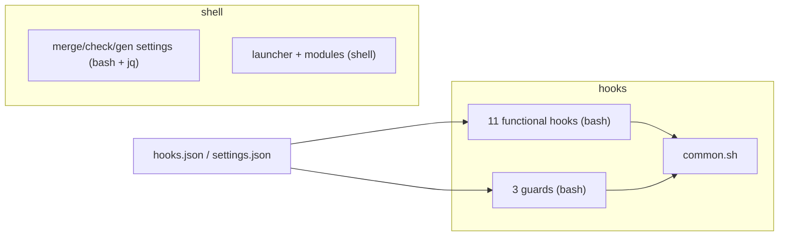
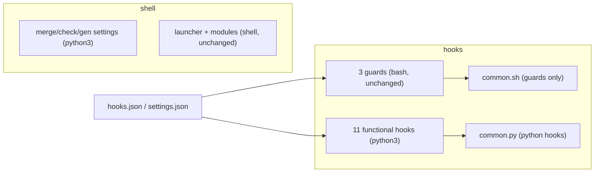

# ADR 0005: Migrate the hooks and the config scripts from shell to Python

- **Status:** Accepted
- **Date created:** 2026-08-11
- **Date modified:** 2026-08-11

## Context

The toolkit's automation is shell. There are 14 hooks under `hooks/` (each a bash script wired via `hooks/hooks.json` or `settings.json`), a shared bash library `hooks/lib/common.sh` (11 helpers: `hi_field`, `session_dir`, `atomic_append`, the `emit_*` payload writers, `repo_slug`, and more), and config-manipulation scripts under `shell/` that lean hard on `jq`: `merge-settings.sh` (12 jq calls), `check-shared-settings.sh` (10), `gen-shared-settings.sh` (5).

Two forces motivate a move to Python. The hooks parse a JSON payload on stdin and emit a JSON payload on stdout; in bash that means a `jq` subprocess per field, where Python's `json` module reads the whole thing once. And the config scripts are dense `jq` pipelines that are hard to read and test; the repo's test suites for them are hand-rolled bash harnesses rather than a real test framework.

Two hard constraints bound any rewrite:

- **The launcher must stay shell.** `cc`, `ccd`, and `_claude` (in `shell/shared/dispatch.sh` and the `shell/zsh` / `shell/bash` entry points) are interactive shell functions that the user sources into their shell. You cannot source a Python or Node file to define a shell function, so the launcher and its modules (sessions, retention, config-drift, clean-resume, bust-cache, worktree) are permanently shell.
- **Hooks are the hot path.** `hooks/hooks.json` fires 4 hooks on every `PreToolUse` and 2 on every `PostToolUse`. That is up to 6 interpreter starts per tool call, all session long. A bash guard runs in about 1 to 5 ms; a Python interpreter cold-starts in about 30 to 50 ms; a Node process about 50 to 100 ms.

Python is already a dependency: `hooks/no-dash-guard.sh` and `hooks/rebuild-memory-graph.sh` embed Python today, and ADR-adjacent work (v0.8.0) made setup enforce python3 >= 3.9. So Python adds no new runtime.

## Decision Drivers

- **Native JSON.** Hooks live and die by JSON on stdin and stdout. Python's `json` reads it once; the bash hooks shell out to `jq` per field.
- **Real tests.** Python gives the config scripts and the hooks a proper unit-test surface instead of bash harnesses that stub `jq` and `brew`.
- **One fewer portability tax.** The bash 3.2 versus zsh differences that complicate the shell code do not exist in Python.
- **No new dependency, and not Node.** Python is already required. Node would be a slower cold start on the hot path and would reintroduce a hard Node dependency the toolkit just made optional (v0.6.0 to v0.8.0). So Python, not `.mjs`.
- **Keep the safety layer fail-safe.** The three guards that block dangerous operations (`rm-workspace-guard`, `no-dash-guard`, `bg-await-guard`) run on every tool call and must not gain latency or a new failure mode.

## Considered Alternatives

### A. Rewrite every hook and the config scripts to Python; keep the three guards in bash (effort: L)

Convert the 11 non-guard hooks and the 3 config scripts to Python, add a `hooks/lib/common.py` the hooks import, and update `hooks/hooks.json` to invoke the `.py` files. The three safety guards stay bash.

- Trade-offs: the JSON-heavy hooks and the jq-heavy config scripts get the clearest win, and they gain real tests. The guards keep bash's near-zero latency and near-zero failure surface, so the safety layer stays fail-safe and fast. The cost is a mixed-language `hooks/` dir (mostly Python, three bash guards), which the authoring docs must explain.

### B. Rewrite ALL hooks including the guards to Python (effort: L)

Same as A, but the three guards also become Python.

- Trade-offs: uniform `hooks/` in one language. But every tool call now pays Python startup for the guards, and a guard that fails to load because Python is missing or broken is a hole in the safety layer. A blocking guard should have the smallest possible failure surface, which is bash. Rejected: the uniformity is not worth a slower, more fragile safety layer.

### C. Rewrite to Node `.mjs` (effort: L)

The hooks and config scripts as Node ES modules.

- Trade-offs: Node's JSON is also native. But Node has the slowest cold start of the three, so the hot-path tax is worst, and it reintroduces a hard Node dependency that v0.6.0 to v0.8.0 deliberately made optional. Rejected on latency and dependency grounds.

### D. Leave everything as shell (effort: S)

- Trade-offs: zero risk, nothing is broken, and the hooks are appropriately fast. But it forgoes the native-JSON and real-tests wins, and the config scripts stay dense jq. Rejected because the owner asked for the consolidation; kept as the fallback if a segment proves not worth it.

## Decision

Adopt **A**. Migrate the 11 non-guard hooks and the 3 config scripts to Python, backed by a new `hooks/lib/common.py`. Keep the three safety guards (`rm-workspace-guard`, `no-dash-guard`, `bg-await-guard`) in bash: a blocking guard on the hot path is exactly where bash's speed and zero-dependency execution are a feature, not a limitation. Keep the launcher and its shell modules in shell, as they must be.

Why the others lost. B makes the safety layer slower and more fragile for the sake of uniformity, a bad trade for code whose job is to fail safe. C is slower on the hot path and undoes the just-completed work to make Node optional. D forgoes the wins the owner asked for. Node is rejected outright; Python is already a dependency.

Hook invocation: each Python hook is an executable `#!/usr/bin/env python3` script, and `hooks/hooks.json` points at the `.py` path exactly as it points at `.sh` today. python3 >= 3.9 is already ensured by setup (v0.8.0).

## Consequences

Positive:

- The JSON-heavy hooks read their payload once instead of forking `jq` per field, and the jq-heavy config scripts become readable Python with real unit tests.
- The bash-3.2-versus-zsh portability tax disappears from the migrated code.
- No new runtime dependency, and the hot-path safety guards keep bash's speed and fail-safe behaviour.

Negative and follow-up:

- `hooks/` becomes mixed-language: mostly Python, three bash guards. The authoring doc (`docs/authoring/01-commands-skills-hooks.md`) must explain the split and when to pick which.
- Every migrated hook pays Python interpreter startup (about 30 to 50 ms) per fire. For the non-guard hooks this is acceptable; measure the `PostToolUse` pair (`post-edit-track`, `rebuild-memory-graph`) after the migration and reconsider any that prove too costly.
- `hooks/lib/common.sh` stays for the three bash guards, and `hooks/lib/common.py` is added for the Python hooks. The two share responsibilities and must not drift; each guard uses only the small slice of `common.sh` it needs.
- Success is measured, not asserted: every migrated hook keeps its existing behaviour (verified by porting its test), the full suite stays green, and the hot-path hooks are timed before and after so a latency regression is visible.

## Architecture Diagrams

Current: everything is shell.

Proposed: hooks and config scripts are Python; guards and the launcher stay shell.

