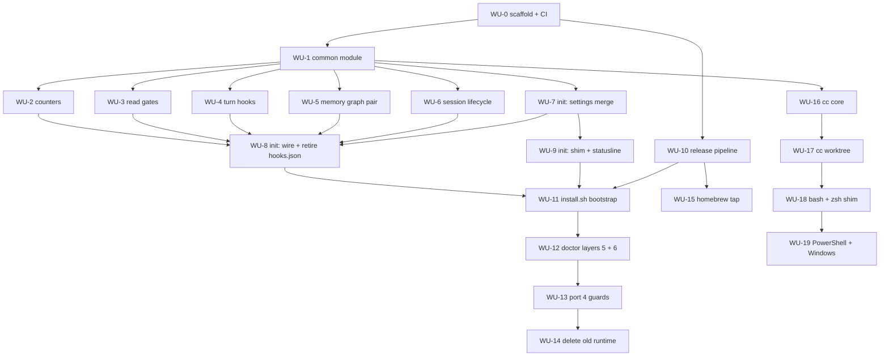

# ADR 0007 Execution Blueprint

- **Parent ADR:** `docs/adr/0007-rust-binary-for-hooks-and-launcher.md`

## System Snapshot

Real paths this plan touches, all confirmed present.

**Hooks to port (15).** 11 python in `hooks/`: `session-init.py` (314), `rebuild-memory-graph.py` (234), `memory-anchors.py` (186), `memory-capture.py` (119), `session-clean-exit.py` (109), `search-counter.py` (100), `preread-size-check.py` (79), `preread-edit-check.py` (78), `auto-model-detect.py` (66), `precompact-warn.py` (62), `post-edit-track.py` (44). 4 bash guards: `rm-workspace-guard.sh` (129), `no-dash-guard.sh` (83), `precommit-check.sh` (65), `bg-await-guard.sh` (42).

**Shared libraries to delete.** `hooks/lib/common.py` (263), `hooks/lib/common.sh` (150). `hooks/lib/config-hash.sh` (17) stays: the launcher sources it too.

**Existing test coverage to port.** One `*.test.sh` per hook (15), plus `hooks/lib/common.test.sh`, `hooks/incr-counter.test.sh`, `hooks/lib/config-hash.test.sh`.

**Registries.** `hooks/hooks.json` (plugin, retired by this work) and `settings.shared.json:99-129` (the seed that wires guards, extended to wire everything).

**Installer to absorb.** `shell/setup-local.sh` (301), `shell/merge-settings.py` (160). `install.sh` (262) shrinks to a bootstrap. `shell/ensure-deps.sh` (89) loses `jq` and `python@3.13` from `Brewfile`.

**Launcher (release 2).** `shell/shared/`: `worktree.sh` (493), `dispatch.sh` (148), `clean-resume.sh` (91), `sessions.sh` (69), `retention.sh` (46), `config-drift.sh` (42), `bust-cache.sh` (27). Entry points `shell/bash/cc.sh` (36), `shell/zsh/cc.zsh` (32).

**Validators that must change.** `shell/check-manifest.sh:31-33` (`ALLOW_FILES` needs `Cargo.toml`, `Cargo.lock`; `ALLOW_DIRS` needs `src`), `shell/plugin-e2e.sh:51-54` (runs `bash -n` on any non-`.py` hook command), `commands/doctor.md` (4 layers today, gains 2).

**CI.** `.github/workflows/shell-ci.yml` lints shell and python on an ubuntu plus macos matrix. No Rust lane exists. `.github/workflows/license.yml:76` already covers `*.rs`.

## Work Units

### WU-0: Cargo scaffold, CI lane, manifest allowlist
- Requires: nothing
- Goal: `cargo build --release` produces a `playbook` binary, CI lints it, and the repo validators accept the new paths.
- Files:
  - `Cargo.toml` | create | package metadata, `clap` with `derive`, `serde`, `serde_json`
  - `Cargo.lock` | create | committed, per the repo's pinned-dependency convention
  - `src/main.rs` | create | clap entry point, subcommand enum stubs for `hook`, `cc`, `statusline`, `init`
  - `src/lib.rs` | create | library root so `cargo test --lib` works
  - `.github/workflows/rust-ci.yml` | create | `cargo fmt --check`, `cargo clippy -- -D warnings`, `cargo test`, on ubuntu and macos
  - `shell/check-manifest.sh` | edit | add `Cargo.toml Cargo.lock` to `ALLOW_FILES`, `src` to `ALLOW_DIRS`
- Verification: `cargo build --release && cargo clippy --all-targets -- -D warnings && cargo fmt --check && bash shell/check-manifest.sh`
- Tests: TDD cycle 1, RED assert `playbook --version` prints the version from `Cargo.toml`; GREEN wire clap's version; REFACTOR extract the subcommand enum.
- Done When:
  - [ ] `./target/release/playbook --version` prints a semver string
  - [ ] `bash shell/check-manifest.sh` passes with `Cargo.toml`, `Cargo.lock` and `src/` tracked
  - [ ] `rust-ci.yml` runs green on both matrix legs

### WU-1: `common` module, replacing both shared libraries
- Requires: WU-0
- Goal: one typed module provides every helper `common.py` and `common.sh` expose, so no hook needs either again.
- Files:
  - `src/common/payload.rs` | create | dotted-path field extraction over `serde_json`, replacing `field()` and `hi_field`
  - `src/common/session.rs` | create | `session_dir`, `abspath`, runtime path resolution
  - `src/common/counter.rs` | create | `incr_counter` with the mkdir-lock and tmp-plus-replace semantics of `common.py:192-240`
  - `src/common/emit.rs` | create | `emit_pre_context`, `emit_pre_deny`, `emit_prompt_context`, `emit_system_message`, plus the `decision: block` shape `memory-capture.py:80-81` uses
  - `src/common/repo.rs` | create | `repo_slug` via `git remote get-url`
  - `src/common/mod.rs` | create | re-exports
- Verification: `cargo test --lib common`
- Tests: port every assertion in `hooks/lib/common.test.sh` and `hooks/incr-counter.test.sh` to `#[test]` functions. Boundary cases the shell tests already pin: missing field returns empty not error, concurrent `incr_counter` under the mkdir lock, atomic append leaves no partial line.
- Done When:
  - [ ] Every helper in `common.py` and `common.sh` has a Rust equivalent with a test
  - [ ] `cargo test --lib common` passes
  - [ ] For each of the four `emit_*` shapes, feeding one fixture payload to the python helper and the Rust helper produces byte-identical stdout, asserted by a test, not by inspection
  - [ ] Every hook entry point returns a non-panicking exit 0 on malformed stdin: truncated JSON, empty input, and valid JSON missing the expected field. Python fails soft today; a Rust panic on a hot path breaks the session

### WU-2: counter and tracking hooks
- Requires: WU-1
- Goal: `playbook hook search-counter` and `playbook hook post-edit-track` behave exactly as their python originals.
- Files:
  - `src/hooks/search_counter.rs` | create | port of `hooks/search-counter.py`
  - `src/hooks/post_edit_track.rs` | create | port of `hooks/post-edit-track.py`
  - `tests/hooks_counter.rs` | create | integration tests
- Verification: `cargo test --test hooks_counter`
- Tests: port `hooks/search-counter.test.sh` and `hooks/post-edit-track.test.sh`. Pin the escalation thresholds at 4, 8 and 12 (`search-counter.py:58-83`) and the first-time-per-path Read rule (`:39-51`).
- Done When:
  - [ ] Same stdout JSON as the python hook for identical stdin, across every case in the ported tests
  - [ ] `edits.jsonl` and the counter files keep their existing on-disk format

### WU-3: read-gate hooks
- Requires: WU-1
- Goal: `playbook hook preread-edit-check` and `playbook hook preread-size-check` behave exactly as their originals, including the deny path.
- Files:
  - `src/hooks/preread_edit_check.rs` | create | port of `hooks/preread-edit-check.py`
  - `src/hooks/preread_size_check.rs` | create | port of `hooks/preread-size-check.py`
  - `tests/hooks_preread.rs` | create | integration tests
- Verification: `cargo test --test hooks_preread`
- Tests: port `hooks/preread-edit-check.test.sh` and `hooks/preread-size-check.test.sh`. Boundaries to pin: the 1800s window (`preread-edit-check.py:18`), the 1000-line and 200KB thresholds (`preread-size-check.py:16-17`) and the 25-pattern allowlist (`:20-27`). This is the only hook that returns `permissionDecision: deny`, so assert the deny shape exactly.
- Done When:
  - [ ] Deny fires on the same inputs as the python version, never on allowlisted basenames
  - [ ] Offset or limit present suppresses the deny, as today

### WU-4: turn-scoped hooks
- Requires: WU-1
- Goal: `auto-model-detect`, `precompact-warn` and `memory-capture` ported.
- Files:
  - `src/hooks/auto_model_detect.rs` | create | port of `hooks/auto-model-detect.py`
  - `src/hooks/precompact_warn.rs` | create | port of `hooks/precompact-warn.py`
  - `src/hooks/memory_capture.rs` | create | port of `hooks/memory-capture.py`
  - `tests/hooks_turn.rs` | create | integration tests
- Verification: `cargo test --test hooks_turn`
- Tests: port the three matching `*.test.sh`. Pin the design-intent regex alternation (`auto-model-detect.py:23-32`), the sub-20-character and slash-command skips (`:50-56`), the 500-line log cap (`precompact-warn.py:48-58`), and `memory-capture`'s `decision: block` payload with at most 5 files.
- Done When:
  - [ ] `memory-capture` still blocks the turn when the `capture-due` marker is present, and consumes it
  - [ ] `precompact-warn` emits `systemMessage` only, never `additionalContext`

### WU-5: memory graph pair
- Requires: WU-1
- Goal: `memory-anchors` and `rebuild-memory-graph` ported together, with `graph.json` semantically equal to what the python writer produces: same nodes, same edges, compared after canonical sorting. Byte equality is the wrong bar, because `os.walk` and `fs::read_dir` return directory entries in unspecified order and the two serialisers format differently.
- Files:
  - `src/hooks/rebuild_memory_graph.rs` | create | port of `hooks/rebuild-memory-graph.py`, including the hand-rolled YAML-subset frontmatter parser (`:63-121`) and the two-pass edge resolver with same-scope-then-global fallback (`:193-210`)
  - `src/hooks/memory_anchors.rs` | create | port of `hooks/memory-anchors.py`, including the per-session TSV cache (`:121-182`)
  - `tests/hooks_memory_graph.rs` | create | integration tests including a round-trip
- Verification: `cargo test --test hooks_memory_graph`
- Tests: port `hooks/rebuild-memory-graph.test.sh` and `hooks/memory-anchors.test.sh`. Add a regression-pinning test that runs the python writer and the Rust writer over the same fixture memory tree and asserts the two `graph.json` outputs are equal.

  **Mandatory fixture matrix for the frontmatter parser**, all six required: (1) top-level scalars, (2) block lists, (3) nested dict sub-keys, (4) inline `[a,b,"c"]` sequences, (5) a dangling edge target, (6) a `supersedes` chain two links long. Comparison against the python writer only proves agreement on inputs someone thought to write, so the matrix is the coverage guarantee, not the comparison.
- Done When:
  - [ ] Rust and python `graph.json` carry the same nodes and edges, compared after canonical sorting, over a fixture tree with all four frontmatter shapes
  - [ ] `memory-anchors` resolves the same facts for the same edited path
  - [ ] Ported together in one commit, since one writes what the other reads

### WU-6: session lifecycle hooks
- Requires: WU-1
- Goal: `session-init` and `session-clean-exit` ported, still shelling out to the two shell scripts they depend on.
- Files:
  - `src/hooks/session_init.rs` | create | port of `hooks/session-init.py`, keeping the `bash` calls to `hooks/lib/config-hash.sh` and `shell/memory-context.sh`
  - `src/hooks/session_clean_exit.rs` | create | port of `hooks/session-clean-exit.py`
  - `tests/hooks_session.rs` | create | integration tests
- Verification: `cargo test --test hooks_session`
- Tests: port `hooks/session-init.test.sh` and `hooks/session-clean-exit.test.sh`. Pin the counter zeroing set (`session-init.py:86-98`), the resume-only drift warning (`:124-145`), and the reason-is-set-and-not-other rule that distinguishes SessionEnd from Stop (`session-clean-exit.py:35-36`).
- Done When:
  - [ ] Both shell-outs still resolve and their output is folded into `additionalContext` unchanged
  - [ ] `to-learn/<slug>.json` is written on the same threshold as today

### WU-7: `playbook init`, settings merge
- Requires: WU-1
- Goal: the three-way settings merge moves into Rust with behaviour identical to `shell/merge-settings.py`.
- Files:
  - `src/init/merge.rs` | create | port of `shell/merge-settings.py`, atomic write via tempfile plus rename
  - `tests/init_merge.rs` | create | integration tests
- Verification: `cargo test --test init_merge`
- Tests: port every case in `shell/merge-settings.test.sh`. Highest-risk unit in the plan, so regression-pinning comes first: run the python merger and the Rust merger over the same base, template and user triples and assert equal output including the skip-report.

  **Mandatory fixture matrix, not illustrative.** All six MUST be present, and "the mergers agree on every fixture" is not satisfiable with fewer: (1) user key absent from base, (2) user key modified from base, (3) template key removed, (4) malformed user JSON, (5) user key that is an object nested three deep, (6) user has hand-added a hook entry the template does not know about. Case 6 pins the clobber risk the ADR names under Consequences.
- Done When:
  - [ ] Rust and python mergers agree on every fixture triple
  - [ ] A crash mid-write leaves the original `settings.json` intact
  - [ ] `shell/merge-settings.py` is NOT deleted yet, so the comparison keeps working

### WU-8: `playbook init`, hook wiring and registry consolidation
- Requires: WU-2, WU-3, WU-4, WU-5, WU-6, WU-7
- Goal: `playbook init` writes every hook entry into `settings.json` and the plugin's `hooks.json` is retired.
- Files:
  - `src/init/wire.rs` | create | writes all 15 hook entries as `playbook hook <name>`, idempotent, backs up before change
  - `settings.shared.json` | edit | seed carries binary-invoked entries for every hook, not only the guards
  - `shell/gen-shared-settings.py` | edit | `SAFETY_RE` no longer filters to guards only, since the seed now legitimately carries all hooks
  - `hooks/hooks.json` | delete | registry retired
  - `tests/init_wire.rs` | create | integration tests
- Verification: `cargo test --test init_wire && python3 shell/check-shared-settings.py settings.shared.json permissions.shared.json .`
- Tests: assert idempotence (running init twice changes nothing the second time), assert every written command resolves, assert a pre-existing user hook entry is preserved not clobbered. Regression-pin the failure this fixes: after wiring, no `settings.json` entry may point at a path under `~/.claude/hooks/`.
- Done When:
  - [ ] `hooks/hooks.json` is gone and no hook is registered twice
  - [ ] `playbook init` run twice is a no-op the second time
  - [ ] `check-shared-settings.py` passes on the regenerated seed

### WU-9: `playbook init`, shim and statusline placement
- Requires: WU-7
- Goal: `init` installs the shell shim and puts `statusline.sh` where `settings.json` points, closing the gap that broke the status line.
- Files:
  - `src/init/shim.rs` | create | writes the bash and zsh shim, appends the source line idempotently, mirroring `shell/setup-local.sh:180-269`
  - `src/init/statusline.rs` | create | places the statusline at the path `settings.json` names, and verifies it resolves
  - `tests/init_shim.rs` | create | integration tests
- Verification: `cargo test --test init_shim`
- Tests: assert the rc file gains exactly one source line across repeated runs. Regression-pin the observed 2026-08-12 outage: after `init`, the `statusLine` command path MUST exist and be readable, asserted directly.
- Done When:
  - [ ] Running `init` on a machine with a missing statusline restores it
  - [ ] `.zshrc` and `.bashrc` gain no duplicate source lines on re-run

### WU-10: release pipeline
- Requires: WU-0
- Goal: a tag publishes five verified, ad-hoc-signed binaries with checksums.
- Files:
  - `.github/workflows/release.yml` | create | build matrix for `aarch64-apple-darwin`, `x86_64-apple-darwin`, `x86_64-unknown-linux-musl`, `aarch64-unknown-linux-musl`, `x86_64-pc-windows-msvc`; `codesign --sign -` on the macOS targets; emit `SHA256SUMS`; upload to the release
  - `Cargo.toml` | edit | `version` must equal `.claude-plugin/plugin.json` `version` and the git tag

**Version lockstep (from the `release-versioning` memory fact).** The manifest version is user-visible through `claude plugin details`, so `.claude-plugin/plugin.json` `version`, `Cargo.toml` `version` and the tag MUST all agree. The workflow MUST fail the build when they diverge, rather than publishing a binary whose version contradicts the manifest. Releases are cut by signed annotated tag pushed through the admin bypass actor on rulesets 18083544 and 18083561, then `gh release create --target main`; this workflow attaches artefacts to that release, it does not replace the procedure.
- Verification: `gh workflow run release.yml --ref <tag> && gh run watch`
- Tests: not unit-testable, and **CI-only: this unit MUST NOT gate a local `cargo test` run**, since it depends on a real GitHub release round-trip. Acceptance is a dry-run tag producing five artefacts plus `SHA256SUMS`, with each checksum verified by re-downloading and running `shasum -a 256 -c`.
- Done When:
  - [ ] Five artefacts and a `SHA256SUMS` file attach to a test release
  - [ ] Each macOS artefact reports `Signature=adhoc` under `codesign -dvv`
  - [ ] The linux artefacts are static: `ldd` reports "not a dynamic executable"

### WU-11: `install.sh` bootstrap
- Requires: WU-8, WU-9, WU-10
- Goal: `install.sh` detects the platform, fetches, verifies, and hands off to `playbook init`, failing loudly at every step.
- Files:
  - `install.sh` | rewrite | platform detect, fetch from Releases, `shasum -a 256 -c`, `chmod +x` defensively, run `playbook --version`, then `playbook init`
  - `shell/install-seed.test.sh` | edit | cover the new failure paths

**The shell fallback is deliberately NOT deleted here.** `shell/setup-local.sh` and `shell/merge-settings.py` stay on disk through this unit and are removed in WU-14, after `playbook init` has been proven by WU-12's doctor layers. Shipping the replacement and deleting the fallback in one commit means a bug in `init` leaves users unable to install at all, with nothing to fall back to.
- Verification: `bash shell/install-seed.test.sh && bash shell/uninstall.test.sh`
- Tests: Gherkin. Given a corrupted download, when install runs, then it exits non-zero and writes nothing to `~/.claude`. Given a binary that will not execute, when install runs, then it aborts before wiring any hook. Given a successful install, when it finishes, then `playbook --version` resolves and every wired hook command resolves.
- Done When:
  - [ ] Checksum mismatch aborts with non-zero exit and no partial install
  - [ ] A non-executable binary aborts before any `settings.json` write
  - [ ] No `python3` or `jq` is invoked anywhere in the install path
  - [ ] Running the FULL install end to end twice leaves `settings.json`, the rc file and the statusline path byte-identical after the second run. WU-8 and WU-9 test their own idempotence in isolation; this asserts it for the composed flow, which is where ordering bugs actually surface
  - [ ] A `settings.json` containing a user-authored hook entry still contains it, unmodified, after install

### WU-12: doctor layers 5 and 6
- Requires: WU-11
- Goal: `/playbook:doctor` fails hard when the binary or the statusline is missing.
- Files:
  - `commands/doctor.md` | edit | add Layer 5 (`playbook --version` resolves) and Layer 6 (the `statusLine` command path exists), both hard failures with remediation hints
- Verification: `bash shell/plugin-e2e.sh` and a manual `/playbook:doctor` run showing 6 layers
- Tests: Gherkin. Given the binary is absent, when doctor runs, then Layer 5 reports FAIL, never PASS. Given `~/.claude/statusline.sh` is missing, when doctor runs, then Layer 6 reports FAIL. Given an installed binary whose version differs from `.claude-plugin/plugin.json`, when doctor runs, then it warns about version skew.
- Done When:
  - [ ] Both new layers report FAIL, not INFO, when their target is missing
  - [ ] An executable test removes `statusline.sh` in a fixture `CLAUDE_CONFIG_DIR`, runs doctor, and asserts a FAIL exit. This replaces the earlier counterfactual wording, which was not checkable
  - [ ] Version skew between the binary and `plugin.json` produces a warning
  - [ ] **The parallel-execution assumption is measured once and recorded**, not assumed. Fire a `PreToolUse:Read` event with its three hooks wired to the binary and confirm event wall clock sits nearer `max(hook)` than `sum(hook)`. The entire "consolidating `hooks.json` entries buys nothing" argument rests on this, and it has only ever been inferred from transcript p50s

### WU-13: port the four bash guards
- Requires: WU-12
- Goal: the guards move into the binary, last, once it is proven present and verifiable.
- Files:
  - `src/hooks/rm_workspace_guard.rs` | create | port of `hooks/rm-workspace-guard.sh`, including the lexical path canonicaliser (`:28-46`)
  - `src/hooks/no_dash_guard.rs` | create | port of `hooks/no-dash-guard.sh`; the embedded python heredoc disappears, since Rust handles UTF-8 codepoints natively
  - `src/hooks/bg_await_guard.rs` | create | port of `hooks/bg-await-guard.sh`
  - `src/hooks/precommit_check.rs` | create | port of `hooks/precommit-check.sh`
  - `tests/hooks_guards.rs` | create | integration tests
- Verification: `cargo test --test hooks_guards`
- Tests: port all four `*.test.sh` suites, 12 cases for `precommit-check` alone. Safety-critical, so assert both directions: every blocked case still blocks, and every allowed case still passes. Pin the conservative blocks in `rm-workspace-guard` on `cd` and on `$(...)`, and the full em and en dash codepoint range U+2012 to U+2015 in `no-dash-guard`.
- Done When:
  - [ ] Every case in the four ported suites passes
  - [ ] `rm-workspace-guard` still blocks a path outside the safe roots, verified by a real invocation
  - [ ] No guard depends on `jq`

### WU-14: delete the old runtime
- Requires: WU-13
- Goal: the python and bash runtime is removed and the validators updated to match.
- Files:
  - `hooks/*.py` | delete | all 11
  - `hooks/*.sh` | delete | the 4 guards
  - `hooks/lib/common.py`, `hooks/lib/common.sh` | delete | both shared libraries
  - `hooks/*.test.sh`, `hooks/lib/common.test.sh`, `hooks/incr-counter.test.sh` | delete | replaced by `cargo test`
  - `shell/setup-local.sh` | delete | absorbed by `playbook init`, deferred from WU-11 so the fallback survived until `init` was proven
  - `shell/merge-settings.py` | delete | absorbed by WU-7, deleted only now that WU-7's comparison tests have passed and WU-12 verified the install
  - `docs/adr/0007-test-mapping.md` | create | the old-to-new test mapping table required below
  - `shell/plugin-e2e.sh` | edit | stop running `bash -n` on non-`.py` hook commands
  - `Brewfile` | edit | drop `jq` and `python@3.13` from the core set
  - `shell/ensure-deps.sh` | edit | drop the python and jq checks
  - `docs/authoring/01-commands-skills-hooks.md` | edit | rewrite the two-languages section for one binary
- Verification: `bash shell/plugin-e2e.sh && bash shell/check-manifest.sh && cargo test`
- Tests: no new tests. Acceptance is a **written mapping table**, committed as `docs/adr/0007-test-mapping.md`, with one row per assertion in every deleted `*.test.sh`: old file, old case description, new `cargo test` name. A row with no new-test counterpart blocks the deletion of that file. "Checked case by case" is not verifiable by itself, which is why the table exists.

**Deletion order is safety-critical (from the `hook-rename-lockstep-settings` memory fact).** Deleting a hook file while `settings.json` still points at it breaks the running session immediately, which is exactly what produced roughly 110 silent errors over 28 hours on 2026-08-11. The dependency chain already enforces the safe order (WU-8 rewrites every `settings.json` entry to `playbook hook <name>`, and WU-11 through WU-13 must land before this unit), but state it explicitly for whoever executes: **verify that no `settings.json` hook command references a path under `~/.claude/hooks/` BEFORE deleting anything**, and keep a timestamped `settings.json.bak-*`. Do not reorder this unit earlier.
- Done When:
  - [ ] `hooks/lib/config-hash.sh` survives, since the launcher sources it
  - [ ] `grep -rl "common.sh\|common.py" hooks/ shell/` returns nothing
  - [ ] `docs/adr/0007-test-mapping.md` has a new-test counterpart for every row, none blank
  - [ ] A container built `FROM debian:stable-slim` with only `git` and the binary installed runs every hook successfully, asserted by a CI job, not by inspection

### WU-15: Homebrew tap
- Requires: WU-10
- Goal: `brew install pragmatic-engineer/tap/playbook` works.
- Files:
  - external repo `pragmatic-engineer/homebrew-tap` | create | `Formula/playbook.rb` pointing at the release artefacts and their checksums
  - `README.md` | edit | document all three channels and the `playbook init` step
  - `docs/guides/00-install.md` | edit | same, plus the macOS `xattr -d com.apple.quarantine` note for the download channel
- Verification: `brew install --build-from-source pragmatic-engineer/tap/playbook && playbook --version`
- Tests: Gherkin. Given a clean machine, when the user runs the brew install and then `playbook init`, then hooks are wired and `/playbook:doctor` passes all six layers.
- Done When:
  - [ ] Formula installs and `playbook --version` resolves
  - [ ] The Gatekeeper workaround is documented for channel 3 on macOS

### WU-16: `playbook cc` core (release 2)
- Requires: WU-1
- Goal: session lookup, config drift, retention, cache busting and clean-resume move into the binary.
- Files:
  - `src/cc/sessions.rs`, `src/cc/config_drift.rs`, `src/cc/retention.rs`, `src/cc/bust_cache.rs`, `src/cc/clean_resume.rs` | create | ports of the matching `shell/shared/*.sh`
  - `tests/cc_core.rs` | create | integration tests
- Verification: `cargo test --test cc_core`
- Tests: port `shell/shared/launcher.test.sh` assertions that cover these modules. Pin the `keep` floor of 2 (`retention.sh:16-18`) and the stamp-regardless-of-match behaviour in `config-drift.sh:32-33`.
- Done When:
  - [ ] `playbook cc sessions --find <title>` prints the same session id the shell function resolves
  - [ ] Retention deletes the same set of files for the same input

### WU-17: `playbook cc worktree` (release 2)
- Requires: WU-16
- Goal: the 493-line worktree engine moves into the binary and prints the resolved path for the shim to `cd` to.
- Files:
  - `src/cc/worktree.rs` | create | port of `shell/shared/worktree.sh`, printing the target path on stdout
  - `tests/cc_worktree.rs` | create | integration tests
- Verification: `cargo test --test cc_worktree`
- Tests: port the worktree cases from `shell/shared/launcher.test.sh`. Pin the gitignored-only `.env` copy guard (`worktree.sh:152-168`) since it is a secret-leak control, and the branch-mismatch recovery paths (`:296-352`).
- Done When:
  - [ ] The resolved path is printed on stdout and nothing else is
  - [ ] `.env` is still copied only when gitignored in the source repo

### WU-18: bash and zsh shim (release 2)
- Requires: WU-17
- Goal: `shell/shared/` is replaced by a shim that keeps only what needs the parent shell.
- Files:
  - `shell/bash/cc.sh`, `shell/zsh/cc.zsh` | rewrite | ~40 lines each, `cd` to the printed path plus `disown`
  - `shell/shared/*.sh` | delete | 7 modules, ~916 lines
  - `shell/shared/launcher.test.sh`, `shell/cc-launcher.test.sh` | delete | parity testing is meaningless once one binary serves both shells
- Verification: `bash -n shell/bash/cc.sh && zsh -n shell/zsh/cc.zsh && cargo test`
- Tests: one end-to-end check per shell that `cc worktree <branch>` leaves the interactive shell in the new directory. That is the only behaviour the shim owns.
- Done When:
  - [ ] Both shims are under 60 lines
  - [ ] `cc worktree` still changes the parent shell's directory

### WU-19: PowerShell shim and Windows validation (release 2)
- Requires: WU-18
- Goal: hooks work on Windows and `cc` exists there.
- Files:
  - `shell/powershell/cc.ps1` | create | PowerShell equivalent of the shim
  - `.github/workflows/rust-ci.yml` | edit | add a windows-latest matrix leg
  - `docs/guides/00-install.md` | edit | Windows section
- Verification: `cargo test` green on the windows-latest CI leg
- Tests: run the full hook integration suite on windows-latest. Path handling is the risk, so pin cases with backslash separators and drive letters. **CI-only: this unit MUST NOT gate a local `cargo test` run**, since no Windows machine exists to reproduce it locally.
- Done When:
  - [ ] Every hook test passes on windows-latest
  - [ ] `cc worktree` changes directory in PowerShell

## Ordering

| WU | Requires | Parallel group |
|---|---|---|
| WU-0 | none | none |
| WU-1 | WU-0 | none |
| WU-2 | WU-1 | P1 |
| WU-3 | WU-1 | P1 |
| WU-4 | WU-1 | P1 |
| WU-5 | WU-1 | P1 |
| WU-6 | WU-1 | P1 |
| WU-7 | WU-1 | P1 |
| WU-10 | WU-0 | P1 |
| WU-8 | WU-2, WU-3, WU-4, WU-5, WU-6, WU-7 | none |
| WU-9 | WU-7 | none |
| WU-11 | WU-8, WU-9, WU-10 | none |
| WU-12 | WU-11 | none |
| WU-13 | WU-12 | none |
| WU-14 | WU-13 | none |
| WU-15 | WU-10 | none |
| WU-16 | WU-1 | P2 |
| WU-17 | WU-16 | none |
| WU-18 | WU-17 | none |
| WU-19 | WU-18 | none |

## Parallel Groups

- **P1 (after WU-1):** WU-2, WU-3, WU-4, WU-5, WU-6, WU-7, WU-10. Each writes its own files under `src/hooks/`, `src/init/` or `.github/workflows/`, with no shared mutable state and no ordering between them. WU-10 depends only on WU-0 but is safe to run alongside the rest.
- **P2 (release 2):** WU-16 depends only on WU-1, so it can start any time after the foundation lands, including in parallel with release 1 work if you want it early.
- **Sequential:** WU-0, then WU-1, then everything after P1. WU-8 is a barrier: it wires all 15 hooks, so it needs every hook port done. WU-11 through WU-14 are strictly sequential because each depends on the previous being proven, and WU-13 is deliberately gated behind WU-12 by the ADR's fail-safe policy.

## Segments

PR-sized delivery boundaries, stacked.

| Segment | Work Units | Theme |
|---|---|---|
| A | WU-0, WU-1 | Foundation: scaffold, CI, shared module |
| B | WU-2, WU-3, WU-4, WU-5, WU-6 | The 11 python hooks |
| C | WU-7, WU-8, WU-9 | `playbook init` and registry consolidation |
| D | WU-10, WU-11, WU-12, WU-15 | Distribution, three channels, doctor layers |
| E | WU-13, WU-14 | Guards last, then delete the old runtime |
| F | WU-16, WU-17, WU-18, WU-19 | Release 2: launcher and Windows |

Segments A through E are release 1 and deliver the whole justification: single-language hooks, both shared libraries gone, `jq` and `python3` out of the runtime, one registry. Segment F is separable.

## Dependency Graph

## Confidence + open items

- Confidence: **MEDIUM-HIGH.** The hook ports are well understood: every one has an existing test suite to port and a measured baseline. The file plans reference real paths, all confirmed. Confidence drops on WU-7 and WU-11, where `playbook init` absorbs installation, because a bug there breaks installing rather than one hook, and on WU-19, where Windows path handling has no existing coverage anywhere in this repo.
- Open items (verify downstream):
  - **Does `settings.json` accept a bare-name hook command from a plugin-independent entry?** `rtk hook claude` proves it works for a hand-written user entry. WU-8 assumes it holds for entries `playbook init` writes. Verify before WU-8 commits, `/implement` watch.
  - **`shell/gen-shared-settings.py` regeneration ordering.** The generator derives the seed from the maintainer's live `settings.json`, so regenerating before the live file carries the new entries would drop them. WU-8 must sequence this explicitly, `/implement` watch.
  - **`graph.json` byte-identity between the python and Rust writers** may prove impractical if python dict ordering leaks into the output. If so, WU-5 falls back to semantic equality on parsed JSON, which is weaker. Verify in WU-5's first test.
  - **Windows launcher semantics are unproven.** No Windows machine or CI leg exists in this repo today, so WU-19's `cd` behaviour in PowerShell is asserted from documentation, not observation. `[unverified]`
  - **Notarisation deferred.** Channel 3 on macOS relies on a documented `xattr` workaround. If it generates support load, a follow-up ADR covers Developer ID and `notarytool`.
  - **The settings-seed allowlist inversion is deliberately NOT fixed here.** `shell/gen-shared-settings.py` builds the shipped seed by denylisting five personal keys from the maintainer's live `settings.json`, so personal config leaks by construction; the agreed fix is an allowlist in a shared `shell/settings_keys.py` (memory fact `settings-seed-allowlist-inversion`). WU-7 and WU-8 touch that generator, which makes it a tempting place to fix, and fixing it there would be scope creep on an already-XL plan. Flagged so the choice is deliberate rather than an oversight. `/implement` watch.
