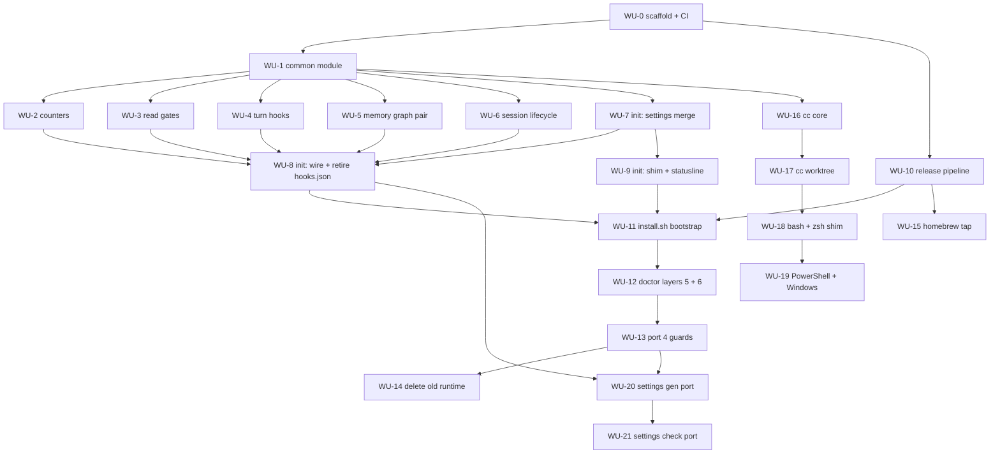

# ADR 0007 Execution Blueprint

- **Parent ADR:** `docs/adr/0007-rust-binary-for-hooks-and-launcher.md`

## System Snapshot

Real paths this plan touches, all confirmed present.

**Hooks to port (15).** 11 python in `hooks/`: `session-init.py` (314), `rebuild-memory-graph.py` (234), `memory-anchors.py` (186), `memory-capture.py` (119), `session-clean-exit.py` (109), `search-counter.py` (100), `preread-size-check.py` (79), `preread-edit-check.py` (78), `auto-model-detect.py` (66), `precompact-warn.py` (62), `post-edit-track.py` (44). 4 bash guards: `rm-workspace-guard.sh` (129), `no-dash-guard.sh` (83), `precommit-check.sh` (65), `bg-await-guard.sh` (42).

**Shared libraries to delete.** `hooks/lib/common.py` (263), `hooks/lib/common.sh` (150). `hooks/lib/config-hash.sh` (17) stays: the launcher sources it too.

**Existing test coverage to port.** One `*.test.sh` per hook (15), plus `hooks/lib/common.test.sh`, `hooks/incr-counter.test.sh`, `hooks/lib/config-hash.test.sh`.

**Registries.** `hooks/hooks.json` (plugin, retired by this work) and `settings.shared.json:99-129` (the seed that wires guards, extended to wire everything).

**Installer to absorb.** `shell/setup-local.sh` (301), `shell/merge-settings.py` (160). `install.sh` (262) shrinks to a bootstrap. `shell/ensure-deps.sh` (89) loses `jq` and `python@3.13` from `Brewfile`.

**Launcher (release 2).** `shell/shared/`: `worktree.sh` (493), `dispatch.sh` (148), `clean-resume.sh` (91), `sessions.sh` (69), `retention.sh` (46), `config-drift.sh` (42), `bust-cache.sh` (27). Entry points `shell/bash/cc.sh` (36), `shell/zsh/cc.zsh` (32).

**Validators that must change.** ~~`shell/check-manifest.sh:31-33`~~ (**amended 2026-08-20:** that file no longer exists; WU-21 ported it to `src/manifest/check.rs`, and `ls shell/check*` returns no matches), `shell/plugin-e2e.sh:45-58` (runs `bash -n` on any non-`.py` hook command; line numbers moved from `:51-54`, and **WU-11 now owns this edit**, not WU-14, because WU-11 deletes the `hooks/hooks.json` that `:37`, `:58` and `:88` read), `commands/doctor.md` (5 layers today, gains 2; Layer 5 checks the status line against the shipped copy and shipped ahead of WU-12).

**CI.** `.github/workflows/shell-ci.yml` lints shell and python on an ubuntu plus macos matrix. No Rust lane exists. `.github/workflows/license.yml:76` already covers `*.rs`.

## Work Units

### WU-0: Cargo scaffold, CI lane, manifest allowlist
- Requires: nothing
- Goal: `cargo build --release` produces a `playbook` binary, CI lints it, and the repo validators accept the new paths.
- Files:
  - `Cargo.toml` | create | package metadata, `clap` with `derive`, `serde`, `serde_json`
  - `Cargo.lock` | create | committed, per the repo's pinned-dependency convention
  - `src/main.rs` | create | clap entry point, subcommand enum stubs for `hook`, `cc`, `statusline`, `init`
  - `src/lib.rs` | create | library root so `cargo test --lib` works
  - `.github/workflows/rust-ci.yml` | create | `cargo fmt --check`, `cargo clippy -- -D warnings`, `cargo test`, on ubuntu and macos
  - `shell/check-manifest.sh` | edit | add `Cargo.toml Cargo.lock` to `ALLOW_FILES`, `src` to `ALLOW_DIRS`
- Verification: `cargo build --release && cargo clippy --all-targets -- -D warnings && cargo fmt --check && bash shell/check-manifest.sh`
- Tests: TDD cycle 1, RED assert `playbook --version` prints the version from `Cargo.toml`; GREEN wire clap's version; REFACTOR extract the subcommand enum.
- Done When:
  - [ ] `./target/release/playbook --version` prints a semver string
  - [ ] `bash shell/check-manifest.sh` passes with `Cargo.toml`, `Cargo.lock` and `src/` tracked
  - [ ] `rust-ci.yml` runs green on both matrix legs

### WU-1: `common` module, replacing both shared libraries
- Requires: WU-0
- Goal: one typed module provides every helper `common.py` and `common.sh` expose, so no hook needs either again.
- Files:
  - `src/common/payload.rs` | create | dotted-path field extraction over `serde_json`, replacing `field()` and `hi_field`
  - `src/common/session.rs` | create | `session_dir`, `abspath`, runtime path resolution
  - `src/common/counter.rs` | create | `incr_counter` with the mkdir-lock and tmp-plus-replace semantics of `common.py:192-240`
  - `src/common/emit.rs` | create | `emit_pre_context`, `emit_pre_deny`, `emit_prompt_context`, `emit_system_message`, plus the `decision: block` shape `memory-capture.py:80-81` uses
  - `src/common/repo.rs` | create | `repo_slug` via `git remote get-url`
  - `src/common/mod.rs` | create | re-exports
- Verification: `cargo test --lib common`
- Tests: port every assertion in `hooks/lib/common.test.sh` and `hooks/incr-counter.test.sh` to `#[test]` functions. Boundary cases the shell tests already pin: missing field returns empty not error, concurrent `incr_counter` under the mkdir lock, atomic append leaves no partial line.
- Done When:
  - [ ] Every helper in `common.py` and `common.sh` has a Rust equivalent with a test
  - [ ] `cargo test --lib common` passes
  - [ ] For each of the four `emit_*` shapes, feeding one fixture payload to the python helper and the Rust helper produces byte-identical stdout, asserted by a test, not by inspection
  - [ ] Every hook entry point returns a non-panicking exit 0 on malformed stdin: truncated JSON, empty input, and valid JSON missing the expected field. Python fails soft today; a Rust panic on a hot path breaks the session

### WU-2: counter and tracking hooks
- Requires: WU-1
- Goal: `playbook hook search-counter` and `playbook hook post-edit-track` behave exactly as their python originals.
- Files:
  - `src/hooks/search_counter.rs` | create | port of `hooks/search-counter.py`
  - `src/hooks/post_edit_track.rs` | create | port of `hooks/post-edit-track.py`
  - `tests/hooks_counter.rs` | create | integration tests
- Verification: `cargo test --test hooks_counter`
- Tests: port `hooks/search-counter.test.sh` and `hooks/post-edit-track.test.sh`. Pin the escalation thresholds at 4, 8 and 12 (`search-counter.py:58-83`) and the first-time-per-path Read rule (`:39-51`).
- Done When:
  - [ ] Same stdout JSON as the python hook for identical stdin, across every case in the ported tests
  - [ ] `edits.jsonl` and the counter files keep their existing on-disk format

### WU-3: read-gate hooks
- Requires: WU-1
- Goal: `playbook hook preread-edit-check` and `playbook hook preread-size-check` behave exactly as their originals, including the deny path.
- Files:
  - `src/hooks/preread_edit_check.rs` | create | port of `hooks/preread-edit-check.py`
  - `src/hooks/preread_size_check.rs` | create | port of `hooks/preread-size-check.py`
  - `tests/hooks_preread.rs` | create | integration tests
- Verification: `cargo test --test hooks_preread`
- Tests: port `hooks/preread-edit-check.test.sh` and `hooks/preread-size-check.test.sh`. Boundaries to pin: the 1800s window (`preread-edit-check.py:18`), the 1000-line and 200KB thresholds (`preread-size-check.py:16-17`) and the 25-pattern allowlist (`:20-27`). This is the only hook that returns `permissionDecision: deny`, so assert the deny shape exactly.
- Done When:
  - [ ] Deny fires on the same inputs as the python version, never on allowlisted basenames
  - [ ] Offset or limit present suppresses the deny, as today

### WU-4: turn-scoped hooks
- Requires: WU-1
- Goal: `auto-model-detect`, `precompact-warn` and `memory-capture` ported.
- Files:
  - `src/hooks/auto_model_detect.rs` | create | port of `hooks/auto-model-detect.py`
  - `src/hooks/precompact_warn.rs` | create | port of `hooks/precompact-warn.py`
  - `src/hooks/memory_capture.rs` | create | port of `hooks/memory-capture.py`
  - `tests/hooks_turn.rs` | create | integration tests
- Verification: `cargo test --test hooks_turn`
- Tests: port the three matching `*.test.sh`. Pin the design-intent regex alternation (`auto-model-detect.py:23-32`), the sub-20-character and slash-command skips (`:50-56`), the 500-line log cap (`precompact-warn.py:48-58`), and `memory-capture`'s `decision: block` payload with at most 5 files.
- Done When:
  - [ ] `memory-capture` still blocks the turn when the `capture-due` marker is present, and consumes it
  - [ ] `precompact-warn` emits `systemMessage` only, never `additionalContext`

### WU-5: memory graph pair
- Requires: WU-1
- Goal: `memory-anchors` and `rebuild-memory-graph` ported together, with `graph.json` semantically equal to what the python writer produces: same nodes, same edges, compared after canonical sorting. Byte equality is the wrong bar, because `os.walk` and `fs::read_dir` return directory entries in unspecified order and the two serialisers format differently.
- Files:
  - `src/hooks/rebuild_memory_graph.rs` | create | port of `hooks/rebuild-memory-graph.py`, including the hand-rolled YAML-subset frontmatter parser (`:63-121`) and the two-pass edge resolver with same-scope-then-global fallback (`:193-210`)
  - `src/hooks/memory_anchors.rs` | create | port of `hooks/memory-anchors.py`, including the per-session TSV cache (`:121-182`)
  - `tests/hooks_memory_graph.rs` | create | integration tests including a round-trip
- Verification: `cargo test --test hooks_memory_graph`
- Tests: port `hooks/rebuild-memory-graph.test.sh` and `hooks/memory-anchors.test.sh`. Add a regression-pinning test that runs the python writer and the Rust writer over the same fixture memory tree and asserts the two `graph.json` outputs are equal.

  **Mandatory fixture matrix for the frontmatter parser**, all six required: (1) top-level scalars, (2) block lists, (3) nested dict sub-keys, (4) inline `[a,b,"c"]` sequences, (5) a dangling edge target, (6) a `supersedes` chain two links long. Comparison against the python writer only proves agreement on inputs someone thought to write, so the matrix is the coverage guarantee, not the comparison.
- Done When:
  - [ ] Rust and python `graph.json` carry the same nodes and edges, compared after canonical sorting, over a fixture tree with all four frontmatter shapes
  - [ ] `memory-anchors` resolves the same facts for the same edited path
  - [ ] Ported together in one commit, since one writes what the other reads

### WU-6: session lifecycle hooks
- Requires: WU-1
- Goal: `session-init` and `session-clean-exit` ported, still shelling out to the two shell scripts they depend on.
- Files:
  - `src/hooks/session_init.rs` | create | port of `hooks/session-init.py`, keeping the `bash` calls to `hooks/lib/config-hash.sh` and `shell/memory-context.sh`
  - `src/hooks/session_clean_exit.rs` | create | port of `hooks/session-clean-exit.py`
  - `tests/hooks_session.rs` | create | integration tests
- Verification: `cargo test --test hooks_session`
- Tests: port `hooks/session-init.test.sh` and `hooks/session-clean-exit.test.sh`. Pin the counter zeroing set (`session-init.py:86-98`), the resume-only drift warning (`:124-145`), and the reason-is-set-and-not-other rule that distinguishes SessionEnd from Stop (`session-clean-exit.py:35-36`).
- Done When:
  - [ ] Both shell-outs still resolve and their output is folded into `additionalContext` unchanged
  - [ ] `to-learn/<slug>.json` is written on the same threshold as today

### WU-7: `playbook init`, settings merge
- Requires: WU-1
- Goal: the three-way settings merge moves into Rust with behaviour identical to `shell/merge-settings.py`.
- Files:
  - `src/init/merge.rs` | create | port of `shell/merge-settings.py`, atomic write via tempfile plus rename
  - `tests/init_merge.rs` | create | integration tests
- Verification: `cargo test --test init_merge`
- Tests: port every case in `shell/merge-settings.test.sh`. Highest-risk unit in the plan, so regression-pinning comes first: run the python merger and the Rust merger over the same base, template and user triples and assert equal output including the skip-report.

  **Mandatory fixture matrix, not illustrative.** All six MUST be present, and "the mergers agree on every fixture" is not satisfiable with fewer: (1) user key absent from base, (2) user key modified from base, (3) template key removed, (4) malformed user JSON, (5) user key that is an object nested three deep, (6) user has hand-added a hook entry the template does not know about. Case 6 pins the clobber risk the ADR names under Consequences.
- Done When:
  - [ ] Rust and python mergers agree on every fixture triple
  - [ ] A crash mid-write leaves the original `settings.json` intact
  - [ ] `shell/merge-settings.py` is NOT deleted yet, so the comparison keeps working

### WU-8: `playbook init`, hook wiring and registry consolidation
- Requires: WU-2, WU-3, WU-4, WU-5, WU-6, WU-7
- Goal: the wiring code exists and is tested. It is NOT activated here; WU-11 turns it on. See the second amendment below.
- Files:
  - `src/init/wire.rs` | create | writes the 11 PORTED hook entries as `playbook hook <name>`, idempotent, backs up before change. The four guards keep their existing `~/.claude/hooks/*.sh` commands until WU-13; see the amendment below
  - `shell/gen-shared-settings.py` | edit | `SAFETY_RE` accepts both a bare `playbook hook <name>` and the four guard `.sh` filenames, since across the transition the seed legitimately carries both shapes
  - `tests/init_wire.rs` | create | integration tests
  - **Not here:** `settings.shared.json` regeneration and the `hooks/hooks.json` deletion move to WU-11; see the second amendment below
- Verification: `cargo test --test init_wire && ./target/debug/playbook settings check settings.shared.json permissions.shared.json .` (**amended 2026-08-20:** was `python3 shell/check-shared-settings.py ...`; WU-21 ported that validator into the binary and deleted the script)
- Tests: assert idempotence (running init twice changes nothing the second time), assert every written command resolves, assert a pre-existing user hook entry is preserved not clobbered. **Assert that no hook wired in binary form is still an empty stub**, deriving the list from what `wire()` actually writes rather than from a hardcoded copy.
- Done When:
  - [ ] `wire()` run twice against the same file is a no-op the second time
  - [ ] `check-shared-settings.py` still passes on the unchanged seed
  - [ ] No hook wired as `playbook hook <name>` resolves to a stub implementation
  - [ ] `hooks/hooks.json` is still present and still delivers the 11 functional hooks

### Amendment 2026-08-16: WU-8 must not rewire the guards

The original text said "writes every hook entry" and regression-pinned "after
wiring, no `settings.json` entry may point at a path under `~/.claude/hooks/`".
Executing that faithfully **silently disables four live safety guards**, because
`rm_workspace_guard`, `bg_await_guard`, `no_dash_guard` and `precommit_check` are
empty stubs (`pub fn run(_payload: &Payload) {}`) until WU-13, which sits two
Segments later in Segment E.

Verified by running both implementations against the same `rm -rf ~/Documents`
payload: the shell guard returns `permissionDecision: "deny"` naming the path,
the Rust stub prints nothing and exits 0, allowing the command through.

This was invisible to WU-8's own tests. All seven passed and the seed validator
passed, because the wiring is correct and the stubs are legitimately empty. The
defect lives in the gap between two units that are each individually right.

**The `~/.claude/hooks/` criterion moves to WU-13**, which is the first unit
where it can be true without disabling a guard. Reordering WU-13 ahead of WU-8
would also work but drags the guard port two Segments earlier for no benefit.

The general lesson, worth applying to the remaining units: when an acceptance
criterion asserts a global property ("no entry anywhere does X"), it ranges over
every item, not only the ones the unit touches. Check the whole range.

### Amendment 2026-08-16 (second): activation moves to WU-11

**No Work Unit in this blueprint ever wires `Command::Init`.** WU-0 created
`src/main.rs` with `Command::Init => {}` as a stub, and the only later edits to
that file are WU-20 and WU-21 adding `settings gen` and `settings check`. So
`playbook init` is a no-op for the entire plan as originally written, while
WU-8's and WU-9's Done When criteria are phrased as though it runs
("`playbook init` run twice is a no-op the second time", "Running `init` on a
machine with a missing statusline restores it"). Their tests call the library
functions directly, so nothing caught the gap.

That is survivable on its own. What is not: WU-8 also deleted
`hooks/hooks.json`, which is the plugin's registry and the only thing currently
delivering the 11 functional hooks. Deleting it while `playbook init` does
nothing removes every functional hook from every user on the next plugin
release, with no way to restore them. Verified: that file registers 12 hook
commands, and the live `~/.claude/settings.json` carries only the four guards,
so the plugin registry really is load-bearing.

This is the same rule WU-14 already states for the reverse direction: never
remove the old wiring before the new wiring works. It applies here too.

**Therefore:**

- WU-8 delivers the wiring CODE only, tested at the library level, inert. That
  matches how every Segment so far has worked: build it, prove it, activate
  later.
- `hooks/hooks.json` deletion and `settings.shared.json` regeneration into
  binary-invoked form move to **WU-11**, which is the unit that builds the
  install bootstrap and already requires WU-8, WU-9 and WU-10.

  **Amended 2026-08-20.** The third item, wiring `src/main.rs`'s
  `Command::Init`, **landed early in PR #190** and is no longer part of the
  switchover: `src/main.rs:51-79` composes `init::run::run`, which chains merge,
  wire, shim and statusline (`src/init/run.rs:136-141`). Landing it alone was
  safe because `hooks/hooks.json` still delivers the functional hooks, so `wire`
  only changes a user's own `settings.json` when they choose to run `init`.
  **WU-11 must therefore do the remaining two together or neither.**
- WU-11 gains `src/main.rs | edit | wire Command::Init to compose merge, wire,
  shim and statusline` in its file plan, plus a Done When asserting that
  `playbook init` on a clean machine leaves all 15 hooks firing, verified by
  invoking them rather than by reading the settings file.

### WU-9: `playbook init`, shim and statusline placement
- Requires: WU-7
- Goal: `init` installs the shell shim and puts `statusline.sh` where `settings.json` points, closing the gap that broke the status line.
- Files:
  - `src/init/shim.rs` | create | writes the bash and zsh shim, appends the source line idempotently, mirroring `shell/setup-local.sh:180-269`
  - `src/init/statusline.rs` | create | places the statusline at the path `settings.json` names, and verifies it resolves
  - `tests/init_shim.rs` | create | integration tests
- Verification: `cargo test --test init_shim`
- Tests: assert the rc file gains exactly one source line across repeated runs. Regression-pin the observed 2026-08-12 outage: after `init`, the `statusLine` command path MUST exist and be readable, asserted directly.
- Done When:
  - [ ] Running `init` on a machine with a missing statusline restores it
  - [ ] `.zshrc` and `.bashrc` gain no duplicate source lines on re-run

### WU-10: release pipeline
- Requires: WU-0
- Goal: a tag publishes five verified, ad-hoc-signed binaries with checksums.
- Files:
  - `.github/workflows/release.yml` | create | build matrix for `aarch64-apple-darwin`, `x86_64-apple-darwin`, `x86_64-unknown-linux-musl`, `aarch64-unknown-linux-musl`, `x86_64-pc-windows-msvc`; `codesign --sign -` on the macOS targets; emit `SHA256SUMS`; upload to the release
  - `Cargo.toml` | edit | `version` must equal `.claude-plugin/plugin.json` `version` and the git tag

**Version lockstep (from the `release-versioning` memory fact).** The manifest version is user-visible through `claude plugin details`, so `.claude-plugin/plugin.json` `version`, `Cargo.toml` `version` and the tag MUST all agree. The workflow MUST fail the build when they diverge, rather than publishing a binary whose version contradicts the manifest. Releases are cut by signed annotated tag pushed through the admin bypass actor on rulesets 18083544 and 18083561, then `gh release create --target main`; this workflow attaches artefacts to that release, it does not replace the procedure.
- Verification: `gh workflow run release.yml --ref <tag> && gh run watch`
- Tests: not unit-testable, and **CI-only: this unit MUST NOT gate a local `cargo test` run**, since it depends on a real GitHub release round-trip. Acceptance is a dry-run tag producing five artefacts plus `SHA256SUMS`, with each checksum verified by re-downloading and running `shasum -a 256 -c`.
- Done When:
  - [ ] Five artefacts and a `SHA256SUMS` file attach to a test release
  - [ ] Each macOS artefact reports `Signature=adhoc` under `codesign -dvv`
  - [ ] The linux artefacts are static: `ldd` reports "not a dynamic executable"

### WU-11: `install.sh` bootstrap
- Requires: WU-8, WU-9, WU-10
- Goal: `install.sh` detects the platform, fetches, verifies, and hands off to `playbook init`, failing loudly at every step.
- Files:
  - `install.sh` | rewrite | resolve one release tag (**keeping `resolve_tarball_url`'s 200/404/other status branching**, per the `installer-must-not-fall-back-to-main` memory fact); from **that same tag** fetch both the platform binary and the source tarball; verify the binary against `SHA256SUMS` with `shasum -a 256 -c`, falling back to `sha256sum -c`; `chmod 0755` defensively; smoke-test `--version` from the staging dir and assert it matches the resolved tag; install to `${PLAYBOOK_BIN_DIR:-$HOME/.local/bin}` by temp-file-plus-rename; then run `playbook init` with `CLAUDE_PLUGIN_ROOT` pointed at the staged tarball tree. **Removes** the whole-tree copy into `~/.claude` (`:181-198`), the `setup-local.sh` hand-off (`:223`), and the `backups/install-*` creation and pruning (`:176-178`, `:264-267`). Keeps the plugin install and the interactive prompts
  - `src/main.rs` | **no change** | **amended 2026-08-20:** `Command::Init` was wired ahead of this unit in PR #190; `:51-79` already composes merge, wire, shim and statusline via `init::run::run`. Left in the file plan as a deliberate no-op so a reader does not re-do it
  - `hooks/hooks.json` | delete | registry retired. Moved here from WU-8: deleting it before `Command::Init` is wired strips all 11 functional hooks from every user with nothing to restore them
  - `settings.shared.json` | edit | regenerate so the seed carries the 11 ported hooks in binary-invoked form. Moved here from WU-8, same reason: the seed must not advertise a binary the installer has not yet placed. **Acceptance:** the diff touches the `.hooks` block and nothing else; any other changed key is personal drift leaking through the denylist generator (`settings-seed-allowlist-inversion`) and must be reverted by hand. `shell/gen-shared-settings.py:54-57`'s `SAFETY_RE` already accepts both shapes, so no generator edit is needed
  - `shell/install-seed.test.sh` | edit | cover the new failure paths

  **Added to the file plan 2026-08-20** (the original list was short by ten files):
  - `src/init/guards.rs` | create | place the four guards; see the defect note below
  - `src/init/system_prompt.rs` | create | place `prompts/SYSTEM_PROMPT.md`; see the defect note below
  - `src/init/run.rs` | edit | insert both steps into the vec at `:136-141`; guards go **before** `wire_hooks`. Update the ordering doc at `:15-23`
  - `src/init/mod.rs` | edit | declare both modules. Update `:14-21`, which still says the switchover "needs a published release … which does not exist yet"; v0.10.0 shipped 2026-08-19
  - `src/init/wire.rs` | edit | widen `GUARD_SPECS` visibility to `pub(crate)` so `guards.rs` derives from it. No behaviour change
  - `tests/init_guards.rs` | create | including an ordering pin: with `place_guards` failing, `settings.json` must contain no guard command
  - `shell/install-hooks-fire.test.sh` | create | the 15-hook fire matrix; see the amended Done When below
  - `shell/plugin-e2e.sh` | edit | `:37` drop `hooks/hooks.json` from the JSON-validity loop; `:45-58` delete section C (no registry left to walk, and the fire matrix covers resolution better by executing); `:88` `hk_expected` becomes 0, asserted rather than deleted so a returning file is caught; `:99-115` section F, extend the guard loop to all four and **invert** `:107-108`, which asserts functional hooks are NOT in settings, since after this unit they must be
  - `shell/install-resolve.test.sh` | edit | keep every existing status-code scenario (they are the `installer-must-not-fall-back-to-main` regression pins); extend the `curl` stub to serve the asset and `SHA256SUMS` URLs; add unsupported-platform, checksum-mismatch and version-mismatch scenarios
  - `shell/install-backup-prune.test.sh` | delete | its entire subject is `$CLAUDE_HOME/backups/install-*`, which the new installer never creates. Leaving it green would be a lie. `init`'s own `settings.json.bak.<epoch>` backups are unbounded in a different way; pruning those is new behaviour and belongs in its own unit
  - `shell/install-uninstall-roundtrip.test.sh` | edit | the owned set shrinks to what `init` writes, plus the binary at `$PLAYBOOK_BIN_DIR`
  - `uninstall.sh` | edit | keep the `SHIPPED` allowlist (`:111-139`) for legacy trees, **add** removal of `${PLAYBOOK_BIN_DIR:-$HOME/.local/bin}/playbook` and the rc-file PATH line so uninstall stays a true inverse; update `--help` at `:53-59`
  - `README.md`, `docs/guides/00-install.md` | edit | document the two-step model, `PLAYBOOK_BIN_DIR`, and the shell-reload step. The ADR calls the two-step install a deliberate user-visible change (`0007-...launcher.md:141`)

**The two remaining moved items are one atomic switchover** (amended 2026-08-20). Deleting `hooks/hooks.json` and regenerating the seed must land together with the working `install.sh`, or not at all. Either without the others leaves users with no functional hooks, or with a seed advertising a binary the installer has not placed. `Command::Init`'s wiring is no longer part of this set; it shipped in PR #190.

**The shell fallback is deliberately NOT deleted here.** `shell/setup-local.sh` and `shell/merge-settings.py` stay on disk through this unit and are removed in WU-14, after `playbook init` has been proven by WU-12's doctor layers. Shipping the replacement and deleting the fallback in one commit means a bug in `init` leaves users unable to install at all, with nothing to fall back to.

**New defect found 2026-08-20, before implementation: retiring the tree copy orphans the four guards.**

`init::wire` deliberately keeps the four safety guards on their `~/.claude/hooks/<name>.sh` commands until WU-13 (`src/init/wire.rs:186-219`, all four `ported: false`). The only thing that has ever put those scripts at that path is `install.sh:181-198`, the whole-tree copy into `~/.claude`, which this Work Unit deletes. `shell/setup-local.sh:69` copies **only three of the four** (`rm-workspace-guard`, `bg-await-guard`, `no-dash-guard`); `precommit-check.sh` has never been in that loop. Neither `src/init/shim.rs` (launcher runtime only) nor `src/init/statusline.rs` (statusline only) copies any of them, and a grep of `src/init/*.rs` for a guard copy returns nothing.

Verified on the live machine 2026-08-20: `~/.claude/hooks/` holds exactly three guards, and `~/.claude/settings.json` wires exactly those three, all resolving. **The defect is armed, not yet fired:** `wire` writes four guard commands, so the fourth becomes a dangling command the first time anyone runs `playbook init`, and deleting the tree copy widens it from one guard to all four.

A `settings.json` entry naming a script that does not exist is precisely the failure the `hook-rename-lockstep-settings` memory fact records: roughly 110 silent errors over 28 hours on 2026-08-11. It is also the WU-8 guard-stub defect in a new costume, a guard that fails open while the wiring looks correct.

**WU-11 therefore gains two new `init` steps, both instances of one rule: the component that names a path must be the component that places the file there.**

- `src/init/guards.rs` copies `self_root/hooks/<name>.sh` for each guard into `claude_home/hooks/`, sets mode 0755 under `cfg(unix)`, and verifies the placed file is executable. It processes every guard rather than stopping at the first failure, returning `wired` (safe to reference) alongside `failures`, because the real-world case is partial: three guards land and `precommit-check` does not. It runs **before** `wire_hooks` and hands it the `wired` set. It derives its list from `wire::GUARD_SPECS` filtered on `!ported` rather than a second hardcoded list, so WU-13 flipping `ported` automatically stops it copying. WU-13 deletes the module.

  **Ordering alone is NOT sufficient, discovered by running it 2026-08-20.** The obvious design, "guards run first, so `wire` never writes a command for a guard that did not land", was implemented and then measured against a real `settings.shared.json`. It does not hold: the template itself carries all four guard commands (`settings.shared.json:106-122`), and `seed_or_merge_settings` merges it in BEFORE guards and wire run. Observed with `precommit-check.sh` absent from the shipped tree: `settings.json` named it, disk did not have it. `wire` had correctly declined to add the command; the template had already put it there. **A second writer defeated the gate.**

  So `wire` gains a narrow removal: for a guard NOT in `placed_guards`, it removes that guard's legacy command **only when `claude_home/hooks/<name>.sh` does not exist**. The existence check is the whole safety of it. A guard whose script resolves is never touched, which is exactly the `shell/setup-local.sh` case: that script places three of the four itself, and its command must survive. Removal matches the exact `legacy_shell_command` string and touches nothing else under `.hooks`.

  This also **repairs** rather than merely preventing: a machine already carrying a dangling guard command from an earlier state heals on the next `init`. Verified in both directions: with the script absent the command is removed, and once the script is shipped the next run places it and re-wires the command.

  Rejected on the way: emptying the template's `.hooks` so `wire` is the sole writer. It is the cleaner end state, but it breaks `shell/setup-local.test.sh` scenario A, because `setup-local.sh:68-79` copies guard scripts while relying on the template for their `settings.json` entries. That fallback must survive until WU-14 and `install.sh:223` still calls it, so emptying the template now would leave a window where a fresh install has guard files on disk and nothing wiring them. Revisit when WU-14 deletes the fallback.

  Consequence for `wire`'s contract: it is no longer purely additive. Its module doc said so and has been corrected rather than left stale.
- `src/init/system_prompt.rs` copies `prompts/SYSTEM_PROMPT.md`. **Decision 2026-08-20:** `shell/setup-local.sh:278-295` is the only thing that has ever placed this file, WU-14 deletes that script, and `playbook init` had no equivalent step, so `--system-prompt` would have been silently lost. A sixth `init` step was chosen over keeping the copy in `install.sh` because `init` owning everything it places is the same rule as above, and `commands/doctor.md:59` Layer 4 already checks for the file.

**Binary install location (decision 2026-08-20).** `${PLAYBOOK_BIN_DIR:-$HOME/.local/bin}`, with an idempotent rc-file PATH line using the same marker idiom as `setup-local.sh:263-268`. Nothing in the repo named a directory before this; the only hard constraint is that `wire` writes the bare command `playbook hook <name>` (`wire.rs:468-489`), so **PATH resolution is the requirement**. `/usr/local/bin` was rejected because a `curl | bash` one-liner that prompts for `sudo` is a materially different security proposition; `~/.claude/bin` because it is on nobody's PATH and so solves nothing. Emitting an absolute path from `wire` instead was considered and **rejected**: `wire.rs:33-38` records evidence for the bare form, an absolute path breaks Homebrew and manual-download users, and baking absolute paths into `settings.json` is the drift behind the 28-hour outage. The residual gap, a shell whose PATH cannot be changed retroactively, is what WU-12's doctor Layer 5 exists to catch.

**`install.sh` must export `CLAUDE_PLUGIN_ROOT`.** `run.rs:167`, `:283` and `:323` all skip their step when `self_root` is `None`, so a bare `playbook init` from a `curl | bash` shell writes a `settings.json` with only a `.hooks` block: no permissions, no env, no `statusLine`, no shim, no statusline file. `install.sh` therefore fetches the source tarball at the resolved tag and runs `CLAUDE_PLUGIN_ROOT="$SRC" playbook init`, which also makes binary and plugin data version-locked by construction.

- Verification: `cargo test && bash shell/install-seed.test.sh && bash shell/install-hooks-fire.test.sh && bash shell/install-resolve.test.sh && bash shell/install-uninstall-roundtrip.test.sh && bash shell/uninstall.test.sh && bash shell/plugin-e2e.sh && ./target/debug/playbook settings check settings.shared.json permissions.shared.json .`
- Tests: Gherkin. Given a corrupted download, when install runs, then it exits non-zero and writes nothing to `~/.claude`. Given a binary that will not execute, when install runs, then it aborts before wiring any hook. Given a successful install, when it finishes, then `playbook --version` resolves and every wired hook command resolves.
- Done When:
  - [ ] Checksum mismatch aborts with non-zero exit and no partial install
  - [ ] A non-executable binary aborts before any `settings.json` write
  - [ ] **No `python3` and no `jq` is invoked anywhere in the install path**, where "install path" means `install.sh` plus everything `playbook init` executes (amended 2026-08-20 to close an ambiguity about build tooling). Asserted mechanically, not by reading: the suite puts `python3` and `jq` stubs first on `PATH` that touch a tripwire file and exit 1, runs the full install, and fails if either tripwire exists. A `command -v` check would pass while a script still called an absolute `/usr/bin/python3`. Regenerating `settings.shared.json` is **build-time** tooling (`Makefile:20` still hardcodes `python3 shell/gen-shared-settings.py`; WU-20's Makefile edit did not land) and is out of range. Existing `*.test.sh` harnesses may still use `jq` to inspect results: the constraint is on the code under test, not the harness
  - [ ] Running the FULL install end to end twice leaves `settings.json`, the rc file and the statusline path byte-identical after the second run. WU-8 and WU-9 test their own idempotence in isolation; this asserts it for the composed flow, which is where ordering bugs actually surface
  - [ ] A `settings.json` containing a user-authored hook entry still contains it, unmodified, after install
  - [ ] After `playbook init` on a clean machine, **all 15 hooks are invocable and each produces its declared observable effect** (amended 2026-08-20 to give the criterion a definition and a home). The suite reads the command strings out of the resulting `settings.json`, asserts it found exactly 15 distinct hook names, then **executes each command string** with a hook-specific payload and asserts a hook-specific observable: a stdout JSON shape, a named file appearing under the scratch `HOME`, or a `permissionDecision: deny` for a guard. `src/main.rs:153-165` reads the payload from `$HOOK_INPUT` or stdin, so every ported hook is drivable as `printf '%s' "$payload" | playbook hook <name>` and every guard as `printf '%s' "$payload" | bash ~/.claude/hooks/<name>.sh`. Deriving the list from the file and asserting the count is what stops the suite silently covering 12; a name in the file with no table row is a **failure**, not a skip
  - **Stated limit, not weakened quietly.** A shell suite executes the command string; it cannot make Claude Code dispatch a real `PreToolUse` event. This proves the wired command resolves and behaves, which is what the WU-8 guard-stub defect and the 2026-08-11 outage both needed and neither had. It does **not** prove Claude Code's event routing, which belongs to WU-12's measured `PreToolUse:Read` fire. Both are recorded so the gap is deliberate
  - The suite is `shell/install-hooks-fire.test.sh`, a new file. `shell/install-seed.test.sh` is scoped to `settings.json` handling and a 15-row fire matrix does not belong in it

**Delivery: three PRs, in this order** (added 2026-08-20, revised the same day after measuring; `pr-size-limit-vs-test-heavy-rust` sets a 1500-changed-line cap with no override, counting tests).

1. **PR 1a, `feat(init): place the safety guards init wires`.** `src/init/guards.rs`, `src/init/run.rs`, `src/init/mod.rs`, `src/init/wire.rs`, `tests/init_guards.rs`, `tests/init_wire.rs`. Measured at 1405 changed lines. Safe to ship alone and **strictly repairing**: today `init` wires four guard paths and places none. After this it places them or fails loudly, and removes a guard command whose script is genuinely absent. It also fixes the pre-existing `precommit-check.sh` gap for `/playbook:setup` users. Nothing downstream depends on the switchover.
2. **PR 1b, `feat(init): place the opt-in system prompt`.** `src/init/system_prompt.rs`, the `--system-prompt` flag on `Command::Init`, its `run` step, `tests/init_system_prompt.rs`. Split out of PR 1a purely for the size cap; the seam is real, since nothing couples the system prompt to guard placement beyond sharing the step list.
3. **PR 2, `feat(install): bootstrap the binary and retire the plugin hook registry`.** Everything else, with the atomic switchover in a single commit so one `git revert` restores `hooks.json`, the old seed and the old `install.sh` together.

**Why 1a and 1b are separate, checked rather than asserted.** The `pr-size-limit-vs-test-heavy-rust` fact warns that a "these must ship together" claim is often false and should be verified. Verified here: `system_prompt` and `guards` share only `InitPaths` and the step vector. There is no format, dispatch or ordering coupling, and `init` with the guards step alone leaves `SYSTEM_PROMPT.md` exactly as it is today, untouched by any component. Splitting costs nothing.

**Pre-deletion verification, run before PR 2 touches any file** (`hook-rename-lockstep-settings`, and restated at the WU-14 deletion-order note below). Back up `~/.claude/settings.json` to a timestamped `settings.json.bak-*`, then confirm every `~/.claude/hooks/` command in the live settings resolves to a file that exists. It must print nothing. WU-11 deletes no `hooks/*.sh` (those go in WU-14), so the live guard paths stay valid throughout; the check is cheap and the rule says run it anyway.

**Rollback property.** After a revert of PR 2, users who already ran the new installer keep a `settings.json` full of `playbook hook` entries **and** a working binary, so their hooks keep firing. They regain the double-fire window until they re-run. No population ends up with zero working hooks, which is the property the original "all three or none" rule protected, and it survives the reduction to two.

**Known double-fire window.** Any plugin release ≤ v0.10.0 still ships `hooks.json` while `Command::Init` is already wired, so a user who runs `init` today fires each functional hook twice: duplicate `edits.jsonl` lines, halved `search-counter` thresholds, `memory-capture` potentially blocking twice. **This window is already open on `main`**, opened by PR #190; WU-11 closes it. Cut the next release promptly after PR 2 merges.

### WU-12: doctor layers 5 and 6
- Requires: WU-11
- Goal: `/playbook:doctor` fails hard when the binary or the statusline is missing.

**Amended 2026-08-20, on executing it. This unit is smaller than written, and it also had to fix a defect in an existing layer.**

Three corrections, all verified against `commands/doctor.md` rather than assumed:

1. **The numbering collision is resolved by appending, not renumbering.** This unit was written before PR #143 shipped "Layer 5: Status line matches the shipped copy". The binary check therefore lands as **Layer 6**, leaving Layers 1 to 5 exactly as users and docs already know them. Renumbering a shipped layer costs more than it buys.
2. **The proposed "Layer 6: the statusLine command path exists" was NOT implemented, because it already exists.** The shipped Layer 5's `MISSING` branch (`commands/doctor.md`, the `if [ ! -f "$sl_path" ]` arm) already reports a hard FAIL when the path named in `settings.json` is absent. Adding it again under a second number would have been a duplicate check. So this unit adds **one** new layer, not two.
3. **Layer 2 was itself defective and is fixed here.** It matched only `rm-workspace-guard|bg-await-guard|no-dash-guard` and passed on "3 or more", so `precommit-check` was never counted and a missing fourth guard read as healthy. Worse, it only checked that a guard was WIRED, never that the script existed, which is the exact fail-open blind spot WU-11's guard work closed in `init`. A doctor that cannot see the defect the installer just learned to prevent is not worth much. Layer 2 now reports `wired=N/4 present=M/4` and treats wired-but-absent as a hard FAIL.

- Files:
  - `commands/doctor.md` | edit | add Layer 6 (`playbook --version` resolves, with version-skew reporting), and fix Layer 2 to check all four guards for BOTH wiring and presence
  - `shell/doctor.test.sh` | create | the first executable test this command has ever had. It EXTRACTS each layer's fenced bash block from the markdown and runs it against fixture `HOME`s, so the shipped snippets are the ones under test and cannot drift from it
- Verification: `bash shell/plugin-e2e.sh` and a manual `/playbook:doctor` run showing 6 layers
- Tests: Gherkin. Given the binary is absent, when doctor runs, then Layer 5 reports FAIL, never PASS. Given `~/.claude/statusline.sh` is missing, when doctor runs, then Layer 6 reports FAIL. Given an installed binary whose version differs from `.claude-plugin/plugin.json`, when doctor runs, then it warns about version skew.
- Done When:
  - [ ] Both new layers report FAIL, not INFO, when their target is missing
  - [ ] An executable test removes `statusline.sh` in a fixture `CLAUDE_CONFIG_DIR`, runs doctor, and asserts a FAIL exit. This replaces the earlier counterfactual wording, which was not checkable
  - [ ] Version skew between the binary and `plugin.json` produces a warning
  - [ ] **The parallel-execution assumption is measured once and recorded**, not assumed. Fire a `PreToolUse:Read` event with its three hooks wired to the binary and confirm event wall clock sits nearer `max(hook)` than `sum(hook)`. The entire "consolidating `hooks.json` entries buys nothing" argument rests on this, and it has only ever been inferred from transcript p50s

### WU-13: port the four bash guards
- Requires: WU-12
- Goal: the guards move into the binary, last, once it is proven present and verifiable.
- Files:
  - `src/hooks/rm_workspace_guard.rs` | create | port of `hooks/rm-workspace-guard.sh`, including the lexical path canonicaliser (`:28-46`)
  - `src/hooks/no_dash_guard.rs` | create | port of `hooks/no-dash-guard.sh`; the embedded python heredoc disappears, since Rust handles UTF-8 codepoints natively
  - `src/hooks/bg_await_guard.rs` | create | port of `hooks/bg-await-guard.sh`
  - `src/hooks/precommit_check.rs` | create | port of `hooks/precommit-check.sh`
  - `src/init/wire.rs` | edit | flip the four guard entries from their `.sh` paths to `playbook hook <name>`, now that the Rust bodies exist. WU-8 deliberately left them alone; see its 2026-08-16 amendment
  - `settings.shared.json` | edit | regenerate so the seed carries the guards in binary-invoked form too
  - `shell/gen-shared-settings.py` | edit | `SAFETY_RE` drops the `.sh` filename branch, since no hook ships as a path any more
  - `tests/hooks_guards.rs` | create | integration tests
- Verification: `cargo test --test hooks_guards`
- Tests: port all four `*.test.sh` suites, 12 cases for `precommit-check` alone. Safety-critical, so assert both directions: every blocked case still blocks, and every allowed case still passes. Pin the conservative blocks in `rm-workspace-guard` on `cd` and on `$(...)`, and the full em and en dash codepoint range U+2012 to U+2015 in `no-dash-guard`.

  **Differential, not just ported.** Run each Rust guard and its `.sh` original against the same payloads and assert they agree on the decision. A ported suite passes happily against an empty stub, which is exactly the WU-8 defect; the only thing that catches it is comparing against the thing being replaced.
- Done When:
  - [ ] Every case in the four ported suites passes
  - [ ] `rm-workspace-guard` still blocks a path outside the safe roots, verified by a real invocation
  - [ ] No guard depends on `jq`
  - [ ] **No `settings.json` entry points at a path under `~/.claude/hooks/`.** Moved here from WU-8 on 2026-08-16: this is the first unit where it can be true without disabling a guard
  - [ ] Each guard denies at least one payload its `.sh` original denies, asserted by invoking the binary, not by inspecting the written command string

### WU-14: delete the old runtime
- Requires: WU-13
- Goal: the python and bash runtime is removed and the validators updated to match.
- Files:
  - `hooks/*.py` | delete | all 11
  - `hooks/*.sh` | delete | the 4 guards
  - `hooks/lib/common.py`, `hooks/lib/common.sh` | delete | both shared libraries
  - `hooks/*.test.sh`, `hooks/lib/common.test.sh`, `hooks/incr-counter.test.sh` | delete | replaced by `cargo test`
  - `shell/setup-local.sh` | delete | absorbed by `playbook init`, deferred from WU-11 so the fallback survived until `init` was proven
  - `shell/merge-settings.py` | delete | absorbed by WU-7, deleted only now that WU-7's comparison tests have passed and WU-12 verified the install
  - `docs/adr/0007-test-mapping.md` | edit | **already created on 2026-08-18** with the suite-level mapping measured and the per-scenario rows marked TODO. WU-14 completes those rows; it no longer starts from nothing. The file states which suites are highest risk, `rebuild-memory-graph.test.sh` at 61 old scenarios against 24 Rust tests being the widest, and it records why a lower Rust count is not lost coverage, since the Rust tests are table-driven and `tests/init_merge.rs` alone carries 17 cases across 8 test functions
  - `shell/plugin-e2e.sh` | edit | stop running `bash -n` on non-`.py` hook commands
  - `Brewfile` | edit | drop `jq` and `python@3.13` from the core set
  - `shell/ensure-deps.sh` | edit | drop the python and jq checks
  - `docs/authoring/01-commands-skills-hooks.md` | edit | rewrite the two-languages section for one binary
- Verification: `bash shell/plugin-e2e.sh && bash shell/check-manifest.sh && cargo test`
- Tests: no new tests. Acceptance is a **written mapping table**, committed as `docs/adr/0007-test-mapping.md`, with one row per assertion in every deleted `*.test.sh`: old file, old case description, new `cargo test` name. A row with no new-test counterpart blocks the deletion of that file. "Checked case by case" is not verifiable by itself, which is why the table exists.

**Deletion order is safety-critical (from the `hook-rename-lockstep-settings` memory fact).** Deleting a hook file while `settings.json` still points at it breaks the running session immediately, which is exactly what produced roughly 110 silent errors over 28 hours on 2026-08-11. The dependency chain already enforces the safe order (WU-8 rewrites every `settings.json` entry to `playbook hook <name>`, and WU-11 through WU-13 must land before this unit), but state it explicitly for whoever executes: **verify that no `settings.json` hook command references a path under `~/.claude/hooks/` BEFORE deleting anything**, and keep a timestamped `settings.json.bak-*`. Do not reorder this unit earlier.
- Done When:
  - [ ] `hooks/lib/config-hash.sh` survives, since the launcher sources it
  - [ ] `grep -rl "common.sh\|common.py" hooks/ shell/` returns nothing
  - [ ] `docs/adr/0007-test-mapping.md` has a new-test counterpart for every row, none blank
  - [ ] A container built `FROM debian:stable-slim` with only `git` and the binary installed runs every hook successfully, asserted by a CI job, not by inspection
  - [ ] **`git ls-files '*.py'` returns nothing.** Moved here from WU-21 on 2026-08-17: this is the first unit where it can be true, since WU-14 owns deleting the 12 hook scripts that make it false. Use `git ls-files`, NOT `find`: `find` does not read `.gitignore`, so it also walks `.claude/worktrees/`, which `/playbook:implement` fills with full repo checkouts. Measured on 2026-08-16 with two worktrees live, `find` returned 45 while `git ls-files` returned 15. An acceptance command whose result depends on the executor's own scratch directories is not an acceptance command. `.github/workflows/shell-ci.yml:77` and `:84` already use `git ls-files '*.py'`
  - [ ] **`shell-ci` invokes no python tooling anywhere.** Also moved from WU-21. Delete BOTH remaining steps: `.github/workflows/shell-ci.yml:77` (`py_compile`) and `:85` (`pipx run ruff`). Line 85 must be deleted rather than left with an empty file list, because `ruff check` treats `[FILES]...` as optional and falls back to linting `.`. Line 77 is safe either way, since `xargs -r` no-ops on empty input, but it is dead once no `.py` remains

### WU-20: port the settings seed generator
- Requires: WU-8, **WU-13** (added 2026-08-17: WU-13 edits `shell/gen-shared-settings.py`'s `SAFETY_RE`, which is the file WU-20 ports and diffs against. Without this edge the graph allows either order, and Segment G first would port a generator whose filter WU-13 then changes only in python, leaving the Rust and the oracle silently out of step)
- Goal: `shell/gen-shared-settings.py` moves into the binary as `playbook settings gen`, with byte-identical output.
- Files:
  - `src/settings/gen.rs` | create | port of `shell/gen-shared-settings.py`: canned permissions block, `skipAutoPermissionPrompt: false`, strip any pinned model, drop personal keys
  - `src/settings/mod.rs` | create | module wiring, shared with WU-21
  - `src/main.rs` | edit | add the `settings gen` subcommand
  - `Makefile` | edit | **line 14** `GEN` points at the binary, AND **line 20** drops its hardcoded `python3` prefix. Repointing `GEN` alone yields `python3 target/debug/playbook settings gen`. The target also needs the binary built first, since `GEN` is no longer an interpreted script

  > **UNLANDED as of 2026-08-20.** `settings gen` shipped, but this Makefile edit did not: `Makefile:14` still reads `GEN := shell/gen-shared-settings.py` and `:20` still runs `@python3 "$(GEN)"`, so **this unit's own Done When (`grep -c python3 Makefile` is 0) is currently false**. Surfaced while planning WU-11, which runs the generator during seed regeneration. Out of WU-11's scope and it does not touch the install path, so WU-11 leaves it alone; **WU-20 should be reopened** rather than silently marked done.
  - `tests/settings_gen.rs` | create | ported cases plus the differential comparison
- Verification: `cargo test --test settings_gen`
- Tests: port **all 10 scenarios** in `shell/gen-shared-settings.test.sh` (measured by running it). Regression-pinning comes first: run the python generator and the Rust generator over the same input `settings.json` and assert **byte-identical** output.

  **Byte equality is achievable here, and that is now evidenced rather than asserted.** `gen-shared-settings.py:127` is `print(json.dumps(result, indent=2))`, and reconstructing that from the parsed object plus a trailing newline reproduces the generator's stdout exactly. `src/init/merge.rs` already uses `serde_json::to_string_pretty` and WU-7's differential tests assert byte equality against python across 9 fixtures, including a three-deep nested object; those pass on main. So this is not the `graph.json` mistake repeated.

  **Mandatory non-ASCII fixture.** python's `json.dumps` defaults to `ensure_ascii=True` and escapes to `\uXXXX`; `serde_json` writes raw UTF-8. Neither `settings.shared.json` nor `permissions.shared.json` contains a single non-ASCII byte today, which is exactly why a code comment is not enough: the divergence is invisible until real data changes. Add a fixture that asserts the divergence in a named direction, so the suite speaks up rather than the diff shifting silently. WU-7 shipped this same gap with only a comment.
- Done When:
  - [ ] All 10 ported scenarios pass
  - [ ] `shell/gen-shared-settings.py` is NOT deleted yet, so the comparison keeps working
  - [ ] The Rust generator's output byte-matches the **python generator's** output from the same `SRC`. **Not** "produces no diff against the committed file", which passes trivially once that file was itself produced by the code under test
  - [ ] A deliberately mutated input produces a diff, proving the check can fail
  - [ ] The generator's filter admits exactly the shapes WU-8 left it accepting: a bare `playbook hook <name>` with `<name>` matching `[a-z][a-z0-9-]*`, or one of the four guard `.sh` filenames. Nothing else. **This criterion previously read "still refuses to reintroduce functional hooks into the seed", which WU-8 made false**: WU-8 deliberately widened `SAFETY_RE` so the seed can carry binary-invoked functional hooks. An implementer taking the old wording at face value would have re-tightened the filter to the four guards and stripped all 11 functional hooks out of the shipped seed, which `shell/setup-local.sh` then copies to both `settings.json` and the merge base. Verified 2026-08-17 that the delivered port did NOT do this: it accepts both shapes and is byte-identical to python on a mixed input
  - [ ] `grep -c python3 Makefile` is 0, and a missing binary produces a clear error

### WU-21: port the settings seed validator, and move its CI lane
- Requires: WU-20
- Goal: `shell/check-shared-settings.py` moves into the binary as `playbook settings check`, and its CI check moves from `shell-ci` to `rust-ci`.
- Files:
  - `src/settings/check.rs` | create | port of `shell/check-shared-settings.py`: permissions block matches, no pinned model, prompt defaults set, no personal keys leaked, every hook command resolves inside the repo
  - `src/main.rs` | edit | add the `settings check` subcommand
  - `.github/workflows/shell-ci.yml` | edit | drop **line 88 only**, the `python3 shell/check-shared-settings.py` step. Lines 77 and 85 belong to WU-14; see the amendment below
  - `.github/workflows/rust-ci.yml` | edit | add an explicit `cargo build`, THEN `playbook settings check`. rust-ci currently runs fmt, clippy, test and audit with no build step, so `./target/debug/playbook` is not guaranteed to exist
  - `shell/plugin-e2e.sh` | edit | **remove the seed check entirely**, do not repoint it at the binary; see the amendment below
  - `tests/settings_check.rs` | create | ported cases
- Verification: `cargo test --test settings_check && ./target/debug/playbook settings check settings.shared.json permissions.shared.json .`
- Tests: port **all 12 scenarios** in `shell/check-shared-settings.test.sh` (measured by running it), including each rejection case. A validator whose failure paths are untested is worse than none, so every "must fail" case must be shown failing.

  **All 14 `die()` call sites, one case each**, enumerated by line so the claim is checkable: `:25` usage (argc), `:32` usage (second form), `:35` template unreadable, `:37` permissions unreadable, `:39` repo root not a directory, `:45` template invalid JSON, `:51` permissions invalid JSON, `:55` permissions not a JSON object, `:59` `.permissions` missing or not an object, `:62` `.permissions` not deep-equal, `:66` `.model` present, `:70` `.skipAutoPermissionPrompt` not false, `:75` a personal key present, `:106` an unresolvable hook command. Note `:25` and `:32` share one usage message but fire on different conditions, so counting distinct messages (13) understates the branches by one.

  **Both directions of the hook-resolution branch.** A command that legitimately resolves inside the repo must PASS, not only an unresolvable one failing. A validator tested only on its rejections can reject everything and still look correct.
- Done When:
  - [ ] All 12 ported scenarios pass, and all 14 rejection branches are shown failing
  - [ ] `shell/check-shared-settings.py` is NOT deleted here, and neither is `shell/gen-shared-settings.py`. **Both deletions, and their `*.test.sh` suites, move to WU-14** (amended 2026-08-17, see amendment four). Two reasons. The parent ADR is emphatic that python must not be forced out of the test suite early, because the differential oracles are the strongest evidence the ports are faithful and they "disappear on their own at WU-14". And the `docs/adr/0007-test-mapping.md` row this deletion requires belonged to a file WU-14 was going to create, while WU-21 requires only WU-20 and has no path to WU-14. **That second argument is now weaker: the mapping file was created early, on 2026-08-18, so a Segment G running first would no longer append to a missing file.** The first argument stands on its own and is the one that matters: deleting the oracles early trades real evidence for a tidier file listing. Recorded rather than quietly dropped, so the reasoning can be re-judged
  - [ ] `shell-ci` no longer runs the seed check (line 88). The repo-wide "no python3 anywhere" and "no `.py` files remain" assertions belong to WU-14, not here

### Amendment 2026-08-17: what the Segment G gate got wrong, and who owns each fix

The 2026-08-16 gate on WU-20 and WU-21 returned FAIL with four defects. Fixing them turned up two errors in the gate itself, so both are recorded here rather than quietly corrected.

**1. The `.py` criterion was unsatisfiable, and has moved.** WU-21's Done When demanded `find . -name "*.py" -not -path "./target/*"` return nothing. It returns 15 files: 12 under `hooks/` plus all three under `shell/`. Only WU-14 deletes the 12 hook scripts, and nothing made WU-21 depend on WU-14, so the graph permitted an order where the criterion could not hold through no fault of the unit. **Resolved by narrowing, not by adding a dependency:** WU-21 now asserts only the two files it actually deletes, and the repo-wide assertion moves to WU-14. Adding `WU-14` to WU-21's `Requires` would have blocked independent build tooling behind the entire old-runtime deletion.

**2. `shell-ci` has THREE python steps, not two.** The gate said two. Real state:

| Line | Step | Owner |
|---|---|---|
| 77 | `git ls-files '*.py' \| xargs -r -n1 python3 -m py_compile` | WU-14 |
| 85 | `pipx run ruff check $(git ls-files '*.py')` | WU-14 |
| 88 | `python3 shell/check-shared-settings.py ...` | WU-21 |

The gate's `grep python` missed line 85 because `ruff` invoked through `pipx` does not contain the string "python". That line carries a trap for WU-14: `ruff check` takes `[FILES]...` as optional and falls back to linting `.`, so it must be **deleted**, not left to receive an empty list. Line 77 is safe by comparison, since `xargs -r` genuinely no-ops on empty input.

**3. `Makefile:20` hardcodes the interpreter.** Now in WU-20's file plan.

**4. `plugin-e2e.sh` has no binary to call, so the check leaves.** That harness never invokes `cargo`. Rather than teach a packaging test to build a Rust toolchain, WU-21 removes the seed check from it entirely. **No coverage is lost, verified:** `plugin-e2e.sh:72` copies only `commands`, `skills`, `agents`, `hooks` and `.claude-plugin` into the packaged plugin and never packages `settings.shared.json`, and its check at `:128` runs `cd "$REPO"` against the repo's own file, under a section headed "Repo validators and behavioral suites". It was always a repo validator sitting inside a packaging harness. Moving it to `rust-ci` removes the coupling the quality report flagged instead of relocating it.

**5. The gate's `die()` count was off by one.** It said "about 13"; there are 14 call sites. WU-21 now lists them by line.

### Amendment 2026-08-17 (third): `Command::Statusline` has no owning Work Unit, and the shell residue is larger than the record implies

**This is the `Command::Init` defect again, in the same file.** `src/main.rs:21` reads `Command::Statusline => {}` with the comment "Statusline rendering lands in a later Work Unit". Searching this blueprint for `Statusline`, `statusline rendering` or `playbook statusline` returns **nothing**. No unit ever wires it. WU-9 only *places* `statusline.sh` at the path `settings.json` names; it never ports it.

That is twice now that a declared CLI subcommand carried a comment promising a later unit that the plan does not contain. The first cost a near-miss that would have stripped every functional hook from every user. **Before relying on any `=> {}` arm in `src/main.rs`, grep this blueprint for the unit that fills it.** `Cc` is the third such arm; it is genuinely covered, by WU-16 through WU-19.

### What the migration actually removes, measured

Python reaches zero. All 15 tracked `.py` files are named in this plan for deletion (12 under `hooks/` including `lib/common.py`, plus all three under `shell/`). Verified by checking each filename against this document.

Shell does NOT reach zero, and the record should stop implying otherwise. Seven non-test scripts survive a fully completed ADR 0007, in three groups:

| Script | Why it survives |
|---|---|
| `hooks/lib/config-hash.sh` | Deliberate. The parent ADR states the binary keeps shelling out rather than absorbing it |
| `shell/memory-context.sh` | Deliberate, same decision. `src/hooks/session_init.rs` invokes it under `CLAUDE_PLUGIN_ROOT` today |
| `statusline.sh` | **Gap.** Never ported, no owning Work Unit |
| `shell/gh-remote.sh` | **Gap.** Not mentioned anywhere in this plan; its only consumer is `statusline.sh` |
| `shell/check-agents.sh` | Not in the plan. Sibling of `check-manifest.sh`, which the plan edits but never ports |
| `shell/review-worktree.sh` | Not in the plan. Used by `/playbook:quick-review` and `/playbook:deep-review` |
| `uninstall.sh` | Not in the plan |

Plus their `*.test.sh` suites, and `install.sh`, which the plan shrinks to a bootstrap rather than removing.

**None of this is an argument to port them now.** The first two are a settled decision, and the last three are ordinary shell tooling that a Rust rewrite would not obviously improve. The point is that "single language" was never achievable for `hooks/` plus `shell/` together, only for `hooks/`, and the honest target is:

- **python: 15 to 0**, fully planned.
- **shell: 63 to roughly 20**, mostly by deleting the 15 hook test suites in WU-14.

The two real gaps to settle are `statusline.sh` and `gh-remote.sh`. Either add a Work Unit that ports `Command::Statusline` and absorbs `gh-remote.sh` with it, or change `src/main.rs:21`'s comment to say the subcommand is reserved and not planned, so the next reader is not misled the way this one was.

### Amendment 2026-08-17 (fourth): findings from the Segment G gate reviews, which arrived late

The adversarial and test-plan reviews recorded as INCONCLUSIVE on 2026-08-16 **did eventually deliver**, hours after being written off. They found six things the inline gate missed. Recorded here with what was verified and what was not, because two of them turned out to be conditional and one turned out to be already-correct in shipped code.

**Confirmed and fixed in this amendment:**

1. **`find` is the wrong tool for the `.py` criterion.** `find` ignores `.gitignore`, so it walks `.claude/worktrees/`, which `/playbook:implement` fills with full repo checkouts. Measured with two worktrees live: `find` returned 45, `git ls-files` returned 15. Now uses `git ls-files`, matching what `shell-ci.yml:77` and `:84` already do. Note this reproduces only while worktrees exist on disk; it returned 15 = 15 after they were cleaned up, which is exactly what makes it a trap.
2. **WU-20's hook-filter criterion was false.** It read "the generator's filter still refuses to reintroduce functional hooks into the seed", an invariant WU-8 deliberately abolished. An implementer taking it at face value would re-tighten `SAFETY_RE` to the four guards and strip all 11 functional hooks from the shipped seed, which `shell/setup-local.sh` copies to both `settings.json` and the merge base. Replaced with a positive statement of what the filter now admits. **Verified the delivered port did NOT fall into this**: it accepts both shapes and is byte-identical to python on a mixed input containing a guard, a valid `playbook hook` name, a random path and an invalid hook name.
3. **WU-20 needed a `WU-13` edge.** WU-13 edits `gen-shared-settings.py`'s `SAFETY_RE`, the very file WU-20 ports and diffs against, and no edge existed. Added to `Requires`, the Ordering table and the mermaid graph.
4. **Both `.py` deletions move to WU-14.** WU-21 deleting them contradicted the parent ADR's explicit protection of the differential oracles until WU-14, and required appending to `docs/adr/0007-test-mapping.md`, a file WU-14 creates and WU-21 has no dependency path to.

**Already addressed before the reviews landed:** the unsatisfiable `.py` criterion, the non-CI-reproducible "no diff against the committed file" Done When, the missing non-ASCII fixture, and the 14-branch validator coverage. All four were fixed in the second and third amendments.

**The strategic finding, left for the maintainer.** Both reviewers independently argued Segment G scores zero against the parent ADR's four stated justifications (`0007-...launcher.md:130-133`), because neither script is on any end user's path: `gen-shared-settings.py` runs from `make` on the maintainer's machine, and `check-shared-settings.py` runs in CI, both environments having python unconditionally. They also note the "one language" framing is already false regardless, since `jq`, `bash`, `zsh`, `shellcheck`, `pipx`/`ruff` and the `claude` CLI all survive, and `config-hash.sh` plus `memory-context.sh` stay in the runtime path by design. The cheapest alternative they name is one Brewfile line moved into a build-tooling block with a comment, which satisfies all four justifications and drops most of Segment G's defects at a stroke. WU-20 has shipped; **WU-21 is the open question.**

**One genuine conflict neither amendment resolves.** `blueprint`'s open items name WU-20 as the agreed home for replacing the generator's leaking five-key denylist with an allowlist, but an allowlist by construction produces different output, which WU-20's byte-identity bar forbids. WU-20 shipped as a faithful port with the denylist intact and byte-identity held, so the allowlist fix now has no owning unit at all. It needs one, or the open item needs closing as declined.

### WU-15: Homebrew tap
- Requires: WU-10
- Goal: `brew install pragmatic-engineer/tap/playbook` works.
- Files:
  - external repo `pragmatic-engineer/homebrew-tap` | create | `Formula/playbook.rb` pointing at the release artefacts and their checksums
  - `README.md` | edit | document all three channels and the `playbook init` step
  - `docs/guides/00-install.md` | edit | same, plus the macOS `xattr -d com.apple.quarantine` note for the download channel
- Verification: `brew install --build-from-source pragmatic-engineer/tap/playbook && playbook --version`
- Tests: Gherkin. Given a clean machine, when the user runs the brew install and then `playbook init`, then hooks are wired and `/playbook:doctor` passes all six layers.
- Done When:
  - [ ] Formula installs and `playbook --version` resolves
  - [ ] The Gatekeeper workaround is documented for channel 3 on macOS

### WU-16: `playbook cc` core (release 2)
- Requires: WU-1
- Goal: session lookup, config drift, retention, cache busting and clean-resume move into the binary.
- Files:
  - `src/cc/sessions.rs`, `src/cc/config_drift.rs`, `src/cc/retention.rs`, `src/cc/bust_cache.rs`, `src/cc/clean_resume.rs` | create | ports of the matching `shell/shared/*.sh`
  - `tests/cc_core.rs` | create | integration tests
- Verification: `cargo test --test cc_core`
- Tests: port `shell/shared/launcher.test.sh` assertions that cover these modules. Pin the `keep` floor of 2 (`retention.sh:16-18`) and the stamp-regardless-of-match behaviour in `config-drift.sh:32-33`.
- Done When:
  - [ ] `playbook cc sessions --find <title>` prints the same session id the shell function resolves
  - [ ] Retention deletes the same set of files for the same input

### WU-17: `playbook cc worktree` (release 2)
- Requires: WU-16
- Goal: the 493-line worktree engine moves into the binary and prints the resolved path for the shim to `cd` to.
- Files:
  - `src/cc/worktree.rs` | create | port of `shell/shared/worktree.sh`, printing the target path on stdout
  - `tests/cc_worktree.rs` | create | integration tests
- Verification: `cargo test --test cc_worktree`
- Tests: port the worktree cases from `shell/shared/launcher.test.sh`. Pin the gitignored-only `.env` copy guard (`worktree.sh:152-168`) since it is a secret-leak control, and the branch-mismatch recovery paths (`:296-352`).
- Done When:
  - [ ] The resolved path is printed on stdout and nothing else is
  - [ ] `.env` is still copied only when gitignored in the source repo

### WU-18: bash and zsh shim (release 2)
- Requires: WU-17
- Goal: `shell/shared/` is replaced by a shim that keeps only what needs the parent shell.
- Files:
  - `shell/bash/cc.sh`, `shell/zsh/cc.zsh` | rewrite | ~40 lines each, `cd` to the printed path plus `disown`
  - `shell/shared/*.sh` | delete | 7 modules, ~916 lines
  - `shell/shared/launcher.test.sh`, `shell/cc-launcher.test.sh` | delete | parity testing is meaningless once one binary serves both shells
- Verification: `bash -n shell/bash/cc.sh && zsh -n shell/zsh/cc.zsh && cargo test`
- Tests: one end-to-end check per shell that `cc worktree <branch>` leaves the interactive shell in the new directory. That is the only behaviour the shim owns.
- Done When:
  - [ ] Both shims are under 60 lines
  - [ ] `cc worktree` still changes the parent shell's directory

### WU-19: PowerShell shim and Windows validation (release 2)
- Requires: WU-18
- Goal: hooks work on Windows and `cc` exists there.
- Files:
  - `shell/powershell/cc.ps1` | create | PowerShell equivalent of the shim
  - `.github/workflows/rust-ci.yml` | edit | add a windows-latest matrix leg
  - `docs/guides/00-install.md` | edit | Windows section
- Verification: `cargo test` green on the windows-latest CI leg
- Tests: run the full hook integration suite on windows-latest. Path handling is the risk, so pin cases with backslash separators and drive letters. **CI-only: this unit MUST NOT gate a local `cargo test` run**, since no Windows machine exists to reproduce it locally.
- Done When:
  - [ ] Every hook test passes on windows-latest
  - [ ] `cc worktree` changes directory in PowerShell

## Ordering

| WU | Requires | Parallel group |
|---|---|---|
| WU-0 | none | none |
| WU-1 | WU-0 | none |
| WU-2 | WU-1 | P1 |
| WU-3 | WU-1 | P1 |
| WU-4 | WU-1 | P1 |
| WU-5 | WU-1 | P1 |
| WU-6 | WU-1 | P1 |
| WU-7 | WU-1 | P1 |
| WU-10 | WU-0 | P1 |
| WU-8 | WU-2, WU-3, WU-4, WU-5, WU-6, WU-7 | none |
| WU-9 | WU-7 | none |
| WU-11 | WU-8, WU-9, WU-10 | none |
| WU-12 | WU-11 | none |
| WU-13 | WU-12 | none |
| WU-14 | WU-13 | none |
| WU-15 | WU-10 | none |
| WU-16 | WU-1 | P2 |
| WU-17 | WU-16 | none |
| WU-18 | WU-17 | none |
| WU-19 | WU-18 | none |
| WU-20 | WU-8, WU-13 | none |
| WU-21 | WU-20 | none |

## Parallel Groups

- **P1 (after WU-1):** WU-2, WU-3, WU-4, WU-5, WU-6, WU-7, WU-10. Each writes its own files under `src/hooks/`, `src/init/` or `.github/workflows/`, with no shared mutable state and no ordering between them. WU-10 depends only on WU-0 but is safe to run alongside the rest.
- **P2 (release 2):** WU-16 depends only on WU-1, so it can start any time after the foundation lands, including in parallel with release 1 work if you want it early.
- **Sequential:** WU-0, then WU-1, then everything after P1. WU-8 is a barrier: it wires all 15 hooks, so it needs every hook port done. WU-11 through WU-14 are strictly sequential because each depends on the previous being proven, and WU-13 is deliberately gated behind WU-12 by the ADR's fail-safe policy.

## Segments

PR-sized delivery boundaries, stacked.

| Segment | Work Units | Theme |
|---|---|---|
| A | WU-0, WU-1 | Foundation: scaffold, CI, shared module |
| B | WU-2, WU-3, WU-4, WU-5, WU-6 | The 11 python hooks |
| C | WU-7, WU-8, WU-9 | `playbook init` and registry consolidation |
| D | WU-10, WU-11, WU-12, WU-15 | Distribution, three channels, doctor layers |
| E | WU-13, WU-14 | Guards last, then delete the old runtime |
| F | WU-16, WU-17, WU-18, WU-19 | Release 2: launcher and Windows |
| G | WU-20, WU-21 | Rust only: port the remaining build tooling |

Segments A through E are release 1 and deliver the whole justification: single-language hooks, both shared libraries gone, `jq` and `python3` out of the runtime, one registry. Segment F is separable.

## Dependency Graph

## Confidence + open items

- Confidence: **MEDIUM-HIGH.** The hook ports are well understood: every one has an existing test suite to port and a measured baseline. The file plans reference real paths, all confirmed. Confidence drops on WU-7 and WU-11, where `playbook init` absorbs installation, because a bug there breaks installing rather than one hook, and on WU-19, where Windows path handling has no existing coverage anywhere in this repo.
- Open items (verify downstream):
  - **Does `settings.json` accept a bare-name hook command from a plugin-independent entry?** `rtk hook claude` proves it works for a hand-written user entry. WU-8 assumes it holds for entries `playbook init` writes. Verify before WU-8 commits, `/playbook:implement` watch.
  - **`shell/gen-shared-settings.py` regeneration ordering.** The generator derives the seed from the maintainer's live `settings.json`, so regenerating before the live file carries the new entries would drop them. WU-8 must sequence this explicitly, `/playbook:implement` watch.
  - **`graph.json` byte-identity between the python and Rust writers** may prove impractical if python dict ordering leaks into the output. If so, WU-5 falls back to semantic equality on parsed JSON, which is weaker. Verify in WU-5's first test.
  - **Windows launcher semantics are unproven.** No Windows machine or CI leg exists in this repo today, so WU-19's `cd` behaviour in PowerShell is asserted from documentation, not observation. `[unverified]`
  - **Notarisation deferred.** Channel 3 on macOS relies on a documented `xattr` workaround. If it generates support load, a follow-up ADR covers Developer ID and `notarytool`.
  - **The settings-seed allowlist inversion is deliberately NOT fixed here.** `shell/gen-shared-settings.py` builds the shipped seed by denylisting five personal keys from the maintainer's live `settings.json`, so personal config leaks by construction; the agreed fix is an allowlist in the shared Rust settings module (WU-20) (memory fact `settings-seed-allowlist-inversion`). WU-7 and WU-8 touch that generator, which makes it a tempting place to fix, and fixing it there would be scope creep on an already-XL plan. Flagged so the choice is deliberate rather than an oversight. `/playbook:implement` watch.
