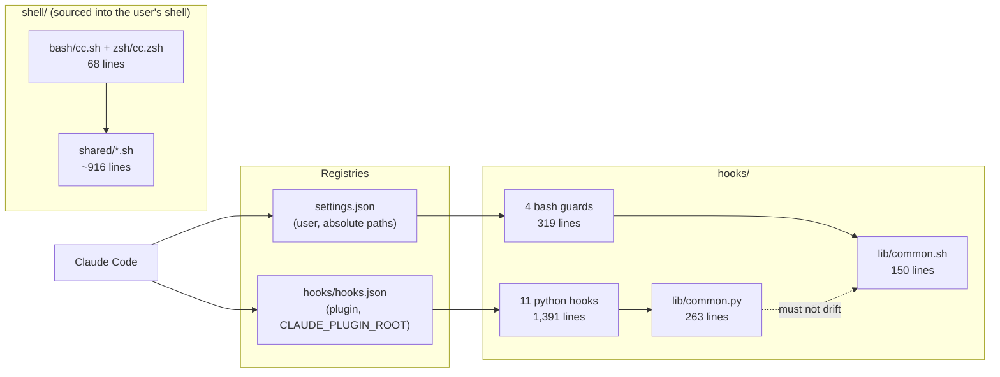
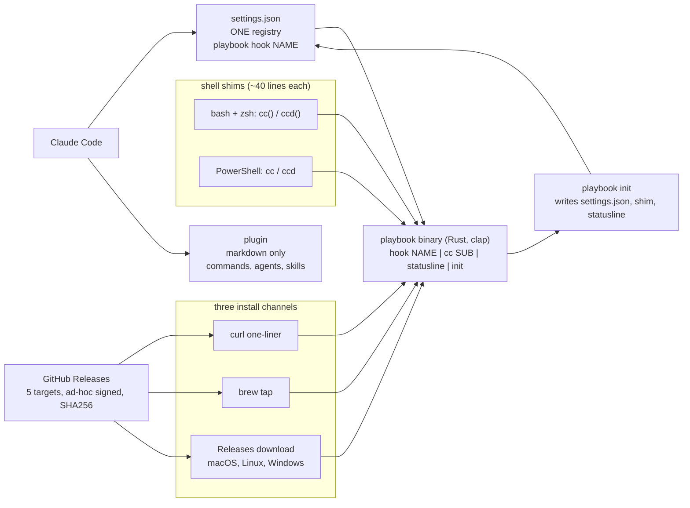
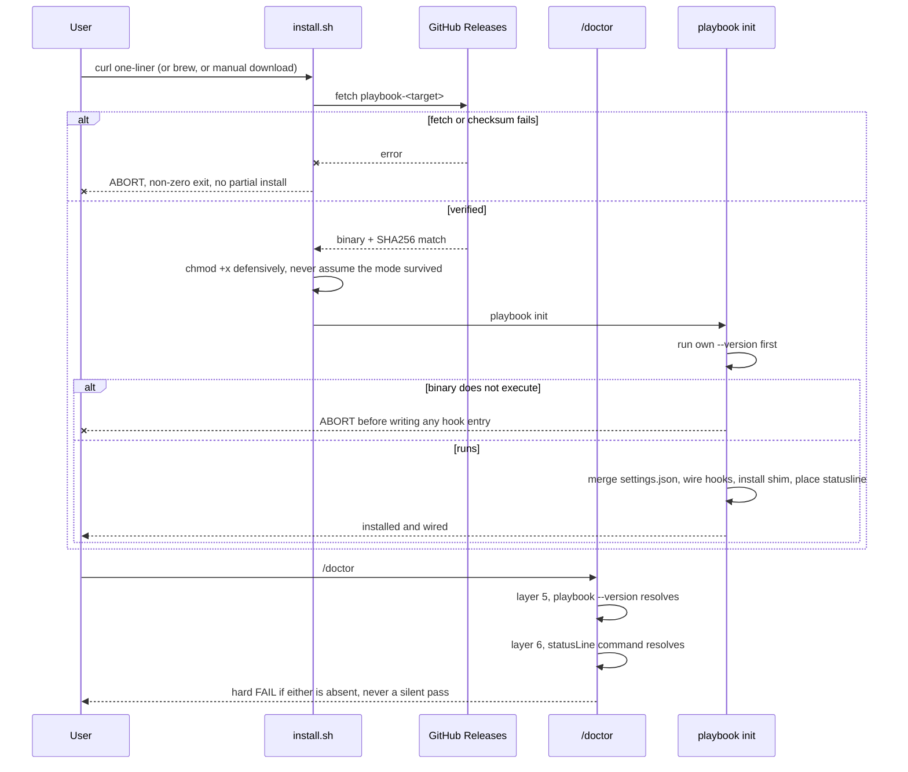

# ADR 0007: Move the hooks and the launcher into a single Rust binary

- **Status:** Accepted
- **Date created:** 2026-08-13
- **Date modified:** 2026-08-13
- **Amends:** ADR 0005 (migrate the hooks and the config scripts from shell to Python), ADR 0001 (package the toolkit as a plugin), ADR 0002 (plugin based install with always-on safety hooks)

## Context

`hooks/` is mixed-language by design. Eleven Python hooks share `hooks/lib/common.py` (263 lines) and four bash guards share `hooks/lib/common.sh` (150 lines). ADR 0005:72 records the cost of that split: "The two share responsibilities and must not drift."

The measurement that justified the split does not hold. `docs/authoring/01-commands-skills-hooks.md:91` claimed a bash hook costs 7ms against Python's 35 to 41ms, and ADR 0005:16 put bash at 1 to 5ms. Re-measured 2026-08-12 on macOS arm64, ten runs each:

| | ms |
|---|---:|
| Process spawn floor (`/bin/echo`) | 4 |
| `jq`, compiled C | 6 |
| `rtk`, compiled Rust | 9 |
| `bash -c true` | 10 |
| `hooks/bg-await-guard.sh` | 26 |
| `python3` cold start | 29 |
| `hooks/rebuild-memory-graph.py` | 41 |
| `hooks/post-edit-track.py` | 46 |
| `hooks/search-counter.py` | 46 |
| `hooks/memory-anchors.py` | 53 |

A real guard costs 26ms, within 3ms of a bare Python cold start, because `common.sh` shells out to `jq` per field. The guards are bash for a speed advantage they do not have. The authoring doc was corrected on 2026-08-12; ADR 0005 was left intact as a historical record.

ADR 0005 left one question open: "measure the `PostToolUse` pair (`post-edit-track`, `rebuild-memory-graph`) after the migration and reconsider any that prove too costly." It was never answered because both hooks write no stdout and Claude Code does not persist a silent successful hook run, so they are invisible in transcripts. Measured directly: 46ms and 41ms.

**Hooks for one event run in parallel.** Across a 250-transcript window, `PreToolUse:Read` has a p50 of 57ms over 731 recorded entries while each of its three Python hooks measures 46 to 53ms alone. Serial would be about 145ms. An event therefore costs about as much as its slowest hook, which means consolidating `hooks.json` entries buys nothing.

Aggregate latency available, over 2.1 days and 13 projects of heavy use, using real tool-call counts:

| Tool | Calls | Now | After | Saved |
|---|---:|---:|---:|---:|
| Bash | 6,006 | 23ms | 9ms | 84s |
| Read | 2,016 | 57ms | 9ms | 97s |
| Edit | 1,147 | ~99ms | ~18ms | 93s |
| Write | 500 | ~99ms | ~18ms | 41s |
| Grep | 336 | 46ms | 9ms | 12s |
| Glob | 153 | 46ms | 9ms | 6s |

About 5.5 minutes, roughly 2.6 minutes a day. Inside turns the model dominates, that is close to 1% of felt wall clock. Latency is a supporting benefit here, not the case for the work.

**Scope.** 15 hooks and the launcher, about 3,148 lines: 11 Python hooks (1,391) plus `common.py` (263), 4 bash guards (319) plus `common.sh` (150), and the launcher (~1,025). Against that sit 8,169 lines of markdown in `commands/`, `agents/`, `skills/`, `prompts/` and `docs/` that no rewrite touches. The product is prose; this changes only its runtime.

**The launcher is not permanently shell.** ADR 0005 states "you cannot source a Python or Node file to define a shell function, so the launcher and its modules are permanently shell." That conflates the function definition with the function body. Only two statements need the parent process: `cd "$worktree_path"` (`shell/shared/worktree.sh:354`) and `disown` (`:383`). The heavy part of that flow already runs out-of-process in a `( ... ) &` subshell (`worktree.sh:369-383`), and the launcher never `exec`s into `claude`; every launch is a foreground call with control returning afterward (`shell/shared/dispatch.sh:141,147`). A shell function that calls a binary and `cd`s to the path it prints satisfies the constraint.

**Distribution, verified by spike on 2026-08-12.**

- The plugin cache is a real git clone and file modes survive it exactly: `statusline.sh`, `install.sh`, `rm-workspace-guard.sh` and `session-init.py` are 755 in both repo and cache, `shell/setup-local.sh` 644 in both. A committed binary would stay executable.
- Gatekeeper does not block. `rtk`, already a dependency (`Brewfile:21`), is `Signature=adhoc` with `TeamIdentifier=not set` and runs. A curl download sets `com.apple.provenance`, never `com.apple.quarantine`.
- `rustc` and `cargo` are already installed.
- A release procedure exists and is documented, contrary to an earlier reading: set `.claude-plugin/plugin.json` `version` to match, signed annotated tag, push through the admin bypass actor on rulesets 18083544 and 18083561, then `gh release create --target main`. The manifest version is user-visible via `claude plugin details` and must match the tag. Only the binary build-and-upload step is missing.
- `.github/workflows/betterleaks.yml:40,61` already fetches a pinned, SHA256-verified prebuilt binary, so the pattern exists in-repo.

**Constraints from the Claude Code plugin documentation** (checked 2026-08-13). Documentation-sourced, distinct from the machine measurements above, and two of them override what the spike suggested:

- **The executable bit is not guaranteed to survive.** The Plugins Reference raises it under Debugging and suggests a `chmod +x` at SessionStart. The spike found modes intact, but that is one machine and one version, not a guarantee. Design for the documented behaviour.
- **Plugins cannot reference files outside their own directory.** This undercuts invoking a PATH-resolved binary from the plugin's `hooks.json`, which was the design's first choice. `settings.json` carries no such restriction: the four bash guards already run from there by absolute path, and `rtk hook claude` runs from there by bare name.
- **Binaries must be statically linked or already on PATH.** Rust covers this with a `musl` target on Linux; macOS and Windows link their system libc.
- **Hooks are unsandboxed** and run with full user privileges, so a compiled hook has exactly the authority the scripts it replaces already had. No new privilege surface.
- **Gatekeeper is not documented**, and it is the one real user-facing trap. The spike holds that `curl` sets only `com.apple.provenance`, so the one-liner path is clean. A **browser** download sets `com.apple.quarantine`, so anyone taking the download-from-Releases path on macOS hits a block curl users never see. Ad-hoc signing does not clear quarantine.

**Runtime dependencies disappear.** The hooks need `jq` today (`common.sh` shells to it per field) and `python3` (11 hooks, plus `no-dash-guard.sh` embeds a python heredoc for reliable Unicode dash detection), and `shell/merge-settings.py` needs `python3` at install time. A static binary needs none of them. That matters beyond tidiness: `shell/ensure-deps.sh:44-46,63-64` soft-fails when brew is absent, so a Linux-without-brew user currently ends up with config installed and hooks that cannot run, warned only on stderr.

**Precedent that cuts the other way.** ADR 0001:50 excludes `rtk` from `hooks.json` because it is "a personal external tool with no script in this repo", and lists `rtk` portability under Risks at `:73`. This ADR makes the plugin depend on exactly such a binary, which is a reversal that needs stating plainly.

**Failure evidence.** `hook-rename-lockstep-settings` predicted the failure mode on 2026-08-11. It recurred twice since. Between 2026-08-11T06:47Z and 2026-08-12T10:42Z, stale `.sh` paths in the user's `settings.json` produced about 110 `No such file or directory` errors, 100 of them `search-counter.sh`. Hooks silently stopped running for roughly 28 hours and nobody noticed. Separately, the ADR 0006 relocation removed `~/.claude/statusline.sh` while `settings.shared.json:133-137` still pointed at it; two clean `/setup` runs and a four-layer `/doctor` pass all reported healthy while the status line rendered nothing. **A missing binary fails exactly this way, and this repo has now demonstrated twice that silent hook failure is not noticed.**

## Decision Drivers

- `hooks/` carries two shared libraries that must not drift, a risk ADR 0005:72 accepted explicitly and has not retired.
- The measurement behind the two-language split is wrong by 4x (26ms measured against 7ms claimed), so the split rests on a false premise.
- Parallel hook execution caps the latency win at about 40ms per event, which makes speed a supporting argument and maintainability the real one.
- Both distribution unknowns are resolved: the executable bit survives, gatekeeper does not block.
- Silent hook failure has gone unnoticed twice in two days, so any design that degrades quietly is unacceptable.
- Two registries point at the same hooks today, and that duality is the structural cause of both outages.
- A static binary removes `jq` and `python3` from the user runtime, which closes the brew-less install path that currently produces working config with non-functional hooks.
- Plugins cannot reference files outside their own directory, so hook wiring has to leave `hooks.json` regardless of the rest of this decision.
- 8,169 lines of markdown, the actual product, are untouched by any option here.

## Considered Alternatives

### Status quo: keep Python hooks and bash guards (effort: S)

- Change nothing. Correct the timing docs and move on.
- Trade-offs: zero risk and zero cost. Keeps two shared libraries that must be hand-synchronised, keeps a language split justified by a number now known to be wrong, and leaves the per-event floor at Python cold start.

### A. One self-wiring binary for all 15 hooks, the launcher, and the installer (effort: XL)

- One `clap`-based binary with `playbook hook <name>`, `playbook cc `, `playbook statusline` and `playbook init`. Hooks wire through `settings.json`, written by `init`, so the plugin's `hooks.json` is retired. Three install channels feed it. The launcher shrinks to a ~40 line shim per shell family, keeping only `cd` and `disown`.
- Trade-offs: single language for the whole runtime, both shared libraries deleted, `jq` and `python3` gone from the user runtime, one hook registry instead of two, and Windows becomes reachable. `cargo test` replaces part of a 7,303 line hand-rolled harness. Costs a binary release pipeline, five build targets and a `homebrew-tap` repo for one maintainer, a PowerShell shim as a third shell language, a Gatekeeper caveat on the download channel, and reduced contributor accessibility on a public MIT repo.
- Sized XL rather than L because it absorbs the installer (`setup-local.sh`, `merge-settings.py`) and adds Windows, neither of which was in the original framing.

### B. Hot path only, 9 hooks (effort: M)

- Port the six per-tool-call Python hooks and the three guards. Leave the five per-session and per-turn hooks in Python.
- Trade-offs: captures nearly all the latency for roughly half the work. Leaves `hooks/` in three languages with three shared libraries, which is worse drift than today, and drift is the problem being solved.

### C. Wrapper script with Python fallback (effort: M)

- `hooks.json` points at a shell wrapper that runs the binary when present and the Python hook otherwise.
- Trade-offs: never breaks for anyone, on any platform. Pays about 10ms of bash startup on every fire, and requires maintaining two implementations of every hook forever, which is the `common.py` versus `common.sh` trap widened.

### D. Commit per-platform binaries to the plugin repo (effort: M)

- Ship `macos-arm64`, `macos-x64`, `linux-x64`, `linux-arm64` in the plugin tree, invoked as `${CLAUDE_PLUGIN_ROOT}/bin/playbook`.
- Trade-offs: zero install friction and the spike proves the executable bit survives. Adds several MB per release to git history permanently, and `shell/check-manifest.sh:31-33` needs a new allowlisted dir.

### E. Unify on Python: port the four bash guards, keep everything else (effort: S)

- Port `rm-workspace-guard.sh`, `no-dash-guard.sh`, `bg-await-guard.sh` and `precommit-check.sh` (319 lines) to Python on `common.py`. Delete `common.sh`. Change nothing else.
- Trade-offs: **this satisfies two of the four stated success criteria**, single-language `hooks/` and one shared library deleted, for about 320 lines against 3,148, with no new language, no release pipeline, no tap repo, no signing and no Windows. The measurement that keeps the guards in bash is already known to be false (26ms measured against 29ms for Python cold start), and parallel hook execution means three more Python hooks barely move an event.
- What it does not do: `python3` and `jq` stay required at runtime, the per-event floor stays at Python cold start (29ms), `common.py` survives, installation stays shell, and Windows stays impossible.

## Decision

Take **A**, extended in three ways after reviewing how `rtk` distributes itself.

**The justification is removing the interpreter from the runtime, not speed and not maintainability alone.** This needs stating precisely, because two weaker framings do not survive scrutiny.

Framed on **latency**, it fails: 2.6 minutes a day of machine time, inside model-dominated turns, is roughly 1% of felt wall clock.

Framed on **maintainability**, it fails too, and alternative E is why. If the goal is only single-language `hooks/` with one shared library deleted, E does that for about 320 lines instead of 3,148. Any argument resting on "two libraries must not drift" is answered ten times more cheaply by porting four guards to Python. That objection is fatal to the maintainability framing and this ADR does not try to dodge it.

What survives is narrower and concrete. **A compiled binary removes `jq` and `python3` from the user runtime entirely**, which no Python-based option can do because Python is the runtime. That buys four things E cannot:

1. `shell/ensure-deps.sh:44-46,63-64` soft-fails when brew is absent, so a Linux-without-brew user today gets installed config and hooks that cannot run, warned only on stderr. With no interpreter to install, that failure mode stops existing.
2. The per-event floor drops from Python cold start (29ms) to process spawn (about 9ms). Small in absolute terms, but it is a floor, not a tuning knob: no amount of Python work goes below 29ms.
3. Installation itself stops depending on `python3`, since `shell/merge-settings.py` is the last runtime user of it.
4. Windows becomes reachable, which no shell-and-Python design can offer.

If those four are not worth 3,148 lines to you, **take alternative E instead**. It is a legitimate, much cheaper answer to the drift problem, and the record says so plainly rather than burying it.

### The plugin stops working standalone, and that is a real reversal

ADR 0002 established plugin-based install with the plugin's own components working on their own, and the current architecture wires 11 functional hooks through `hooks/hooks.json` via `${CLAUDE_PLUGIN_ROOT}`, with `shell/gen-shared-settings.py` deliberately filtering the seed down to the guards so regeneration never reintroduces functional hooks into `settings.json`.

**This ADR inverts both halves.** Hooks move into `settings.json`, and the generator's filter is removed. The user-visible consequence: today, installing the plugin gives you 11 working hooks; after this change it gives you none until `playbook init` runs. Install becomes two steps, matching the `rtk` model where `brew install` and `rtk init --global` are separate.

That is accepted deliberately, for one reason: **plugins cannot reference files outside their own directory**, so a plugin-resident `hooks.json` cannot invoke a binary living anywhere else. The alternative that preserves standalone behaviour is committing per-platform binaries into the plugin tree (alternative D), rejected on repo weight. The two-step install is the price of not carrying several MB per release in git history forever.

### Windows is a deliberate scope addition, not a requirement

Nothing in this repo evidences a Windows user, and the launcher cannot work there without a third shim language. Windows is included because the maintainer asked for it, and it rides on a target Rust cross-compiles nearly free. **Segment F carries it and is separable**: Segments A through E deliver the entire justification above, and Segment F should get its own go/no-go rather than being assumed. If it slips or is cut, nothing in Segments A through E depends on it.

### The binary wires itself: `playbook init`

`install.sh` shrinks to a bootstrap that detects the platform, fetches, verifies, and hands off. `playbook init` owns everything after that: the `settings.json` merge, hook wiring, the shell shim, and the statusline path. That moves about 460 lines of `shell/setup-local.sh` (301) and `shell/merge-settings.py` (160) into typed, tested Rust, and it removes the last `python3` requirement from the user runtime.

This reverses the design's earlier non-goal, which excluded the installer. Two things changed it: the plugin path-traversal restriction forces hook wiring out of `hooks.json` anyway, and a self-wiring binary is the only version where the statusline gap cannot recur, because one component owns that path.

### One registry, not two

**All hooks wire through `settings.json`, written by `playbook init`. The plugin's `hooks/hooks.json` is retired.** The documented restriction that a plugin cannot reference files outside its own directory rules out calling a PATH-resolved binary from `hooks.json`, and committing per-platform binaries into the plugin tree to work around it costs several MB per release in git history forever.

Retiring `hooks.json` also fixes the root cause of the outages in the Context above. Today two registries point at the same hooks, and it was exactly that duality, `settings.json` holding stale absolute paths after the files moved, that produced 110 silent errors over 28 hours. One registry with one owner cannot drift against itself. The plugin keeps doing what it is good at: shipping the 8,169 lines of markdown.

### Three install channels, matching the `rtk` model

1. **Quick install**, the existing `curl -fsSL .../install.sh | bash` one-liner. Clean on macOS: curl sets no quarantine.
2. **Homebrew**, `brew install pragmatic-engineer/tap/playbook`, which needs a new `homebrew-tap` repo alongside the existing marketplace repo.
3. **Pre-built binaries** on GitHub Releases for macOS, Linux and Windows.

Each ends with the user running `playbook init`, the same two-step shape `rtk` uses.

**Signing.** Ad-hoc signing (`codesign --sign -`) for every macOS build, which is what `rtk` ships and what the spike confirmed runs. Ad-hoc does not clear `com.apple.quarantine`, so channel 3 on macOS must document the `xattr -d com.apple.quarantine` step in the README. Full Developer ID notarisation is the better answer and is deliberately deferred: it costs a paid Apple account and a `notarytool` stage in CI, and channels 1 and 2 do not need it. Revisit if channel 3 generates support load.

**Windows is supported.** Five build targets: `aarch64-apple-darwin`, `x86_64-apple-darwin`, `x86_64-unknown-linux-musl`, `aarch64-unknown-linux-musl`, `x86_64-pc-windows-msvc`. Linux uses `musl` for static linking per the documented requirement. Hooks work on Windows unchanged. The launcher needs a PowerShell shim, since `cd` and function definition are shell-bound there exactly as they are in bash and zsh.

### Fail-safe policy, settling the question left open in the design

`install.sh` and `playbook init` MUST fail loudly and refuse to complete when the binary cannot be fetched, verified, or executed. Neither may degrade quietly to a partial install. `playbook init` MUST verify its own binary runs before writing any hook entry, and MUST `chmod +x` defensively rather than assuming the mode survived. `/playbook:doctor` gains a layer that runs `playbook --version` and reports a hard failure when it does not resolve, plus a layer that resolves the `statusLine` command.

The reasoning is evidential. This repo has twice shipped a state where hooks silently stopped firing, once for 28 hours across about 110 errors, and neither `/setup` nor `/doctor` caught it. A guard that fails open is worse than no guard, because it reports success. The four bash guards stay bash until the binary is proven in place, and are ported last.

Rejections. **E** is the closest call and is rejected only on the four points above: it leaves `python3` and `jq` required, keeps the 29ms interpreter floor, keeps installation shell-dependent, and forecloses Windows. If the runtime dependency is not a problem you care about, E is the better decision and this ADR should be reopened. **Status quo** is rejected because the two-library drift risk is real and its justification is a wrong number; correcting the docs alone leaves the structural problem. **B** is rejected because three languages and three shared libraries is a worse end state than the two it replaces, and partial porting risks schema drift between `rebuild-memory-graph` (sole writer of `~/.claude/memory/graph.json`) and `memory-anchors` (sole reader). **C** is rejected because maintaining two implementations of every hook permanently is the exact failure this ADR exists to end, and it pays bash startup on every fire besides. **D** is rejected on repo weight, several MB per release in git history forever; note its original appeal rested on the executable bit surviving, which the documentation says not to rely on.

## Consequences

Positive:

- `hooks/` becomes one language. `common.py` and `common.sh` are deleted, and the drift obligation from ADR 0005:72 disappears.
- Per-event hook cost drops from about 50ms to about 9ms; the `Edit`/`Write` path drops from about 99ms to about 18ms.
- `cargo test` replaces the hand-rolled harness for the hook layer, with types and a real test framework.
- **`jq` and `python3` leave the user runtime entirely.** `Brewfile` drops to `git` plus optional `gh`, `node` and `agent-browser`. The soft-fail path in `shell/ensure-deps.sh:44-46,63-64`, where a brew-less Linux user gets installed config and non-functional hooks, stops being reachable.
- **One hook registry instead of two.** Retiring `hooks/hooks.json` removes the structural cause of the 28-hour silent outage, since `settings.json` can no longer hold paths that drift against a second registry.
- **Windows becomes possible for the first time.** Hooks run there unchanged; the launcher needs a PowerShell shim. The repo has no Windows story today.
- A `playbook statusline` subcommand later removes the version-pinned path problem permanently, since a plugin cannot declare a `statusLine` (confirmed across 47 installed manifests) and the cache path carries the version.

Negative and follow-up:

- Three languages coexist during the migration. Time-box it, or the transitional state becomes permanent and worse than the start.
- A binary release pipeline must be built. The tag-and-release procedure exists; the build-and-upload step does not.
- **Five build targets** fall on one maintainer, plus a **new `homebrew-tap` repo** to create and keep current on every release, on top of the existing marketplace repo. A public MIT repo also loses drive-by contributors who can read bash but not Rust.
- **Channel 3 on macOS hits Gatekeeper.** A browser download sets `com.apple.quarantine`, which ad-hoc signing does not clear, so the README must document `xattr -d com.apple.quarantine`. Notarisation is deferred, not solved.
- **A PowerShell shim is a second shim to maintain**, in a third shell language, for the launcher only.
- `playbook init` absorbing `setup-local.sh` and `merge-settings.py` widens the blast radius: a bug there breaks installation itself, not just one hook. The three-way settings merge is the delicate part and needs its existing test coverage ported before the shell version is deleted.
- `shell/plugin-e2e.sh:51-54` runs `bash -n` on any non-`.py` hook command and must learn to skip a binary.
- `shell/check-manifest.sh:31-33` needs the new source dir allowlisted.
- 14 hook `*.test.sh` files port to `cargo test`. The 402 lines of launcher parity tests (`shell/shared/launcher.test.sh`, `shell/cc-launcher.test.sh`) largely stop meaning anything once one binary serves both shells.
- `hooks/precommit-check.sh` was added 2026-08-13 and is a fifteenth hook to port.
- This reverses ADR 0001's stance that a compiled binary stays outside the plugin. `rtk` remains outside it; the toolkit's own binary does not.
- `session-init.py` shells out to `hooks/lib/config-hash.sh` and `shell/memory-context.sh`. The binary keeps shelling out to both rather than absorbing them.
- **Install becomes two steps.** The plugin alone no longer delivers working hooks; `playbook init` is required. README and `docs/guides/00-install.md` must lead with that, or users get a silently hook-less install, which is the failure mode this ADR is otherwise trying to end.
- **Version skew between the binary and the plugin.** The plugin updates through `claude plugin update` while the binary updates through brew, curl or a manual download, so a user can run new markdown against an old binary that lacks a subcommand it calls. `playbook init` MUST record the version it wired, and `/playbook:doctor` MUST compare the installed binary version against `.claude-plugin/plugin.json` and warn on mismatch.
- **A hand-edited `settings.json` can be clobbered.** `playbook init` writes hook entries into a file users are encouraged to edit. It MUST preserve unknown entries, back up before writing, and never remove a hook command it did not author.
- **No rollback story.** If a release breaks, there is no documented downgrade. Pin the previous version by tag in the install one-liner and document it, the way `PLAYBOOK_REF` already works for the shell install.

## Architecture Diagrams

Current state: two languages, two shared libraries, two registries.

Proposed state: one binary, one language, the shim keeping only what needs the parent shell.

Install-time fail-safe, the policy this ADR settles.

