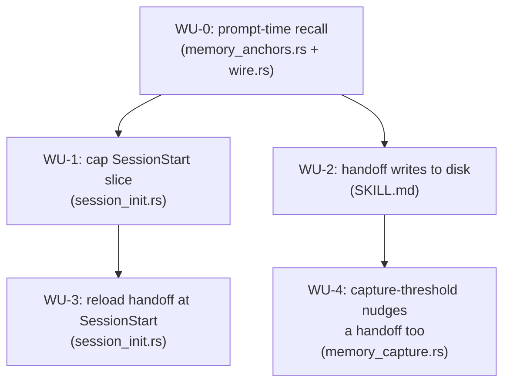

# ADR-0008 Execution Blueprint

- **Parent ADR:** docs/adr/0008-bounded-memory-injection-with-prompt-recall-and-handoff-continuity.md

## System Snapshot

- `src/hooks/memory_anchors.rs` — `PreToolUse` on `Edit|Write` only today
  (`src/init/wire.rs:126-133`). Builds a per-session anchor index once, cached
  as a TSV under `session_dir(payload)` (`memory_anchors.rs:158-201`,
  `build_index`/`compute_index_rows`), matches exact path then containing
  directory (`:105-129`), emits fact **names** via `emit_pre_context`, never
  blocks. Test file: `tests/hooks_graph_reader.rs`.
- `src/hooks/session_init.rs` — `SessionStart`, runs unconditionally on every
  `source` (`:83-86`). `append_memory_slice` (`:172-222`) shells to
  `shell/memory-context.sh --repo <slug>`, no size cap; legacy fallback
  `read_legacy_memory` (`:242-247`) is capped at `.chars().take(16000)`. Test
  file: `tests/hooks_session.rs`.
- `src/init/wire.rs` — `HookSpec` table (`PORTED_HOOK_SPECS`, `:93-190`).
  Precedent for one hook name on two events already exists: `session-clean-exit`
  is registered on both `Stop` and `SessionEnd` (`:167-181`), branching
  internally on which payload fields are present. `memory-anchors` will follow
  the same pattern for `PreToolUse` and `UserPromptSubmit`.
- `src/common/emit.rs:73-77` — `emit_prompt_context(msg)` already exists,
  wraps `emit_pre_context("UserPromptSubmit", msg)`, unused for memory today.
- `src/common/payload.rs:13,32-45` — `Payload` wraps raw JSON; any dotted path
  is legal to query, missing resolves to `""`. `auto_model_detect.rs:89`
  proves `.prompt` is readable on `UserPromptSubmit` in this codebase.
- `src/hooks/post_edit_track.rs` — writes `edits.jsonl` under
  `session_dir(payload)` on every `Edit`/`Write`; `memory_capture.rs:43,72-89`
  already reads it for "recently touched paths". WU-0 reuses this file rather
  than tracking touched paths a second way.
- `src/cc/mod.rs:24` — `pub fn project_slug(path: &str) -> String`, slugifies
  every non-alphanumeric character to `-`. `src/cc/config_drift.rs:21-23`
  already keys per-worktree state this way (`cc-state/<project-slug>`).
  `logical_cwd()` (`src/cc/mod.rs:35-45`) prefers `$PWD` over
  `current_dir()`, required because macOS symlinks `/tmp` and `/var` into
  `/private`.
- `src/hooks/session_clean_exit.rs:92` / `session_init.rs:262` — the
  `to-learn/<repo-slug>.json` read-once-then-delete pattern WU-3 mirrors.
- `skills/session-handoff/SKILL.md:62-66` — prints only by default; "Never
  write to a path that was not explicitly provided" governs the **user-facing**
  path argument, not the new fixed internal runtime path WU-2 adds.
- No *behavioral* skill-validation tooling exists in this repo. One light
  check exists: `shell/plugin-e2e.sh:62-67` confirms every `skills/*/SKILL.md`
  declares a `description` field, but it does not, and cannot, verify write
  behavior like WU-2's fixed-path logic. WU-2's verification is manual, not a
  `cargo test` command, and is stated as such rather than invented.

## Work Units

### WU-0: Prompt-time recall in `memory_anchors.rs`

- Requires: nothing
- Goal: `UserPromptSubmit` matches prompt text and this-session touched files
  against the anchor index, and injects the matched fact **bodies** (not just
  names), deduped per session, using the same anchor index `memory_anchors.rs`
  already builds for `PreToolUse`.
- Files:
  - `src/hooks/memory_anchors.rs` (production): add a `UserPromptSubmit`
    branch to `run()`. Verify first whether the input payload carries
    `.hook_event_name` (some Claude Code hook payloads do); if present,
    branch on it. If not present on this event in practice, branch on
    `!payload.field(".prompt").is_empty()` instead, since a `PreToolUse`
    `Edit`/`Write` payload has no `.prompt` field. Reuse
    `build_index`/`compute_index_rows` unchanged. Add: a prompt-token match
    (case-insensitive substring of any prompt word against `name` or
    `description`), a touched-file match (parse `edits.jsonl` via the same
    approach `memory_capture.rs:72-89` uses, match against the index's
    `anchor` column), a body reader (open the fact's `file` column and read
    its content, capped like the legacy `MEMORY.md` fallback at 16000 chars
    per fact to bound one huge fact from dominating a turn), and a dedup
    marker at `session_dir(payload)/prompt-recall-seen.tsv` (one fact id per
    line; a fresh session gets a fresh `session_dir`, so no explicit reset
    logic is needed, only creation on first write).
  - `src/init/wire.rs` (production): add `HookSpec { event: "UserPromptSubmit",
    matcher: None, name: "memory-anchors", .. }` alongside the existing
    `PreToolUse` entry, following the `session-clean-exit` two-event
    precedent (`:167-181`) exactly.
  - `tests/hooks_graph_reader.rs` (test): extend.
- Verification:
  ```bash
  cargo test --test hooks_graph_reader
  cargo test --lib init::wire
  ```
- Tests (Gherkin):
  - Scenario: prompt mentions a fact by name surfaces its body, not just its name
    - Given a graph with a fact named "guard-default-roots-untested" and a body containing "PLAYBOOK_SAFE_ROOTS"
    - And no prior `prompt-recall-seen.tsv` this session
    - When `UserPromptSubmit` fires with `.prompt` = "why does guard-default-roots-untested happen"
    - Then the emitted `additionalContext` contains "PLAYBOOK_SAFE_ROOTS" (the body), not only the fact's one-line description
  - Scenario: a fact already surfaced this session is not repeated
    - Given the same fact matched and injected on turn 1
    - When `UserPromptSubmit` fires again on turn 2 with a prompt matching the same fact
    - Then `additionalContext` does not contain that fact a second time
    - And a fact newly matching only on turn 2 still appears
  - Scenario: a file touched this session (no edit needed on this turn) surfaces its anchored fact
    - Given `edits.jsonl` already contains `src/hooks/rm_workspace_guard.rs` from an earlier `Edit` this session
    - And a fact anchored to that path
    - When `UserPromptSubmit` fires with a prompt that never names the file or the fact
    - Then the anchored fact's body is still injected (pins the "asking about a file surfaces nothing" defect this WU fixes)
  - Scenario: no match emits nothing
    - Given a prompt matching no fact name, description, or touched path
    - Then no `additionalContext` block is emitted for this hook (not an empty block)
  - Scenario: a missing or corrupted anchor index degrades to silence, not a crash
    - Given `session_dir(payload)/memory-anchor-index.tsv` does not exist, or exists with unparsable content
    - When `UserPromptSubmit` fires with a prompt that would otherwise match a real fact
    - Then the hook exits 0 and emits no `additionalContext` block, proving the same "never panics, degrades to say nothing" invariant `session_init.rs` already documents for its own failure paths
  - Scenario: a fact whose `file` path no longer exists on disk is skipped, not fatal
    - Given the anchor index references a fact whose `file` column points at a `.md` path that has been deleted since the graph was last rebuilt
    - And a second, real fact also matches the same prompt
    - When `UserPromptSubmit` fires
    - Then the hook exits 0, the real fact's body is still injected, and the missing fact is silently omitted rather than aborting the whole match
  - Scenario: `PreToolUse` behavior is unchanged (regression pin)
    - Given the existing `tests/hooks_graph_reader.rs` `PreToolUse` scenarios
    - When run unmodified against the extended `memory_anchors.rs`
    - Then all still pass, proving the `UserPromptSubmit` branch is additive, not a rewrite of the existing path
- Done When:
  - [ ] `UserPromptSubmit` on a matching prompt injects fact bodies, verified against a real body string, not just a name/description string
  - [ ] The same fact is never injected twice in one session
  - [ ] A fact anchored to a file touched earlier this session, but not named in the current prompt, still surfaces
  - [ ] A missing or unparsable anchor index at prompt time exits 0 with no `additionalContext`, not a crash
  - [ ] A fact whose `file` path has been deleted is skipped without blocking a real match from injecting
  - [ ] Every pre-existing `PreToolUse` test in `tests/hooks_graph_reader.rs` still passes unmodified

### WU-1: Cap the SessionStart fact slice

- Requires: nothing
- Goal: the graph-backed `append_memory_slice` path has a size ceiling,
  closing the asymmetry where only the legacy fallback is bounded.
- Files:
  - `src/hooks/session_init.rs` (production): in `append_memory_slice`
    (`:172-222`), cap `mem_body` from the graph-backed branch (`:189`) the same
    way the legacy branch already is (`:246`, `.chars().take(16000)`). Use the
    same constant so both paths share one literal, not two copies that can
    drift.
  - `tests/hooks_session.rs` (test): extend.
- Verification:
  ```bash
  cargo test --test hooks_session
  ```
- Tests (Gherkin):
  - Scenario: an oversized graph-backed slice is truncated, not passed through whole
    - Given `memory-context.sh` returns a synthetic slice over 16000 characters (a fixture graph with enough facts to exceed it)
    - When `append_memory_slice` runs
    - Then the injected `extra_context` memory block is at most 16000 characters
    - (Regression pin: this test fails today, since the graph-backed path currently has no cap; confirms the fix, not just its presence)
  - Scenario: a slice under the cap is passed through unchanged
    - Given a slice of 500 characters
    - Then the injected block is exactly that content, not silently truncated a byte short
  - Scenario: a slice at exactly the cap is untouched, one byte over is truncated
    - Given a slice of exactly 16000 characters
    - Then the injected block is all 16000 characters, unmodified
    - Given a second slice of 16001 characters, identical to the first plus one trailing character
    - Then the injected block is the first 16000 characters exactly, pinning the boundary itself rather than only "clearly over" and "clearly under"
  - Scenario: the legacy fallback cap is unaffected (regression pin)
    - Given the graph script is absent so the legacy `MEMORY.md` path is taken
    - Then the existing 16000-char behavior at `:246` is unchanged
- Done When:
  - [ ] A synthetic slice over 16000 characters is truncated when injected
  - [ ] A slice under the cap is passed through byte-for-byte
  - [ ] The legacy fallback's existing cap test still passes unmodified

### WU-2: `session-handoff` persists to a worktree-safe path

- Requires: nothing
- Goal: `/playbook:session-handoff` always writes a copy to
  `~/.claude/runtime/handoff/<project-slug>.md`, where `project-slug` is the
  CWD slugified the same way `cc-state` already does it, in addition to its
  existing behavior of printing to the conversation and optionally writing to
  a user-given path.
- Files:
  - `skills/session-handoff/SKILL.md` (production): update "Where to Write
    It" (`:60-66`) to add: always compute
    `project-slug = ${PWD//[^a-zA-Z0-9]/-}` (the exact expansion
    `shell/shared/config-drift.sh:20-22` already uses for the same purpose)
    and write the rendered document to
    `~/.claude/runtime/handoff/<project-slug>.md`, creating the `handoff/`
    directory if absent, on every invocation, unconditionally. State
    explicitly that this is separate from, and in addition to, the
    user-supplied path behavior in the paragraph immediately below it, so the
    "never write to a path not explicitly provided" rule is not read as
    contradicting this fixed internal path.
- Verification: no automated check exists for skill instruction files in this
  repo (confirmed: no `shell/check-*.sh` validates `skills/`). Verification is
  manual: run `/playbook:session-handoff` in this repo, confirm
  `~/.claude/runtime/handoff/<slug>.md` exists (`<slug>` = this repo's working
  directory, slugified) and its content matches what was printed. Re-run and
  confirm the file is overwritten, not appended.
- Tests: none automatable at this layer; WU-3's tests cover the consuming
  side (a handoff file present on disk gets read, injected, and deleted) with
  synthetic fixtures, which is where real assertions are possible.
- Done When:
  - [ ] Running the skill in this repo produces a file at
        `~/.claude/runtime/handoff/<this-repo-slug>.md` with content matching
        what was printed
  - [ ] A second run overwrites rather than appends
  - [ ] The skill's existing user-facing-path behavior (printing, optional
        explicit path) is unchanged

### WU-3: Reload the handoff at SessionStart, including after `/clear`

- Requires: WU-1 (both edit `append_memory_slice`'s neighborhood in
  `session_init.rs` and its test file; sequencing avoids a same-file conflict)
- Goal: every `SessionStart`, regardless of `source`, checks
  `~/.claude/runtime/handoff/<project-slug>.md`; if present, injects it and
  deletes it (read-once), mirroring the `to-learn` pattern exactly.
- Files:
  - `src/hooks/session_init.rs` (production): add `append_handoff_slice`,
    called from `run()` (`:83-86`) alongside the existing `append_*` calls.
    Compute the path via `crate::cc::project_slug(&crate::cc::logical_cwd())`
    joined under `home_dir().join("runtime").join("handoff")`, matching
    exactly the formula WU-2 specifies in the skill so the two never diverge.
    Read with the same non-panicking pattern every other read in this file
    already uses (`fs::read_to_string(..).unwrap_or_default()`-style; a
    missing, unreadable, or permission-denied file must degrade to "say
    nothing", never a panic, matching the module's own documented invariant
    exactly as `read_legacy_memory`, `:242-247`, already does for its file).
    Append to `extra_context` with a preamble distinct from the memory
    slice's (so a reader can tell "recalled facts" from "your own prior
    session's handoff" apart), then delete the file. No-op if absent, exactly
    like `to-learn`'s absence case. Also age-prune: if the file's mtime is
    older than 14 days, treat it as stale, skip injecting it, and still
    attempt the delete, mirroring `to-learn`'s `prune_old` backstop
    (`session_init.rs:289-314`) exactly. This closes the one gap the
    `to-learn` pattern doesn't automatically inherit: if a prior session's
    delete silently failed (permission error, or the process was killed
    between read and delete), an undeleted handoff would otherwise re-inject
    into every future session in that worktree indefinitely, with no
    backstop to end it.
  - `tests/hooks_session.rs` (test): extend.
- Verification:
  ```bash
  cargo test --test hooks_session
  ```
- Tests (Gherkin):
  - Scenario: a handoff present at SessionStart is injected and then removed
    - Given `~/.claude/runtime/handoff/<slug>.md` exists with known content
    - When `SessionStart` fires with `source: "clear"`
    - Then `extra_context` contains that content
    - And the file no longer exists after the hook returns (regression pin: proves read-once, not read-forever)
  - Scenario: no handoff file means no handoff block, and no error
    - Given the file is absent
    - Then `extra_context` has no handoff section, and the hook does not fail or emit an empty preamble
  - Scenario: `source: "clear"` is treated the same as `source: "startup"` for this purpose
    - Given the same handoff file present
    - When `SessionStart` fires once with `source: "clear"` and separately with `source: "startup"`
    - Then both inject the handoff (pins that this path is NOT gated by `check_config_drift`'s `source` branching, unlike the drift-warning logic)
  - Scenario: a handoff older than 14 days is treated as stale and cleared, not injected
    - Given `~/.claude/runtime/handoff/<slug>.md` exists with its mtime set to 15 days ago
    - When `SessionStart` fires
    - Then `extra_context` has no handoff section
    - And the file no longer exists after the hook returns (pins the backstop that ends an
      indefinitely re-injecting handoff if a prior session's delete ever silently failed)
  - Scenario: two different worktrees of the same repo never read each other's handoff
    - Given a handoff file written under worktree A's `project-slug`
    - And no file exists under worktree B's `project-slug`
    - When `SessionStart` fires with `cwd` set to worktree B
    - Then `extra_context` has no handoff section (proves the path is CWD-keyed, not repo-remote-keyed, closing the collision the ADR names)
- Done When:
  - [ ] A present handoff file is injected into `extra_context` on `SessionStart`
  - [ ] The file is deleted after being read, verified by checking it is gone, not merely that the test passed
  - [ ] Injection fires identically on `source: "clear"` and `source: "startup"`
  - [ ] A handoff older than 14 days is skipped and cleared, not injected
  - [ ] A handoff written under one worktree's slug is invisible to a `SessionStart` running under a different worktree's slug

### WU-4: extend `memory-capture`'s block reason to also instruct a handoff

- Requires: WU-2 (the instruction is only worth giving once
  `/playbook:session-handoff` persists to a reloadable path; WU-4's code has
  no file overlap with WU-2 and could compile without it, but shipping it
  first would instruct an action with no lasting effect)
- Goal: reuse the existing, tested `capture-due` threshold trigger
  (`statusline.sh:339-343`, `CC_CAPTURE_AT`, default 70%) to also nudge a
  session handoff, instead of adding a second marker file, a second
  threshold, or touching `PreCompact` at all. `PreCompact` cannot instruct
  the model (`precompact_warn.rs:5-6`, confirmed live: it only calls
  `emit_system_message`, a human-facing note, never `additionalContext`), so
  this rides the one event that already can: `Stop`, at the one threshold
  already proven safe by ADR 0004's own tuning note ("too high and it races
  auto-compact at 90%").
- Files:
  - `src/hooks/memory_capture.rs` (production): extend the reason text
    `emit_block` sends (`:47` area) to also instruct running
    `/playbook:session-handoff`, alongside its existing instruction to write
    down durable facts. Same trigger, same once-per-crossing latch, no new
    marker file.
  - `tests/hooks_turn.rs` (test): extend the existing `mod memory_capture`
    tests.
- Verification:
  ```bash
  cargo test --test hooks_turn
  ```
- Tests (Gherkin):
  - Scenario: the block reason instructs a handoff, not only fact capture
    - Given `capture-due` is present (threshold already crossed)
    - When `Stop` fires
    - Then the emitted `reason` text instructs running `/playbook:session-handoff`, in addition to its existing fact-capture instruction
  - Scenario: existing capture behavior is unchanged (regression pin)
    - Given every pre-existing `memory_capture` test in `tests/hooks_turn.rs`
    - When run unmodified
    - Then all still pass, proving this is additive text, not a rewrite of the trigger or latch logic
- Done When:
  - [ ] The `Stop` block reason, once per threshold crossing, instructs both fact capture and a session handoff
  - [ ] Every pre-existing `memory_capture` test still passes unmodified
  - [ ] No new marker file, threshold, or hook event was introduced

## Ordering

| WU | Requires | Parallel group |
|---|---|---|
| WU-0 | none | none (sequential, first) |
| WU-1 | none | P1 |
| WU-2 | none | P1 |
| WU-3 | WU-1 | none (sequential) |
| WU-4 | WU-2 | none (sequential, last) |

## Parallel Groups

- Sequential: WU-0 first, alone. Not blocked by anything, but built and
  committed before the others start, per the explicit priority this ADR
  states in its Decision section.
- P1 (after WU-0): WU-1 and WU-2. Disjoint files
  (`session_init.rs`/`tests/hooks_session.rs` vs `skills/session-handoff/SKILL.md`),
  no shared state, safe for two concurrent agents.
- Sequential: WU-3 last, after WU-1 lands (same-file dependency on
  `session_init.rs` and `tests/hooks_session.rs`). WU-3 does not have a hard
  build dependency on WU-2, only a naming-convention agreement already fixed
  identically in both units' text, but running it after both P1 members have
  landed lets its manual end-to-end check (skill writes, hook reads) exercise
  the real pair rather than a synthetic fixture alone.

## Dependency Graph



## Confidence + open items

- Confidence: HIGH. Every mechanism reuses a pattern already implemented and
  tested in this codebase (anchor index, `to-learn` read-once file,
  `project_slug`, `emit_prompt_context`). The one open item that kept this at
  MEDIUM, whether `.hook_event_name` is reliably present on the input
  payload, is now resolved against the official documentation (fetched live
  2026-08-24): it is present on every event unconditionally. The prompt-text
  field name conflict the same fetch surfaced (`user_prompt` vs. this repo's
  own live, tested `.prompt`) is neutralized by reading both, not by
  guessing which is correct.
- Open items (verify downstream):
  - RESOLVED 2026-08-24 against the official Claude Code hooks documentation
    (fetched live): `.hook_event_name` is present on every event's input
    payload unconditionally. `memory_anchors.rs` branches on
    `payload.field(".hook_event_name") == "UserPromptSubmit"` vs
    `"PreToolUse"`, not on field-presence inference. The same fetch reported
    the prompt-text field as `user_prompt`, which conflicts with this
    repo's own live, tested code (`auto_model_detect.rs:89` reads `.prompt`,
    with passing tests against `{"prompt":...}` payloads); the discrepancy is
    resolved defensively rather than guessed: read `.prompt` first, fall back
    to `.user_prompt` if empty. Costs one extra field lookup, removes the
    ambiguity regardless of which name is real.
  - RESOLVED 2026-08-24: `Node.file` is relative to `~/.claude/memory/`, not
    absolute. `rebuild_memory_graph.rs:473,476` builds it via
    `fpath.strip_prefix(&mem_dir)` where `mem_dir` is the memory root, so a
    value looks like `pragmatic-engineer/playbook/some-fact.md`. WU-0's body
    reader must join it as `home_dir().join(".claude/memory").join(&node.file)`,
    never read the field as a standalone path.
  - WU-2 has no automated verification in this repo's tooling. If a skill
    validator gets built later, add a check that the "Where to Write It"
    section's fixed path and WU-3's Rust-computed path can never drift
    (currently guarded only by both units citing the identical formula in
    prose). Who verifies: manual review at merge time, and re-verify if
    either file changes independently in the future.
  - The ADR's own open consequence, trimming existing fact descriptions to
    bring the slice further under the new cap, is content work across
    existing `.md` files, not part of any Work Unit here. Who verifies: a
    follow-up task, not blocking this blueprint.
