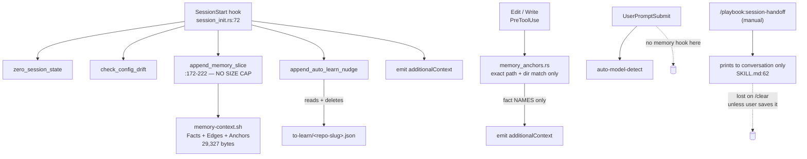
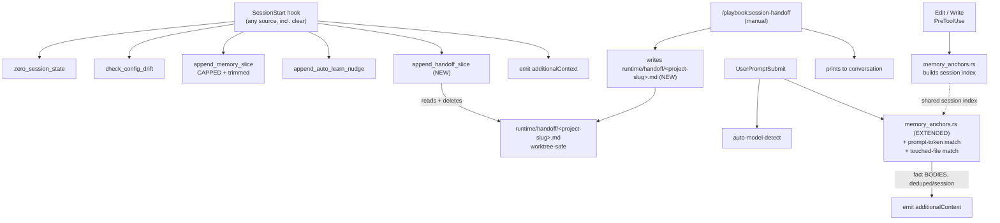

# ADR 0008: Bounded memory injection, prompt-time recall, and handoff continuity across /clear

- **Status:** Accepted
- **Date created:** 2026-08-24
- **Date modified:** 2026-08-24
- **Amends:** ADR 0004 (graph-first memory retrieval and triggered capture)

## Context

ADR 0004 (`docs/adr/0004-graph-first-memory.md`, Accepted 2026-08-10) adopted
Option B: inject the repo-scoped fact slice once at `SessionStart`, match
anchors just in time on `PreToolUse` for `Edit`/`Write`, and trigger capture
from a `Stop` hook on a context-usage threshold. It explicitly considered and
rejected per-prompt retrieval:

> `0004-graph-first-memory.md:65` — "### C. Retrieve on every prompt via
> UserPromptSubmit (effort: M)"
> `:86` — "C is rejected on the 8.8 KB measurement. Paying per turn to
> recompute a subset of something small enough to load once is work without a
> payoff."

That measurement no longer holds. Measured live against this repo's store on
2026-08-24, using `shell/memory-context.sh --repo pragmatic-engineer/playbook`:

```
slice total     29,327 bytes   (0004 measured 8,800; 3.3x growth in 14 days)
  Facts         16,909  58%    88 lines
  Edges          7,773  27%   111 lines
  Anchors        4,937  17%    73 lines
facts in scope    185 total: 52 global + 133 project across 9 repos
description len   avg 162 chars, max 251
```

Two structural problems compound the growth. First, the injected path has no
size cap. `src/hooks/session_init.rs:246` caps the legacy `MEMORY.md` fallback
at `contents.chars().take(16000)`, but the graph-backed slice that actually
runs (`append_memory_slice`, `:172-222`) has none. The deprecated route is
bounded; the live one is not. Second, 52 of the 185 facts are global, so every
repo pays for all of them regardless of relevance, and the pool only grows: a
fact saved in any project is injected into all nine.

ADR 0004's own blueprint pre-registered the fix and it was never applied:

> `0004-graph-first-memory-blueprint.md:177` — "Watch for the slice being
> noisier than the old 2.5 KB index; if so, trim descriptions rather than
> reverting."

What the 29 KB buys is titles, not knowledge. `shell/memory-context.sh:73`
emits `"\(.name): \(.description)"` only; `session_init.rs:194` states this
directly: "Fact bodies are read on demand." A fact's actual guidance surfaces
only if the anchor hook fires (`PreToolUse` on `Edit`/`Write`,
`src/init/wire.rs:126-133`) or if the model chooses to read the file. A turn
that only asks about a file, without editing it, gets nothing beyond the
one-line description already in the session-start slice. ADR 0004's own
decision driver cuts against its current behavior:

> `0004-graph-first-memory.md:41` — "Cost of retrieval must scale with need...
> A turn that edits nothing should pay nothing."

In practice a turn that edits nothing also *gets* nothing.

Separately, `/playbook:session-handoff` (`skills/session-handoff/SKILL.md`)
produces a structured decision-first handoff document but, by default, only
prints it to the conversation. It writes to disk only if the user supplies an
explicit path (`:62-66`, "Never write to a path that was not explicitly
provided"), so the document is lost the moment the session is cleared unless
the user remembers to save it. `/clear` fires a `SessionStart` event with
`source: "clear"` (confirmed against the current Claude Code hooks
documentation, matcher table: `startup, resume, clear, compact, fork`), and
`session_init.rs:83-86` already runs its full `append_*` chain unconditionally
on every `SessionStart`, regardless of `source` (only `check_config_drift`,
`:151,162`, branches on `resume`/`startup`). So a mechanism that reads a
persisted handoff at `SessionStart` requires no new hook event: it rides the
event and code path already firing on every `/clear`.

A precedent for a cross-session, auto-pruned artifact already exists in this
codebase: `to-learn/<repo-slug>.json`, written by
`src/hooks/session_clean_exit.rs:92`, read and deleted once by
`session_init.rs:262`, age-pruned at 14 days (`:289-314`). This repo also
already distinguishes per-repo state (keyed by git remote, via `repo_slug()`)
from per-worktree state (keyed by the actual checkout path, via
`project_slug()`, `src/cc/mod.rs:24`, used by `config_drift.rs:21` for exactly
this reason). `cc worktree` places each worktree at its own path under
`<repo-parent>/.worktrees/<repo>/<folder>` (`README.md:155`), so two worktrees
of the same repo share a `repo_slug` but never share a `project_slug`.

## Decision Drivers

- The live injection path is unbounded and has already tripled in the two
  weeks since the number that justified loading it whole was measured
  (`0004-graph-first-memory.md:69`, 8.8 KB then, 29.3 KB now).
- The remedy for slice bloat was already specified by ADR 0004's own blueprint
  and never implemented; closing that gap needs no new mechanism.
- Anchor-based recall exists but fires only on `Edit`/`Write`
  (`src/init/wire.rs:126-133`), so asking about a file surfaces nothing that
  editing it would.
- `/playbook:session-handoff`'s output is ephemeral by design (`SKILL.md:66`)
  and disappears on `/clear` unless manually saved.
- A read-once, auto-pruned, cross-session artifact pattern (`to-learn`) is
  already implemented and tested in this codebase; extending it is lower risk
  than inventing a new one.
- `/clear` is a real, already-wired `SessionStart` source; no new hook event is
  needed to reload something at that boundary.
- Earlier in this same day, a single stray `settings.json` hook entry pointing
  at a file deleted by `uninstall.sh` silently killed prompt injection for an
  unknown period (see project memory fact
  `uninstall-strands-settings-hook-entries`). Every additional per-turn hook is
  one more thing that can fail silently; new surface area has a cost
  independent of correctness.
- `repo_slug()` and `project_slug()` are already distinct, tested concepts in
  this codebase; a handoff keyed by the wrong one would silently corrupt
  concurrent worktree sessions on the same repo.

## Considered Alternatives

### A. Status quo: uncapped slice, edit-only anchors, ephemeral handoff (effort: none)

- Nothing changes. `memory-context.sh` keeps rendering the full in-scope slice
  every session; anchor matching stays `Edit`/`Write`-only;
  `session-handoff` keeps printing to the conversation only.
- Trade-offs: zero cost, but the slice has no ceiling and is already 3.3x its
  original justification; a turn that only asks about a file gets no fact
  content; every `/clear` discards the session's accumulated understanding
  unless the user remembers to copy a handoff out by hand.

### B. Prompt-time retrieval only, drop or shrink SessionStart injection (effort: L)

- Match prompt text and touched files against the anchor index and fact
  bodies on `UserPromptSubmit`, inject only what matches, and reduce or
  remove the SessionStart slice in favor of this per-turn mechanism.
- Trade-offs: closes the edit-only anchor gap and could in principle be
  leaner per turn than a fixed 29 KB block. But it does not, on its own,
  solve `/clear` continuity, that still needs a persisted handoff regardless
  of which retrieval model is chosen, so this alternative does not remove the
  need for the mechanism in C. It also removes the always-available baseline
  a fresh session opens with, and no relevance-matching code exists anywhere
  in this repo today (confirmed by an exhaustive grep across `src/`, `shell/`,
  `hooks/`, `commands/`, `agents/`, `docs/` for
  `search|rank|score|keyword|similarity|relevance|match|filter|recall|retrieve|query`,
  turning up only scope filtering and exact-path anchor matching), so this
  is new code with no precedent to build on.

### C. Keep SessionStart, cap the slice, add prompt-time recall and worktree-safe persisted handoff (effort: M) — CHOSEN

- Four changes to the existing, already-unconditional `append_*` chain in
  `session_init.rs:83-86`:
  1. Extend `memory_anchors.rs`'s per-session anchor index to also match on
     `UserPromptSubmit`: reuse the existing exact-path/containing-directory
     match (`:105-129`) against paths already touched this session
     (`edits.jsonl`, already tracked by `post_edit_track.rs`), add a plain
     substring match of prompt tokens against fact names and descriptions,
     and inject the matched fact **bodies** (not names), deduped per session
     via a marker under `session_dir(payload)`, the same convention as
     `capture-due` and `edit-count`.
  2. Cap the graph-backed `SessionStart` slice, mirroring the 16000-char cap
     the legacy fallback already has (`:246`), and trim fact descriptions per
     the plan the ADR 0004 blueprint already specified (`:177`) and never
     executed.
  3. `session-handoff` always writes to
     `~/.claude/runtime/handoff/<project-slug>.md` in addition to printing,
     where `project-slug` is `project_slug(logical_cwd())` (`src/cc/mod.rs:24`),
     not `repo_slug()`, so concurrent sessions across worktrees of the same
     repo never collide.
  4. `session_init.rs` gains a handoff read that checks that path on every
     `SessionStart` (including `source: "clear"`), injects it, then deletes
     it, mirroring the exact `to-learn` read-once pattern
     (`session_clean_exit.rs:92`, `session_init.rs:262`).
- Trade-offs: the most moving parts of the three alternatives, but every
  piece reuses a pattern already implemented and tested in this codebase
  (the anchor index, the `to-learn` read-once file, `project_slug`,
  `emit_prompt_context()` which already exists at `src/common/emit.rs:73-77`
  and is unused for memory today). No new dependency, no network call, no
  embedding model: matching is a substring comparison over a 185-fact,
  1.2 MB corpus, which is single-digit milliseconds.

## Decision

Adopt C, prioritizing the prompt-time recall piece first in execution order.

A is not viable: the slice's growth is unbounded and has already outpaced the
number that justified injecting it whole, and it leaves the actual pain
point, `/clear` discarding session understanding, unaddressed.

B is rejected as the sole mechanism. It solves per-file relevance at the cost
of new, unprecedented matching code, and it does not solve `/clear`
continuity by itself, so choosing it still leaves the handoff piece of C to be
built separately. Once that piece exists, B's marginal benefit over "keep
SessionStart, capped, plus prompt-time recall layered on top" is not worth
also giving up the reliable baseline a session opens with.

C is chosen because every component reuses an existing, tested pattern in
this exact codebase rather than inventing a new one, and because it is the
only option that closes all three findings from this investigation:
unbounded slice growth, edit-only anchor matching, and ephemeral handoffs.

## Consequences

**Positive**

- Slice growth gets a ceiling; the graph-backed path is no longer the one
  uncapped route where the legacy fallback already has a limit.
- A turn that only asks about a file, without editing it, can now surface the
  fact bodies anchored to it, not just their one-line descriptions.
- `/clear` no longer discards a session's synthesized understanding; a
  user-triggered handoff survives into the next session automatically,
  worktree-safe.
- No new hook event: everything rides `UserPromptSubmit` and `SessionStart`,
  both already wired and already firing unconditionally.

**Negative**

- Trimming descriptions is partly a content-editing task across existing
  fact files, not only a code change.
- The handoff is user-triggered by default, with one automatic safety net:
  WU-4 extends the existing `capture-due` threshold trigger (`Stop`, once
  per crossing, already proven safe at its current threshold by ADR 0004's
  own tuning note) to also instruct a handoff, so a session that runs long
  enough to approach compaction gets one written even if the user forgets.
  This is not the same as an automatic on-every-`Stop` handoff, which would
  pay for an LLM pass on every turn end, the exact unbounded per-turn cost
  this ADR removes elsewhere; it reuses a trigger that already fires once
  per session, not once per turn.
- Prompt-time substring matching will produce occasional false positives
  (a fact name matching an unrelated word in the prompt) and false negatives
  (a relevant fact whose name or description does not share a token with the
  prompt). No ranking model is proposed; matches are deduped per session but
  not scored against each other.
- The handoff path is worktree-safe, not session-safe. Two Claude Code
  sessions running concurrently in the *same* worktree, both invoking
  `/playbook:session-handoff` before either clears, can race on the same
  `runtime/handoff/<project-slug>.md` file: last write wins, and a session
  that reads it between another session's write and delete could see a
  partial or already-consumed file. Accepted, not fixed here: this scenario
  requires two interactive sessions in one directory writing the same
  intentional artifact at nearly the same instant, which is rare enough that
  file-locking machinery is not justified yet. Revisit if it is ever observed
  in practice.

**Follow-up**

- A doctor check that flags a wired hook command pointing at a nonexistent
  file would have caught the `uninstall.sh`-orphaned Python hook (project
  memory fact `uninstall-strands-settings-hook-entries`) immediately;
  candidate for a separate, small ADR or direct implementation, not part of
  this one.
- Re-measure the `SessionStart` slice after trimming to confirm it lands
  meaningfully under the current 29.3 KB.

## Architecture Diagrams

### Current state



### Proposed state



### Sequence: handoff survives /clear across worktrees

```mermaid
sequenceDiagram
    participant U as User
    participant CC as Claude Code
    participant SH as session-handoff skill
    participant FS as runtime/handoff/&lt;project-slug&gt;.md
    participant SI as session_init.rs

    U->>SH: /playbook:session-handoff
    SH->>U: prints decision-first document
    SH->>FS: write (project_slug = slugified CWD)
    U->>CC: /clear
    CC->>SI: SessionStart(source="clear")
    SI->>FS: read
    FS-->>SI: handoff content
    SI->>FS: delete (read-once)
    SI->>CC: additionalContext includes handoff
    Note over FS: A second worktree of the same repo<br/>writes to a DIFFERENT path (different CWD),<br/>so concurrent sessions never collide.
```
