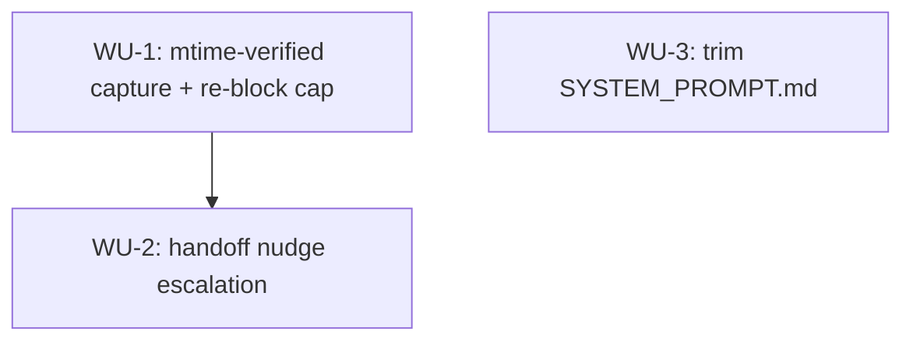

# ADR-0009 Execution Blueprint

- **Parent ADR:** `docs/adr/0009-evidence-verified-memory-capture-and-bounded-handoff-nudging.md`

## System Snapshot

- `src/hooks/memory_capture.rs:61-99` — the Stop hook `run()`. Currently: reads `session_dir(payload)` (`src/common/session.rs:32-38`, resolves to `$HOME/.claude/runtime/<session_id>`, confirmed to match `statusline.sh:350`'s `telemetry_dir`), returns early if `capture-due` isn't present, deletes it unconditionally at line 74 *before* building the reason text, then always emits `decision: block` via `emit_block` (`src/common/emit.rs`) with `INTRO` + edited-paths + `HANDOFF_NUDGE` + `OUTRO`.
- `statusline.sh:350-377` — the sole writer of `capture-due` and the `capture-fired` latch, guarded so the pair is only (re-)armed once per threshold crossing (`used_int >= capture_at`, default 70). No existing crossing counter.
- `~/.claude/memory/memory.graph.json` — rebuilt atomically by `src/hooks/rebuild_memory_graph.rs` (PostToolUse) on every memory-fact save. Its mtime is the "a fact was written" signal.
- `session_init.rs:143` — writes `start-ts` into the session dir at `SessionStart` (`fs::write(base.join("start-ts"), now.to_string())`), the existing session-start-time signal.
- `session_init.rs:379-444` — `append_handoff_slice` glob-matches `~/.claude/runtime/handoff/<project-slug>-<epoch>-<pid>.md`, reads/deletes the freshest few. The freshest match's mtime is the "a handoff was written" signal.
- `prompts/SYSTEM_PROMPT.md:51-63` — the `## Memory` section. Six paragraphs; the `**Retrieval**:` paragraph (line 59) narrates the three mechanical retrieval paths verbatim, and the anchors paragraph (line 57) ends with a mechanical sentence ("The graph rebuilds automatically via PostToolUse hook...").
- Existing state-file idiom (single-writer, no lock): `session_init.rs:143` and `session_init.rs:185-196` use plain `fs::write`/`fs::read_to_string` for small per-session scalar files. `src/common/atomic.rs`'s `with_dir_lock` and `src/common/counter.rs`'s `incr_counter` exist but are for genuinely multi-writer counters (e.g. `search_counter.rs`) — not needed here since `memory_capture.rs` is the only writer of its own new state files, and `docs/adr/0007-rust-binary-for-hooks-and-launcher.md:31` confirms hooks for one Stop event run as parallel OS processes, so any new filename this WU introduces must stay disjoint from filenames other Stop-registered hooks (e.g. `session_clean_exit.rs`) touch in the same dir.
- `tests/hooks_turn.rs:23-62` — test harness: `scratch_home`, `run_hook`, `session_dir_for`. `mod memory_capture` (~line 424) has 10 existing tests using this trio plus `fs::write(dir.join("capture-due"), "")`.

## Work Units

### WU-1: mtime-verified capture with a bounded re-block cap
- Requires: nothing
- Goal: `memory_capture.rs` only releases the `capture-due` marker silently when `memory.graph.json`'s mtime is newer than the marker's own mtime (captured via `fs::metadata` *before* any removal, reversing today's unconditional-delete-first order). The existing presence gate (`memory_capture.rs:69`, `if !marker.is_file() { return; }`) is restructured to distinguish two states `is_file()` currently conflates: read the marker's metadata directly and match on the error kind. `io::ErrorKind::NotFound` means no marker is due, return silently exactly as today (this preserves every existing "no marker" test unmodified). Any *other* error (e.g. `PermissionDenied`, the marker exists but couldn't be stat'd) is a distinct case: the fail-open invariant below applies, and the hook releases without blocking rather than either retaining-and-reblocking or falling through to the old silent-return path — those two outcomes must stay observably different, since a silent "no marker" return and a fail-open "marker existed but errored" release both produce the same "no block" result on the wire, but only the latter should also best-effort clean up `capture-attempts`. No write detected on a successfully-read marker: retain the marker, persist a re-block attempt count in a new sibling file `capture-attempts` (plain `fs::write`/`fs::read_to_string`, unlocked, same idiom as `session_init.rs:143`), and re-block with a reason that names the attempt (e.g. appends "This is re-block N of 2 since context usage crossed the threshold; still no new memory fact detected." with `N = capture-attempts + 1`), so the text is verifiably different from a plain first block and from other attempts. On this path, the reblock note replaces `OUTRO`'s "will not interrupt the next turn unless usage climbs past the threshold again" sentence rather than being appended after it — `OUTRO` is only accurate for a genuinely fresh crossing (attempts absent), and stating it directly above a sentence announcing the next turn WILL be interrupted again is a self-contradiction a reblocked session would read verbatim. **Cap: 2.** `capture-attempts` starts at 0 (file absent). While `capture-attempts < 2`, a no-write invocation blocks and then increments the counter (two possible re-blocks: `0→1` and `1→2`). Once `capture-attempts == 2`, the next no-write invocation releases without blocking instead of incrementing further. Worst case: 2 blocked turns total, then the marker clears — one more blocked turn than today's baseline of a single unconditional block, chosen to keep worst-case interruption small, matching the Decision's rejection of Alternative B for being "an availability risk with no upside over a capped one." At cap, consume both `capture-due` and `capture-attempts` and release without blocking (log the "capture skipped" outcome to stderr only — Stop's response schema has no non-blocking channel to the model per the ADR's Context, so this note is for the user/logs, never the model; `/playbook:implement` should confirm this repo's existing non-blocking-diagnostic convention against another hook, e.g. `session_clean_exit.rs`, before adding a new stderr call site).
- **Fail-open invariant (MUST)**: any I/O error *or unparseable content* reading `memory.graph.json`'s mtime, the marker's mtime, or the attempts file resolves to "release without blocking," never to "retain and re-block" or "treat as attempt 0 and re-block." This is deliberately stricter than a simple reset-to-0 fallback: for a value that gates whether the hook blocks, an unreadable or corrupt state must fail toward *less* blocking, never more. A hook that can't determine state must never wedge a session.
- Files: `src/hooks/memory_capture.rs` (production), `src/common/session.rs` (production: promote `rebuild_memory_graph.rs:62-63`'s private `fn memory_dir() -> PathBuf { home_dir().join(".claude").join("memory") }` to a shared `pub(crate)` helper next to `runtime_root()`, then have both `rebuild_memory_graph.rs` and `memory_capture.rs` use it — hook modules don't cross-import each other's private helpers in this codebase (`src/hooks/mod.rs:14-30` are all disjoint `pub mod`s with no inter-module `use`), so duplicating the 2-line function inline would violate the repo's existing DRY pattern of sharing path helpers through `src/common`), `tests/hooks_turn.rs::memory_capture` (tests: extend the existing module, AND rewrite two pre-existing tests whose current assertions encode the exact behavior WU-1 replaces — see Done When).
- Verification: `cargo build && cargo test --test hooks_turn`
- Shared test helper requirement: every mtime-ordering test below needs the "older" file written, then a bounded self-check after a short sleep — write, `sleep(10ms)`, write again, then poll in a short loop (e.g. up to 500ms in 10ms steps) confirming the second file's mtime is strictly greater than the first's, panicking with a clear message if the filesystem's mtime resolution can't distinguish them, rather than proceeding into a test that would otherwise be flaky on a slow or coarse-mtime CI runner. `Cargo.toml` has no `[dev-dependencies]` section (confirmed during Stage 3 fact-check), so this must be built from `std::thread::sleep`/`std::time`, not a mtime-injection crate.
- Tests (extend `mod memory_capture`, reusing `scratch_home`/`run_hook`/`session_dir_for`):
  - `write_detected_releases_marker_silently`: `capture-due` present, `capture-attempts` pre-seeded to `1` (simulating a prior re-block), `memory.graph.json` written with a later mtime → no block, both `capture-due` and `capture-attempts` gone afterward (proves cleanup of stale attempts state, not just "never wrote one").
  - `no_graph_file_present_retains_marker_and_reblocks`: no `memory.graph.json` at all → block emitted, reason names "re-block 1 of 2", `capture-due` still present, `capture-attempts` == 1. (Also the canonical "missing file treated as no-write" case; no separate test needed.)
  - `graph_file_older_than_marker_retains_marker_and_reblocks`: `memory.graph.json` exists but with a mtime strictly older than the marker's (a stale graph from before this crossing) → same outcome as above, distinct code path from "file absent."
  - `no_write_at_cap_minus_one_still_reblocks`: `capture-attempts` pre-seeded to `1` → block emitted, reason names "re-block 2 of 2", `capture-attempts` == 2.
  - `no_write_at_cap_releases_without_blocking`: `capture-attempts` pre-seeded to `2` → no block, both `capture-due` and `capture-attempts` removed.
  - `unreadable_marker_mtime_fails_open`: create `capture-due` normally inside the session dir, then remove read+execute permission on the **session dir itself** (`fs::set_permissions` on `dir_path`, mode `0o000`), so `fs::metadata(&marker)` fails with `PermissionDenied`, not `NotFound` — a dangling symlink was tried and rejected during gate review: it also returns `NotFound`, indistinguishable from the sibling "marker genuinely absent" case this same test file already covers via `no_marker_at_all_is_silent`, so it can't prove the fail-open branch fired instead of the ordinary absent-marker path. Restore the session dir's permissions via a `Drop`-based scope guard constructed immediately after the `chmod` (not a plain "chmod back at the end" sequence — this crate has no panic-strategy override in `Cargo.toml`, so the default unwind applies under `cargo test` and only a `Drop` guard's cleanup is guaranteed to run if an assertion between the chmod and the restore panics, leaving no other harness-level safety net since `scratch_home` itself is never cleaned up by any existing test). Self-check before calling `run_hook`, three-way: `Ok(_)` (elevated privileges bypassed the chmod, e.g. root or `CAP_DAC_OVERRIDE` CI runners, common for containerized Rust CI) → log and skip the rest of the test rather than assert; `Err(e) if e.kind() == io::ErrorKind::NotFound` → the fixture itself broke, `panic!` with a clear message; any other `Err` → proceed, this is the expected `PermissionDenied` path, call `run_hook` and assert it releases without blocking. Unix-only fixture; this repo's CI matrix is ubuntu/macos (no Windows), so no cross-platform gap.
  - `unreadable_graph_mtime_fails_open`: create `capture-due` normally (so the marker read succeeds and an arm time is obtained), then remove read+execute permission on the **memory dir** (`~/.claude/memory`, created first via `fs::create_dir_all` if the scratch home doesn't already have it) so `fs::metadata` on `memory.graph.json` inside it fails with `PermissionDenied` — same reasoning as above: a dangling symlink collides with `NotFound`, already claimed by `no_graph_file_present_retains_marker_and_reblocks` for the opposite outcome (retain-and-reblock). Restricting the memory dir specifically, not the session dir, keeps this test's cleanup of `capture-due`/`capture-attempts` (which lives in the still-accessible session dir) unaffected. Same `Drop`-guard restore requirement and the same three-way self-check (skip on root/elevated bypass, panic on a broken fixture, proceed on genuine `PermissionDenied`) as above. → releases without blocking.
  - `corrupt_attempts_file_fails_open`: `capture-attempts` contains non-numeric content (e.g. `"garbage"`), no write detected → releases without blocking per the fail-open invariant, not "treated as 0 and re-blocked."
- Done When:
  - [ ] all new tests above pass
  - [ ] 8 of the 10 pre-existing `mod memory_capture` tests pass unmodified; the other 2 — `marker_present_fires_once_and_clears_the_marker` and `second_call_with_marker_already_consumed_is_silent` — are rewritten to first write a `memory.graph.json` with a mtime newer than the marker (putting them on the write-detected path), preserving their original intent (marker consumed on one call, second call silent) under the new logic, since as written today neither test creates `memory.graph.json` and both would incorrectly hit the retain-and-re-block branch under WU-1
  - [ ] `cargo build` clean, no new `unwrap()`/`expect()` on fallible I/O in the new code path

### WU-2: handoff nudge escalation
- Requires: WU-1 (same function, appends to the "no write detected, under cap" branch's reason text only — per the ADR's Decision, this never introduces a new blocking path). **Known, documented limitation** (see the ADR record's Consequences, added during this gate's revision): a session that writes memory facts promptly on every crossing takes WU-1's silent-release branch every time and so never reaches this branch — such a session gets no handoff signal at all, regardless of length. This is a real gap, not something WU-2 closes; it's out of scope for this WU because closing it would require a new blocking path the ADR's Decision explicitly rejected (no enforcement value beyond what `SessionEnd` could already fire past).
- Why crossing-count over a simpler existing signal: `start-ts` age (session_init.rs:143) or `telemetry.jsonl`'s row count (statusline.sh:354-356) could each approximate "session running long" without new shell-side state. Crossing-count is used instead because it matches the ADR Decision's literal mechanism ("crossed the capture threshold enough times," Alternative C item 2) and is a compliance-relevant proxy, not just a wall-clock one: a session idling for an hour without doing anything shouldn't escalate, but one that has crossed the memory-pressure threshold three times has generated real work worth surfacing.
- Goal: `statusline.sh` gains a `capture-crossings` counter file (plain integer text), incremented once per threshold crossing at the same guarded point it already arms `capture-due`/`capture-fired` (`statusline.sh:367-373`), so it's naturally single-write-per-crossing with no extra locking. `capture-crossings` is added to `session_init.rs`'s `SESSION_COUNTER_FILES` list (`session_init.rs:52-58`) so `zero_session_state` (`session_init.rs:127-144`) resets it alongside `start-ts` on every `SessionStart`, including resume — without this, a resumed session would carry forward a stale crossing count while `start-ts` restarts fresh, making a session look "running long" on its very first post-resume crossing. `memory_capture.rs`'s re-block branch (WU-1) reads `capture-crossings`; once it's **≥ 3** (three crossings ≈ a long session at the default 70% capture threshold), also reads the freshest handoff-glob mtime (reusing `session_init.rs:379-444`'s glob pattern, read-only, never deletes) and compares it to `start-ts`. If no handoff file is newer than `start-ts`, append a stronger handoff sentence to the block reason already being built.
- **Fail-safe rule (deliberately the opposite direction from WU-1)**: an unparseable `capture-crossings` value is treated as `0` (matching `counter.rs:22-25`'s existing fallback idiom), and an unreadable handoff directory is treated as "no handoff found this session" (append the nudge). WU-2 never gates blocking on its own; an unreadable handoff directory must never cause extra *silence* (a nudge that should show but doesn't), the opposite of WU-1's rule that failures must never cause extra *blocking*. The crossings counter itself is the one exception: it intentionally defaults to 0 on unparseable content, on the existing `counter.rs` idiom, accepting a rare missed nudge over departing from that convention.
- Files: `statusline.sh` (production), `src/hooks/session_init.rs` (production: add `capture-crossings` to `SESSION_COUNTER_FILES` at `session_init.rs:52`, a fixed-size `[&str; 5]` array that becomes `[&str; 6]`), `src/hooks/memory_capture.rs` (production, extends WU-1's branch), `tests/hooks_turn.rs::memory_capture` (tests), `shell/statusline.test.sh` (tests, existing suite covers the capture-due/capture-fired arming logic this extends).
- Verification: `cargo build && cargo test --test hooks_turn && shell/statusline.test.sh`
- Tests (each states its WU-1 precondition explicitly, e.g. "no `memory.graph.json`" or "`capture-attempts` < 2," rather than relying on scratch-dir defaults):
  - `handoff_nudge_appears_when_crossings_at_threshold_and_no_handoff_written`: no `memory.graph.json` (WU-1 no-write precondition), `capture-crossings` = 3, no handoff file newer than `start-ts` → reblock reason includes the handoff sentence.
  - `handoff_nudge_appears_when_crossings_above_threshold`: same preconditions, `capture-crossings` = 5 → reblock reason still includes the handoff sentence (guards a `== 3` implementation instead of `>= 3`).
  - `handoff_nudge_absent_below_crossing_threshold`: same preconditions, `capture-crossings` = 2 → reblock reason unchanged from WU-1's baseline.
  - `handoff_nudge_absent_when_handoff_already_written`: same preconditions, `capture-crossings` = 3, a handoff file newer than `start-ts` present → reblock reason has no handoff sentence.
  - `handoff_nudge_appears_when_handoff_is_stale`: same preconditions, `capture-crossings` = 3, a handoff file present but with a mtime *older* than `start-ts` (left over from a prior session) → reblock reason includes the handoff sentence (a stale match is not "written this session," distinct code path from "no match at all").
  - `handoff_nudge_never_fires_without_a_reblock`: write detected (WU-1's silent-release branch) with `capture-crossings` = 5 → still no block at all.
  - `crossings_unparseable_treated_as_zero_no_nudge`: `capture-crossings` contains non-numeric content, WU-1 no-write preconditions met → reblock still happens (WU-1 logic unaffected) but without the handoff sentence, per the fail-safe rule.
  - statusline.sh: extend `shell/statusline.test.sh` to drive three separate cross/drop/re-cross cycles (using the existing pattern at lines 199-205) and assert `capture-crossings` reads exactly `3` at the end, not just that a single crossing doesn't over-increment.
- Done When:
  - [ ] all new Rust tests pass, plus the extended `statusline.test.sh` case
  - [ ] no existing `statusline.test.sh` assertion changes behavior (crossing counter is additive)
  - [ ] `capture-crossings` resets to absent/0 on every `SessionStart`, verified by extending `session_init.rs`'s existing `SESSION_COUNTER_FILES` test coverage
  - [ ] the hook still never blocks a turn that had no `capture-due` marker to begin with
  - [ ] the doc comment at `session_init.rs:49-51` ("The five per-session counter/state files... Matches hooks/session-init.py:88 exactly") is updated to drop "the five" and the exact-parity claim, since `SESSION_COUNTER_FILES` grows to six entries and no longer matches the Python source one-for-one

### WU-3: trim `SYSTEM_PROMPT.md`'s Memory section
- Requires: nothing (parallel-safe, disjoint file from WU-1/WU-2)
- Goal: remove the `**Retrieval**:` paragraph (`prompts/SYSTEM_PROMPT.md:59`) entirely — it narrates the three mechanical retrieval paths (`SessionStart` injection, anchor matching, prompt matching) that `session_init.rs` and `memory_anchors.rs` already run without needing prose. Also trim the trailing mechanical sentence from the anchors paragraph (line 57): "The graph rebuilds automatically via PostToolUse hook whenever any fact file is saved." Keep every paragraph carrying save-time judgment (storage format/location, graph-edge semantics for writing links, where-to-save, when-to-save) untouched.
- Files: `prompts/SYSTEM_PROMPT.md` (production; no test file, this is prose — verification is a manual read-through plus grep, per this repo's convention for doc-only WUs).
- Verification: `grep -c "Retrieval" prompts/SYSTEM_PROMPT.md` returns 0; the file still parses as valid markdown (no orphaned headers).
- Done When:
  - [ ] `## Memory` section retains all save-time judgment content
  - [ ] no sentence duplicates behavior `session_init.rs` or `memory_anchors.rs` already performs mechanically

## Ordering

| WU | Requires | Parallel group |
|---|---|---|
| WU-1 | none | P1 |
| WU-2 | WU-1 | none |
| WU-3 | none | P1 |

## Parallel Groups

- P1 (no prerequisites): WU-1 and WU-3. Disjoint files (`memory_capture.rs`/`tests/hooks_turn.rs` vs `prompts/SYSTEM_PROMPT.md`), no shared state, safe to run concurrently.
- Sequential: WU-2 after WU-1 (extends the exact branch WU-1 introduces in `memory_capture.rs`; landing both independently is the same "uncoordinated additions to the same block-reason logic" risk the ADR itself flags for #263, so WU-1 and WU-2 must land in that order even though they could theoretically be drafted together).

## Dependency Graph

## Confidence + open items

- Confidence: HIGH. Every file:line citation in this blueprint was verified against the actual source during the Stage 3 fact-check (2026-09-02): `session.rs:32-38`, `memory_capture.rs:61-99`, `atomic.rs:44` (`with_dir_lock`), `counter.rs:18-25` (`incr_counter`'s missing-or-unparsable-starts-from-0 fallback idiom), `session_init.rs:52,127-144` (`SESSION_COUNTER_FILES`, `zero_session_state`), `session_init.rs:143` (`start-ts`), `session_init.rs:379` (`append_handoff_slice`), `statusline.sh:354-356,367-373`, `tests/hooks_turn.rs:23/34/60/424`, `rebuild_memory_graph.rs:62-63,825`, ADR-0007 line 31, `shell/statusline.test.sh:164-210` (`SESSION_COUNTER_FILES` was cited by the Phase 2 critic review and independently confirmed here). The two re-block cap and crossing-count values (2 and 3) remain the blueprint's own reasoned choice per the ADR's explicit delegation. This is the blueprint's second draft: gate iteration 1 (Phase 2 critic + Phase 3 test-reviewer, both FAIL) found 2 HIGH-severity internal contradictions (the cap prose vs. its own test table, and 2 pre-existing tests asserting behavior WU-1 removes), 4 MEDIUM findings (an overstated "not a gap" claim, a missing session-resume reset, an unjustified new shell-side signal, a missing WU-2 fail-open note), and 5 test-plan FAILs (missing boundary/fail-open coverage, weak assertions, a broken fail-open test mechanism, unaddressed mtime-comparison flakiness); all are addressed above.
- Open items (resolved during fact-check, recorded here so `/playbook:implement` doesn't re-derive them):
  - `Cargo.toml` has **no `[dev-dependencies]` section at all** (checked directly) — no `filetime` or similar mtime-injection crate is available, and adding one for two test files would be disproportionate given the whole binary has 4 pinned dependencies total. WU-1/WU-2 tests must control mtime ordering via real writes plus a short `std::thread::sleep(Duration::from_millis(10))` between the "older" and "newer" file writes, not via direct mtime manipulation.
  - `rebuild_memory_graph.rs:62`'s `memory_dir()` is a private `fn`, not `pub`; resolved above by promoting it into `src/common/session.rs`. `/playbook:implement`'s WU-1 RED step should do this promotion first since both the WU-1 tests and `rebuild_memory_graph.rs`'s own existing tests depend on the function continuing to resolve to the same path after the move.
  - The "capture skipped" stderr-only logging in WU-1 still assumes a convention this session didn't directly confirm; `/playbook:implement` should check another hook (e.g. `session_clean_exit.rs`) for an existing non-blocking `eprintln!`-style diagnostic pattern before adding a new one.
