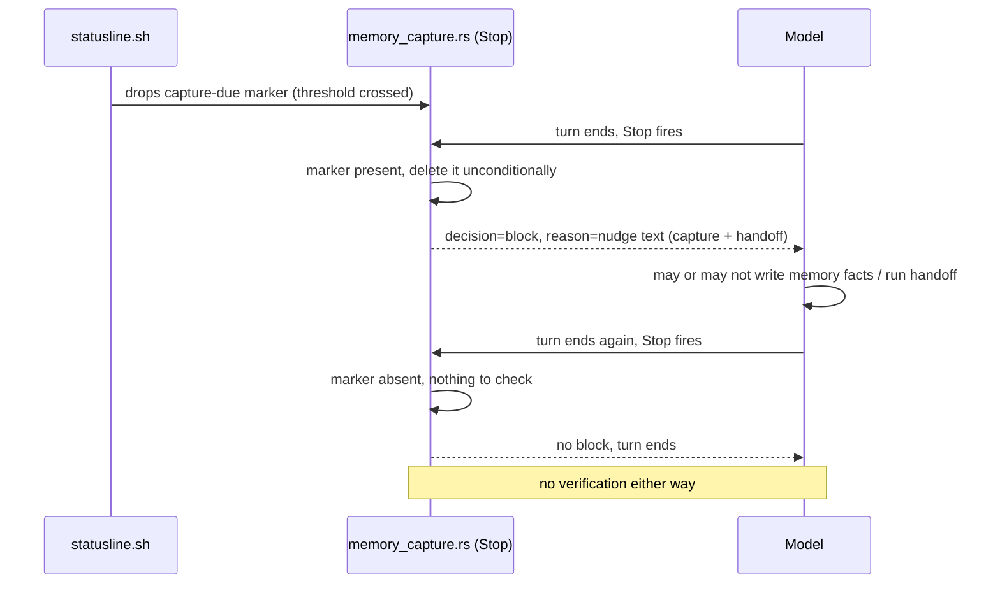

# ADR-0009: Evidence-verified memory capture and bounded handoff nudging

- **Status:** Proposed
- **Date created:** 2026-08-25
- **Date modified:** 2026-08-25

## Context

Memory recall is already hook-enforced, not prompt-based. `session_init.rs` injects a capped slice of `graph.json` at `SessionStart` and `memory_anchors.rs` matches edited files and prompt text against the anchor index mechanically (ADR 0004, ADR 0008). Neither depends on the model reading and following prose.

Capture and handoff are different. `src/hooks/memory_capture.rs:61-99` is a `Stop` hook that checks for a `capture-due` marker `statusline.sh` drops in the session directory when context usage crosses a threshold. It deletes the marker unconditionally, before the block reason text is even built (`memory_capture.rs:72-74`), then emits a `decision: block` with text asking the model to write durable facts and, since ADR 0008, to consider running `/playbook:session-handoff` (`HANDOFF_NUDGE`, `memory_capture.rs:51-53`). Nothing checks whether a write actually happened. A model that ignores the nudge loses nothing: the marker is already gone, so the very next `Stop` succeeds cleanly, threshold crossing or not.

`skills/session-handoff/SKILL.md:16-49` defines the handoff document as decisions made and why, next steps, and open questions, all of which require the model to synthesize the session, not something a deterministic hook script can generate. A hook can verify a handoff was written; it cannot write one.

Fetched directly from the official Claude Code hooks docs (`code.claude.com/docs/en/hooks`, 2026-08-24/25) rather than assumed:

- `Stop` can block, and the model can attempt to stop again afterward. The docs name no `stop_hook_active` field and describe no built-in cap on repeated blocking.
- `SessionEnd`'s block column reads "No... Shows stderr to user only." It is fire-and-forget: nothing it returns can pause or redirect the model.
- `Stop`'s decision-control fields are `decision` and `reason` only. `additionalContext` is not available there, matching what `memory_capture.rs` already does (only ever calling `emit_block`, never trying to inject context).

Two mechanisms already exist that make evidence-based verification cheap. `src/hooks/rebuild_memory_graph.rs` rebuilds `~/.claude/memory/graph.json` atomically on every save under `~/.claude/memory/` (a `PostToolUse` hook), so the file's mtime is a free, already-current signal for "a memory fact was written." `session_init.rs`'s handoff read (ADR 0008) reads and deletes `~/.claude/runtime/handoff/<project-slug>.md` at `SessionStart`, so that file's mtime is the equivalent signal for "a handoff was written."

`prompts/SYSTEM_PROMPT.md:51-63`'s `## Memory` section narrates, in prose, both the save-time decisions that genuinely need model judgment (what counts as durable, which scope) and the three retrieval paths that `session_init.rs` and `memory_anchors.rs` already run mechanically. `docs/concepts/02-memory-system.md` carried a near-identical duplication before ADR 0008, and it had drifted stale and self-contradictory by the time it was caught.

## Decision Drivers

- `memory_capture.rs`'s block has no compliance check: deleting the marker before building the reason text means the block cannot distinguish "the model wrote facts" from "the model said ok and moved on."
- The official docs confirm `Stop` has no documented re-block cap, so any design that blocks until compliance must supply its own bound, or a session can wedge with no way out.
- `SessionEnd` cannot force anything. Any handoff-enforcement design has a structural ceiling: no hook event both fires exactly once at the true end of a session and can pause it.
- `docs/concepts/02-memory-system.md`'s Design Rationale is explicit that memory writes are nudge-and-approve by design, since a bad or spurious fact compounds unattended once it is in the store. A stricter capture gate must not trade "model ignores the nudge" for "model writes junk just to satisfy the gate."
- `SYSTEM_PROMPT.md`'s Memory section mixes judgment-only guidance with prose descriptions of mechanically-enforced behavior in one block, the same shape that let `docs/concepts/02-memory-system.md` go stale until ADR 0008 caught it.

## Considered Alternatives

### A. Status quo: nudge-only capture, prose-described recall (effort: S)

- How it works: `memory_capture.rs` blocks once per threshold crossing with nudge text; the system prompt narrates retrieval mechanics and save-time judgment together.
- Trade-offs: No implementation cost. Leaves capture and handoff fully dependent on model compliance with zero verification, which is the exact gap this record exists to close.

### B. Hard block until any write happens, no cap (effort: S)

- How it works: `memory_capture.rs` never deletes the marker until `graph.json`'s mtime advances past the marker's own mtime, blocking every `Stop` attempt until then.
- Trade-offs: Simple to build. But the docs confirm `Stop` has no built-in loop-prevention, so a model that has genuinely nothing to capture, or that fails to act on the nudge for any reason, can re-block indefinitely. Turning a productivity aid into a stuck session is a worse failure than the one being fixed.

### C. Evidence-verified capture with a bounded re-block cap, plus mtime-checked handoff nudging, plus a trimmed system prompt (effort: M), chosen

- How it works, three coordinated changes:
  1. `memory_capture.rs` compares `graph.json`'s mtime against the marker's own arm time before consuming it. No write detected: retain the marker and re-block, up to a small fixed cap, then release with a distinct "capture skipped" note so the block can never wedge a session.
  2. The same path also checks the handoff file's mtime once a session has crossed the capture threshold enough times to suggest it is running long (a proxy for "probably near a natural stop," since `Stop` cannot know it is the session's last turn and `SessionEnd` cannot block at all), nudging harder rather than blocking, since blocking here has no enforcement value `SessionEnd` could not already fire past.
  3. `SYSTEM_PROMPT.md`'s Memory section keeps only the save-time judgment calls, dropping the prose that just restates what `session_init.rs` and `memory_anchors.rs` already do mechanically.
- Trade-offs: More real engineering than B: a re-block counter, two separate mtime comparisons, and careful wording for the skipped case. Bounded correctly: never wedges a session, and never claims an enforcement guarantee hooks cannot deliver.

### D. Move enforcement to SessionEnd, drop the mid-session Stop nudge (effort: M)

- How it works: rely solely on `SessionEnd` to warn, via stderr, if no capture or handoff happened during the session.
- Trade-offs: Matches "handoff belongs at the end" more precisely in principle. Rejected: `SessionEnd`'s stderr output reaches the user, not the model's context, so this discards the one channel that can currently put a nudge back in front of the model in exchange for a channel that cannot, net weaker than what exists today.

## Decision

Alternative C. It closes the real compliance gap in `memory_capture.rs` that alternative A leaves open, respects the documented absence of loop-prevention on `Stop` that alternative B ignores, and keeps the one enforcement channel that reaches the model instead of trading it for `SessionEnd`'s user-only channel as alternative D does. B is rejected specifically because an uncapped block is an availability risk with no upside over a capped one. D is rejected because it is strictly weaker on the half of the problem that can still be improved, in exchange for matching the half that cannot.

## Consequences

- `memory_capture.rs`'s block becomes a real gate tied to an observable write, not a formality that always releases regardless of compliance.
- `SYSTEM_PROMPT.md` shrinks and stops duplicating hook behavior in prose, reducing the risk of the staleness ADR 0008 already found once in `docs/concepts/02-memory-system.md`.
- `memory_capture.rs` gains state it does not have today: a re-block attempt counter, scoped per marker/session.
- Handoff enforcement stays bounded by what hooks can actually do. `SessionEnd` cannot block, so this record closes the mid-session compliance gap, not the end-of-session one. A user who exits before complying with a nudge still loses the handoff, exactly as today; the blueprint must record this limit rather than imply it away.
- Follow-up: the re-block cap and the threshold-crossing count that escalates handoff nudging are both concrete values the blueprint has to choose and justify, not implementation details left open here.

## Architecture Diagrams

### Current state



### Proposed state

```mermaid
sequenceDiagram
    participant SL as statusline.sh
    participant Stop as memory_capture.rs (Stop)
    participant Graph as graph.json (mtime)
    participant Handoff as handoff file (mtime)
    participant Model
    SL->>Stop: drops capture-due marker, records arm time
    Model->>Stop: turn ends, Stop fires
    Stop->>Graph: mtime newer than arm time?
    alt write detected
        Stop->>Stop: consume marker
        Stop-->>Model: no block, turn ends
    else no write detected, under cap
        Stop->>Stop: retain marker, increment attempt
        Stop-->>Model: decision=block, reason=stronger nudge
    else no write detected, cap reached
        Stop->>Stop: consume marker, log "capture skipped"
        Stop-->>Model: no block, turn ends
    end
    opt session long enough (crossing count high)
        Stop->>Handoff: mtime newer than session start?
        Stop-->>Model: reason includes handoff nudge if stale
    end
    Note over Stop,Model: SessionEnd still cannot block; gap stays visible, not hidden
```
