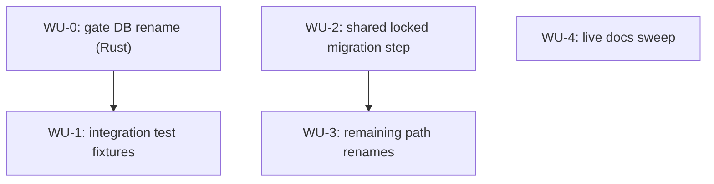

# ADR-0010 Execution Blueprint

- **Parent ADR:** docs/adr/0010-agent-agnostic-repo-local-storage.md

## System Snapshot

Five repo-local stores move from `.claude/<name>` to `.playbook/<name>`, all
resolved via `git rev-parse --show-toplevel` from cwd, unchanged:

- **Gate DB** (Rust-owned): `src/gate/record.rs`, `src/gate/check.rs`,
  `src/gate/db.rs`, `src/gate/mod.rs`, `src/lib.rs`. Tests:
  `src/gate/db.rs` (unit), `tests/gate_check.rs`, `tests/gate_record.rs`
  (integration, spawn the real binary).
- **Markdown-convention stores** (`plans/`, `designs/`, `implement/`,
  `worktrees/`): `commands/scope.md`, `commands/implement.md`,
  `commands/brainstorm.md`, `.gitignore`.
- **Live user-facing docs** referencing the old paths: `README.md`,
  `docs/guides/01-plan-and-implement.md`.

Explicitly untouched: historical ADRs (`docs/adr/0003-*.md`,
`docs/adr/0007-*.md`) that reference `.claude/designs/` or
`.claude/worktrees/` describe what was true at the time those decisions
were made; rewriting them would misrepresent history, not just move a
path. `~/.claude` (home-level state) is out of scope per the parent ADR.

**Revision note (post Quality Gate iteration 1):** the first draft of this
blueprint put each store's migration only in its own save-time bootstrap
block (e.g. `plans/` migrated only inside `commands/scope.md`'s Step 7
save). Both the adversarial review and the test review independently
caught the same real bug: several READ sites (`commands/implement.md`'s
Plan Picker glob, `commands/implement.md`'s progress-ledger resume,
`commands/scope.md`'s Design Doc Handoff, `commands/brainstorm.md`'s
prior-design scan) reference a store before that store's own save-time
migration ever runs, so a paused `/playbook:implement` run's ledger, or an
existing plan, would become invisible after this ADR ships, until
something happens to trigger that store's save path. On a paused
mid-delivery run, that could re-dispatch already-`DONE` Work Units. WU-2
below is restructured around this: one shared, locked migration step,
covering all four stores in a single idempotent pass, wired as the
FIRST thing each command does, not spread across four separate save-time
bootstraps.

## Work Units

### WU-0: Rename the gate DB's repo-local path and gitignore shape-check

- Requires: nothing
- Goal: `gate record`/`gate check` resolve `<repo>/.playbook/state.db`, and
  the auto-gitignore side effect only fires for that shape, not the old
  `.claude/state.db` shape.
- Files:
  - `src/gate/record.rs` (path construction, currently lines 92-94; doc
    comments lines 6, 82) — production
  - `src/gate/check.rs` (path construction, currently lines 75-77) —
    production
  - `src/gate/db.rs` (`open_db` doc comment line 48; module doc lines
    4-5, 8-17; `ensure_state_db_gitignored` shape-check and its doc
    comment, currently lines 120-148, literal component comparisons
    `file_name != "state.db"` stays, `claude_dir_name != ".claude"`
    becomes `playbook_dir_name != ".playbook"`; unit test
    `open_db_gitignores_claude_state_db_path`, currently lines 379-397)
    — production + test
  - `src/gate/mod.rs` (module doc, currently line 5) — production
  - `src/lib.rs` (`GateCommand::Record` doc comment, currently line 156)
    — production
- Verification: `cargo test --lib gate::` && `cargo clippy --all-targets -- -D warnings` && `cargo fmt --check`
- Tests:
  - Scenario: opening a DB at `<repo>/.playbook/state.db` auto-appends
    `.playbook/state.db` to the repo's `.gitignore`. (Rename of the
    existing `open_db_gitignores_claude_state_db_path` test to assert the
    new path and entry.)
  - Scenario: opening a DB at the old shape, `<repo>/.claude/state.db`,
    does NOT trigger the auto-append. New test, regression-pins the
    rename boundary so a partial revert or a stray old-shape check
    can't silently resurrect the old behavior.
- Done When:
  - [ ] `gate record` and `gate check` both resolve `.playbook/state.db`
  - [ ] the gitignore auto-append fires only for the `.playbook/state.db`
        shape
  - [ ] `cargo test --lib gate::` passes, including the renamed test and
        the new old-shape regression test
  - [ ] `cargo clippy --all-targets -- -D warnings` and `cargo fmt --check`
        pass

### WU-1: Update the gate DB integration test fixtures

- Requires: WU-0
- Goal: the two integration fixtures that spawn the real binary read and
  write `.playbook/state.db`, matching WU-0's production change, and pin
  that the old path is never touched (Test Review finding: nothing
  previously asserted this, and `record.rs`/`check.rs`'s own path
  construction isn't exercised by WU-0's unit test).
- Files:
  - `tests/gate_check.rs` (`db_path` fn, currently lines 43-44) — test
  - `tests/gate_record.rs` (`db_path` fn, currently lines 64-65; fixture
    doc comment, currently lines 22-24) — test
- Verification: `cargo test --test gate_check --test gate_record`
- Tests: existing scenarios in both fixtures (record then check a PASS;
  MISSING on an unrecorded phase; etc.) are unchanged in intent, only the
  path they assert against moves. Add one assertion to each fixture's
  post-run checks: `assert!(!self.repo.join(".claude").join("state.db").exists(), "gate should never touch the old .claude/state.db path")`,
  regression-pinning that the rename is real, not additive (i.e. the old
  path isn't ALSO written as a compatibility leftover).
- Done When:
  - [ ] both fixtures construct and assert against `.playbook/state.db`
  - [ ] both fixtures assert `.claude/state.db` does not exist after a run
  - [ ] `cargo test --test gate_check --test gate_record` passes

### WU-2: Add a shared, locked migration step for the markdown-convention stores

- Requires: nothing
- Goal: a single migration step, covering all four stores
  (`plans`, `designs`, `implement`, `worktrees`) in one idempotent,
  locked pass, wired as the FIRST thing each of `commands/scope.md`,
  `commands/implement.md`, and `commands/brainstorm.md` does, so no read
  of any store (existing or introduced by WU-3) can ever run before that
  store has had a chance to migrate. This is the direct fix for the
  Quality Gate iteration 1 finding: migrating only at each store's own
  save-time bootstrap left several read sites able to run first and see
  nothing.
- Migration snippet (identical, byte-for-byte, in all three insertion
  points; iteration 2's Test Review flagged hand-duplication as a drift
  risk with nothing enforcing the three copies stay identical, addressed
  below with a byte-identity test case rather than a shared sourced file,
  since these commands run against an arbitrary target repo and have no
  existing mechanism to locate the playbook tool's own install path from
  inside a bash block):
  ```bash
  # BEGIN repo-local-storage-migration
  ROOT=$(git rev-parse --show-toplevel 2>/dev/null || pwd)
  LOCK="$ROOT/.playbook-migrate.lock"
  ACQUIRED=0
  for _ in $(seq 1 20); do
    mkdir "$LOCK" 2>/dev/null && { ACQUIRED=1; break; }
    sleep 0.05
  done
  if [ "$ACQUIRED" != 1 ]; then
    echo "ERROR: could not acquire $LOCK after 1s; another session may be migrating .claude/ to .playbook/. Retry once it finishes." >&2
    exit 1
  fi
  for name in plans designs implement worktrees; do
    old="$ROOT/.claude/$name"
    new="$ROOT/.playbook/$name"
    if [ -e "$new" ] && [ ! -d "$new" ]; then
      echo "WARNING: $new exists and is not a directory; skipping migration for $name" >&2
    elif [ -d "$old" ] && [ -d "$new" ]; then
      : # both already exist; never merge or delete, leave both alone
    elif [ -d "$old" ] && [ ! -e "$new" ]; then
      mkdir -p "$ROOT/.playbook"
      mv "$old" "$new"
    fi
  done
  rmdir "$LOCK" 2>/dev/null
  # END repo-local-storage-migration
  ```
  Lock acquisition is now mandatory (iteration 2's Test Review finding:
  the prior version proceeded unlocked, unprotected, after a 1-second
  timeout, narrowing the TOCTOU race instead of closing it). A session
  that can't acquire the lock within 1 second exits with a clear message
  instead of racing; a stuck lock from a crashed prior session is a rare,
  visible, manually-recoverable failure (`rmdir` the lock dir), which is
  a better failure mode than a silent partial migration. Explicitly does
  not touch a store where the new path already exists as something other
  than a directory, or where both old and new already exist: silent data
  loss is worse than a store that stays unmigrated until a human resolves
  the conflict.
- Files:
  - `commands/scope.md`: insert the snippet, including its
    `# BEGIN repo-local-storage-migration` / `# END repo-local-storage-migration`
    marker lines, as its own bash block placed before the
    `## Design Doc Handoff` section (currently starting line 81), which
    runs unconditionally "Before Step 1" per its own text (currently line
    83) and today has no bash block of its own — production markdown
  - `commands/implement.md`: insert the snippet, markers included, as its
    own bash block placed immediately after the
    `## Step 1: Resolve the Task Reference` heading (currently line 80)
    and BEFORE the conditional
    "**No task reference given (empty, or only flags)?**" branch point
    (currently line 82). Iteration 2's Adversarial Review caught that the
    previous placement, inside that conditional's own bash block, never
    runs when a task reference IS given, which is the common resume path
    (`/playbook:implement .claude/plans/<slug>.md` against a paused run):
    the ledger read at (currently) line 259 would still see nothing.
    Placing it before the branch point makes it run on every invocation
    of Step 1 regardless of which branch follows — production markdown
  - `commands/brainstorm.md`: insert the snippet, markers included, as
    its own bash block placed before the prior-design scan described at
    (currently) line 114, inside Step 2, which the Adversarial Review
    confirmed already runs unconditionally regardless of idea-mode vs
    ticket-mode — production markdown
  - `shell/repo-local-storage-migration.test.sh` (new file) — test
- New test file, following the `ok`/`bad` PASS/FAIL accumulator pattern
  already established in `hooks/migration-check.test.sh` (own `mktemp -d`
  scratch git repo per case, not shared across cases), parameterized over
  the four store names, auto-discovered by `shell-ci.yml`'s existing
  `git ls-files '*.test.sh'` (no separate CI wiring needed). Per store,
  per its own fresh scratch repo:
  1. Old dir has content, new doesn't exist: migrates; new dir has the
     content, old dir is gone.
  2. Old dir is empty, new doesn't exist: still migrates (an empty dir is
     not "nothing to migrate").
  3. Neither old nor new exists: no-op, no error.
  4. New path exists as a plain file, not a directory: warns to stderr,
     skips, old dir (if present) is left untouched, script does not
     abort or crash.
  5. Both old and new already exist as directories, with distinct
     sentinel files in each: both left untouched afterward, no merge, no
     deletion.
  6. Two invocations of the snippet backgrounded concurrently against one
     scratch repo with real old content: exactly one clean migration
     results, content intact, no partial move, no lock file left behind.
  7. Lock already held (pre-create `$ROOT/.playbook-migrate.lock` and
     don't remove it): the snippet exits non-zero within ~1 second with
     the "could not acquire" message, and makes no change to any store
     (old dir, if present, still exists; no new dir created).
  8. Byte-identity: extract the migration snippet from each of
     `commands/scope.md`, `commands/implement.md`, and
     `commands/brainstorm.md` using `sed -n '/# BEGIN repo-local-storage-migration/,/# END repo-local-storage-migration/p'`.
     First assert each of the three extracts is non-empty (a missing
     marker pair must fail loudly, not compare two empty strings as
     "identical," which iteration 3's Test Review flagged as a vacuous
     pass otherwise). Then assert all three extracts are byte-identical
     to each other. This is the drift protection Test Review iteration 2
     asked for, in place of a shared sourced file (not viable here, see
     the migration snippet's own note above).
- Verification: `bash shell/repo-local-storage-migration.test.sh` (exit 0,
  all cases print `PASS`)
- Done When:
  - [ ] the migration snippet, with its `# BEGIN`/`# END` markers, is the
        first bash block each of the three commands runs, placed before
        any conditional branch point in that command's earliest step, and
        before any other reference to
        `.claude/{plans,designs,implement,worktrees}` in that same file
  - [ ] `shell/repo-local-storage-migration.test.sh` exists, covers all 8
        cases above, and passes

### WU-3: Rename the remaining internal path references

- Requires: WU-2 (every read must be guaranteed to run after the shared
  migration step exists and is wired, or renaming the literal path first
  would strand pre-existing content the way iteration 1 did)
- Goal: every remaining `.claude/{plans,designs,implement,worktrees}`
  reference in the three command files, and the corresponding
  `.gitignore` entries, read `.playbook/{...}` instead. This is now safe:
  WU-2 guarantees migration has already run earlier in the same
  invocation before any of these references execute.
- Files:
  - `commands/scope.md`: argument-hint and example (lines 4, 26), design
    doc detection prose (lines 83, 85-86), plan-save bootstrap (lines
    346-347, 355, 361, 364-365) — command markdown
  - `commands/implement.md`: help example (line 29), plan-file glob (line
    87), plan/blueprint prose (line 102), worktree add path (line 241),
    WU brief path (line 250), progress ledger path and prose (line 259),
    bootstrap mkdir (line 263), gitignore lock loop (line 271) — command
    markdown
  - `commands/brainstorm.md`: design doc path prose (line 44), prior-design
    scan (line 114), save prose and bootstrap (lines 182, 186, 194, 198,
    223) — command markdown
  - `.gitignore` (lines 60-63: `.claude/plans/`, `.claude/designs/`,
    `.claude/implement/`, `.claude/worktrees/` each rename to the
    `.playbook/` equivalent) — config
- Verification:
  `grep -rn '\.claude/plans\|\.claude/designs\|\.claude/implement\|\.claude/worktrees' commands/scope.md commands/implement.md commands/brainstorm.md .gitignore`
  returns nothing.
- Tests: no new scenarios; WU-2's migration tests plus WU-2's own Done
  When (migration always runs first) are what makes this rename safe.
  This WU is a mechanical find-and-replace, verified by the grep above.
- Done When:
  - [ ] the grep above returns no matches
  - [ ] `.gitignore` lines 60-63 read `.playbook/{plans,designs,implement,
        worktrees}/`

### WU-4: Update live user-facing docs

- Requires: nothing
- Goal: `README.md` and `docs/guides/01-plan-and-implement.md` describe
  the new `.playbook/` paths, not the old `.claude/` ones. Historical ADRs
  are explicitly excluded (System Snapshot, above).
- Files:
  - `README.md` (line 166: `/playbook:scope` row) — docs
  - `docs/guides/01-plan-and-implement.md` (lines 66, 101, 136) — docs
- Verification:
  `grep -rn '\.claude/plans\|\.claude/designs\|\.claude/implement\|\.claude/worktrees' README.md docs/guides/`
  returns nothing.
- Tests: N/A, prose-only change; the grep above is the acceptance check.
- Done When:
  - [ ] the grep above returns no matches

## Ordering

| WU | Requires | Parallel group |
|---|---|---|
| WU-0 | none | P1 |
| WU-1 | WU-0 | P2 |
| WU-2 | none | P1 |
| WU-3 | WU-2 | P2 |
| WU-4 | none | P1 |

## Parallel Groups

- P1 (no dependencies): WU-0, WU-2, WU-4. Disjoint files (`src/gate/*` +
  `src/lib.rs` vs `commands/*.md` (insert-only) + new
  `shell/*.test.sh` vs `README.md` + `docs/guides/*.md`), no shared
  state, safe to run concurrently.
- P2 (after P1's relevant prerequisite): WU-1 (after WU-0) and WU-3
  (after WU-2). Disjoint files (`tests/*.rs` vs `commands/*.md` +
  `.gitignore`), safe to run concurrently with each other once their own
  prerequisite is met.

## Dependency Graph



## Confidence + open items

- Confidence: HIGH. WU-0 and WU-1 are HIGH confidence: small, precisely
  cited, mirror an existing test in the same file, and iteration 1's Test
  Review confirmed WU-0's regression test is well-specified. WU-2 is now
  HIGH: the migration snippet's shape, lock, and insertion points were
  each verified against the live control flow of all three command
  files across two Adversarial Review iterations (iteration 2 caught and
  this revision fixed a real placement bug in `commands/implement.md`;
  `commands/brainstorm.md`'s and `commands/scope.md`'s placements were
  independently confirmed already-unconditional), and the byte-identity
  test case (case 8) gives CI-enforced drift protection across the three
  duplicated copies. WU-3 and WU-4 are HIGH confidence, mechanical, and
  WU-3's safety depends on WU-2, which this revision hardens.
- Open items (verify downstream):
  - Whether a repo other than this one already has real content under
    `.claude/plans/` or `.claude/designs/` that exercises WU-2's
    migration for real, beyond the scratch-repo test cases. This repo's
    own `.claude/designs/` and `.claude/plans/` do hold real content
    today (confirmed in the parent ADR's Context), so running the
    updated commands once in this repo after WU-3 lands is itself a real
    end-to-end check, worth doing deliberately rather than incidentally.
