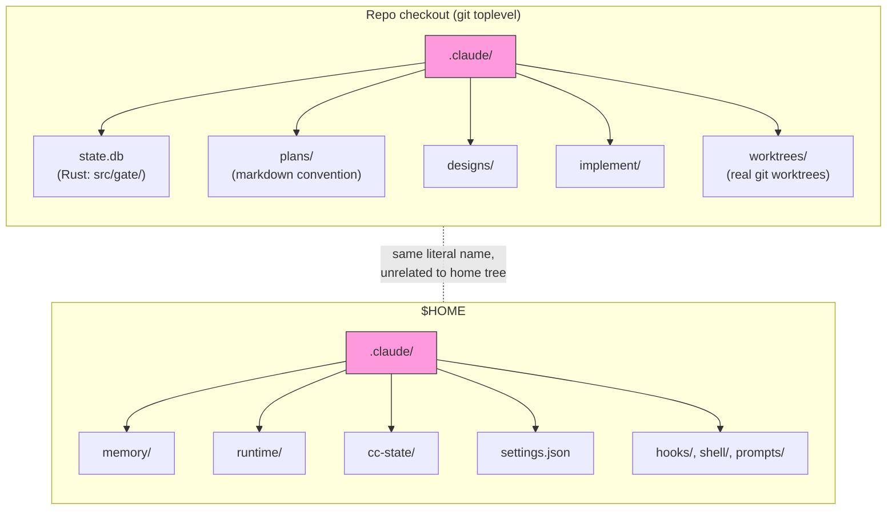
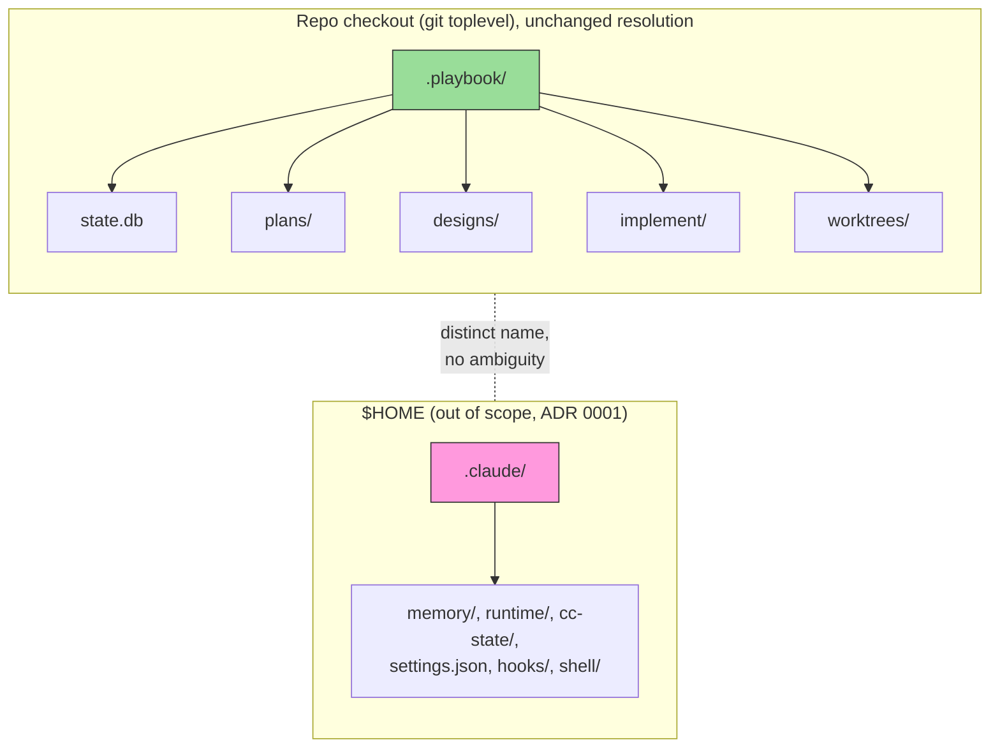
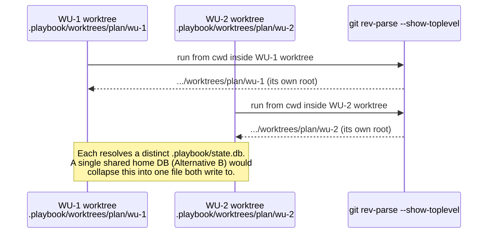

# ADR-0010: Agent-Agnostic Repo-Local Storage

- **Status:** Superseded by ADR-0012
- **Date created:** 2026-08-30
- **Date modified:** 2026-09-03

## Context

The maintainer raised, in the same session that shipped the gate check DB
(`gate-check-db-shipped`, 2026-08-30), that this tool's Claude-Code-specific
config and metadata should become a thin layer, because `playbook` will
support other coding agents (Codex, Cursor, etc.) in the future. The
concrete example floated: move storage from Claude-Code-specific paths
(`.claude/state.db`) to a shared, agent-agnostic location. This ADR covers
the repo-local half of that surface. `~/.claude` (home-level state: memory,
runtime, settings, hooks, shell launchers) is out of scope, see Decision.

**What lives under `.claude/` inside a repo checkout today.** Five stores,
two different ownership models:

1. `.claude/state.db` (the gate check DB). Real Rust code: the path is
   built identically in two places, `src/gate/record.rs:92-94` and
   `src/gate/check.rs:75-77`:
   ```rust
   let repo_root =
       manifest::check::toplevel().ok_or_else(|| "not inside a git repository".to_string())?;
   let db_path = repo_root.join(".claude").join("state.db");
   ```
   `toplevel()` (`src/manifest/check.rs:127-137`) shells out to
   `git rev-parse --show-toplevel`. `open_db` (`src/gate/db.rs:49-54`)
   creates the parent dir and gitignores the file as a side effect, but only
   when the path shape is exactly `<parent>/.claude/state.db`
   (`src/gate/db.rs:125-148`), checked by literal component comparison.

2. `.claude/plans/`, `.claude/designs/`, `.claude/implement/`,
   `.claude/worktrees/`. Markdown-convention only, no Rust code touches
   them. `commands/scope.md:347,355,361` writes `<topic-slug>.md` and
   `-quality.md` under `plans/`; `commands/brainstorm.md:44` and
   `commands/scope.md:83-86` write `designs/`; `commands/implement.md:250,
   259,263` writes per-Work-Unit briefs and progress files under
   `implement/`; `commands/implement.md:241,271` creates real git worktrees
   under `worktrees/`. All four are gitignored the same way
   (`.gitignore:59-62`) and bootstrapped the same way
   (`commands/scope.md:346-347`: `git rev-parse --show-toplevel`, then
   `mkdir -p`).

None of the five is a novel storage domain that needs inventing. All five
already resolve their root the same way (git toplevel from cwd), already
gitignore themselves the same way, and are already conceptually one thing:
playbook's own scratch state for one repo checkout. The only thing tying
them to Claude Code is the literal directory name, `.claude`.

**`plan_slug` has no validation and is unique today only by accident of
where the DB lives.** `src/lib.rs:154-161` takes it as a raw CLI string;
`src/main.rs` passes it through untouched into `gate::record::run`
(`src/gate/record.rs:86`) and the SQL bind (`src/gate/db.rs:77-93`). No
length check, charset check, or normalization exists anywhere in `src`. Its
only real-world derivation rule is a markdown convention: kebab-case the
topic the human typed (`commands/scope.md:361`). The write is a blind
upsert:
```rust
conn.execute(
    "INSERT OR REPLACE INTO gate_phases \
     (plan_slug, phase, verdict, evidence, command, recorded_at) \
     VALUES (?1, ?2, ?3, ?4, ?5, ?6)",
```
(`src/gate/db.rs:86-91`), keyed on `(plan_slug, phase)` alone
(`src/gate/db.rs:26-34`). Today this is safe purely because the DB file
itself is per-repo-checkout.

**That per-repo isolation is actually per-worktree, verified empirically.**
`git rev-parse --show-toplevel` returns the linked worktree's own root, not
the main checkout's root, when run from inside a linked worktree:
```
$ git -C /tmp/main-repo rev-parse --show-toplevel
/tmp/main-repo
$ git -C /tmp/wt-a rev-parse --show-toplevel
/tmp/wt-a
```
(confirmed live, 2026-08-30, on a scratch repo with one linked worktree).
`/playbook:implement` already runs concurrent Work Units in separate
worktrees under `.claude/worktrees/<plan-slug>/<wu-id>/`
(`commands/implement.md:241,271`); each one gets its own `.claude/state.db`
for free today, with zero collision risk between them, because each
worktree has a distinct git toplevel.

**No prior ADR covers any of this.** Zero hits for `state.db`, `gate
record`, `gate_phases`, or `rusqlite` across `docs/adr/`. The nearest
relevant prior decision is ADR 0001, which pins `~/.claude/memory` and
`~/.claude/runtime` by absolute path with an explicit constraint:
> Runtime and memory stay under `~/.claude` by absolute path. Do not
> rewrite those to the plugin root, since `learn-project` and the
> statusline read `~/.claude/memory`.
(`docs/adr/0001-package-toolkit-as-plugin.md:76`). That constraint is about
`~/.claude`, the home-level tree, not the repo-local one this ADR covers,
so it does not block this decision, but it does mean any future ADR that
wants to touch `~/.claude` needs to explicitly amend it.

**No dependency for home/XDG path resolution exists today**, and none is
needed by the decision below: `Cargo.toml:10-14` lists four direct
dependencies (`clap`, `rusqlite`, `serde`, `serde_json`), every version
pinned with `=`, with `cargo audit` in CI (`.github/workflows/rust-ci.yml:
83-86`). The one existing home-dir helper,
`std::env::home_dir()` wrapped at `src/common/session.rs:24-26`, exists
specifically because two other call sites (`src/cc/mod.rs:31`,
`src/hooks/rm_workspace_guard.rs:80`) do the thing its own doc comment says
not to do. This ADR's decision does not touch home-dir resolution at all.

## Decision Drivers

- The maintainer's stated goal is a "thin Claude-Code-specific layer", i.e.
  not being branded to Claude Code, not necessarily "visible across every
  repo on the machine." (session context, 2026-08-30)
- `plan_slug` has zero built-in scoping (`src/lib.rs:154-161`,
  `src/gate/db.rs:86-91`) and is safe today only because storage is
  per-repo-checkout, verified to actually be per-worktree
  (`git rev-parse --show-toplevel` differs per linked worktree).
- `/playbook:implement` runs concurrent Work Units in separate worktrees
  (`commands/implement.md:241,271`) and depends on each one's state being
  independent.
- Four of the five stores (`plans/`, `designs/`, `implement/`,
  `worktrees/`) hold real content a developer may want to keep (planning
  documents, quality reports, WU briefs), unlike `state.db`'s
  re-derivable verdicts, so any move needs a migration story for those
  four, not just a "start fresh" story for the DB (`commands/scope.md:
  347,355,361`, `commands/implement.md:250,259,263`).
- No new direct dependency should be added for this if the existing
  resolution mechanism (git toplevel) already satisfies the actual goal
  (`Cargo.toml:10-14`, pinned versions, `cargo audit` gate).

## Considered Alternatives

### A. Status quo: keep `.claude/`-nested repo-local storage as-is (effort: S)

- Do nothing. `state.db`, `plans/`, `designs/`, `implement/`, `worktrees/`
  stay under `.claude/`.
- Trade-offs: zero engineering cost. Does not address the stated goal at
  all: a future Codex or Cursor integration either adopts the
  Claude-Code-branded `.claude/` convention (confusing, actively
  misleading about what owns the data) or invents a second, parallel
  convention, guaranteeing drift between the two.

### B. Move all five stores to a single shared home location, e.g. `~/.config/playbook/` (effort: L)

- The literal idea floated in the session that raised this: `state.db`,
  `plans/`, `designs/`, `implement/`, `worktrees/` all move to one
  location under the user's home directory, shared across every repo
  checkout on the machine.
- Trade-offs: solves the naming problem. But it destroys the free
  per-repo, per-worktree isolation the current git-toplevel resolution
  provides (verified above): every repo, and every concurrent WU
  worktree, would write into the same files. Reintroduces the
  `plan_slug` collision risk repo-wide, and worse, worktree-wide, with no
  built-in mitigation; real scoping (at minimum `repo_slug`, and likely a
  worktree-identity component too) would need to be added as a
  co-requisite, not a follow-up, or the gate DB silently produces
  cross-repo and cross-worktree false PASS verdicts via its
  `INSERT OR REPLACE` (`src/gate/db.rs:86-91`). The DB's own busy-timeout
  tuning (`src/gate/db.rs:59-65`, sized for "two `gate record` processes
  in one repo") would need re-tuning for "every concurrent playbook
  invocation on the machine." Needs a real migration story for `plans/`,
  `designs/`, `implement/` content across every existing repo checkout on
  disk, not just the current one.

### C. Rename repo-local storage to an agent-agnostic name, keep it repo-local (effort: M) — chosen

- `state.db`, `plans/`, `designs/`, `implement/`, `worktrees/` move from
  `.claude/<name>` to `.playbook/<name>`, at the same git-toplevel-resolved
  root, with the same gitignore convention, generalized off the new
  directory name instead of the literal `.claude` check.
- Trade-offs: solves the actual stated problem (the directory name says
  "Claude Code", not "any repo-local playbook data") without inheriting
  Alternative B's collision, concurrency, or isolation regressions: no
  change to how the root is resolved, so per-repo and per-worktree
  isolation is preserved exactly as it is today. No new dependency. Needs
  updating 2 Rust path-construction sites, the gitignore shape-check
  function, roughly a dozen markdown path references across
  `commands/scope.md` and `commands/implement.md`, and 3 test fixtures.
  Does not create a single cross-repo-visible location; nothing in the
  current feature set needs one, since every reader of these paths
  (`scope.md`, `implement.md`, `src/gate/`) already runs from inside one
  specific repo checkout.

### D. Move to a per-project-scoped subdirectory under a shared home location, e.g. `~/.config/playbook/<repo_slug>/` (effort: XL)

- Combines Alternative B's shared home location with real scoping via
  `common::repo::repo_slug()` (already exists, `src/common/repo.rs:21-32`,
  returns `<owner>/<repo>`, the same key `~/.claude/memory/<owner>/<repo>/`
  already uses) to avoid the cross-repo collision.
- Trade-offs: solves naming and cross-repo collision. Still destroys the
  free per-worktree isolation unless a further worktree-identity component
  is layered onto the path, compounding the design (`repo_slug` alone is
  not enough: two worktrees of the same repo share one `repo_slug`).
  Needs an expanded home-dir resolution helper, a decision on
  `XDG_CONFIG_HOME` support (`src/hooks/session_init.rs:140-141` is the
  only existing XDG read today, and it is `XDG_CACHE_HOME`, not
  `XDG_CONFIG_HOME`), and the same `plans/`/`designs/`/`implement/`
  migration story as Alternative B. Solves a problem, cross-repo/
  cross-worktree visibility of plans, nothing in the current feature set
  needs.

## Decision

**Alternative C**: rename the five repo-local stores from `.claude/<name>`
to `.playbook/<name>`, at the same git-toplevel-resolved location, with the
same resolution mechanism and gitignore convention generalized to the new
name.

Alternative A is rejected: it does not move toward the maintainer's stated
direction at all.

Alternative B is rejected: it is the literal idea as originally floated,
but investigation surfaced two risks the floating did not anticipate, the
`plan_slug` collision (safe today only by accident of repo-local storage)
and the free per-worktree isolation the current resolution mechanism
provides (verified empirically, not assumed). Both would need to be solved
as new work, not inherited for free, and B does not actually need to solve
either to satisfy the stated goal.

Alternative D is rejected as solving a problem nothing today needs
(cross-repo/cross-worktree plan visibility), at XL effort, including a real
data-migration story for meaningful content (`plans/`, `designs/`) that a
same-machine rename does not require.

**`~/.claude` (home-level state: memory, runtime, `cc-state`, `settings.
json`, hooks, shell launchers) is explicitly out of scope for this ADR.**
ADR 0001 already pins those paths by absolute path with an explicit
"do not move" constraint (`docs/adr/0001-package-toolkit-as-plugin.md:76`).
Revisiting that is a separate, larger decision with a different and much
larger set of readers (`statusline.sh`, `/playbook:learn-project`, every
hook), and amending ADR 0001 is not something this ADR does implicitly by
touching a different, repo-local tree.

**Superseded by ADR 0012.** [ADR 0012: Unify state under `~/.config/playbook/`](0012-unify-state-under-config-playbook.md) is that separate, larger decision: it amends ADR 0001's home-level constraint and supersedes this ADR's Decision, moving repo-local storage from the `.playbook/<name>` rename chosen here to `$HOME/.config/playbook/repos/<owner>/<repo>/<worktree-id>/`, unified with the home-level stores. This ADR's own investigation (the worktree-isolation evidence, the `plan_slug` collision risk, the rejection of Alternatives B and D) remains valid and is inherited directly by ADR 0012, not redone.

## Consequences

- **Positive:** repo-local playbook data is agent-agnostic in name; a
  future Codex or Cursor integration can reuse the same repo-local
  convention without inheriting Claude-Code branding. Zero new
  dependencies. Zero new correctness risk: the git-toplevel resolution,
  the per-worktree isolation, and the gitignore-on-first-write behavior
  all carry over unchanged, just renamed.
- **Negative:** does not create a single location for a hypothetical
  future "list all my plans across every repo" feature; if that is ever
  wanted, it is a separate, later decision. Every consumer of the old
  `.claude/{state.db,plans,designs,implement,worktrees}` paths must be
  updated in lockstep (2 Rust path-construction sites, the gitignore
  shape-check function, roughly a dozen markdown references, 3 test
  fixtures) or the tool silently stops seeing its own historical plans on
  an existing checkout.
- **Follow-up, explicitly deferred, not folded into this ADR's blueprint:**
  (1) whether/when to revisit `~/.claude` home-level storage, which needs
  its own ADR amending 0001; (2) the Docker/Podman base image backlog item
  raised in the same session, unrelated to this decision
  (`backlog-thin-claude-layer-multi-agent-config`).

## Architecture Diagrams

### Current state



### Proposed state



### Worktree isolation (the evidence behind rejecting Alternative B)


