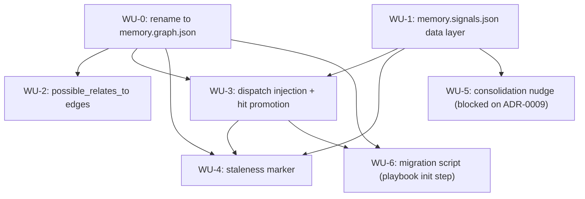

# ADR-0011 Execution Blueprint

- **Parent ADR:** docs/adr/0011-memory-signals-usage-staleness-similarity-and-consolidation.md

## System Snapshot

- `src/hooks/rebuild_memory_graph.rs:424-450`: owns `memory.graph.json` (renamed from `graph.json` in WU-0). `Graph { nodes, edges }`, `Node { id, file, scope, type, name?, description?, project? }`, `Edge { from, to, relation }`. Full rebuild from markdown source every save, atomic write, mkdir advisory lock.
- `src/hooks/mod.rs:16-45`: `pub mod` declarations plus a `HookName` enum matched in `dispatch()`. Each hook is a `playbook hook <name>` subcommand. Adding a hook means a new enum variant, a new match arm, and a new module.
- `src/main.rs:15-23`: `Command::Hook { name }` reads stdin/`HOOK_INPUT`, parses a `Payload`, calls `hooks::dispatch(name, &payload)`.
- Live `~/.claude/settings.json` hook wiring (confirmed this session): `PreToolUse` entries use a `matcher` (`"Bash"`, `"Read"`) plus a `hooks` array of `{"type": "command", "command": "playbook hook <name>"}`. `PostToolUse` uses `"Edit|Write|NotebookEdit"`. No shipped matcher targets the `Agent` tool yet, but a live probe against this exact file (added, validated, triggered, reverted, this session) confirmed `matcher: "Agent"` fires on `PreToolUse`, `tool_name` is literally `"Agent"`, `tool_input` carries `subagent_type`/`prompt`/`description`, and `hookSpecificOutput.additionalContext` from that matcher reaches the orchestrating session's own context, the same delivery path the existing `memory-anchors` hook already uses for `Edit|Write`. WU-3's mechanism is confirmed working, not assumed.
- `src/hooks/session_init.rs`: SessionStart, reads the graph for the capped slice (`MEMORY_BODY_CAP_CHARS`).
- `src/hooks/memory_anchors.rs`: PreToolUse-on-Edit/Write and UserPromptSubmit, anchor-keyed matching.
- `src/hooks/memory_capture.rs`: Stop hook, threshold-crossing nudge.
- Tests: `tests/hooks_graph_writer.rs`, `tests/hooks_graph_reader.rs`, `tests/hooks_session.rs` exist today (confirmed via `ls tests/`). `memory_capture.rs`'s own test file was not grepped this session; confirm its name before WU-5.
- `src/init/run.rs:145-173`: `run(paths: &InitPaths) -> InitOutcome` composes 5 idempotent, independent steps (`settings`, `hooks`, `shim`, `statusline`, `system-prompt`), each a function returning a `StepReport { name, status: Wired|AlreadyCorrect|Skipped|Failed, detail }`. Backs `Command::Init` (`playbook init`, invoked by `/playbook:setup`). This is the repo's existing mechanism for "bring an already-installed machine up to date with what this version ships," used for settings, hooks, the shell shim, statusline, and the system prompt today. WU-6 adds a sixth step here rather than inventing a new mechanism.
- Shell: `shell/memory-context.sh`, `shell/memory-context.test.sh`, `shell/install-hooks-fire.test.sh` all reference `graph.json` by name today (confirmed via repo-wide grep).
- Docs referencing `graph.json` by name: `commands/learn-project.md`, `docs/concepts/02-memory-system.md`, `docs/guides/03-decisions-and-memory.md`, `docs/internals/01-launcher-and-hooks.md`, `docs/internals/02-model-routing-and-memory.md`, `prompts/SYSTEM_PROMPT.md`.

## Work Units

### WU-0: Rename `graph.json` to `memory.graph.json`
- Requires: nothing
- Goal: every live reference (code, tests, shell, docs) uses the new name and lock filename; `Graph` gains a `version: 1` field, and `Node` gains the optional `pinned` field parsed from frontmatter. Otherwise no behavior change beyond the rename. Migrating an existing old file on disk is WU-6, not this WU.
- Files:
  - `src/hooks/rebuild_memory_graph.rs`: edit, output filename constant, lock filename, add `version` field to `Graph`, and add an optional `pinned: Option<bool>` field to `Node`, parsed from a new optional `pinned: true` frontmatter key. This is the manual override for gap 1 (see WU-3): a human or model can flag a fact for unconditional injection immediately, without waiting on the hit counter, the cheap fix for the one fact already known to need this today.
  - `tests/hooks_graph_writer.rs`, `tests/hooks_graph_reader.rs`: edit, expected filename and `version` assertion
  - `src/hooks/memory_anchors.rs`, `src/hooks/session_init.rs`: edit, filename read
  - `shell/memory-context.sh`, `shell/memory-context.test.sh`, `shell/install-hooks-fire.test.sh`: edit, filename references
  - `commands/learn-project.md`, `docs/concepts/02-memory-system.md`, `docs/guides/03-decisions-and-memory.md`, `docs/internals/01-launcher-and-hooks.md`, `docs/internals/02-model-routing-and-memory.md`, `prompts/SYSTEM_PROMPT.md`: edit, filename references
- Verification: `cargo build && cargo test --test hooks_graph_writer && cargo test --test hooks_graph_reader && bash shell/memory-context.test.sh`
- Tests: extend the existing round-trip test in `hooks_graph_writer.rs` to assert the output file is `memory.graph.json` and contains `"version":1`; add a fixture fact with `pinned: true` in frontmatter, assert its `Node` carries `"pinned":true`; a fact without the key asserts the field is omitted (`skip_serializing_if`), not written as `false`
- Done When:
  - [ ] no live code, test, or shell file references the bare old filename (docs describing the historical name, e.g. this ADR's Context section, are out of scope)
  - [ ] full listed verification suite is green

### WU-1: `memory.signals.json` data layer
- Requires: nothing (parallel with WU-0, disjoint files)
- Goal: a new module owns `memory.signals.json`'s read/modify/write cycle with its own mkdir advisory lock. No consumer wired yet.
- Files:
  - `src/hooks/memory_signals.rs`: new. `SignalsStore { version, cursor: Cursor, nodes: HashMap<String, NodeSignals> }`, `NodeSignals { hits, window_start, promoted, verified_hash?, verified_at? }`, atomic write plus `memory.signals.json.lock`, mirroring `rebuild_memory_graph.rs`'s `write_graph_atomically`
  - `src/hooks/mod.rs`: edit, `pub mod memory_signals;`
  - `tests/hooks_signals.rs`: new
- Verification: `cargo build && cargo test --test hooks_signals`
- Tests: TDD, write `hooks_signals.rs` first: round-trip read/write; missing file returns a default empty store; two concurrent writers under normal contention both land, mirroring `tests/hooks_graph_writer.rs:1177-1210`'s `concurrent_rebuilds_from_two_sessions_both_survive` (two `std::thread::spawn` writers, each bumping a distinct node's hit counter, both joined, then assert the final `SignalsStore` contains both distinct bumps). A third scenario for the lock-exhausted path (`with_dir_lock`, `src/common/atomic.rs:37-52`, is deliberately fail-open, it proceeds even when the lock isn't acquired): force `acquire_dir_lock` to fail (pre-create the lock directory and never remove it), assert the write still completes without panicking or corrupting the file (valid JSON, readable), not that the increment survives, an increment can legitimately be lost under exhausted retries, and that is the accepted, documented behavior, not a bug to hide with a flakier test
- Done When:
  - [ ] round-trip and normal-contention concurrent-write tests pass
  - [ ] the lock-exhausted path completes without panicking or corrupting the file; a lost increment there is accepted, not asserted against
  - [ ] no other file in the repo yet references `memory_signals` (confirms this WU shipped in isolation)

### WU-2: `possible_relates_to` edges (ADR gap 3)
- Requires: WU-0 (same file, must land after the rename)
- Goal: `rebuild_memory_graph.rs`'s existing pass also emits `possible_relates_to` edges between two facts sharing 2 or more of: anchor parent directory, matching type and scope, Jaccard word-overlap over a threshold on fact bodies.
- Files:
  - `src/hooks/rebuild_memory_graph.rs`: edit, add the pairwise signal computation after nodes and edges are built, before write
  - `tests/hooks_graph_writer.rs`: edit, add a fixture pair sharing an anchor directory and type, assert the edge appears with a `signals` list; add a dissimilar pair, assert no edge; assert a fact is never compared against itself
- Verification: `cargo build && cargo test --test hooks_graph_writer`
- Tests: TDD, the three scenarios above, plus two boundary cases: a pair whose Jaccard score lands exactly at the configured threshold (pins whether the comparison is `>=` or `>`), and a pair where at least one fact body is empty (pins that intersection/union both being 0 is handled explicitly, not a divide-by-zero or a false-positive default)
- Done When:
  - [ ] edge appears only when 2+ signals hit
  - [ ] existing edge relations (`anchors`, `relates_to`, `supersedes`, `depends_on`, `contradicts`) are unaffected
  - [ ] full existing `hooks_graph_writer` suite still green

### WU-3: dispatch-time injection and hit-counter promotion (ADR gap 1, C1 + O1)
- Requires: WU-0, WU-1
- Goal: a new PreToolUse hook fires on an Agent-tool call whose `subagent_type` matches a fact, injects that fact's full body, and bumps its hit counter in `memory.signals.json`. `session_init.rs` includes a `promoted` fact unconditionally, counted against the existing `MEMORY_BODY_CAP_CHARS` budget.
- Files:
  - `src/hooks/memory_agent_dispatch.rs`: new, match `subagent_type` against `memory.graph.json` nodes, on match inject body and call `memory_signals::bump_hit`
  - `src/hooks/mod.rs`: edit, new `HookName` variant plus dispatch arm
  - `src/hooks/session_init.rs`: edit, include a fact unconditionally, within the existing cap, when either `memory.graph.json`'s `Node.pinned == Some(true)` (the manual override, WU-0) or `memory.signals.json`'s `NodeSignals.promoted == true` (the automatic path)
  - Settings hook seed (exact generator file to confirm at implementation time, see `src/main.rs`'s `SettingsCommand::Gen`): edit, register the new hook
  - `shell/install-hooks-fire.test.sh`: edit, add a firing assertion
  - `tests/hooks_session.rs`: edit, assert a `promoted` fact appears with zero anchor or prompt match
- Verification: `cargo build && cargo test --test hooks_session && bash shell/install-hooks-fire.test.sh`
- Tests: TDD: hit count below threshold does not promote; hit count crosses threshold within the rolling window promotes and the next `session_init` run includes the fact unconditionally; hits outside an expired window don't count toward the threshold; the hit landing exactly on the threshold value promotes (pins the boundary direction, not just "crosses"); dispatching the same fact twice within one turn before the window advances asserts the resulting count reflects only the intended per-dispatch increments, not a double bump from re-entrant or duplicate hook firing
- Done When:
  - [ ] promotion state is observable in `memory.signals.json`
  - [ ] `session_init.rs` injects a promoted fact with no anchor or prompt match present
  - [ ] a fact with `pinned: true` in frontmatter injects unconditionally with zero hits recorded, independent of the automatic path
  - [ ] `MEMORY_BODY_CAP_CHARS` is still enforced with a promoted fact present
- Mechanism confirmed: see System Snapshot. `matcher: "Agent"` on `PreToolUse` fires, carries `subagent_type`, and its `additionalContext` reaches the orchestrator, empirically verified this session, not assumed.

### WU-4: staleness marker (ADR gap 2, C2 + O2)
- Requires: WU-0, WU-1, WU-3 (sequenced after WU-3 only to avoid both editing `src/hooks/mod.rs` concurrently; no functional dependency on WU-3's content)
- Goal: at the existing anchor-match and prompt-match surfacing points, show a soft, non-blocking staleness marker when the anchor changed after the fact was last touched. `memory.signals.json` is checked first, as an index, before any live recomputation, the same principle C1's hit counter and C4's cursor already follow: query the JSON, don't recompute from source unless the JSON has nothing cached. Same-repo anchors compare `git log` dates only on a cache miss; anchors outside any git-tracked path fall back to `memory.signals.json`'s stored hash and date, which is itself the same cache, just with no live-recompute path available.
- Files:
  - `src/hooks/staleness.rs`: new, `check_staleness(node_id, anchor_path, git_lookup: &impl Fn(&Path) -> Option<DateTime>) -> Staleness`. The git lookup is an injected parameter, a production closure wrapping `Command::new("git")` by default, and a call-counting fake in tests, since a repo-wide grep confirmed every existing git-shelling call in this codebase (`session_init.rs:641`, `memory_anchors.rs:290-291`, `precommit_check.rs:162-163`, `cc/worktree.rs`, `cc/worktree_run.rs:316`, `manifest/check.rs:94,128`) is a bare, non-injected `Command::new("git")`, so without this seam "no second git call" has no way to be observed in a test. First reads `memory.signals.json`'s `verified_at`/`verified_hash` for `node_id`; a fresh cached entry (this session, or within a short TTL) short-circuits with no filesystem or git call at all. On a cache miss: the injected lookup for a same-repo anchor, or a content hash for a non-repo anchor, then writes the fresh result back to `memory.signals.json` before returning, so the next surfacing of the same fact is a pure JSON read again. The injected lookup returns `None` for an untracked file, an uncommitted anchor, or a shallow clone with no history for that path, all real cases (a freshly cloned install, a fact added in the same commit as its anchor), not just the already-flagged directory-anchor case. `check_staleness` treats a `None` from the lookup as "no marker," never as stale: the ADR commits to never a new blocking gate, so an unverifiable anchor must not default to a false-positive staleness warning on every fresh install.
  - `src/hooks/memory_anchors.rs`: edit, call the staleness check when rendering a matched fact, append a marker if stale
  - `src/hooks/mod.rs`: edit, `pub mod staleness;`
  - `tests/hooks_staleness.rs`: new
- Verification: `cargo build && cargo test --test hooks_staleness && cargo test --test hooks_graph_reader`
- Tests: TDD, using the call-counting fake git lookup: a fixture repo where the anchor is committed after the fact, asserts stale and the fake's call count is 1 (cache miss path); a second check of the same fact right after asserts the fake's call count is still 1, unchanged, and the cached verdict is returned (cache hit path); both committed at the same point, asserts not stale; a non-repo anchor path, asserts the hash fallback runs and is itself read from `memory.signals.json` first on a repeat check; an untracked or uncommitted anchor (the fake returns `None`), asserts no marker, not a false-positive stale
- Done When:
  - [ ] same-repo staleness detected with zero new fact frontmatter fields
  - [ ] a repeat staleness check for the same fact reads `memory.signals.json` only, no second `git log` call
  - [ ] non-repo anchor falls back to `memory.signals.json`
  - [ ] an unverifiable same-repo anchor (untracked, no history) shows no marker, never a false-positive stale
  - [ ] the marker is additive text only, never blocks retrieval

### WU-5: consolidation nudge (ADR gap 4, C4 + O3)
- Requires: WU-1. **External blocker: do not start until ADR-0009 reaches Accepted, or this WU is explicitly re-scoped against ADR-0009's proposed shape.** Confirmed real, not just scheduling caution: re-read ADR-0009 in full this session, still Status Proposed, no blueprint written. Its chosen Alternative C has `memory_capture.rs` compare the graph file's mtime against a capture-marker's arm time as part of the same Stop-hook reason-text construction this WU also extends. Landing both independently risks two uncoordinated additions to the same block-reason logic, not just a shared file. Not a graph dependency this blueprint can resolve; track separately.
- Goal: `memory_capture.rs`'s existing Stop-hook nudge also mentions consolidation candidates (superseded chains, oversized facts) once the store crosses a size threshold, using `memory.signals.json`'s cursor to scan only what changed since the last pass.
- Files:
  - `src/hooks/memory_capture.rs`: edit, add the consolidation-candidate scan, gated by cursor and size threshold
  - `src/hooks/memory_signals.rs`: edit, cursor read/advance helpers if not already generic from WU-1
  - `tests/hooks_turn.rs`: edit, confirmed via repo-wide grep to be `memory_capture.rs`'s actual existing coverage (a broader turn-lifecycle test file, not a dedicated `hooks_capture.rs`); add the consolidation-mention scenarios here
- Verification: `cargo build && cargo test --test hooks_turn`
- Tests: TDD: store below threshold, no consolidation mention; above threshold with facts touched since the cursor, mention appears; cursor advances after a full pass; the store size landing exactly on the threshold, asserted explicitly (inclusive or exclusive), the same boundary class as WU-3's hit-counter fix, to add when this WU unblocks
- Done When:
  - [ ] nudge text unchanged below threshold
  - [ ] mention appears only for facts touched since the last cursor position
  - [ ] the hook still never blocks the turn from ending

### WU-6: `graph.json` to `memory.graph.json` migration script
- Requires: WU-0, WU-3 (shares `session_init.rs` with WU-3's edits, sequenced to avoid a concurrent-edit conflict, same reasoning as WU-4)
- Goal: a dedicated, idempotent migration step, the "internal script" this repo already has a mechanism for: `playbook init`'s existing 5-step `run()` (`src/init/run.rs`), invoked by `/playbook:setup` after installing a new version, the same way settings, hooks, the shell shim, statusline, and the system prompt are all kept in sync today. A minimal defensive fallback in `session_init.rs` covers the gap where SessionStart fires before the user re-runs `/playbook:setup` after an auto-update, so a fresh session right after upgrading doesn't read an apparently-empty store.
- Files:
  - `src/init/memory_migrate.rs`: new, `migrate_memory_store(claude_home: &Path) -> StepReport`, same shape as the other 5 init steps. `Wired` when `graph.json` exists and `memory.graph.json` doesn't (renames the file and its `.lock` sibling if present). `AlreadyCorrect` when `memory.graph.json` already exists (old file, if also present, is left untouched). `Skipped` when neither exists.
  - `src/init/run.rs`: edit, add the migration step to `run()`'s `steps` vec, same pattern as `seed_or_merge_settings`/`wire_hooks`/etc. It touches neither `settings.json` nor `.hooks`, so it has no ordering dependency on the other 5 steps; note that in the module doc comment alongside the existing ordering rationale.
  - `src/hooks/session_init.rs`: edit, a minimal defensive fallback only (the same rename-if-exists check, inline, no new module), for a session that starts before the user re-runs `/playbook:setup`
  - `tests/init_memory_migrate.rs`: new, matching this repo's existing `init_<module>.rs` convention (`init_merge.rs`, `init_wire.rs`, `init_shim.rs`, `init_system_prompt.rs` all confirmed present in `tests/`). Fixture with only the old filename present asserts `Wired` with content and lock file preserved; both absent asserts `Skipped`; new file already present asserts `AlreadyCorrect` and the old file untouched.
  - `tests/init_run.rs`: edit, confirmed to already exist, add an assertion that the migration step appears in `run()`'s reported steps
  - `tests/hooks_graph_reader.rs`: edit, add a case for `session_init.rs`'s fallback path
- Verification: `cargo build && cargo test --test init_memory_migrate && cargo test --test init_run && cargo test --test hooks_graph_reader`
- Tests: TDD, the three `migrate_memory_store` scenarios above, plus one confirming `session_init.rs`'s fallback independently covers the same old-present/new-absent case; each scenario gets its own uniquely tagged scratch directory (`scratch_home(tag)`, matching `tests/init_run.rs:69`, functionally the same per-tag isolation `tests/init_merge.rs:58-66`'s `scratch_dir(tag)` uses under a different name), not a shared fixture directory (idempotency tests are exactly the shape where reused state silently leaks between cases)
- Done When:
  - [ ] `playbook init`'s report output includes the migration step, in the same rendered format as the other 5 (`memory-migrate: wired - ...`)
  - [ ] a fresh checkout with only the old `graph.json` migrates cleanly via `playbook init`, no data loss
  - [ ] a session that starts before `playbook init` is re-run after an upgrade still sees the store, via `session_init.rs`'s fallback
  - [ ] both paths are idempotent on repeated runs

## Ordering

| WU | Requires | Parallel group |
|---|---|---|
| WU-0 | none | P1 |
| WU-1 | none | P1 |
| WU-2 | WU-0 | none |
| WU-3 | WU-0, WU-1 | none |
| WU-4 | WU-0, WU-1, WU-3 | none |
| WU-5 | WU-1 (+ external: ADR-0009 Accepted) | none |
| WU-6 | WU-0, WU-3 | none |

## Parallel Groups

- P1 (no dependencies): WU-0 and WU-1. WU-0 only touches existing files it already owns (`rebuild_memory_graph.rs` and its own tests, shell, docs); WU-1 only creates new files (`memory_signals.rs`, `tests/hooks_signals.rs`) plus a single-line addition to `mod.rs` that WU-0 never touches. Disjoint, safe to run concurrently.
- Sequential otherwise: WU-2 shares `rebuild_memory_graph.rs` with WU-0. WU-3 and WU-4 both edit `src/hooks/mod.rs` (a new `HookName` variant versus a new `pub mod` line); kept sequential rather than claimed as parallel-safe, since the rule here is disjoint files, not low conflict odds. WU-6 shares `session_init.rs` with WU-3's edits. WU-5 is held on an external ADR, not scheduled relative to the others at all until that clears.

## Dependency Graph

## Confidence + open items

- Confidence: HIGH on WU-0, WU-1, WU-2, WU-3, all now grounded against real, directly-verified system behavior this session (`rebuild_memory_graph.rs`'s struct and rebuild contract, `mod.rs`'s dispatch pattern, and a live empirical probe proving the `Agent` matcher, `subagent_type` field, and `additionalContext` delivery path WU-3 depends on). MEDIUM on WU-4 and WU-6, mechanisms are clear but untested against edge cases (directory anchors, upgrade-path fixtures). MEDIUM on WU-5, mechanism is clear but genuinely blocked on ADR-0009, confirmed by re-reading it this session, not just flagged on suspicion.
- Open items (verify downstream):
  - Locate the exact file that generates the shipped `settings.json` hook seed and confirm the registration path before WU-3 (the probe validated the mechanism against the live personal settings file, not the repo's shipped template).
  - WU-5 cannot start until ADR-0009's status changes from Proposed; track that separately from this blueprint's own progress.
  - `git log`'s behavior against a directory-shaped anchor (`anchors: - src/auth/`), not just a file anchor, is still unverified; needed before WU-4.
