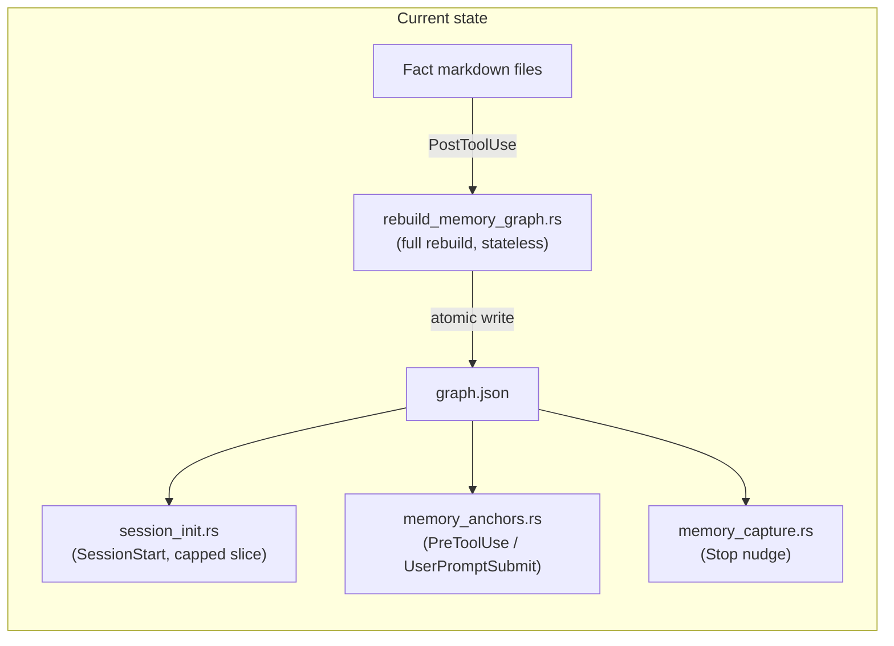
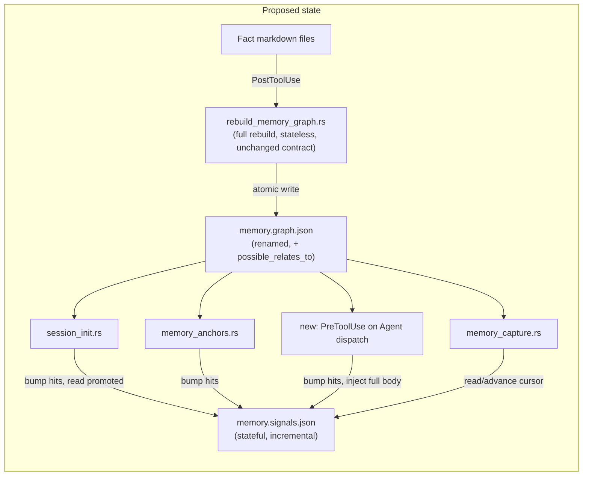
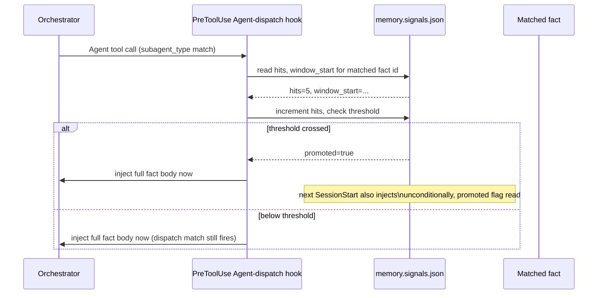

# ADR-0011: Memory Signals: Usage Promotion, Staleness, Similarity Edges, and Consolidation

- **Status:** Accepted
- **Date created:** 2026-08-27
- **Date modified:** 2026-08-28

## Context

This repo's memory system already has three ADRs behind it. ADR-0004 made `graph.json` the retrieval path with anchor-keyed lookup. ADR-0008 added a bounded SessionStart slice (`MEMORY_BODY_CAP_CHARS`, `src/hooks/session_init.rs`) plus prompt-time recall, and explicitly rejected a ranking model. ADR-0009 (Proposed) redesigns `src/hooks/memory_capture.rs`'s Stop-hook nudge around a mtime-versus-marker comparison, and explicitly rejected uncapped blocking.

A single session against this repo hit four gaps in that system, each with a concrete instance:

1. A high-cost gotcha (`subagent-results-lost-not-hung`, this project's own memory store) was rediscovered five-plus times across sessions despite anchor and prompt matching already surfacing it when those paths happen to fire. Nothing distinguishes a fact that keeps recurring from one that doesn't.
2. `statusline-install-and-doctor-gap.md`'s premise was invalidated mid-session by a later change in the same implementation run, corrected only because it was noticed by hand.
3. `output-styles/concise-direct.md` and `skills/writing-style/SKILL.md` turned out to share roughly 85% of the same content, discovered only by reading both files in full. No `relates_to` edge existed between them, and nothing suggested one should.
4. `subagent-results-lost-not-hung.md` has accumulated corrections from at least five separate incidents in its body, with no periodic pass to fold or split it.

`src/hooks/rebuild_memory_graph.rs:424-450` defines the current shape: `Graph { nodes: Vec<Node>, edges: Vec<Edge> }`, `Node { id, file, scope, type, name?, description?, project? }`, `Edge { from, to, relation }`. The doc comment at line 7 states the rebuild is "not incremental": every save triggers a full rebuild from markdown source, written atomically via temp-file-plus-rename, serialized against concurrent rebuilds with a `graph.json.lock` mkdir advisory lock. The live store is 477 nodes, 878 edges, 313KB. 30 files reference `graph.json` by name across hooks, shell, tests, and docs.

None of the four gaps can be closed by data the current rebuild can reconstruct. A hit count, a verified-at timestamp, and a consolidation cursor are inherently stateful: they have to survive the next fact save, and the rebuild's whole contract is to not carry state across saves.

## Decision Drivers

- `src/hooks/rebuild_memory_graph.rs:7`: the rebuild is documented as "not incremental," a full rebuild from source every save. Any new field that must persist across saves breaks that contract if stored on the same struct the rebuild overwrites.
- `session-slice-is-uncapped-and-outgrew-its-budget.md` (this project's memory store): the SessionStart slice already grew from 8.8KB to 29.3KB uncapped on a legacy fallback path. Any new unconditional-injection mechanism (gap 1) must count against the existing cap, not add a second uncapped channel.
- `prompt-recall-and-handoff-continuity-decision.md` (this project's memory store): dropping SessionStart for pure per-turn retrieval was already rejected twice. A new dispatch-time channel has to add to the existing retrieval paths, not replace one.
- ADR-0009 is Proposed and already redesigns `memory_capture.rs`'s Stop-hook logic. A consolidation trigger that also touches that hook (gap 4) cannot land in parallel against it without coordinating on the same hook's shape.
- `protocortex/liam` (evaluated directly this session): a bitemporal, hybrid-retrieval memory engine with `supersedes` edges, confidence and half-life decay, and Leiden clustering, everything gaps 1 through 4 need natively. Six weeks old, pre-1.0, ships as a separate daemon binary with an optional heavy ML dependency tree, and replaces direct file-level fact editing with opaque MCP calls.

## Considered Alternatives

### Do nothing (effort: S)
- Leave `graph.json` and the four hooks as they are. Anchor and prompt matching stay the only retrieval signals.
- Trade-offs: zero implementation cost, but none of the four gaps close. The subagent-delivery fact keeps getting rediscovered, staleness keeps needing a human to notice, cross-file duplication keeps needing a full manual read, and the store keeps accumulating dated addenda with no consolidation trigger.

### Add the new fields to the existing `graph.json` Node and Edge structs (effort: M)
- Extend `Node` with `hits`, `window_start`, `verified_hash`, `verified_at`, and add `possible_relates_to` as an edge relation, all inside the one file the rebuild already writes.
- Trade-offs: no new file, no new lock, minimal code surface. The real cost is failure-domain mixing, not the merge step alone: a bug in usage tracking (an off-by-one in the hit counter, a bad TTL) would corrupt the same file the deterministic graph relies on. A hit counter stored here also either forces the rebuild to read the previous file and merge specific fields before overwriting, a real addition to a hook whose contract is "regenerate safely, anytime," or resets to zero on the next unrelated fact save anywhere in the store, defeating the counter's purpose. Rejected primarily for the failure-domain mixing; the merge cost alone is a bounded, one-time `HashMap` build, not disqualifying on its own.

### Adopt an external memory engine, `protocortex/liam` or a vector-backed store (effort: XL)
- Replace the markdown-plus-JSON-graph store with LIAM's MCP daemon: `remember`/`recall` tools, bitemporal facts, hybrid BM25/vector/graph retrieval, confidence and half-life ranking, Leiden clustering.
- Trade-offs: gets all four gaps essentially for free, and its mechanisms (`supersedes` on write, usage-weighted ranking, a change cursor) are proven prior art. But it ships as a separate daemon binary plus, for real embeddings, a large ML dependency tree (`fastembed`, `candle`, an ONNX runtime), doubling the plugin's binary-distribution surface on top of the existing Rust hook binary. It stores facts in an opaque SQLite/libSQL file instead of git-tracked markdown, removing direct `Read`/`Edit` access to facts. And it's six weeks old with no release tag, too immature to be a hard dependency for a plugin installed by people other than its author.

### Split into `memory.graph.json` (renamed, unchanged contract) plus a new `memory.signals.json` (chosen, effort: M/L)
- `memory.graph.json` keeps the exact current `Graph`/`Node`/`Edge` shape and rebuild contract, renamed from `graph.json`, with one addition: `possible_relates_to` as a valid `relation`, computed deterministically in the same pass as every other edge, so gap 3 needs no new state at all.
- A new `memory.signals.json`, keyed by node id, holds only what must survive across rebuilds: per-fact hit counts and a promotion flag (gap 1), a verified hash and date for facts anchored outside any git-tracked path (gap 2's fallback case), and a consolidation cursor (gap 4). Written incrementally by the hooks that observe each event (`session_init.rs`, `memory_anchors.rs`, a new PreToolUse-on-Agent-dispatch hook, `memory_capture.rs`), never by the rebuild.
- Gap 2's common case (a fact anchored to a file inside this same git repo) needs no stored state at all: `git log -1 --format=%ad` on the fact file versus the anchor at read time answers "did the anchor change since this fact was last touched" directly.
- Trade-offs: two files and a second lock file instead of one, and a small added read on every session for `memory.signals.json`. In exchange, `rebuild_memory_graph.rs`'s stateless-full-rebuild contract stays completely intact, no existing fact file's frontmatter changes, and the two failure domains stay separate (a bug in usage tracking can't corrupt the deterministic graph, and vice versa).

## Decision

Split the store: rename `graph.json` to `memory.graph.json` (and its lock file to `memory.graph.json.lock`) with its contract unchanged, and add a new `memory.signals.json` for the state that must survive across rebuilds. Rejected the do-nothing option because it closes none of the four gaps. Rejected extending `graph.json`'s own structs because it forces a choice between breaking the rebuild's stateless contract and defeating the counters it would hold. Rejected adopting LIAM because its distribution model (a separate daemon, optional heavy ML dependencies), storage model (opaque database instead of git-tracked markdown), and maturity (six weeks old, pre-1.0) are the wrong fit for a plugin installed by people other than its author, even though its individual mechanisms, `supersedes` on write and a change cursor specifically, validate the direction taken here.

Four consumer features build on this split, independently reviewable and mergeable once it lands, though not all independently schedulable: the execution blueprint sequences WU-4 and WU-6 after WU-3 for file-conflict reasons (both would otherwise edit `src/hooks/mod.rs` or `session_init.rs` at the same time), not functional coupling. Detailed in `.claude/designs/2026-08-27-memory-system-enhancements.md`:

- Gap 1: a new PreToolUse hook on Agent-tool dispatch injects a matched fact's full body at spawn time; `memory.signals.json`'s hit counter auto-promotes a fact to unconditional SessionStart injection once it crosses a threshold within a rolling window, counted against the existing `MEMORY_BODY_CAP_CHARS` cap per Decision Driver 2. This auto-promotion is a deliberate, scoped exception to this project's general preference for human- or model-confirmed changes: the entire point of gap 1 is closing the loop on a pattern nobody noticed in time to flag by hand. A manual `pinned: true` frontmatter override ships alongside it (WU-0 parses it into `Node.pinned`, WU-3 wires `session_init.rs` to check it), so the one fact already known to need this today gets fixed immediately and cheaply, and the automatic path is validated against future, not-yet-discovered cases rather than being asked to carry the sole burden of the one case already in evidence.
- Gap 2: `memory.signals.json` checked first as a cache; only on a miss does a same-repo anchor get a live git-log-date comparison, or a non-repo anchor a fresh hash, with the result written back so the next surfacing is a pure JSON read. Surfaced as a soft marker at existing contact points, never a new blocking gate.
- Gap 3: a zero-dependency local heuristic (shared anchor directory, shared type and scope, Jaccard word-overlap on fact bodies) in `rebuild_memory_graph.rs`'s existing pass writes `possible_relates_to` edges, always model-confirmed before becoming a real `relates_to`.
- Gap 4: `memory_capture.rs`'s existing Stop-hook nudge gains a consolidation mention past a store-size threshold, using `memory.signals.json`'s cursor to evaluate only what changed since the last pass. This gap is sequenced after ADR-0009 ships, or designed against its proposed shape, per Decision Driver 4; it does not land in parallel against the hook ADR-0009 is already redesigning.

**What this ADR fixes versus what stays open.** The hard-to-reverse decision this record makes is the store split itself, `memory.graph.json` plus `memory.signals.json`, unchanged rebuild contract, a cross-cutting file format multiple hooks read. The four gaps' specific mechanism shapes above (O1's promotion threshold and window, O2's cache TTL, gap 3's Jaccard cutoff, O3's cursor granularity) are proposed designs, not locked parameters. Their concrete numbers and final shape are confirmed at `/playbook:scope` time for each Work Unit, per the blueprint's own open items. Treat the bullets above as the intended mechanism, not a commitment to exact constants.

**Cross-cutting principle: the JSON files are checked first, as an index, before anything more expensive.** Gap 1 matches `subagent_type` against `memory.graph.json`'s nodes directly, never scans the markdown store. Gap 2 reads `memory.signals.json`'s cached verdict before ever shelling out to `git log`. Gap 3's `possible_relates_to` edges are computed once at rebuild time and read from `memory.graph.json` thereafter, never recomputed live. Gap 4 reads the cursor before scanning anything. No consumer re-derives from the markdown source when the JSON already has the answer.

## Consequences

- Positive: `rebuild_memory_graph.rs`'s stateless, full-rebuild contract stays intact and auditable exactly as it is today. No existing fact file's frontmatter changes for the common staleness case. A `version` field on both files makes a future schema change detectable by readers instead of silently misparsed. Each of the four consumer features can ship and be evaluated as its own change.
- Negative: two files and two lock files to reason about instead of one. `session_init.rs` and `memory_anchors.rs` each gain a second file read per session. `memory.signals.json` needs its own concurrency-safe write path, reusing the existing `with_dir_lock` pattern rather than inventing a new one.
- Follow-up: the first run after upgrade finds an old `graph.json` and no `memory.graph.json`; the migration behavior (rename-if-exists versus rebuild-fresh-and-orphan-cleanup) is deferred to the execution blueprint. Gap 4's implementation is blocked on ADR-0009's status.
- Accepted risk: `memory.signals.json`'s writer reuses `with_dir_lock` (`src/common/atomic.rs:37-52`), deliberately fail-open by design, a hook proceeds even if the lock isn't acquired. A hit-counter increment can be lost under real contention, for example several `/playbook:deep-review` reviewer-lens subagents dispatching near-simultaneously. This is the same tolerance `memory.graph.json`'s existing lock already accepts. A lost increment delays auto-promotion; it never corrupts the file or blocks a hook. Not a defect to eliminate here, since the underlying primitive's fail-open design is a deliberate choice this ADR inherits rather than overrides.
- Accepted limitation: a session still running the pre-upgrade binary during a version transition expects `graph.json`. If a sibling session's migration (WU-6) has already renamed it, the old session's hooks find their expected file missing until that session itself restarts on the new binary. Not fixed here: the window is narrow and self-resolving, and a real fix (a transitional symlink, or a dual-write period) is disproportionate to how rarely two sessions straddle exactly this upgrade boundary.

## Architecture Diagrams

