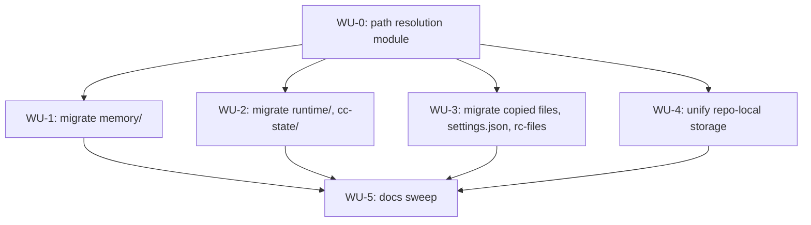

# ADR-0012 Execution Blueprint

- **Parent ADR:** `docs/adr/0012-unify-state-under-config-playbook.md`

## System Snapshot

- `src/common/session.rs:24-43` — today's home-dir/runtime-root helpers: `home_dir()` (wraps `std::env::home_dir()`), `runtime_root()` = `home_dir().join(".claude").join("runtime")`, `session_dir()`/`session_dir_in()`.
- `src/cc/mod.rs:30-32` — a SECOND, independent home-dir helper, `claude_dir()` = `PathBuf::from(std::env::var("HOME")...).join(".claude")`, plus `project_slug()` (`mod.rs:24-28`, trivial non-alphanumeric→`-` slugifier) and `logical_cwd()` (`mod.rs:41-46`, prefers `$PWD` over `current_dir()`).
- `src/common/session.rs:41-44` — `memory_dir()` = `home_dir().join(".claude").join("memory")`, `pub(crate)`, already promoted here by PR #317 (ADR-0009's WU-1, merged during this same session). `src/hooks/rebuild_memory_graph.rs:52,579` already calls this shared version, no longer defines its own.
- `src/common/repo.rs:21-32` — `repo_slug()`, `<owner>/<repo>` from `git remote get-url origin`, vendor-stripped, timeout-bounded, empty string on any failure.
- `src/cc/config_drift.rs:8,21` — `cc-state` keyed by `project_slug(cwd)`.
- `src/gate/record.rs:92-94`, `src/gate/check.rs:75-77` — both build `repo_root.join(".claude").join("state.db")` independently (duplicated construction, not shared).
- `src/gate/db.rs:115-148` — `ensure_state_db_gitignored`, a literal-component shape-check (`file_name == "state.db"`, `parent.file_name() == ".claude"`) that appends `.claude/state.db` to the repo's `.gitignore` the first time. Becomes dead code once `state.db` moves home-level (nothing to gitignore for a path outside the repo).
- `src/init/memory_migrate.rs` — ADR-0011 WU-6's `graph.json` → `memory.graph.json` migration script. Nearest precedent for WU-1 below; read its actual shape before assuming it transfers unchanged (it migrates one file, not a whole subtree with dozens of nested fact files).
- `src/init/{wire.rs,statusline.rs,system_prompt.rs,shim.rs}` — the installer's copy-destination logic for the legacy safety-guard hooks, `statusline.sh`, `SYSTEM_PROMPT.md`, and shell launchers respectively, all currently targeting `~/.claude/*`.
- `src/settings/gen.rs`, `src/settings/check.rs:27` — settings.json generation and the `INSTALL_PREFIXES = ["~/.claude/", "$HOME/.claude/"]` recognized-prefix list used to validate hook command paths.
- Full path inventory (categories A/B/C/D) already gathered this session; re-derive nothing, cite it directly during implementation rather than re-running the same greps.

## Work Units

### WU-0: unified path-resolution module
- Requires: nothing
- Goal: one new module, `src/common/paths.rs`, replacing both existing home-dir helpers. `playbook_root()` = `home_dir().join(".config").join("playbook")` (reuses `session.rs`'s existing `home_dir()` wrapper, the one with the documented symlink/env-var caveat; `cc/mod.rs`'s `claude_dir()` is deleted, callers repointed). Add: `memory_dir()`, `runtime_root()`, `cc_state_dir()` (all flat under `playbook_root()`), `worktree_id() -> String` (new: `project_slug()`'s existing character-class slugifier applied to `git rev-parse --show-toplevel`'s output, NOT raw `$PWD`, so every subdirectory of one worktree resolves identically), `repo_scoped_dir(kind: RepoScope) -> Option<PathBuf>` where `RepoScope::Config` yields `repos/<owner>/<repo>/.config/` and `RepoScope::Worktree` yields `repos/<owner>/<repo>/<worktree-id>/`, both `None` when `repo_slug()` or the git-toplevel lookup fails (never guess a path from a failed git call).
- Files: `src/common/paths.rs` (new, production), `src/common/session.rs` (production: delete the now-superseded `runtime_root()` AND `memory_dir()` (the latter already lives here, promoted by PR #317, and simply moves again into `paths.rs` with its root changed), re-export from `paths.rs`), `src/cc/mod.rs` (production: delete `claude_dir()`, repoint its 1 call site), `src/hooks/rebuild_memory_graph.rs` (production: repoint its 2 `memory_dir()` call sites, `rebuild_memory_graph.rs:52,579`, to `paths::memory_dir()`), `tests/` (new unit tests for `worktree_id()` and `repo_scoped_dir()`, exact file TBD at implementation time, follow the existing `src/common/*.rs` test convention, inline `#[cfg(test)]` modules where that's the established pattern, not a new integration-test file).
- Verification: `cargo build && cargo test paths::`
- Tests (TDD, RED first): `worktree_id_differs_between_two_worktrees_of_the_same_repo` (the exact property ADR-0012's Decision Drivers requires); `worktree_id_stable_regardless_of_cwd_depth_within_one_worktree`; `repo_scoped_dir_none_outside_a_git_repo`; `repo_scoped_dir_none_with_no_origin_remote`; `playbook_root_is_config_playbook_under_home`.
- Done When:
  - [ ] both old home-dir helpers gone, one canonical path module remains
  - [ ] `worktree_id()` proven distinct for two real worktrees of the same repo (integration-style test, actual `git worktree add` in a scratch repo, not a mocked toplevel)
  - [ ] no caller anywhere still does `home_dir().join(".claude")` inline (grep-clean at the end of this WU, even though later WUs are what actually repoint most of them)

### WU-1: migrate `memory/` (durable data, zero-loss required)
- Requires: WU-0
- Goal: on the binary's next run (via `playbook init`, the natural "config work happens here" entry point per `src/init/memory_migrate.rs`'s existing precedent), detect `~/.claude/memory/` present and the new location incomplete, and move the whole subtree: `fs::rename` first (same filesystem, same user home, atomic, cheap), falling back to recursive copy + verify + delete-source only if `rename` fails with a cross-device error (rare for a same-`$HOME` move, but `fs::rename` across a bind mount or an unusual `$HOME` layout is a real failure mode worth handling explicitly rather than silently). Every hook that currently resolves memory paths via `paths::memory_dir()` (already repointed by WU-0) picks up the new root automatically, no further hook changes needed in this WU.
- **"Incomplete" is defined precisely, not left to guesswork**: completion is marked by a sentinel file, `$HOME/.config/playbook/memory/.migration-complete`, written only after the full copy is verified (every source file present at the destination with matching size). Migration runs whenever the sentinel is absent, regardless of whether the destination directory itself is empty, partially populated (a prior run was interrupted), or fully populated but never marked complete. This directly closes the "process killed mid-copy, rerun" gap: a rerun with the sentinel absent always re-verifies and completes the copy, tolerating a partially-populated destination from an earlier interrupted attempt rather than assuming "destination exists" means "destination is done."
- Files: `src/init/memory_migrate.rs` (production: extend or add a sibling migration function, read the existing `graph.json`→`memory.graph.json` migration first to match its idiom rather than inventing a new one), `shell/memory-context.sh` (production: `GRAPH` default path). No hook files need touching in this WU: WU-0 already repointed every consumer to `paths::memory_dir()`.
- **Fail-safe invariant (MUST)**: any error during the move (partial copy, permission denied mid-rename) MUST leave the ORIGINAL `~/.claude/memory/` tree intact and unmodified; only delete the source after the destination is confirmed complete (sentinel written). Never partially migrate and never delete-then-fail.
- Verification: `cargo build && cargo test --test hooks_turn && cargo test memory_migrate::`
- Tests (the failure-injection idiom below already exists in this repo, reuse it rather than inventing a new mechanism, per `tests/init_merge.rs:694-749`'s `crash_mid_write_leaves_the_original_settings_file_intact`, a chmod-based fixture with a root-bypass guard): `migration_moves_global_and_project_facts_byte_identical`; `migration_is_a_noop_when_sentinel_already_present` (idempotent, safe to run every `playbook init`); `migration_leaves_source_untouched_on_simulated_copy_failure` (same chmod idiom as `init_merge.rs:694-749`); `no_migration_needed_when_old_location_never_existed` (fresh install); `migration_resumes_when_destination_partially_populated_and_sentinel_absent` (seed old fully, seed new with a strict subset of files, no sentinel, run migration, assert the full byte-identical set with nothing duplicated or lost); `migration_never_marks_complete_until_resumed_copy_is_verified` (same partial-destination setup, but additionally asserts the sentinel file does not exist at any point before the resumed copy finishes and passes its own verify step, a distinct assertion from the first test: that one proves the END STATE is correct, this one proves the sentinel is never written prematurely mid-resume, the specific invariant a kill-immediately-after-resume-starts scenario depends on).
- Done When:
  - [ ] a scratch `~/.claude/memory/` with global + 2 project scopes migrates with zero data loss, verified byte-for-byte
  - [ ] re-running migration on an already-migrated home (sentinel present) is a no-op, not an error
  - [ ] a partially-populated destination with no sentinel (simulating an interrupted prior run) completes correctly on rerun, not treated as already-done
  - [ ] no remaining `.claude/memory` literal anywhere in `src/` (the hook repoints are WU-0's responsibility, verified there, not re-verified here)

### WU-2: migrate `runtime/` and `cc-state/` (session-scoped, lower stakes)
- Requires: WU-0
- Goal: unlike `memory/`, these hold ephemeral/session-scoped state (telemetry, handoff files, counters, config-drift baselines), not durable facts. No byte-perfect migration needed: new sessions simply start writing at the new location; old `~/.claude/runtime/` and `~/.claude/cc-state/` are left in place (not deleted, since `uninstall.sh`'s preserved list and any in-flight session still mid-write shouldn't be disturbed) and go stale naturally. Every call site that resolves these paths repoints to `paths::runtime_root()`/`paths::cc_state_dir()`.
- Files: `src/common/session.rs`, `src/cc/mod.rs`, `src/cc/config_drift.rs`, `src/hooks/session_clean_exit.rs`, `src/hooks/precompact_warn.rs`, `src/hooks/memory_capture.rs` (its own `runtime`-rooted `capture-due`/`capture-attempts`/`capture-crossings` files), `src/hooks/session_init.rs` (`runtime/handoff`, `runtime/to-learn`), `statusline.sh` (`telemetry_dir`), `shell/shared/config-drift.sh`, `shell/shared/retention.sh`, `shell/shared/dispatch.sh` (`project_dir` for `cc list`, which reads Claude Code's OWN `projects/` tree, stays at `~/.claude/projects/`, do not move, this one call site is Category C not A).
- Verification: `cargo build && cargo test --test hooks_turn --test hooks_session && shell/statusline.test.sh && shell/shared/*.test.sh`
- Tests: extend existing `hooks_turn`/`hooks_session`/`statusline.test.sh`/`launcher.test.sh` suites to assert the new root, rather than writing a parallel test file; each existing test that hardcodes `.claude/runtime` or `.claude/cc-state` in its fixture setup needs updating to `.config/playbook/runtime`/`.config/playbook/cc-state`, a mechanical but repo-wide edit. Named new test: `runtime_and_cc_state_migration_leaves_old_root_untouched` (seed both `~/.claude/{runtime,cc-state}` and the new root with distinct content, perform a session write at the new root, assert the old tree's files are byte-unchanged afterward).
- Done When:
  - [ ] all runtime/cc-state fixtures across the test suite use the new root
  - [ ] `dispatch.sh`'s `project_dir` (Claude Code's own `projects/` tree) is confirmed UNCHANGED, explicitly verified not accidentally moved
  - [ ] `runtime_and_cc_state_migration_leaves_old_root_untouched` passes

### WU-3: migrate the copied-files set + update `settings.json` contents + rc-file lines
- Requires: WU-0
- Goal: `prompts/SYSTEM_PROMPT.md`, `shell/**` launchers, the 3 legacy safety-guard hook scripts, `hooks/lib/config-hash.sh`, `statusline.sh`, `.settings.base.json`, `backups/` all get copied to `$HOME/.config/playbook/` instead of `~/.claude/` on install/update. `settings.json`'s `.hooks.*.hooks[].command` and `.statusLine.command` string values get rewritten to the new paths (playbook edits `settings.json`'s CONTENTS; the file itself stays at its Claude-Code-owned location, per the ADR's explicit out-of-scope line). The installer's rc-file source lines (`.zshrc`/`.bashrc`) get rewritten to source `~/.config/playbook/shell/**` instead of `~/.claude/shell/**`, idempotently (detect and replace the old line, don't duplicate).
- **`INSTALL_PREFIXES` (`src/settings/check.rs:27`) gates CI only, not live user machines**: its only caller, `check_one_command`, is reached exclusively through `playbook settings check` (`src/main.rs:95-105`), run in this repo's own CI (`rust-ci.yml:80`) to validate `settings.shared.json`'s hook paths resolve inside the playbook checkout. It never reads or validates any end user's `~/.claude/settings.json`. Widening it protects repo CI, not a partially-migrated user's machine; that live-machine risk is handled below by ordering, not by this constant.
- **Fail-safe invariant (MUST), same shape as WU-1's**: files copy first and are verified complete BEFORE `settings.json` is rewritten, and `settings.json` is rewritten BEFORE the rc-file line is patched. If the process dies at any point in that sequence, `settings.json` either still points at the fully-intact old `~/.claude/*` files (copy step incomplete) or at a fully-verified-complete new location (copy step done); it must never end up pointing at a partially-copied destination. `commands/doctor.md`'s existing Layer 7 check (`doctor.md:204-242`) is the live-machine detector for a broken result of this sequence; confirm it still catches a settings.json/file-location mismatch after this WU, since that check currently hardcodes the old path.
- Files: `src/init/wire.rs`, `src/init/statusline.rs`, `src/init/system_prompt.rs`, `src/init/shim.rs` (all production: change copy destinations, enforce the copy-then-settings-then-rcfile ordering above), `src/settings/gen.rs` (production: new command path values), `shell/zsh/cc.zsh`, `shell/bash/cc.sh`, `shell/cc.sh` (production: rc-file rewrite logic), `install.sh` (production: `hooks/lib/config-hash.sh`'s unconditional copy destination), `commands/doctor.md` (production: every hardcoded `~/.claude/...` path it inspects, including Layer 7).
- **Migration for existing installs**: a `playbook init` (or a dedicated `playbook migrate` subcommand, decide at implementation time based on which fits the existing CLI surface better) moves the existing copied files, rewrites the existing `settings.json` in place (same backup-before-write convention `src/init/run.rs` already uses for other settings writes), and patches the existing rc-file line, in the order stated above. This is real user-facing surgery on files playbook doesn't fully control the format of (a hand-edited `.zshrc`); err toward "detect our own exact prior line, replace only that" over any fuzzier pattern match.
- Verification: `cargo build && cargo test --test settings_gen && shell/doctor.test.sh`
- Tests: extend `settings_gen.rs`'s existing regression-pin-against-python-oracle style tests for the new command paths; `shell/doctor.test.sh` already covers `.hooks`/`.statusLine.command` shape, extend for the new path; new test for rc-file idempotent rewrite (run twice, assert one line, not two); named end-to-end test `existing_install_migrates_settings_and_rcfile_with_doctor_reporting_no_drift` (seed a full pre-migration `~/.claude` install, run migration, assert copied files, `settings.json` contents, and the rc-file line all land in the new state, and `doctor` reports clean afterward); named ordering test `crash_between_file_copy_and_settings_rewrite_leaves_old_wiring_intact` (reusing the `tests/init_merge.rs:694-749` chmod-based crash-injection idiom, interrupt after copy but before the settings write, assert `settings.json` still points at the fully-functional old location).
- Done When:
  - [ ] fresh install writes everything under `~/.config/playbook/`, `settings.json` command values point there
  - [ ] `existing_install_migrates_settings_and_rcfile_with_doctor_reporting_no_drift` passes
  - [ ] `crash_between_file_copy_and_settings_rewrite_leaves_old_wiring_intact` passes
  - [ ] `doctor.md`'s Layer 7 confirmed to still detect a broken settings/file mismatch after this WU's path changes

### WU-4: unify repo-local storage (`state.db`, `plans/`, `designs/`, `implement/`, `worktrees/`), close the worktree-collision gap
- Requires: WU-0
- Goal: `src/gate/record.rs` and `src/gate/check.rs` both stop building `repo_root.join(".claude").join("state.db")` and instead call `paths::repo_scoped_dir(RepoScope::Worktree)`, erroring clearly (not silently falling back to repo-local) when `repo_slug()` or the worktree-id lookup fails, since a gate DB with no distinguishing key at all is worse than refusing to run. `ensure_state_db_gitignored` (`src/gate/db.rs:115-148`) is DELETED, not repointed: the DB no longer lives inside the repo checkout, so there is nothing to gitignore, and keeping a dead shape-check around invites confusion about whether it still does something. `commands/scope.md`, `commands/implement.md`, `commands/brainstorm.md` repoint their `plans/`, `designs/`, `implement/`, `worktrees/` path references the same way. The `.config/` repo-scoped tier (`RepoScope::Config`) ships with the helper from WU-0 but stays genuinely unpopulated by this WU: no test coverage or Done-When item is owed for it here, since nothing consumes it yet and inventing coverage for zero callers is speculative effort, not verification.
- **Nested worktrees resolved, not left open**: `worktree_id()` (WU-0) is computed from wherever it is invoked, via that location's own `git rev-parse --show-toplevel`, with no notion of ancestry. A WU worktree spawned from inside another WU worktree therefore gets its own distinct `worktree_id` automatically, from its own distinct toplevel path, the same as any other worktree; no special-casing is needed and none is added. This closes the record's own deferred open item.
- **Migration for existing repo checkouts**: lazy, not eager (there is no single moment "every repo on the machine" is visited). The first `gate record`/`gate check`/`/playbook:scope`/`/playbook:implement` invocation inside a given repo checkout, after the binary upgrade, detects a legacy `.claude/state.db` (or `.claude/plans/`, etc.) at that repo's git toplevel and moves it to the new worktree-scoped location before proceeding, exactly once per repo (idempotent: a second invocation finds nothing left to migrate). `.claude/.gitignore`'s now-orphaned `.claude/state.db` entry is left alone (harmless dead gitignore line in the user's repo, not worth an automated edit to someone else's tracked file).
- **Fail-safe invariant (MUST), same shape as WU-1's**: `plans/`/`designs/` hold real planning documents a developer may want to keep, the same tier of care as `memory/`. Any error during this migration MUST leave the original `.claude/{plans,designs,implement,worktrees}` intact; only delete the source after the destination is confirmed complete. `state.db` itself is re-derivable (gate verdicts), so it alone could tolerate a "start fresh" fallback if migration fails, but `plans/`/`designs/`/`implement/` may not, so the whole migration follows the stricter invariant uniformly rather than splitting behavior per-file-type.
- Files: `src/gate/record.rs`, `src/gate/check.rs`, `src/gate/db.rs` (production: delete `ensure_state_db_gitignored` and its call site, add the lazy per-repo migration), `commands/scope.md`, `commands/implement.md`, `commands/brainstorm.md` (production: path references), `tests/cc_worktree.rs` (test infra: `with_isolated_git_env`/`seeded_repo`/`add_worktree`/`git`/`git_ok` at `cc_worktree.rs:1638-1739` are real and do exactly what this WU's collision test needs, but they're plain, non-`pub` functions nested inside the private `mod cleanup_stale_execution`, scoped there by that module's own doc comment; hoist them to file level, or into a shared `pub(crate)` fixtures module, BEFORE writing this WU's new tests, don't assume they're callable as-is from a new test module in the same file), `tests/` (extend the existing `gate` test suite for the remaining tests, exact file TBD at implementation time).
- Verification: `cargo build && cargo test gate:: && cargo test --test cc_worktree`
- Tests: `state_db_resolves_under_the_new_repo_and_worktree_scoped_path`; `two_worktrees_writing_the_same_plan_slug_do_not_clobber_each_others_verdicts` (the real regression test for the collision this WU exists to close: using the hoisted real `git worktree add` harness, call the actual `gate record` path from two distinct worktrees of one scratch repo with an IDENTICAL `plan_slug` but different phase/verdict content in each, then read back both worktrees' `state.db` and assert each contains only its own write, not just that the two file paths differ); `gate_record_errors_when_worktree_scoping_cannot_resolve` (run outside a git repo or with no origin remote, assert a hard, clear `Err`, never a silent repo-local fallback write); `gate_check_errors_when_worktree_scoping_cannot_resolve` (same setup, `gate check` specifically, since it has its own independent path-construction call site at `check.rs:75-77` that could silently diverge from `record.rs`'s fix if only one is tested); `legacy_claude_state_db_migrates_on_first_gate_record_call`; `legacy_migration_is_idempotent_second_call_finds_nothing`; `legacy_migration_leaves_source_untouched_on_simulated_failure` (same chmod idiom as WU-1's `tests/init_merge.rs:694-749` precedent); `legacy_migration_resumes_correctly_after_simulated_kill_mid_copy` (same fail-safe rigor as WU-1's equivalent test: interrupt a legacy `plans/`/`designs/` copy partway, rerun, assert completion with no duplication or loss); `gitignore_shape_check_function_and_call_site_fully_removed` (a grep-based test asserting the function no longer exists, not just that it's unused).
- Done When:
  - [ ] `two_worktrees_writing_the_same_plan_slug_do_not_clobber_each_others_verdicts` proves the collision closed via a real gate-record round trip, not just path distinctness
  - [ ] both `gate_record_errors_when_worktree_scoping_cannot_resolve` and `gate_check_errors_when_worktree_scoping_cannot_resolve` prove no silent fallback exists in either call site
  - [ ] `legacy_migration_resumes_correctly_after_simulated_kill_mid_copy` passes, proving the same resumption safety WU-1 has
  - [ ] a repo with existing `.claude/{state.db,plans,designs,implement,worktrees}` migrates cleanly on next use, verified content-preserving for `plans/`/`designs/`
  - [ ] `ensure_state_db_gitignored` and its call site are gone, confirmed by grep, not just unreferenced

### WU-5: docs sweep
- Requires: WU-1, WU-2, WU-3, WU-4 (documents the shipped shape, not a design done in parallel with it)
- Goal: every `~/.claude/memory`, `~/.claude/runtime`, `.claude/state.db` etc. reference in `docs/concepts/*.md`, `docs/internals/*.md`, `docs/guides/*.md` gets updated to `~/.config/playbook/...`. Also flip `docs/adr/0001-package-toolkit-as-plugin.md`'s stale `Status: Proposed` to `Accepted` while touching this file for the path-constraint amendment anyway (a real, unrelated-but-adjacent doc bug surfaced this session, cheap to fix in the same pass, not worth its own WU).
- Files: `docs/concepts/02-memory-system.md`, `docs/concepts/01-system-prompt.md`, `docs/guides/03-decisions-and-memory.md`, `docs/internals/02-model-routing-and-memory.md`, `docs/internals/01-launcher-and-hooks.md`, `docs/guides/00-install.md`, `docs/guides/01-plan-and-implement.md`, `docs/adr/0001-package-toolkit-as-plugin.md` (Status field only), `docs/adr/0010-agent-agnostic-repo-local-storage.md` (Status field changes to `Superseded by ADR-0012`, plus the supersession cross-reference, per the Decision section's own commitment).
- Verification: `grep -rn '~/.claude/memory\|~/.claude/runtime\|\.claude/state\.db' docs/` returns nothing outside historical/superseded ADR records (0001 through 0011 describe the state of the world AT THE TIME they were written and are not rewritten retroactively, only 0010 gets a forward-pointing cross-reference, not a rewrite).
- Done When:
  - [ ] no live (non-ADR-historical) doc still points at the old paths
  - [ ] ADR-0001's Status field corrected to `Accepted`
  - [ ] ADR-0010's Status field changed to `Superseded by ADR-0012` and its body cross-references this ADR

## Ordering

| WU | Requires | Parallel group |
|---|---|---|
| WU-0 | none | none |
| WU-1 | WU-0 | P1 |
| WU-2 | WU-0 | P1 |
| WU-3 | WU-0 | P1 |
| WU-4 | WU-0 | P1 |
| WU-5 | WU-1, WU-2, WU-3, WU-4 | none |

## Parallel Groups

- P1 (after WU-0): WU-1, WU-2, WU-3, WU-4. Each touches a disjoint set of production files (memory hooks vs. session/cc-state hooks vs. installer/init vs. gate DB) with no shared mutable state between them; all four only share a read-only dependency on WU-0's new `paths` module. Safe for 4 concurrent agents.
- Sequential: WU-0 first (everything else calls its helpers). WU-5 last (documents the shipped shape of WU-1 through WU-4, would need rewriting if drafted against their designs instead of their actual landed behavior).

## Dependency Graph

## Confidence + open items

- Confidence: HIGH. WU-0 through WU-2 are grounded directly in code read this session (`session.rs`, `cc/mod.rs`, `config_drift.rs`, `repo.rs`). WU-3 and WU-4 carry real user-facing migration risk (a hand-edited `.zshrc`, an existing `settings.json`, real planning documents in `plans/`/`designs/`), addressed with the same explicit fail-safe invariant and ordering guarantees WU-1 always had, plus named tests reusing this repo's own existing failure-injection and real-worktree test precedents (`tests/init_merge.rs:694-749`, `tests/cc_worktree.rs:1638-1739`) rather than inventing new test infrastructure. This is the blueprint's third revision, across three gate rounds: iteration 1 (critic + test-reviewer, both FAIL) found 2 HIGH findings (`INSTALL_PREFIXES` protecting the wrong thing; WU-3 missing WU-1's fail-safe invariant), 4 MEDIUM findings (WU-1's undefined "incomplete" detection; WU-4 missing the same fail-safe invariant; the nested-worktree question dropped rather than resolved; the Alternative B rejection reasoning overclaiming "self-defeating" for the repo-local half specifically, corrected in the record), 2 LOW findings (a speculative `.config/` tier scoped out of test-coverage obligations; ADR-0010's Status field not updated), plus 4 test-plan FAILs (missing incomplete-destination and interrupted-migration tests, a collision test that only proved path distinctness not the actual bug fixed, no silent-fallback error test) and 2 WARNs (unnamed tests for committed Done-When items); iteration 2 found one MEDIUM (WU-4's fail-safe invariant text present but unverified by a resumption test to WU-1's own rigor) and, from the test-reviewer, 1 FAIL (`gate check`'s independent error path untested alongside `gate record`'s) plus 2 WARNs (two WU-1 tests reading as undifferentiated duplicates; the `cc_worktree.rs` helper-reuse note not flagging their module privacy); iteration 3 (this revision) passed both phases outright. All findings from every round are addressed above.
- Open items (verify downstream):
  - Whether migration should be a side effect of `playbook init` (matching the ADR-0011 WU-6 precedent) or a new dedicated `playbook migrate` subcommand: `/playbook:implement`'s WU-1 RED step should check whether `playbook init` is already idempotent and safe to run unprompted on every invocation, or whether it has side effects (like resetting settings.json) that make "just run init to migrate" a worse UX than a dedicated command.
  - `fs::rename`'s cross-device fallback path (WU-1) is unverified against any real cross-device `$HOME` layout; if the implementer cannot construct a real cross-device test fixture, this specific fail-safe branch may need to stay a documented, code-reviewed-but-not-integration-tested edge case, flagged explicitly rather than silently under-tested.
