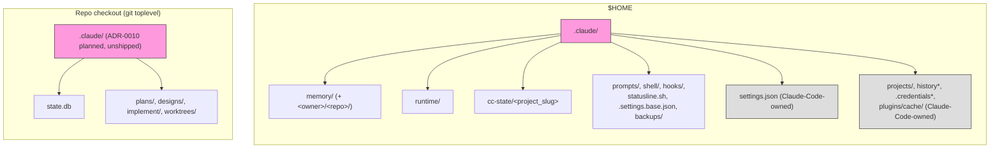
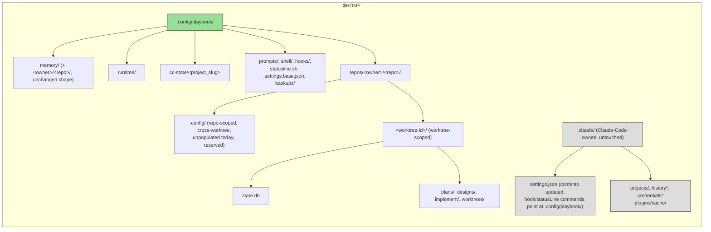

# ADR-0012: Unify Home and Repo-Local State Under `$HOME/.config/playbook/`

- **Status:** Accepted
- **Date created:** 2026-09-03
- **Date modified:** 2026-09-03

## Context

The maintainer's stated goal (this session, 2026-09-03): share the memory store with other coding agents (Cursor, Codex; tracked as a "future nice-to-have" in issue #301). `~/.claude/memory/` is branded to Claude Code by its path alone, and a second agent integration would either adopt that branding (misleading about what owns the data) or invent a second, parallel memory convention, guaranteeing drift.

**ADR-0001 currently blocks this.** It pins the constraint directly: *"Runtime and memory stay under `~/.claude` by absolute path. Do not rewrite those to the plugin root, since `learn-project` and the statusline read `~/.claude/memory`"* (`docs/adr/0001-package-toolkit-as-plugin.md:76`). This ADR amends that constraint.

**ADR-0010 already covers half of this ground, but was never implemented.** It decided (Accepted, 2026-08-30) to rename repo-local `.claude/{state.db,plans,designs,implement,worktrees}` to `.playbook/{...}`, at the same git-toplevel-resolved location. Verified this session: `.playbook` appears nowhere in current source (`grep -rl '\.playbook' src/ commands/ shell/` returns nothing), and `src/gate/record.rs:92-94`, `src/gate/check.rs:75-77`, and `src/gate/db.rs:125-148`'s gitignore shape-check all still hardcode `.claude`. ADR-0010's blueprint exists but its Work Units were never executed. This ADR supersedes ADR-0010's Decision before it ships, rather than migrating repo-local storage twice.

**A full inventory of every `~/.claude` reference** (this session, ~400 matches across ~60 files) splits into four categories:

1. **Playbook-invented, playbook-owned, freely movable**: `memory/` (`src/common/session.rs:37,40,43`), `runtime/` (`src/common/session.rs:28,37,193`, plus every hook that touches session state), `cc-state/` (`src/cc/config_drift.rs:8,21`). Nothing in Claude Code reads or writes these; the only fixed anchor is playbook's own hardcoded `.claude` join.
2. **Playbook-copied files under `~/.claude`, destination is playbook's own choice, but referenced by a Claude-Code-schema field or an rc-file line playbook must keep in sync**: the 3 legacy safety-guard hook scripts and `hooks/lib/config-hash.sh` (referenced from `settings.json`'s `.hooks.*.hooks[].command` string value), `prompts/SYSTEM_PROMPT.md` (referenced via the `--system-prompt-file` CLI flag), `shell/**` launchers (sourced from `.zshrc`/`.bashrc` rc-file lines the installer writes), `statusline.sh` (referenced from `settings.json`'s `.statusLine.command`), `.settings.base.json` and `backups/` (playbook-internal, no external reference).
3. **Claude-Code-owned, fixed by Claude Code's own convention, not movable by playbook**: `settings.json` itself, session transcripts (`projects/`, `history*`), credentials, and the plugin-cache install path (`plugins/cache/<marketplace>/<plugin>/<version>/`, where Claude Code physically installs this toolkit's own skills/commands/agents/hooks.json, resolved at runtime via `${CLAUDE_PLUGIN_ROOT}`).
4. **A related but orthogonal defect, not fixed by this ADR**: `session_init.rs:573-574`'s skills-primer reads `~/.claude/skills`/`~/.claude/commands` directly, which the plugin-install path never populates (already flagged as ADR-0006 finding C1). Worth tracking alongside this move since both touch home-level path assumptions, but this ADR's migration does not change whether that primer finds anything.

**Claude Code has its own relocation mechanism, and it does not solve this.** `CLAUDE_CONFIG_DIR` (documented, `code.claude.com/docs/en/settings.md`) relocates `settings.json`, session history, and plugin installs together, when a user sets it. But it is Claude-Code-specific: Cursor and Codex would never read it, so even if playbook honored it, playbook's own memory store would still be sitting in a Claude-Code-branded (if user-relocated) tree, not a fixed, agent-neutral, well-known location any tool integration could find. This ADR's move is independent of `CLAUDE_CONFIG_DIR` entirely; playbook fully owns both the write side (its own installer) and read side (its own binary/scripts) for everything in categories 1 and 2, regardless of where Claude Code itself is configured to look.

**Two existing, already-load-bearing primitives make the repo-local half safe to unify with the home-level half, if a worktree-collision gap is closed.** `repo_slug()` (`src/common/repo.rs:21-32`) returns the `<owner>/<repo>` slug for `git remote get-url origin`, already vendor-stripped (protocol, host, and `.git` suffix removed by `normalize_remote_url`), and is the exact key `~/.claude/memory/<owner>/<repo>/` already uses for project-scoped facts. `project_slug()` (`src/cc/mod.rs:24-28`) is a trivial slugifier (non-alphanumeric → `-`) already used to key `cc-state/` per project directory. Neither, alone, distinguishes worktrees of the same repo: `git rev-parse --show-toplevel` returns a distinct path per linked worktree (verified empirically in ADR-0010, still true), which is the entire reason today's repo-local `.claude/state.db` gives every concurrent `/playbook:implement` Work-Unit worktree free, automatic isolation with zero code for it. `state.db`'s `plan_slug` has no built-in scoping (`src/lib.rs:154-161`, blind `INSERT OR REPLACE` keyed on `(plan_slug, phase)` alone, `src/gate/db.rs:86-93`) and is safe today purely by accident of that per-worktree file isolation. ADR-0010 already evaluated and rejected collapsing repo-local storage into one shared home location for exactly this reason (its Alternative B and D).

## Decision Drivers

- Cross-agent memory sharing needs a fixed, agent-neutral location; a Claude-Code-relocatable-but-still-branded path (via `CLAUDE_CONFIG_DIR`) does not satisfy this, since other agents don't read that variable.
- ADR-0010's repo-local rename is Accepted but unshipped; doing this now avoids migrating real user data (`state.db`, `plans/`, `designs/`) twice.
- `state.db`'s `plan_slug` has zero built-in scoping and is safe today only by accident of per-worktree file isolation; any unification must add an explicit worktree-identity component or it reintroduces a real correctness bug (cross-worktree false PASS verdicts), not just a naming inconsistency.
- `repo_slug()` and `project_slug()` already exist, are already load-bearing elsewhere, and already produce the exact building blocks (`<owner>/<repo>`, a path slugifier) this decision needs; no new dependency or resolution mechanism should be invented if these already satisfy it.
- Categories 3 (Claude-Code-owned paths) and the CLAUDE_CONFIG_DIR mechanism are out of this ADR's control and orthogonal to its goal; scope must stay to what playbook actually authors and reads (categories 1 and 2, plus the repo-local stores ADR-0010 already scoped).

## Considered Alternatives

### A. Status quo: ship ADR-0010's `.playbook/` rename as originally planned, leave `~/.claude` home-level state alone (effort: S)

- How it works: execute ADR-0010's unexecuted blueprint as-is (repo-local `.claude/` → `.playbook/`); leave `memory/`, `runtime/`, `cc-state/`, and the copied-file set at `~/.claude`.
- Trade-offs: zero new design cost, but does not move toward the stated goal at all. A future Cursor/Codex integration still finds memory under a Claude-Code-branded path. Leaves two inconsistent conventions in place (`.playbook/` repo-local, `.claude/` home-level) with no unifying rationale.

### B. Home-level move only, repo-local stays as ADR-0010 already decided (effort: M)

- How it works: move `memory/`, `runtime/`, `cc-state/`, and the copied-file set to `$HOME/.config/playbook/`, cross-reference the new ADR from ADR-0010, but still execute ADR-0010's original `.playbook/` repo-local rename unchanged.
- Trade-offs: solves the stated cross-agent memory goal without touching `state.db`'s worktree-isolation properties at all, the smallest change that satisfies the actual motivation. Rejected because it leaves two different location conventions for what is conceptually one thing (playbook's own state, home-level vs. repo-local), one of them (`.playbook/`) about to ship for the first time with no XDG grounding, when the home-level half is adopting XDG (`~/.config/`) in the same session. Unifying now, before `.playbook/` ever ships, costs nothing extra over shipping it once under the old scheme and revisiting later.

### C. Fully unify: repo-local and home-level state both move under `$HOME/.config/playbook/`, repo-local split by scope into `repos/<owner>/<repo>/.config/` (repo-scoped) and `repos/<owner>/<repo>/<worktree-id>/` (worktree-scoped) (effort: L) — chosen

- How it works: everything playbook owns (categories 1 and 2, plus ADR-0010's repo-local stores) moves to `$HOME/.config/playbook/`. Global/session-scoped stores (`memory/`, `runtime/`, `cc-state/`, and the copied-file set: `prompts/`, `shell/`, `hooks/`, `.settings.base.json`, `backups/`) sit flat under that root, unchanged in internal shape (`memory/` keeps its own existing `<owner>/<repo>/` project-fact nesting, since a memory fact is valid across every worktree of a repo, not scoped to one). Repo-local state splits by scope, not lumped into one tier: `state.db`, `plans/`, `designs/`, `implement/`, `worktrees/` are all worktree-sensitive today (verified: each gets its own file for free via `git rev-parse --show-toplevel` returning a distinct path per worktree) and move to `$HOME/.config/playbook/repos/<owner>/<repo>/<worktree-id>/`, where `<owner>/<repo>` reuses `repo_slug()` unchanged and `<worktree-id>` is a new component, the slugified absolute output of `git rev-parse --show-toplevel` (reusing `project_slug()`'s existing character-class slugifier, applied to the worktree's own root rather than raw `$PWD`, so every subdirectory within one worktree still resolves to the same id). A sibling `$HOME/.config/playbook/repos/<owner>/<repo>/.config/` tier holds anything genuinely repo-scoped but not worktree-scoped, i.e. config/log/state that should be the same and shared across every worktree of one repo, mirroring the same scope `memory/`'s own `<owner>/<repo>/` nesting already uses. Nothing existing populates this tier yet; it exists so a future repo-level config (not yet designed) has a natural home that doesn't collide with the worktree-scoped tier, rather than being bolted on ad hoc later. This closes exactly the worktree-collision gap ADR-0010's own Alternative D left open, while keeping repo-scoped and worktree-scoped state visibly separate instead of conflating them into one directory shape.
- Trade-offs: solves the stated goal and removes the two-convention inconsistency Alternative B accepts, at real cost: this is a second migration of `state.db`/`plans/`/`designs/`/`implement/`/`worktrees/` layered onto the one Alternative B already required for `memory/`/`runtime/`/`cc-state/`, roughly a dozen more markdown path references (`commands/scope.md`, `commands/implement.md`, `commands/brainstorm.md`) and the gitignore shape-check function (`src/gate/db.rs:125-148`) to update, and two genuinely new primitives (`<worktree-id>`, and the repo-scoped-vs-worktree-scoped split itself) that do not exist in the codebase today and need their own test coverage. The `.config/` tier specifically trades a small amount of up-front structure (one directory nothing populates yet) for not having to retrofit a repo-scoped/worktree-scoped distinction later once something needs it, the same reasoning `memory/`'s existing global-vs-project split already validated. Chosen because ADR-0010's rename has not shipped yet, so "migrate once, correctly" costs less than "ship the old scheme now, redo it later" once decided, and because leaving one convention un-unified when the whole point of this ADR is convention consistency would repeat the exact drift risk ADR-0010 itself was raised to prevent for the Claude-Code-branding problem.

## Decision

Alternative C. It is the only alternative that both satisfies the stated cross-agent-memory goal and removes the naming inconsistency Alternative B would otherwise ship for the first time this session. Alternative A is rejected outright: it does not address the stated goal. Alternative B is rejected because ADR-0010's repo-local rename has not shipped, so unifying now costs a second migration story avoided, not one incurred.

**A real trade-off, not a clean win, on the repo-local half specifically.** The stated goal is cross-agent discoverability, and for repo-local artifacts a naming-consistency argument does not obviously serve that goal better than Alternative B's own repo-local shape would have: a `.playbook/` directory inside the checkout is trivially discoverable to any other agent already working in that directory, no algorithm required, while `$HOME/.config/playbook/repos/<owner>/<repo>/<worktree-id>/` requires every other agent integration to reimplement `repo_slug()`'s exact normalization and this ADR's new `worktree_id()` slugification to find the same data, a real new coordination cost the Decision Drivers otherwise argue against inventing. This ADR accepts that cost anyway, for a narrower reason than "self-defeating": one location convention for everything playbook itself authors is easier for playbook's OWN code and its OWN maintainers to reason about and keep consistent, even though it is not obviously better for a THIRD PARTY agent's discovery story on the repo-local half. The memory-sharing goal is fully served by the home-level half regardless of this choice; the repo-local unification is justified on internal consistency, not on the same cross-agent argument driving the rest of this ADR.

**This ADR supersedes ADR-0010's Decision.** ADR-0010's Alternative C (`.claude/` → `.playbook/`, repo-local only) is superseded by this ADR's Alternative C (`.claude/` and repo-local both → `$HOME/.config/playbook/`, unified, repo-local further split into a repo-scoped `.config/` tier and a worktree-scoped `<worktree-id>/` tier). ADR-0010's own investigation (the worktree-isolation evidence, the `plan_slug` collision risk, the rejection of Alternatives B and D) remains valid and is inherited directly, not redone; only its Decision changes, from "repo-local only, stay repo-local" to "repo-local and home-level both, repo-local nested by repo and split by scope under the same home-level root."

**This ADR amends ADR-0001's constraint** (`docs/adr/0001-package-toolkit-as-plugin.md:76`) from "runtime and memory stay under `~/.claude` by absolute path" to "runtime and memory stay under `$HOME/.config/playbook/` by absolute path," for the same load-bearing reason the original constraint existed (multiple readers depend on the exact path; the constraint moves, it does not disappear).

**Explicitly out of scope**: `~/.claude/settings.json` itself (Claude-Code-owned; playbook edits its contents to point hook/statusline commands at the new location, but does not relocate the file), Claude Code's session transcripts/credentials/plugin-cache install path (entirely Claude-Code-managed, `CLAUDE_CONFIG_DIR` is the user's own lever for these if wanted, orthogonal to this decision), and the `session_init.rs:573-574` skills-primer defect (ADR-0006 finding C1, real but unrelated to where state lives).

## Consequences

- **Positive:** one consistent location convention (`$HOME/.config/playbook/`) for everything playbook itself authors, home-level and repo-local alike. Cross-agent memory sharing becomes structurally possible: any future Cursor/Codex integration reads the same fixed, agent-neutral path. `state.db`'s `plan_slug` collision risk gets closed by an explicit `<worktree-id>` component instead of continuing to rely on accidental file-path isolation.
- **Negative:** every existing user's on-disk `~/.claude/{memory,runtime,cc-state}` and every existing repo checkout's `.claude/{state.db,plans,designs,implement,worktrees}` needs a real migration, not a fresh start; this is a bigger blast radius than ADR-0010's original repo-local-only rename, touching every hook that resolves a home-level path (`src/common/session.rs`, `src/cc/mod.rs`, `src/cc/config_drift.rs`, every `src/hooks/*.rs` that calls `session_dir`/`memory_dir`), `statusline.sh`, `settings.json`'s hook/statusLine command values, every rc-file source line the installer wrote, and the gitignore shape-check in `src/gate/db.rs`.
- **Follow-up, explicitly deferred to the blueprint, not decided here:** the exact migration mechanism for existing on-disk data (in-place move with a legacy-path fallback read, one-time `playbook init` migration step, or dual-read window — ADR-0011 WU-6's `graph.json` → `memory.graph.json` migration is the nearest precedent worth reusing the shape of, not assuming applies unchanged); whether `worktrees/` (itself a directory of git worktrees, potentially created from a WU worktree rather than only the main checkout) needs its own nesting rule distinct from the other four repo-local stores; consolidating the two slightly different existing home-dir helpers (`src/common/session.rs`'s `home_dir()` wrapper and `src/cc/mod.rs`'s inline `claude_dir()`) into one, since both need to learn the new root and duplicating that update is its own drift risk.
- **Org-level and cross-repo memory scoping: explicitly not implemented by this ADR, verified compatible with it.** Today's memory system has exactly two hardcoded scopes, `"global"` and `"project"` (`docs/concepts/02-memory-system.md:3`; matched literally in `memory_anchors.rs:515-516`'s `in_scope` and `session_init.rs:298-299`'s `in_promotion_scope`); there is no org-level or cross-repo scope value anywhere in the current code, and adding one is real feature work (a new `scope` value plus new resolution logic in both functions), not a storage-location change. This ADR's chosen shape does not block that future work: `<owner>/<repo>/` already nests owner above repo, so an org-level scope could later read/write `memory/<owner>/*.md`, sibling to the existing `<repo>/` subdirectories, with zero change to the path shape decided here. True cross-repo sharing across an arbitrary, non-hierarchical set of repos does not fit an owner/repo directory nesting at all; the existing `links: relates_to` graph edge already does cross-scope fact-to-fact linking (`docs/concepts/02-memory-system.md:61`), which may be sufficient, but a genuine shared-store-across-an-explicit-repo-set feature is a separate future decision this ADR neither makes nor forecloses.

## Architecture Diagrams

### Current state



### Proposed state



### Worktree-id closing the collision gap ADR-0010's Alternative D left open

```mermaid
sequenceDiagram
    participant Main as Main checkout<br/>toplevel = /repo
    participant WT1 as WU-1 worktree<br/>toplevel = /repo/.config-era-worktrees/wu-1
    participant WT2 as WU-2 worktree<br/>toplevel = /repo/.config-era-worktrees/wu-2
    participant Path as $HOME/.config/playbook/repos/owner/repo/&lt;slug&gt;/state.db
    Main->>Path: worktree-id = slugify(/repo) → distinct file
    WT1->>Path: worktree-id = slugify(/repo/.../wu-1) → distinct file
    WT2->>Path: worktree-id = slugify(/repo/.../wu-2) → distinct file
    Note over Main,WT2: Same repo_slug (owner/repo) for all three,<br/>but distinct worktree-id keeps state.db's plan_slug<br/>collision-free exactly as today's accidental per-file isolation did.
```
