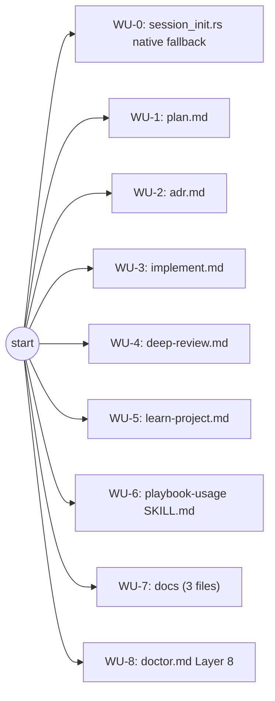

# ADR-0014 Execution Blueprint

- **Parent ADR:** `docs/adr/0014-retire-memory-md-index.md`

## System Snapshot

- `src/hooks/session_init.rs:315-367` — `append_memory_slice`, the SessionStart injector. Its else-branch (`:348-360`) currently reads a legacy `MEMORY.md` file; this is the only Rust code path that changes.
- `src/hooks/session_init.rs:236-299` — `append_promoted_facts`, an existing sibling function that already reads `memory.graph.json` directly via `serde_json::Value`, filters with `in_promotion_scope`, and extracts `name`/`description`. This is the exact pattern the new native fallback mirrors.
- `src/hooks/session_init.rs:302-313` — `in_promotion_scope(node: &serde_json::Value, repo: &str) -> bool`, already scope-matching (global/org/project), reused as-is.
- `src/hooks/session_init.rs:461-469` — `read_legacy_memory`, the function being removed.
- `src/hooks/session_init.rs:475-477` — `cap_memory_body`, the existing 16000-char cap, reused as-is by the new function.
- `src/hooks/rebuild_memory_graph.rs:786-811` — the file walk that builds the graph; its `name != "MEMORY.md"` exclusion (`:807`) stays unchanged, per the ADR's explicit decision (defensive, not load-bearing).
- `src/hooks/rebuild_memory_graph.rs:469-484` — the `Node` struct/JSON shape: `id`, `file`, `scope`, `type` (serialized as `"type"`), optional `name`/`description`/`project`/`pinned`. Code-anchor nodes have `name: None`, confirmed at `:699`.
- `shell/memory-context.sh` — unchanged by this blueprint. Already renders `name: description` (`:74`) plus edges and anchors from `memory.graph.json`, already the primary SessionStart path. It `exit 0`s with empty output whenever `jq` is missing (`:53,99`), silently, with no error. The five command WUs below repoint their reads at this script instead of at `MEMORY.md`, and each also gets its own native, jq-free fallback for when the script produces nothing, since `MEMORY.md` (readable via the plain `Read` tool, no jq) is no longer there to fall back to.
- `commands/doctor.md:1-293` — frontmatter `:2` and the intro at `:11` both say "seven" (layers / checks); the seven numbered layers run `:14` (Layer 1) through Layer 7's own section at `:204-260` (its heading through its Report bullets); `:262-293` is a separate, unnumbered `## Output format` section, not part of Layer 7, containing the file's remediation-branch logic (`:282-292`) which enumerates "Layers 1 to 5", "Layer 6", "Layer 7" by name with no catch-all. `:194-202` warns layer numbers are referenced elsewhere and must never shift, so a new check is always appended, never inserted. `jq` is already a hard, unchecked dependency of Layers 2, 5, 6, and 7's own bash blocks (confirmed via grep: `:37,102,164,238`), a pre-existing gap this blueprint's WU-8 closes.
- `tests/hooks_session.rs:242-278` — `session_init_falls_back_to_the_legacy_memory_index`, the test being replaced.
- `tests/hooks_session.rs:191-239` — `session_init_caps_the_graph_backed_slice_like_the_legacy_fallback`, the existing cap test for the jq/live path; a sibling test is added for the native fallback path.
- `tests/hooks_session.rs:74-109` — `run_hook`, the test harness. Confirmed at `:88` it unconditionally does `.env_remove("CLAUDE_PLUGIN_ROOT")` before applying `extra_env`, so passing `&[]` reliably forces `plugin_root` empty in the child process, which is how the new tests reach the fallback branch deterministically.
- Five command files with a read step to repoint: `commands/plan.md:171`, `commands/adr.md:80`, `commands/implement.md:131`, `commands/deep-review.md:198`, `commands/learn-project.md:72,103`.
- Four command files with a `MEMORY.md` write step to delete: `commands/plan.md:281-291,510`, `commands/adr.md:85-92,155`, `commands/implement.md:138-145`, `commands/learn-project.md:120-130,161,168,178`.
- `commands/implement.md:267` — a WU-brief drafting instruction that references "any fact whose `MEMORY.md` one-line hook mentions the WU's title keywords", needs rewording to `description` since the data now comes from the graph read, not a MEMORY.md scan.
- `skills/playbook-usage/SKILL.md:88` and three doc files (`docs/concepts/02-memory-system.md`, `docs/guides/03-decisions-and-memory.md`, `docs/internals/02-model-routing-and-memory.md`) describe the mechanism for contributors/users.

## Work Units

### WU-0: Native Rust graph-slice fallback in session_init.rs

- Requires: nothing
- Goal: `session_init.rs`'s SessionStart fallback stops reading `MEMORY.md` and instead parses `memory.graph.json` directly (no jq, no bash), producing the same `name: description` shape.
- Files: `src/hooks/session_init.rs` (production), `tests/hooks_session.rs` (test)
- Changes:
  - Add `fn read_graph_slice_fallback(repo: &str) -> String`, mirroring `append_promoted_facts`'s read-and-filter shape (`session_init.rs:236-299`): read `memory_dir().join("memory.graph.json")`, parse as `serde_json::Value`, iterate `nodes`, keep only nodes where `in_promotion_scope(node, repo)` is true AND `node.get("name")` is present (a code-anchor node has no `name`, so this alone excludes it, no separate `scope != "code"` check needed), extract `name`/`description` (`description` defaults to `""` if absent), sort by name, join as `"{name}: {description}"` lines, and return `cap_memory_body(body)`. Any read or parse failure returns an empty string (never panics), matching every other fallback in this file.
  - In `append_memory_slice` (`:318-367`), replace the else-branch's `MEMORY.md` read (`:348-360`, `crate::common::paths::memory_dir().join(&mem_slug).join("MEMORY.md")` + `read_legacy_memory`) with a call to `read_graph_slice_fallback(&mem_slug)`.
  - Remove `read_legacy_memory` (`:461-469`) entirely; confirmed via grep it has no other caller.
  - Update the doc comments at `:315-317` and the removed function's former doc comment references to describe the fallback as "a native, dependency-free parse of `memory.graph.json`" instead of "the legacy `MEMORY.md` index".
- Test scenarios:
  - Given `memory.graph.json` exists with an in-scope project fact and `CLAUDE_PLUGIN_ROOT` is unset (forcing `plugin_root` empty, `mem_script` to `None`, and the fallback branch to run), `additionalContext` contains that fact's name and description. Replaces `session_init_falls_back_to_the_legacy_memory_index` (`tests/hooks_session.rs:242-278`); same repo/home scaffolding, same assertion shape, different fixture (a `memory.graph.json` node instead of a `MEMORY.md` line).
  - Given the same no-`CLAUDE_PLUGIN_ROOT` condition and a graph with ~120 in-scope facts whose rendered `name: description` lines exceed 16000 chars (same fixture shape as `session_init_caps_the_graph_backed_slice_like_the_legacy_fallback`, `tests/hooks_session.rs:191-239`), an early fact survives and a fact placed past the cap boundary does not. Confirms `cap_memory_body` is genuinely reused on this path, not just assumed. Note for whoever implements this: the native path's body has no `"Facts:\n"` preamble the jq path's rendering has (`shell/memory-context.sh:74,91`), so don't just copy the existing test's character-count assumptions; compute the actual rendered length for this path's own format and confirm `fact-001` lands before, and `fact-120` lands after, the 16000-char boundary for real, not by inference from the jq-path test's numbers.
  - Given `memory.graph.json` is absent and `CLAUDE_PLUGIN_ROOT` is unset, `additionalContext` carries no memory section at all (empty fallback, no panic, no error surfaced to the model).
  - Given `memory.graph.json` exists but contains invalid JSON (or valid JSON with no `nodes` array) and `CLAUDE_PLUGIN_ROOT` is unset, the hook still exits 0, its stdout still parses as valid JSON, and no memory section is emitted. Directly exercises the "any read or parse failure returns an empty string, never panics" contract this WU's Changes section commits to; mirror the assertion shape of `session_init_no_memory_store_emits_no_memory_block` (`tests/hooks_session.rs:332-355`) with a malformed-file fixture instead of an absent one.
  - Given `memory.graph.json` contains only a code-anchor node (`type: "code"`, no `name` field, matching how `rebuild_memory_graph.rs` actually serializes one, confirmed at `:699` (the `name: None` field assignment; the `skip_serializing_if` attribute itself is declared at `:476`)) and zero fact nodes, and `CLAUDE_PLUGIN_ROOT` is unset, `additionalContext` contains no memory section at all: with zero fact nodes surviving the `node.get("name")` filter, `mem_body` is empty, so assert `!context.contains("Project memory for this repo")`, the same assertion shape as `session_init_no_memory_store_emits_no_memory_block` (`tests/hooks_session.rs:352-355`). Confirms the `node.get("name")` presence check is what excludes code nodes, not an assumption, and pins the exact output shape rather than a vague "no fact-shaped line" check a weaker implementation could pass by accident.
- Done When:
  - [ ] `read_legacy_memory` no longer exists anywhere in the file.
  - [ ] The fallback branch of `append_memory_slice` calls `read_graph_slice_fallback`, not any `MEMORY.md` path.
  - [ ] `cargo test --test hooks_session session_init_falls_back_to_a_native_graph_read` passes.
  - [ ] `cargo test --test hooks_session session_init_caps_the_native_graph_fallback` passes.
  - [ ] A malformed-`memory.graph.json` test and a code-anchor-only-graph test both pass.
  - [ ] `cargo build && cargo clippy --all-targets -- -D warnings` is clean.

### WU-1: commands/plan.md — repoint reads, drop MEMORY.md writes

- Requires: nothing
- Goal: `/playbook:plan` reads memory via `shell/memory-context.sh` instead of `MEMORY.md`, and writes exactly one file per captured fact.
- Files: `commands/plan.md`
- Changes:
  - Step 2's "Check memory and prior plans" (`:171`): replace the `~/.config/playbook/memory/MEMORY.md` / `~/.config/playbook/memory/<owner>/<repo>/MEMORY.md` read instruction with: resolve `$CLAUDE_PLUGIN_ROOT/shell/memory-context.sh` (same resolve-then-check-`-f` convention `commands/doctor.md:123` uses for `statusline.sh`), run it with `--repo <owner>/<repo>`, and load the fact files it names on demand. **If the script produces no output** (empty store, or `jq`/`bash` unavailable, indistinguishable from stdout alone), fall back to reading `~/.config/playbook/memory/memory.graph.json` directly with the `Read` tool and picking out nodes whose `scope` is `global`, or whose `project` matches this repo (or its owner, for `org` scope): the same dependency-free shape WU-0 gives `session_init.rs`, since this command is an LLM session and can parse JSON without shelling to `jq`. Note in the digest which path actually produced the result (script output vs. direct graph read vs. nothing found), so an operator can tell "nothing relevant" apart from "the script couldn't run."
  - "Knowledge capture (memory)" (`:281`): drop "plus its `MEMORY.md` index line".
  - Delete the "Locked index append" paragraph and its bash block (`:284-291`) entirely; a fact capture is now one `Write` call, no lock needed for a single file only one process is writing at that moment (unlike the shared-index-file case this lock existed for).
  - Step 12, item 3 (`:510`): drop "and update `~/.config/playbook/memory/<owner>/<repo>/MEMORY.md` with the same locked append shown earlier".
  - `:108` (checkpoint locked-write analogy) and `:204` (glossary locked-write analogy): both currently say "the same locked-write discipline `MEMORY.md`/`GLOSSARY.md` use" or "the checkpoint and `MEMORY.md`'s index use". Reword both to drop the `MEMORY.md` half of the comparison, e.g. "the same mkdir-based advisory lock pattern this repo uses elsewhere for concurrent small-file writes (`src/common/atomic.rs`'s `with_dir_lock`)", keeping `GLOSSARY.md` as the one surviving sibling example at `:108` only (it is untouched by this ADR).
- Test scenarios: none automated (prose command file, no test harness for "did the LLM session follow this instruction", matching this repo's existing convention for command-file changes).
- Done When:
  - [ ] `grep -c "MEMORY.md" commands/plan.md` is 0.
  - [ ] The memory-check step names `memory-context.sh` and `--repo`, and specifies the native, jq-free graph-read fallback for when the script produces nothing.
  - [ ] The instruction to note which source (script output, direct graph read, or nothing found) produced the result survives into the final wording, not just the fallback mechanism itself.
  - [ ] Neither the checkpoint nor glossary locked-write analogy references `MEMORY.md` anymore.

### WU-2: commands/adr.md — repoint reads, drop MEMORY.md writes

- Requires: nothing
- Goal: same treatment as WU-1, applied to `/playbook:adr`.
- Files: `commands/adr.md`
- Changes:
  - Stage 1, "Read memory stores if present" (`:80`): replace the two `MEMORY.md` existence checks with the `memory-context.sh --repo <owner>/<repo>` call, same resolve-then-run pattern as WU-1, including the same native-graph-read fallback (and same "note which path produced the result" instruction) for when the script produces nothing.
  - Delete the "Locked index append" paragraph and bash block (`:85-92`) entirely.
  - Stage 2, "Knowledge capture" (`:155`): drop "with the same locked `MEMORY.md` append shown in Stage 1".
- Test scenarios: none automated, same reasoning as WU-1.
- Done When:
  - [ ] `grep -c "MEMORY.md" commands/adr.md` is 0.
  - [ ] Stage 1's memory read step names `memory-context.sh` and `--repo`, and specifies the native fallback, including which source produced the result.

### WU-3: commands/implement.md — repoint reads, drop MEMORY.md writes, fix the brief-drafting reference

- Requires: nothing
- Goal: same treatment as WU-1/WU-2, applied to `/playbook:implement`, plus its one additional reference to `MEMORY.md`'s one-line hook in the WU-brief drafting step.
- Files: `commands/implement.md`
- Changes:
  - Step 3's memory-load bullet (`:131`): replace the two `MEMORY.md` existence checks with the `memory-context.sh --repo <owner>/<repo>` call, plus the same native-graph-read fallback as WU-1.
  - Delete the "Locked index append" paragraph and bash block (`:138-145`) entirely.
  - `:267` ("any fact whose `MEMORY.md` one-line hook mentions the WU's title keywords"): reword to "any fact whose `description` mentions the WU's title keywords", since the memory slice Step 3 now loads comes from `memory-context.sh`'s `name: description` rendering, which carries the same information under a different label.
- Test scenarios: none automated, same reasoning as WU-1.
- Done When:
  - [ ] `grep -c "MEMORY.md" commands/implement.md` is 0.
  - [ ] Step 3's memory-load step names `memory-context.sh` and `--repo`, and specifies the native fallback, including which source produced the result.
  - [ ] The WU-brief drafting instruction at the old `:267` says `description`, not `MEMORY.md` one-line hook.

### WU-4: commands/deep-review.md — repoint the read step

- Requires: nothing
- Goal: `/playbook:deep-review`'s Step 2c reads memory via the graph, not `MEMORY.md`. No write-side change: this command never captured facts.
- Files: `commands/deep-review.md`
- Changes: Step 2c (`:198`): replace the two `MEMORY.md` existence checks with the `memory-context.sh --repo <owner>/<repo>` call, plus the same native-graph-read fallback as WU-1, same pattern throughout.
- Test scenarios: none automated, same reasoning as WU-1.
- Done When:
  - [ ] `grep -c "MEMORY.md" commands/deep-review.md` is 0.
  - [ ] Step 2c's memory-load step names `memory-context.sh` and `--repo`, and specifies the native fallback, including which source produced the result.

### WU-5: commands/learn-project.md — repoint reads, drop MEMORY.md writes (heaviest command file)

- Requires: nothing
- Goal: `/playbook:learn-project`'s priming, dedupe, and reporting steps all read the graph instead of `MEMORY.md`; Phase 4 writes exactly one file per fact.
- Files: `commands/learn-project.md`
- Changes:
  - Phase 1's `--refresh` priming (`:72`): replace "read `$STORE/MEMORY.md`" with running `memory-context.sh --repo <owner>/<repo>` and handing collectors its facts block (names + descriptions) instead of `MEMORY.md`'s titles and hooks. If the script produces nothing, fall back to reading `memory.graph.json` directly, same as WU-1. Keep the "skip this on a fresh run" behavior unchanged.
  - Phase 3's dedupe (`:103`): replace "read the existing indexes (`$STORE/MEMORY.md` and `~/.config/playbook/memory/MEMORY.md`)" with a single `memory-context.sh --repo <owner>/<repo>` call: its facts block already includes both project-scoped and global-scoped facts for that repo (`in_scope` in the script unconditionally includes `.scope == "global"`), so one call replaces both reads. Same native-graph-read fallback as Phase 1's priming when the script produces nothing: a broken dedupe read is worse here than elsewhere in this blueprint, since it risks writing a duplicate fact, so this fallback is not optional polish for this command.
  - Phase 4's write instructions (`:120`): delete the "Add or refresh the `- [Title](file.md): one-line hook` line in the right `MEMORY.md`... Mark superseded index entries `(superseded)`" bullet entirely. A `supersedes` edge in the fact's own frontmatter already carries that relationship into the graph; nothing else needs to mark it.
  - Delete the "Locked index write" paragraph and bash block (`:123-130`) entirely.
  - `--stage` (`:161`): "Do NOT touch the live `MEMORY.md` or `memory.graph.json`" becomes "Do NOT touch the live `memory.graph.json`" (there is no live `MEMORY.md` left to also name).
  - `--from-staged` (`:168`): "write to the live store, dropping the `status`/`staged` staging fields; apply `supersedes`/updates; refresh `MEMORY.md`" drops the trailing "refresh `MEMORY.md`" clause.
  - Phase 5's report (`:178`): drop "The path to each store's `MEMORY.md`" bullet; the adjacent `memory.graph.json` path/count bullet already covers what a user needs to verify the write landed.
- Test scenarios: none automated, same reasoning as WU-1.
- Done When:
  - [ ] `grep -c "MEMORY.md" commands/learn-project.md` is 0.
  - [ ] Phase 1 priming and Phase 3 dedupe both name `memory-context.sh` and specify the native fallback, including which source produced the result.
  - [ ] Phase 4's write instructions describe exactly one file write per fact, no index line.
  - [ ] `--stage` and `--from-staged` no longer reference `MEMORY.md`.
  - [ ] A live `/playbook:learn-project --refresh` run against a repo with existing facts, performed once after this WU lands, confirms dedupe still skips known facts and priming still yields a usable signal to collectors. This is the manual-verification item the Confidence section below names; it is a completion condition for this WU, not an optional follow-up.

### WU-6: skills/playbook-usage/SKILL.md — description update

- Requires: nothing
- Goal: the skill's description of the memory store no longer names `MEMORY.md` as a load-bearing part of it.
- Files: `skills/playbook-usage/SKILL.md`
- Changes: `:88` ("global facts sit flat alongside its `MEMORY.md` index") becomes "global facts sit flat in that directory" (or equivalent phrasing that drops the `MEMORY.md` mention without otherwise changing the sentence's meaning).
- Test scenarios: none automated (prose skill file).
- Done When:
  - [ ] `grep -c "MEMORY.md" skills/playbook-usage/SKILL.md` is 0.

### WU-7: Update contributor/user docs describing the mechanism

- Requires: nothing
- Goal: the three docs that describe the memory system's file format and retrieval no longer present `MEMORY.md` as part of the current design.
- Files: `docs/concepts/02-memory-system.md`, `docs/guides/03-decisions-and-memory.md`, `docs/internals/02-model-routing-and-memory.md`
- Changes:
  - `docs/concepts/02-memory-system.md`: `:17` and `:19` (each scope's "own `MEMORY.md` index" line) reworded to describe the graph as the index. `:42-46` ("The global root and each project subfolder have a `MEMORY.md` index...") replaced with a short paragraph describing `memory.graph.json` as the sole index, built from every fact file's frontmatter, queried via `shell/memory-context.sh` or the native Rust fallback. `:79` ("If the graph is unavailable, `session-init` falls back to the legacy `MEMORY.md` index (capped the same way)") reworded to "falls back to a native, dependency-free read of `memory.graph.json` (capped the same way)".
  - `docs/guides/03-decisions-and-memory.md`: `:58` ("indexed by `~/.config/playbook/memory/MEMORY.md`") drops the `MEMORY.md` clause. `:117` ("referenced by name from `MEMORY.md` index entries") reworded to "referenced by name from the graph".
  - `docs/internals/02-model-routing-and-memory.md`: `:68` ("Each store has a `MEMORY.md` at its root. One line per fact:") and its following example block, replaced with a description of the graph node shape (`id`/`file`/`scope`/`type`/`name`/`description`) as the index format instead.
- Test scenarios: none automated (prose docs).
- Done When:
  - [ ] For each of the three files, `grep -c "MEMORY.md" <file>` is 0, OR its only remaining match is a short note explaining that existing installs may have an inert, unread `MEMORY.md` left over and it's safe to ignore (per the parent ADR's explicit no-active-cleanup decision, `docs/adr/0014-retire-memory-md-index.md:204-205`). A bare zero-count bar would fail a correct edit that chooses to document that leftover state for users.
  - [ ] Each file still accurately describes how retrieval actually works after WU-0's change (native fallback, not a legacy index).

### WU-8: commands/doctor.md — Layer 8, jq installed

- Requires: nothing
- Goal: `/playbook:doctor` gets a real, appended PASS/FAIL check for `jq`'s presence, closing a pre-existing gap (Layers 2, 5, 6, and 7 already shell out to `jq` today with nothing checking it's installed) that this ADR makes more consequential: the five commands' new native-graph-read fallbacks (WU-1 through WU-5) are the thing standing between a missing `jq` and no memory context at all, so surfacing a missing `jq` clearly is worth doing now.
- Files: `commands/doctor.md`
- Changes:
  - Append a new `## Layer 8: jq installed` section between the existing `## Layer 7` section (ends `commands/doctor.md:260`) and the `## Output format` section (starts `:262`), following the same PASS/FAIL/remediation-hint shape Layer 7 uses: a bash block running `command -v jq >/dev/null 2>&1`, reporting PASS with the resolved `jq` path on success, FAIL with a remediation hint (the OS-appropriate install command, e.g. `brew install jq` / `apt install jq`) on failure. Per the "Layer numbering: do not renumber" rule (`:194-202`), this is Layer 8, never a renumbering of any existing layer.
  - Update the two literal "seven" references that become stale once an eighth layer exists: the frontmatter `description` (`:2`, "Check the seven playbook layers...") and the intro line (`:11`, "Run all seven checks below.") both become "eight".
  - Add a Layer 8 branch to the remediation-line logic in `## Output format` (`:282-292`), alongside the existing "Layers 1 to 5", "Layer 6", and "Layer 7" branches: `/playbook:setup` cannot install `jq` either, for the same reason it can't fix Layer 6 or Layer 7, so give the OS package-manager install command directly rather than pointing at `/playbook:setup`.
- Test scenarios: none automated (prose command file, no test harness for command-file changes, same reasoning as WU-1).
- Done When:
  - [ ] `commands/doctor.md` has a `## Layer 8: jq installed` section, positioned between Layer 7 and `## Output format`, with no existing layer renumbered.
  - [ ] The new layer follows the same PASS/FAIL/remediation-hint shape every other layer uses.
  - [ ] The frontmatter description and intro line both say "eight", not "seven".
  - [ ] The remediation-line logic has a Layer 8 branch, not just Layers 1-7.

## Ordering

| WU | Requires | Parallel group |
|---|---|---|
| WU-0 | none | P0 |
| WU-1 | none | P0 |
| WU-2 | none | P0 |
| WU-3 | none | P0 |
| WU-4 | none | P0 |
| WU-5 | none | P0 |
| WU-6 | none | P0 |
| WU-7 | none | P0 |
| WU-8 | none | P0 |

## Parallel Groups

- **P0** (all 9 WUs): every WU touches a disjoint set of files (one Rust production file + its own test file for WU-0; one distinct command file each for WU-1 through WU-5; one skill file for WU-6; three distinct doc files for WU-7; `commands/doctor.md` for WU-8, touched by no other WU), and none depends on another's output: the command-file WUs call `shell/memory-context.sh`, which is unchanged by this blueprint, not WU-0's Rust changes; WU-8 adds a new, appended Layer 8, never renumbering the existing seven, with no dependency on anything else in this blueprint. Safe to dispatch as one wave.
- Sequential: none.

## Dependency Graph

## Confidence + open items

- Confidence: HIGH. WU-0's design mirrors an existing, working function in the same file (`append_promoted_facts`, `session_init.rs:236-299`) rather than inventing a new pattern; the node schema it depends on (`name: None` for code nodes) was confirmed by reading `rebuild_memory_graph.rs:699` directly, not assumed; the test harness's `CLAUDE_PLUGIN_ROOT` isolation was confirmed by reading `run_hook` itself (`tests/hooks_session.rs:88`). Every command-file change is a mechanical repoint (read `MEMORY.md` becomes run `memory-context.sh`, with a native graph-read fallback when it produces nothing; delete a locked-append block) grounded in real line numbers read directly from each file in Stage 1. The Phase 2 adversarial pass caught a real gap in the first draft (the five commands losing their only jq-free path once `MEMORY.md` was gone, with nothing to replace it) and Phase 3's test review caught two real WU-0 boundary gaps (a malformed-graph scenario, a code-anchor-only-graph scenario); both are now fixed in this revision, not just noted.
- Open items (verify downstream):
  - `commands/learn-project.md`'s Phase 1/3 priming and dedupe steps change their data shape (from `MEMORY.md`'s `- [Title](file.md): hook` bracket-link lines to `memory-context.sh`'s plain `name: description` lines). The prose instructions in WU-5 describe this correctly, but since this is a markdown command with no automated test, the actual behavior needs manual verification the first time `/playbook:learn-project --refresh` runs after this ships: confirm collectors still get a usable priming signal and dedupe still correctly skips existing facts. This is now a Done-When completion condition for WU-5 itself, not just a note here. Who verifies: manual run during or right after WU-5, by whoever runs `/playbook:implement` on this blueprint.
  - The same class of risk applies more lightly to WU-1 through WU-4 (`plan.md`, `adr.md`, `implement.md`, `deep-review.md`): their read-instruction swap is lower-stakes than `learn-project.md`'s dedupe (a missed read just means less context, not a duplicated fact), but a grep-based Done-When check (per each WU's own Done When list) cannot confirm the replacement instruction actually resolves and surfaces content when followed by a live session. Who verifies: run each of `/playbook:plan`, `/playbook:adr`, `/playbook:implement`, and `/playbook:deep-review` at least once after implementation and confirm the memory-check step visibly loads something in a repo with existing facts. Whoever runs `/playbook:implement` on this blueprint owns this; not a hard gate the way WU-5's is, since the failure mode here is silent degradation to less context, not data corruption.
  - Whether any other command or skill file references `MEMORY.md` beyond the ones grep found during Stage 1 (`commands/plan.md`, `commands/adr.md`, `commands/implement.md`, `commands/deep-review.md`, `commands/learn-project.md`, `commands/doctor.md`, `skills/playbook-usage/SKILL.md`, and the three docs files) was checked via a repo-wide grep restricted to `commands/`, `skills/`, `src/`, `shell/`, and `docs/`; a final repo-wide `grep -rln "MEMORY.md" commands/ skills/ src/ shell/ docs/concepts/ docs/guides/ docs/internals/` (deliberately excluding `docs/adr/`, which is a historical record and must keep referencing `MEMORY.md` in ADR 0004/0008/0013's own text) should return empty once all 9 WUs land. Who verifies: the orchestrator, right before Stage 3's quality gate.
