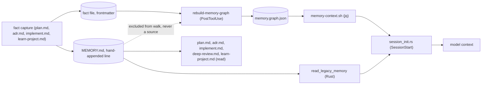
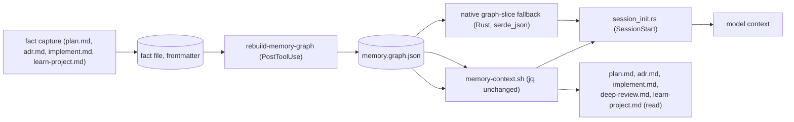

# ADR 0014: Retire MEMORY.md as a parallel memory index

- **Status:** Accepted
- **Date created:** 2026-09-09
- **Date modified:** 2026-09-09
- **Amends:** ADR 0004 (graph-first memory retrieval and triggered capture)

## Context

Every memory scope (`~/.config/playbook/memory/`, each `<owner>/` org
folder, each `<owner>/<repo>/` project folder) keeps a `MEMORY.md` index
alongside its fact files: one line per fact, `- [Title](file.md): one-line
hook`. ADR 0004 (2026-08-10) made `memory.graph.json` the primary retrieval
path and explicitly kept `MEMORY.md` on as "the fallback if the graph proves
not to earn its keep" (`0004-graph-first-memory.md:85`). The graph has
earned its keep: it is the live `SessionStart` path
(`src/hooks/session_init.rs:333-336`), the `PreToolUse`/`UserPromptSubmit`
anchor-match path (`src/hooks/memory_anchors.rs`), and the subject of ADR
0008's bounded-injection work and ADR 0011's usage/staleness signals.

`MEMORY.md` is not a source of truth for the graph. `rebuild_memory_graph.rs`
explicitly excludes it from its file walk:

> `src/hooks/rebuild_memory_graph.rs:807` — `else if name.ends_with(".md")
> && name != "MEMORY.md"`

The graph is built entirely from each fact file's own YAML frontmatter
(`name`, `description`, `links`, `anchors`). `MEMORY.md`'s content, "title +
one-line hook," is exactly `name` + `description`, already present in that
frontmatter and already rendered from the graph by
`shell/memory-context.sh:74` (`"\(.name): \(.description)"`). Nothing
downstream parses `MEMORY.md` to build anything; it is a leaf, not a source.

Despite that, five command files still read it directly as a planning-time
index (`commands/plan.md:171`, `commands/adr.md:80`,
`commands/implement.md:131`, `commands/deep-review.md:198`,
`commands/learn-project.md:72,103`), and four of those same commands
(`plan.md`, `adr.md`, `implement.md`, `learn-project.md`) write it as a
second, separately-authored line on every fact capture, alongside the fact
file itself. Nothing enforces the two stay in sync. `session_init.rs`'s
`append_memory_slice` (`:315-367`) also reads it, but only as a fallback:
when `shell/memory-context.sh` is missing, fails, or `memory.graph.json`
itself is absent or unreadable (`:333-360`). In the healthy case, the one
this repo runs in daily, `MEMORY.md` is read by nothing at `SessionStart`.

`prompts/SYSTEM_PROMPT.md`, loaded into every session's persistent
instructions, independently instructs the same two-write convention three
times over (`:53`, `:61`, `:63`): it describes `MEMORY.md` as each scope's
index alongside the fact files, and its "When to save" rule tells every
session to "write the fact file... and add its `MEMORY.md` index line in
the right store." This is not a command file a specific `/playbook:*`
invocation reads; it is the standing instruction set every session already
has loaded, independent of which command (if any) is running, so it is a
sixth, distinct write path this ADR must also retire, not an incidental
detail of the five commands above.

## Decision Drivers

- **MEMORY.md is structurally redundant.** Its only content (`name` +
  `description`) already lives in every fact file's frontmatter and is
  already rendered from the graph by an existing script
  (`shell/memory-context.sh:74`). Keeping a second, hand-authored copy
  buys nothing the graph doesn't already have.
- **Duplication without enforcement is a real drift risk.** Four command
  files each do two separate writes per fact capture (the file, then the
  index line). Nothing checks the two match; a partial run, a crash, or a
  missed step in any one of the four leaves the index silently wrong.
- **No reader may gain a dependency it didn't have, not just the Rust fallback.**
  `session_init.rs`'s fallback exists specifically for when the jq-based
  live path (`shell/memory-context.sh`) fails, and needs a dependency-free
  path, which a native `serde_json` parse of `memory.graph.json` (already a
  dependency, `Cargo.toml`) provides. The same principle applies to the five
  commands: today they read `MEMORY.md` via the `Read` tool, zero jq, zero
  bash. Repointing them at `memory-context.sh` alone, with nothing else,
  would hand all five a new hard dependency on jq that `MEMORY.md` never
  required, exactly the asymmetry this driver exists to prevent. Each of
  those five work units gets the same shape of native fallback WU-0 does:
  read `memory.graph.json` directly with the `Read` tool (the command is an
  LLM session, so it can parse JSON without shelling to jq) when
  `memory-context.sh` produces nothing.
- **This repo is already moving off shell where a Rust equivalent exists**
  (ADR 0007's Rust migration). A fallback that still shells out for its
  fallback is the wrong direction for that trend.
- **Existing installs have real `MEMORY.md` files on disk.** A migration
  that actively deletes them adds a new migration mechanism to a repo that
  already has open, unresolved findings about migration-mechanism safety
  (issue #369, `src/init/memory_migrate.rs`). Leaving them inert costs
  nothing; deleting them risks repeating a known class of bug for no
  functional gain.

## Considered Alternatives

### A. Status quo: keep MEMORY.md as a hand-maintained duplicate + fallback (effort: none)

Change nothing. Every capture keeps writing both files; the five commands
keep reading `MEMORY.md`; the fallback keeps reading it too.

- Trade-offs: zero migration risk, since nothing moves. But it leaves the
  drift risk permanently unaddressed, and every future command that adds a
  memory-read or memory-write step inherits the same two-write convention
  by copying existing prose, compounding the duplication instead of
  shrinking it.

### B. Auto-generate MEMORY.md from the graph during rebuild (effort: M)

Keep the file and its five/four consumers unchanged. Move its *authorship*
into `rebuild_memory_graph.rs`'s rebuild step: regenerate `MEMORY.md` from
the graph's nodes every time the graph rebuilds, instead of five commands
each hand-appending a line.

- Trade-offs: removes the drift risk (the index can never disagree with the
  graph, since it's derived from it) without touching the five reading
  commands or the fallback's shape at all, the smallest behavioral change.
  But it keeps a second file whose only job is to duplicate content the
  graph already renders via `memory-context.sh`, and it adds a new
  responsibility to `rebuild_memory_graph.rs` (writing a second output
  format, in a second location per scope) for a file whose remaining
  purpose, once auto-generated, is purely legacy: nothing that reads the
  auto-generated version needs it to be markdown rather than the graph's
  native JSON.

### C. Drop MEMORY.md entirely; repoint the fallback and the five commands at the graph (effort: M) — chosen

Stop writing `MEMORY.md` anywhere. `session_init.rs`'s fallback gets a new,
native Rust function that reads `memory.graph.json` directly (`serde_json`,
no jq, no bash) and renders the same `name: description` shape `MEMORY.md`
provided. The five commands are repointed at `shell/memory-context.sh`
(already exists, already produces the equivalent content plus edges and
anchors `MEMORY.md` never had) instead of reading `MEMORY.md` via the Read
tool, and each gets its own native fallback for when that script produces
nothing (empty store, or jq/bash unavailable): read `memory.graph.json`
directly with the `Read` tool and filter it themselves, the same
dependency-free shape as `session_init.rs`'s Rust fallback, since a command
is an LLM session and can parse JSON without shelling to jq.
`learn-project.md`'s dedup step reads the same script's output instead
of `MEMORY.md`'s titles.

- Trade-offs: removes the drift risk at the source, since there is nothing
  left to drift from. Every capture becomes one write instead of two. The
  fallback gains real independence from jq without gaining a new
  dependency. But it touches more files in one pass than B (three Rust
  files, five command files, one skill file, three doc files) and changes
  `learn-project.md`'s dedup data shape (bracket-link markdown to
  `memory-context.sh`'s plain `name: description` block), which needs
  re-verifying rather than assumed compatible.

### D. Consolidate into one new `playbook memory list`/`context` Rust subcommand, replacing shell/memory-context.sh too (effort: L)

Go further than C: add a Rust CLI subcommand that does what
`memory-context.sh` does today (parse the graph, render facts/edges/anchors),
used by `session_init.rs` in-process (no subprocess at all, not even to
bash+jq) for the primary path, by the fallback for the degraded path, and by
the five commands via `Bash` instead of shelling to a `.sh` script.

- Trade-offs: removes the jq dependency from the *primary* path too, not
  just the fallback, and unifies three renderers (the live path's jq filter,
  the fallback's Rust parse, five commands' reads) into one. But it's a
  larger rewrite than this decision needs: the primary path's jq dependency
  isn't the problem this ADR is solving, and folding it in here risks
  scope creep into the broader memory-architecture rethink the user has
  separately flagged (`backlog-rethink-memory-architecture`) rather than
  landing a scoped fix. Revisit in that larger effort instead.

## Decision

Adopt **C**.

MEMORY.md is provably a leaf with no unique content: everything it carries
is already in the frontmatter the graph is built from, and already
renderable from the graph by a script that exists today. The real problem
worth fixing is the unenforced two-write duplication across four commands,
and the cleanest fix removes the duplicate rather than automating it.

Why the others lost:

- **A** is rejected on inaction: it leaves the drift risk in place
  indefinitely and lets it compound as new commands are written.
- **B** is rejected on proportionality once C is on the table: it fixes the
  drift risk but keeps a file whose sole remaining purpose, once
  auto-generated, is duplicating a rendering the graph already produces.
  There's no consumer left that specifically needs markdown-on-disk over a
  graph query; B optimizes a file that C shows isn't needed at all.
- **D** is rejected on scope: it solves a real but different problem (the
  primary path's own jq dependency) that this ADR wasn't asked to fix, and
  doing it here risks tangling a scoped cleanup with the open-ended memory
  rethink the user flagged separately. `shell/memory-context.sh` stays
  exactly as it is; only its callers change.

No active migration deletes existing `MEMORY.md` files from installs that
already have them. They become inert (unread, unwritten) the moment this
ships. `rebuild_memory_graph.rs:807`'s `name != "MEMORY.md"` exclusion stays
in place, unremoved: it costs one comparison and prevents an orphaned
`MEMORY.md` on an existing install from being mis-parsed as a fact file once
nothing else treats it specially.

## Consequences

Positive:

- One write per fact capture instead of two, across `plan.md`, `adr.md`,
  `implement.md`, and `learn-project.md`. The drift risk is gone because
  there's nothing left to drift from.
- `session_init.rs`'s fallback gains real independence from jq and bash
  without adding a new dependency, using `serde_json` (already present).
- The five reading commands simplify on the happy path: one shell-out to an
  existing script instead of a Read-and-scan of a separately-maintained
  file, and they gain edges/anchors in that read for free, information
  `MEMORY.md` never carried. This isn't free: each command now carries a
  second, conditional code path (the native graph-read fallback) where it
  previously had one plain `Read` of `MEMORY.md`, the direct cost of
  preserving the jq-independence `MEMORY.md` used to provide for free.
- `rebuild_memory_graph.rs`'s existing `MEMORY.md` exclusion becomes
  defensive rather than load-bearing, a smaller conceptual surface even
  though the line itself stays.

Negative and follow-up:

- Existing installs keep orphaned `MEMORY.md` files on disk indefinitely;
  no active cleanup ships with this ADR. A future pass can remove them if
  it ever becomes worth the migration-mechanism risk.
- `learn-project.md`'s dedup step changes its data source and parsing shape
  (bracket-link markdown to `memory-context.sh`'s plain `name: description`
  block); this needs explicit re-verification during implementation, not an
  assumption that swapping the source is drop-in.
- Breadth: two Rust files (`session_init.rs` plus its test file), five
  command files, one skill file, three contributor/user doc files,
  `commands/doctor.md` (a new check, not a repoint), and the system prompt
  change in one blueprint. `rebuild_memory_graph.rs` is read and cited but
  not modified: its existing `MEMORY.md` exclusion stays as-is, per the
  Decision above. Each change is small, but the count is real and worth
  sequencing carefully (Rust first, since the command files' correctness
  depends on `memory-context.sh`'s existing behavior, which doesn't change;
  doc files and the system prompt last, since they only describe the
  result).
- This is a narrower fix within the current memory architecture, not the
  broader rethink the user flagged mid-session
  (`backlog-rethink-memory-architecture`). That remains open and separate.

## Architecture Diagrams

Current state: two writes per capture, `MEMORY.md` read directly by the
fallback and by five commands, even though the graph never derives from it.

Proposed state: one write per capture. The fallback and the five commands
both read the graph; `MEMORY.md` is gone from every path.

