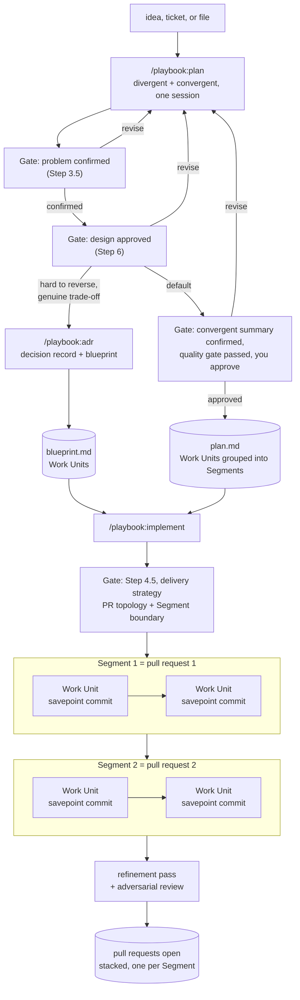

# Plan and Implement

`/playbook:plan` and `/playbook:implement` split feature work into two phases: a verified design session that produces a plan, then a delegated execution that builds it. `/playbook:plan` itself runs two internal phases, divergent then convergent, but it is one command, one session, one artifact.

## Overview

`/playbook:plan` opens divergent: it challenges the premise, explores the codebase and memory, and proposes 2-3 approaches before you approve a design. It can route to `/playbook:adr` mid-session when the decision is hard to reverse, without ending the session. It then continues, in the same conversation with no `/clear` in between, into the convergent interview for Work Units and Segments. `/playbook:plan` and `/playbook:adr` hand `/playbook:implement` the same shape of work: Work Units grouped into Segments, where each Segment becomes one pull request and each Work Unit inside it becomes one commit.



## Planning with /playbook:plan

Run `/playbook:plan` with an optional topic seed, ticket id, or file path:

```bash
/playbook:plan "add --json flag to export command"
/playbook:plan ./tasks/feature-brief.md
```

`/playbook:plan` runs on Opus, effort high. Before asking anything, it reads the codebase, the global memory store at `~/.config/playbook/memory/`, and the project store at `~/.config/playbook/memory/<owner>/<repo>/` (if present). Anything it finds there, it answers itself instead of asking you.

It opens divergent: it challenges the premise, explores 2-3 approaches, and presents a design for your approval. Once you approve the design, it continues, in the same session with no `/clear` in between, into the convergent interview: one question at a time, each with a recommended answer and a reason, for Work Units and Segments.

Each answer opens new branches. `/playbook:plan` walks them in dependency order and won't jump topics while a branch has unresolved decisions.

A crash or interruption mid-session doesn't lose the work: `/playbook:plan` checkpoints after every resolved decision, in both the divergent and convergent phases. Re-running `/playbook:plan <same topic>` finds the checkpoint and offers to resume from wherever the session left off, instead of redoing settled decisions.

When all branches are resolved, it runs a three-phase quality gate:

1. **Fact-check.** A `fact-checker` agent verifies every file path, function signature, and import in the plan. It also checks the Work Unit dependency graph for cycles and confirms parallel-safe flags are accurate.
2. **Adversarial review.** A `critic` agent (focus `plan`) challenges the design: simpler alternatives, missing error paths, blast radius.
3. **Test review.** A `test-reviewer` agent checks the test plan against engineering standards: boundary coverage, flakiness risks, mock quality, assertion strength.

Each phase retries up to three times on FAIL before blocking. WARNs are surfaced but don't block.

After the gate passes and you approve, `/playbook:plan` saves the plan to `<plans-dir>/<slug>.md` and the quality report to `<plans-dir>/<slug>-quality.md`, where `<plans-dir>` is `playbook path plans`'s resolved path. It also persists the key decisions from both phases as project memory facts.

### Plan structure

The saved plan is self-contained. Its core is a Work Units table: smallest independently-committable pieces in dependency order, with parallel-safe groups marked explicitly and each unit assigned to a Segment.

```
| WU | Title | Files | Requires | Segment | Parallel group | Done When |
```

`/playbook:plan` only marks a Work Unit as parallel-safe when its file set is disjoint from every sibling in the group and it has no dependency on them. When unsure, it leaves the unit sequential. `/playbook:implement` re-verifies the flags before dispatching concurrent agents.

### Segments and incremental PRs

Above the Work Units, `/playbook:plan` groups them into ordered **Segments**: PR-sized increments, one concern each, that each become one pull request.

```
| Seg | Title | Work Units | Requires | Concern | Est. lines |
```

A Segment targets under 500 changed lines (a Segment over 1000 needs justification, and none may exceed the 1500 hard limit), following `playbook:engineering-standards` ("one concern per PR", "ship a sequence of small PRs"). Segments are ordered so a Segment's Work Units only depend on the same or earlier Segments; the default is a linear chain, which maps to stacked PRs. These are suggestions: `/playbook:implement` honors them but re-splits any Segment whose real diff exceeds the 1500 hard limit. The quality gate's fact-check phase validates that every Work Unit maps to exactly one Segment, the ordering respects dependencies, and no Segment is over budget.

### Autonomous mode (--auto)

```bash
/playbook:plan "add --json flag to export command" --auto
```

`--auto` is narrower than the old two-command flow's autonomous mode: it only automates the convergent phase, Work Units and Segments. The divergent phase, approach selection, the `/playbook:adr` route check, and design approval, always stops for a human, regardless of `--auto`. This is an intentional breaking change: the old flow's `--auto`, on a raw topic-only invocation with no prior design doc, used to auto-answer approach selection too.

Once the design is approved, `--auto` takes the answer it would have recommended for every convergent decision, records it in an Assumptions list, runs the quality gate, and saves the plan without pausing. A gate FAIL stops the run; it reports the failing checks and the assumptions made. On success, it lists all assumptions so you audit the autonomous choices before running `/playbook:implement`.

## Implementing with /playbook:implement

`/playbook:implement` is execute-only. Pass it a plan file, a GitHub issue, a Jira ticket, a file spec, or plain text:

```bash
/playbook:implement $(playbook path plans)/add-json-flag.md
/playbook:implement #42
/playbook:implement PROJ-123
```

With no arguments, it lists saved plans to pick from. If the reference isn't a ready plan with named files, ordered steps, acceptance criteria, and a test plan, it stops and tells you to run `/playbook:plan` or `/playbook:adr` first.

### Execution

`/playbook:implement` runs on Sonnet and delegates each Work Unit to a subagent via the Task tool. The orchestrator reads the plan, dispatches the Task, and reviews the result. It doesn't edit files directly.

**Delivery strategy (asked up front).** Before executing, `/playbook:implement` settles how to deliver the Segments and recommends an option based on the plan's scope. It asks two things (unless you preset them with `--pr-strategy` / `--boundary`, or run `--auto`, which self-selects the recommended options and records them as assumptions):

- **PR topology:** stacked (default; each Segment branches off the previous, PR N targets Segment N-1), independent off the default branch (when Segments are disjoint), or a single PR (tiny plans).
- **Segment boundary:** savepoint commits with the PRs opened at the end (default), or pause after each PR. Savepoint keeps every Segment branch local until the end, so the refinement pass can rebase the stack locally and each PR opens with a first push (no force-push); pause runs the review per Segment and opens that Segment's PR before moving on.

**Execution order.** `/playbook:implement` executes one Segment at a time in dependency order, each on its own branch. Within a Segment, Work Units run in dependency order; when a parallel group's dependencies are all done, `/playbook:implement` verifies the file sets are disjoint, then dispatches the group as concurrent Sonnet Tasks in one message. After a Segment's Work Units land, it checks the real diff against the 1500-line hard limit and re-splits the Segment if it overflowed.

**TDD by default.** Each Work Unit cycles through red/green/refactor:

1. A subagent writes failing tests encoding the Gherkin scenarios. Tests must fail.
2. A subagent writes the minimal implementation to pass. Tests must pass.
3. A subagent refactors without changing behavior. Tests stay green.

Pass `--no-tdd` to write tests and implementation together instead.

**One commit per Work Unit (savepoint).** Each red/green/refactor subagent checkpoints its own step with a small `wip` commit as it goes. Once a WU's last step passes review, the orchestrator squashes its checkpoints into one commit and stages exactly that WU's files. Each deliverable becomes its own small savepoint commit, even when WUs ran concurrently, and each Segment's commits land on that Segment's branch. If a step's subagent dies or goes idle mid-WU, `/playbook:implement` resumes from its last `wip` commit instead of redoing the whole Work Unit.

**After all Segments.** `/playbook:implement` runs a refinement pass: a self quick-review plus a SOLID/DRY/KISS/YAGNI simplify analysis, folded into refinement Work Units and executed autonomously. Then an adversarial subagent reviews the full diff. Blocking findings get fixed, routed onto the Segment branch that owns the touched file (the stack is rebased in order), and re-validated. Non-blocking ones become follow-ups.

**Then the PRs open.** `/playbook:implement` opens one small pull request per Segment via `/playbook:create-pull-request`, following the chosen topology, stacked PRs target the previous Segment's branch, and each PR body carries that Segment's concern and follow-ups. The one exception is a single-topology plan in interactive mode, where PR creation is left to you (the pre-existing behaviour); `--auto` opens it for you.

### Autonomous mode (--auto)

```bash
/playbook:implement $(playbook path plans)/add-json-flag.md --auto
```

`--auto` executes the Segments in dependency order without pausing, committing each Work Unit as a savepoint, then opens the PR set once the adversarial review passes. It self-selects the delivery strategy (stacked topology, or independent when Segments are disjoint; savepoints) and records it as an assumption. Each Segment lands on its own branch off the default branch (or the previous Segment, when stacked). A gate FAIL blocks unless you also pass `--force` (logged to the quality report).

## Worked example

Feature: add a `--json` flag to a CLI export command. After `/playbook:plan`, the plan has four Work Units grouped into two Segments:

| WU | Title | Requires | Segment | Parallel group | Done When |
|----|-------|----------|---------|----------------|-----------|
| WU-0 | Add output format type | none | S1 | none | Type compiles |
| WU-1 | JSON formatter | WU-0 | S1 | P1 | Tests pass; formats output correctly |
| WU-2 | Refactor table formatter | WU-0 | S1 | P1 | Tests pass; no behavior change |
| WU-3 | Wire `--json` flag in CLI | WU-1, WU-2 | S2 | none | Flag routes to correct formatter |

| Seg | Title | Work Units | Requires | Concern |
|-----|-------|-----------|----------|---------|
| S1 | Formatters | WU-0, WU-1, WU-2 | none | output types + formatting |
| S2 | CLI wiring | WU-3 | S1 | user-facing flag |

`/playbook:implement` asks the delivery strategy (you take the recommended stacked topology with savepoint commits), then processes the Segments in order:

1. **Segment S1** starts on branch `feat/json-export-s1` off main. **WU-0** runs first (red/green/refactor, one savepoint commit). Then **WU-1 and WU-2**, both in P1 depending only on WU-0, dispatch as concurrent Tasks once their file sets are checked disjoint. Two more savepoints land. The Segment's real diff is under budget, so no re-split.
2. **Segment S2** starts on branch `feat/json-export-s2` off S1's branch. **WU-3** wires the flag in the CLI module. One savepoint.
3. Full validation runs: type-check, lint, tests.
4. Refinement pass reviews the diff and collapses anything speculative; the adversarial review challenges the implementation against the plan. Fixes land on the owning Segment branch, and S2 is rebased on the updated S1.
5. Two PRs open, stacked: PR #1 (S1) targets main, PR #2 (S2) targets S1's branch. Each is small and single-concern. In interactive mode they open as drafts ready for `/playbook:quick-review` or `/playbook:deep-review`; `--auto` opens the same stacked pair.

## See also

- [Decisions and Memory](03-decisions-and-memory.md): when to route mid-session to `/playbook:adr` instead of continuing straight to a plan with `/playbook:plan`, and how both memory stores feed planning.
- [Review and PR flow](02-review-and-pr-flow.md): reviewing the branch after `/playbook:implement` finishes.
- [Docs index](../index.md)
