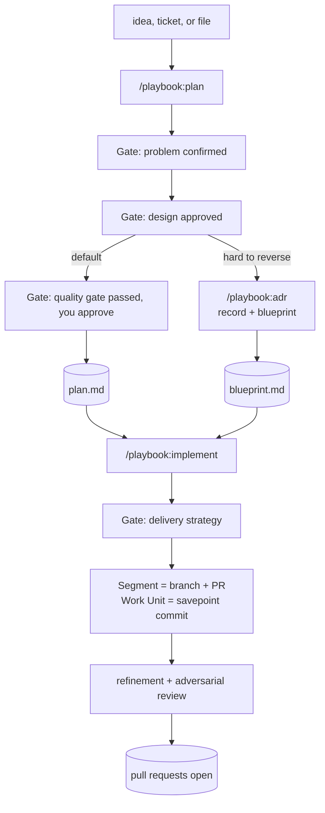

# Plan and implement

Feature work runs in two steps. `/playbook:plan` turns an idea into a verified plan. `/playbook:implement` builds it with subagents. Both share one shape: Work Units grouped into Segments. Each Segment becomes one pull request, and each Work Unit becomes one commit.


```mermaid
flowchart TD
  IDEA["idea, ticket, or file"] --> PLAN["/playbook:plan"]
  PLAN --> G1["Gate: problem confirmed"]
  G1 --> G2["Gate: design approved"]
  G2 -->|"hard to reverse"| ADR["/playbook:adr<br/>record + blueprint"]
  G2 -->|default| G3["Gate: quality gate passed, you approve"]
  G3 --> PLANFILE[("plan.md")]
  ADR --> BLUEPRINT[("blueprint.md")]
  PLANFILE --> IMPL["/playbook:implement"]
  BLUEPRINT --> IMPL
  IMPL --> G4["Gate: delivery strategy"]
  G4 --> SEG["Segment = branch + PR<br/>Work Unit = savepoint commit"]
  SEG --> REFINE["refinement + adversarial review"]
  REFINE --> PRS[("pull requests open")]
```

## Plan

```bash
/playbook:plan "add --json flag to export command"
/playbook:plan ./tasks/feature-brief.md
```

It runs on Opus at high effort and reads the codebase and memory first, so it asks only what it cannot find out.

1. **Divergent.** It challenges the premise, weighs 2 or 3 approaches, and asks you to approve a design. It can route to `/playbook:adr` when the decision is hard to reverse.
2. **Convergent.** In the same session, it interviews you for Work Units and Segments, one question at a time, each with a recommended answer.
3. **Quality gate.** A `fact-checker` verifies paths, signatures and the dependency graph. A `critic` challenges the design. A `test-reviewer` checks the test plan. Each phase retries up to three times on FAIL. WARNs show but do not block.

It checkpoints after every decision, so rerunning with the same topic offers to resume. The plan is saved to `playbook path plans` as `<slug>.md`, with a `<slug>-quality.md` report, and key decisions are stored as memory facts.

### Plan shape

The core is a Work Units table, in dependency order:

```
| WU | Title | Files | Requires | Segment | Parallel group | Done When |
```

A unit is parallel-safe only when its files are disjoint from its siblings and it depends on none of them. `/playbook:implement` re-checks this before running units at the same time.

Segments are PR-sized increments with one concern each:

```
| Seg | Title | Work Units | Requires | Concern | Est. lines |
```

A Segment aims for under 500 changed lines, needs a reason above 1000, and never exceeds 1500. The default order is a linear chain, which maps to stacked PRs.

### Auto

`--auto` answers only the Work Unit and Segment questions. It stops at the design approval. Add `--auto-design` to approve the design as well. Every choice goes into an Assumptions list. A gate FAIL stops the run. Auto from `PLAYBOOK_MODE` or the repo config acts like plain `--auto`.

## Implement

```bash
/playbook:implement $(playbook path plans)/add-json-flag.md
/playbook:implement #42
/playbook:implement PROJ-123
```

It accepts a plan, an ADR blueprint, an issue, a ticket or plain text. With no argument it lists saved plans. If the input is not a ready plan, it stops and points you to `/playbook:plan` or `/playbook:adr`.

It runs on Sonnet and never edits files itself. It hands each Work Unit to a subagent.

**Delivery strategy.** Up front it asks two things, unless you preset `--pr-strategy` and `--boundary`:

- **PR topology:** stacked (default), independent off the default branch, or a single PR.
- **Segment boundary:** savepoint commits with PRs opened at the end (default), or pause after each PR.

**Order.** Segments run one at a time, each on its own branch. Inside a Segment, Work Units run in dependency order, and a parallel group runs as concurrent Tasks once the file sets are verified disjoint. If a Segment's real diff passes 1500 lines, it is split again.

**TDD by default.** Each unit runs red, green, refactor in three subagent steps. `--no-tdd` writes tests and code together. `--no-tests` writes no new tests, for config-only or docs-only changes. Auto never picks it.

**Savepoints.** Each step checkpoints with a `wip` commit. When a unit passes review, its checkpoints squash into one commit. A subagent that dies resumes from its last `wip` commit.

**Finish.** After all Segments, a refinement pass runs a self quick-review and a simplify analysis, then an adversarial subagent reviews the full diff. Blocking findings are fixed on the Segment branch that owns the file. Then one PR per Segment opens through `/playbook:create-pull-request`. In `ask` mode a single-PR plan leaves PR creation to you.

### Auto

`--auto` picks the recommended strategy, runs every Segment, and opens the PR set once the adversarial review passes. A gate FAIL blocks unless you pass `--force`. Auto never force-pushes, and it never picks the `land` boundary, so `--boundary=land` must be explicit. See [Auto mode](05-auto-mode.md).

## Fix a small bug

```bash
/playbook:fix #123
/playbook:fix "export drops the last row when the file is empty"
```

It states the bug in one sentence, writes a failing test, finds the root cause, makes the smallest fix, then commits and opens one PR. It does not clean up nearby code.

It stops and hands off to `/playbook:plan` when any of these is true:

1. More than `fix.maxFiles` files change (default 3).
2. More than `fix.maxLines` lines change, not counting the new test (default 500).
3. The root cause is unclear after two tested hypotheses.
4. The fix needs a new dependency, a schema or config format change, or a public interface change.
5. No failing test is possible.

In `ask` mode it asks before starting the plan. In auto mode it starts the plan, which stops at the design approval unless you pass `--auto-design`. Change the limits with `playbook config set fix.maxFiles <n>` and `fix.maxLines <n>`.

## Example

Adding a `--json` flag gives four Work Units in two Segments.

| WU | Title | Requires | Segment | Parallel group |
|----|-------|----------|---------|----------------|
| WU-0 | Output format type | none | S1 | none |
| WU-1 | JSON formatter | WU-0 | S1 | P1 |
| WU-2 | Refactor table formatter | WU-0 | S1 | P1 |
| WU-3 | Wire the flag in the CLI | WU-1, WU-2 | S2 | none |

With the stacked default, S1 runs on `feat/json-export-s1` off main: WU-0 first, then WU-1 and WU-2 together. S2 runs on a branch off S1 with WU-3. Validation, refinement and the adversarial review follow, and S2 is rebased if S1 changed. Two stacked PRs open: S1 targets main and S2 targets S1.

## See also

- [Decisions and memory](03-decisions-and-memory.md): when to route to `/playbook:adr`.
- [Review and PR flow](02-review-and-pr-flow.md): reviewing the branch afterward.
- [Docs index](../index.md)
